# <center>$PyTorch$</center>

**优秀的工具能够减少错误、加速开发并提高运行性能。**深度学习框架中最有用的部分是它对**自动反向传播与自动优化**的支持。这些特性让你写出模型的前向传播代码，就会使框架自动处理**反向传播与权重更新**。


$PyTorch$是基于以下两个目的而打造的$python$科学计算框架：

- 无缝替换$NumPy$，并且通过**利用$GPU$的算力**来实现神经网络的加速。
- 通过**自动微分机制**，来让神经网络的实现变得更加容易。

```python
#数据预处理
model=Net(#定义一个网络结构
    ...
)

loss=torch.nn.CrossEntropyLoss()#损失函数
optimizer=SGD(lr=1.0)#定义优化器

l = loss(y_hat, y)#传入两个参数比较即可计算出损失
optimizer.zero_grad() # 梯度清零
l.backward()#从最终的损失开始反向传播梯度
optimizer.step()#所有的optimizer都实现了step()方法，这个方法会更新所有的参数
```

## <center>$torch$</center>

包$torch$包含了多维张量的数据结构以及基于其上的多种数学操作。另外，它也提供了多种工具，其中一些可以更有效地对张量和任意类型进行序列化。

### $Tensor$

所有计算机程序最终都可以简化为二进制输入上的一些二进制运算（$AND、OR、NOR$等）。同样地，**深度神经网络学到的所有变换也都可以简化为数值数据张量上的一些张量运算（加上张量、乘以张量等）**。张量（多维）是向量（一维）和矩阵（二维）的抽象形式。$Tensor$和$numpy$的$ndarray$类似，接口设计也和$numpy$极为相似。但是$，Tensor$可以用$GPU$加速。$Tensor$不支持的操作可以先转化为$ndarray$处理完再转回$Tensor$，如果共享内存，开销将非常小。**在$PyTorch$中, 神经网络的输入、输出以及网络的参数等数据, 都是使用张量来进行描述。**

从**接口设计**的角度讲，对$ Tensor$的操作可以分为两类：

* $torch.function$，如$torch.save()$等。
* $Tensor.function$，如$Tensor.view()$等。

**为了方便使用**，一些函数可能同时支持上述两种操作，之间的差别很小。如$torch.add(a,b)$与$a.add(b)$等价。


从**存储的角度**讲，对$ Tensor$的操作可以分为两类：

* 不会修改自身的数据，如$a.add(b)$，结果会返回一个新的$Tensor$。
* 会修改自身的数据（$inplace$），如$a.add\_(b)$，结果仍然存储在$a$中，$a$被修改了。

```python
#常规转换：使用t.from_numpy()将Numpy转为Tensor，使用torch.numpy()将Tensor转为Numpy
a=np.array([1,2])
c=torch.from_numpy(a)
print(c)#tensor([1, 2], dtype=torch.int32)
a=c.numpy()
print(type(a))#<class 'numpy.ndarray'>

#最重要的区别t.Tensor和t.tensor：不论输入的类型是什么，t.tensor()都会进行数据拷贝，不会共享内存；
# t.Tensor()与Numpy共享内存，但当Numpy的数据类型和Tensor的类型不一样的时候，数据会被复制，不会共享内存。
a=np.array([1,2])#整形
print(a.dtype)
b=torch.Tensor(a)#float32，需要注意的情况：使用t.Tensor()进行转换，发现Numpy的数据类型和Tensor的类型不一致，因此不共享内存
print(b.dtype)

a=np.array([1,2],dtype=np.float32)
b=torch.Tensor(a)#需要注意的情况：使用t.Tensor()进行转换，发现Numpy的数据类型和Tensor的类型一致，因此共享内存
print(b.dtype)

b=torch.tensor(a)#需要注意的情况：使用t.tensor()进行转换，只进行数据拷贝，不会共享内存
print(b)
```

$Torch.size$是$tuple$对象的子类。实际上$Tensor.size()$等价于$Tensor.shape$。

函数名后面带下划线$\_$的函数会修改$Tensor$本身。

#### 内部结构

**其实$Tensor$类就是封装了数字，并加上了一些求导需要的信息而已。**


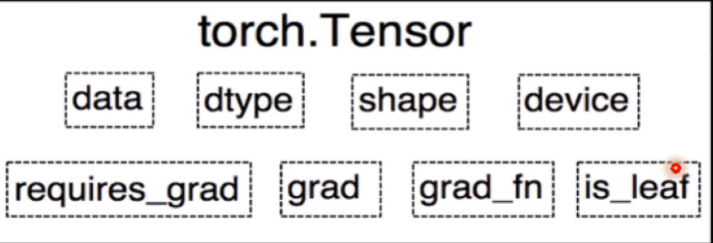

* 与数据有关：

$data$：保存数据。

$dtype$：张量的数据类型，如$tensor.float32,tensor.long$等，整数默认是$torch.int64$小数默认是$torch.float32$。

$shape$：张量的形状，$torch.size$类型。

$device$：张量所在的设备，$cpu/gpu$。

* 与求导有关：

$requires\_grad$：

$grad$：保存相应的梯度，类型仍未$torch.Tensor$。也就是说仍然包含这几个属性，可以继续对其求导。

$grad\_fn$：指向一个$Function$对象，用来构造计算图中的运算，反向传播计算输入的梯度。

$is\_leaf$：指示是否是计算图中的叶子结点张量。

$Tensor$分为**头信息区和存储区**，信息区域主要保存着$Tensor$的形状，数据类型等信息，**而真正的数据则保存成连续数组**。一般来说，一个$Tensor$有着与之对应的$storage$，$storage$是在$data$上封装的接口，便于使用。不同的$Tensor$头信息一般不同，**但是却可能使用相同的$storage$。**比如，我们定义并初始化一个$tensor$名为$A$，$A$的形状$size$、步长$stride$、数据的索引等信息都存储在头信息区，而$A$所代表的真实数据则存储在存储区。另外，如果我们对$A$进行截取、转置或修改等操作后赋值给$B$，则$B$的数据共享$A$的存储区，存储区的数据数量没变，**变化的只是$B$的头信息区对数据的索引方式**。如果听说过浅拷贝和深拷贝的话，很容易明白这种方式其实就是浅拷贝。这种浅拷贝的方式更节省内存，同时提升了处理速度。**这是一种默认的方式，因为我们经常想要的就是这种结果。**

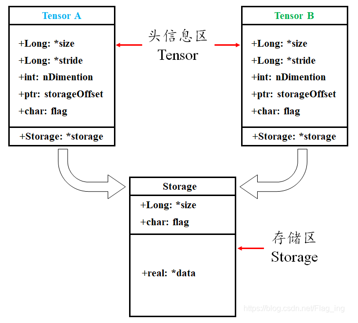

<center>常见的构造方式</center>

```python
a = torch.arange(0,6)
b=a.view(2,3)
print(a.storage())
print(b.storage())
print((id(a.storage())==id(b.storage())))#True
c=a[2:]
print(id(a.data))#1559260210424
print(id(c.data))#1559260210424
```

#### 创建$Tensor$

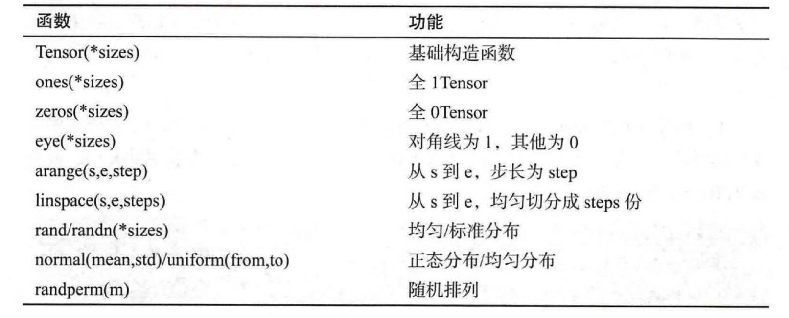

##### 直接创建

```python
def tensor(
	data: Any, 
	dtype: Optional[_dtype]=None, 
	device: Union[_device, str, None]=None,
	requires_grad: _bool=False)
```

```python
a=torch.tensor([1,2],
               dtype=torch.float32,
               device=torch.device('cuda' if torch.cuda.is_available() else 'cpu'),
               requires_grad=True)
```

##### 依据数值创建

```python
def zeros(
	*size: _int, # a sequence of integers. Can be a variable number of arguments or a collection like a list or tuple.
	out: Optional[Tensor]=None, #与上一个参数类型不同，能确定上一个参数的结束位置在哪
	dtype: _dtype=None, 
	layout: _layout=strided, 
	device: Union[_device, str, None]=None,
	requires_grad:_bool=False)
def ones(...)
```

```python
a=torch.zeros(2,3,
              dtype=float,
              device=torch.device('cuda' if torch.cuda.is_available() else 'cpu'),
              requires_grad=True)
```

```python
#torch.zeros(input.size(), dtype=input.dtype, layout=input.layout, device=input.device).
def zeros_like(
    self: Tensor, 
    *, # “*”之后的所有参数都只能以关键参数的形式进行传值，不接收其他任何形式的传值
    memory_format: Optional[memory_format]=None,
    dtype: _dtype=None, 
    layout: _layout=strided, 
    device: Union[_device,str, None]=None,
    requires_grad:_bool=False) 
def ones_like(...)
```

```python
b=torch.zeros_like(a,
                   dtype=float,
                   device=torch.device('cuda' if torch.cuda.is_available() else 'cpu'),
                   requires_grad=True)
```

```python
def full(size, 
           fill_value,
           *,
           out=None,
           dtype=None, #默认为float32
           layout=torch.strided,
           device=None, 
           requires_grad=False)
```

```python
torch.full((2, 3), 3.141592)
```

```python
def full_like(input,
              fill_value, 
              *,
              dtype=None,
              #可选torch.stried或torch.sparse_coo。分别对应顺序储存、离散储存。
              #一般说，稠密张量适用torch.stried，稀疏张量（0 比较多）适用torch.sparse_coo。
              layout=torch.strided,
              device=None, requires_grad=False,
              memory_format=torch.preserve_format)
```

##### 创建等差数列

```python
def arange(
    start: Number,
    end: Number,
    step: Number,
    *, 
    out: Optional[Tensor]=None, dtype: Optional[_dtype]=None,
    device: Union[_device, str, None]=None,
    requires_grad: _bool=False)
```

```python
b=torch.zeros(10,device=torch.device('cuda'))
a=torch.arange(0,10,1,out=b,device=torch.device('cuda' if torch.cuda.is_available() else 'cpu'),requires_grad=True)
```

```python
def linspace(#linear space
    start: Number,
    end: Number, 
    steps: _int=100,#分割的点数，默认是100，与上边的step不同
    *,
    out: Optional[Tensor]=None,
    dtype: _dtype=None,
    layout: _layout=strided,
    device: Union[_device, str, None]=None, 
    requires_grad:_bool=False)
```

```python
torch.linspace(3,10,5)
#tensor([ 3.0000,  4.7500,  6.5000,  8.2500, 10.0000])
```

##### 创建等比数列

```python
def logspace(
    start: Number,
    end: Number,
    steps: _int=100,
    base: _float=10.0,#log的底
    *,
    out: Optional[Tensor]=None,
    dtype: _dtype=None, 
    layout: _layout=strided, 
    device: Union[_device, str, None]=None, 
    requires_grad:_bool=False)
```

```
a=torch.logspace(start=-10, end=10, steps=5)
#tensor([1.0000e-10, 1.0000e-05, 1.0000e+00, 1.0000e+05, 1.0000e+10])
```

##### 依概率创建

```python
def normal(
    mean: _float, 
    std: _float, 
    size: _size, //元组的形式，单个数字的话(10,)
    *,
    generator: Generator=None, 
    out: Optional[Tensor]=None,
    dtype: _dtype=None, 
    layout: _layout=strided,
    device: Union[_device, str, None]=None, 
    requires_grad:_bool=False) 
```

```python
def randn(#均值为0，标准差为1的正态分布
    *size: _int,
    generator: Generator, 
    names: Optional[List[Union[str, None]]],
    out: Optional[Tensor]=None,
    dtype: _dtype=None, 
    layout: _layout=strided, 
    device: Union[_device,str, None]=None,
    requires_grad:_bool=False)
```

```python
def rand(#[0,1)上的均匀分布
    *size: _int,
    generator: Generator, 
    out: Optional[Tensor]=None, 
    dtype: _dtype=None,
    layout: _layout=strided,
    device: Union[_device, str, None]=None, 
    requires_grad:_bool=False) 
```

##### 矩阵

* 上三角矩阵

  `torch.triu(input, diagonal=0, ***, out=None)`

  返回矩阵（$2-D$张量）或矩阵 `input` 批次的上三角部分，结果张量 `out` 的其他元素设置为$0$。

  `diagonal`参数控制要考虑的对角线。如果`diagonal= 0`，则保留主对角线上和上方的所有元素。正值排除主要对角线上方的对角线，同样，负值排除主要对角线下方的对角线

* 

* 

#### 常用的$Tensor$操作

有超过$100$种张量相关的运算操作, 例如转置、索引、切片、数学运算、线性代数、随机采样等。但是我们经常用到的并不多。

##### 查看形状

$torch.numel()$ ：返回张量中的元素个数

##### 改变形状

* 改变观察视图

  * 对视图的理解

    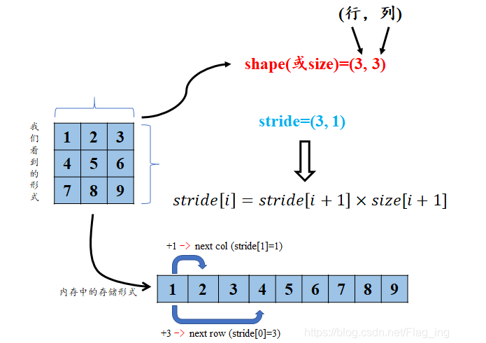

    **实际上就是我们要按照特定视图代表的方式来理解一段数据结构。$Tensor$多维数组底层实现是使用一块连续内存的$1$维数组**。

  * 为什么会变得不连续？
  
    访问矩阵中的下一个元素是通过偏移（可以是一个元组，表示对每个轴的偏移）来实现，这个偏移量称为**步长**。
    
    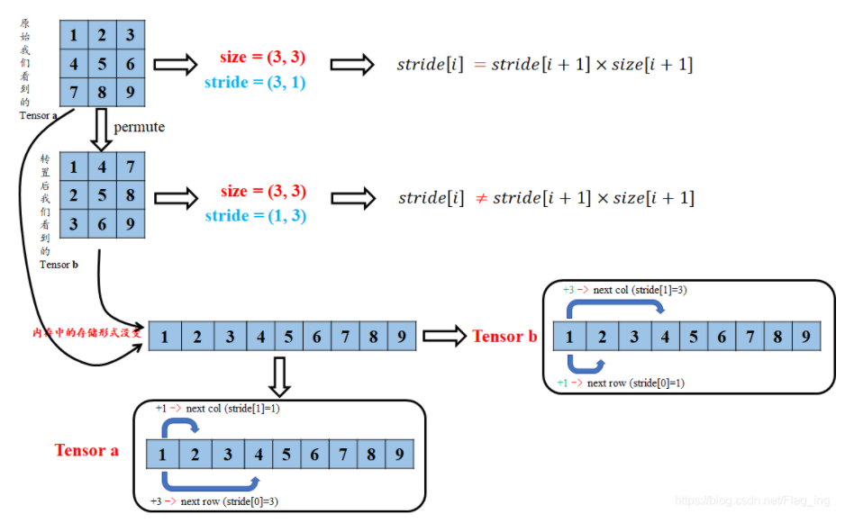

在神经网络中往往需要进行矩阵乘法运算，显然，乘法运算时形状是很重要的，所以我们时常需要改变形状以适应运算需要。还有一个方便的函数$view\_as(tensor)$实际上等同于$view(tensor.shape)$。**通过$Tensor.view()$可以调整$Tensor$的形状，但必须保证调整前后元素个数一致，$view$不会改变自身的数据，返回的新$Tensor$与原$Tensor$共享内存。**$Tensor.reshape()$是另一种可以调整$size$的方法，但是它允许修改$Tensor$的尺寸，如果新尺寸超过了原尺寸，会自动分配新的空间。如果小于原尺寸，则之前的数据仍然会保留。

**对张量的大部分操作就是视图操作！**与之对应相反的概念就是**副本**。副本是一个数据的完整的拷贝，如果我们对副本进行修改，它不会影响到原始数据，因为物理内存不在同一位置。

$torch$的$view()$与r$eshape()$方法都可以用来重塑$tensor$的$shape$，区别就是使用的条件不一样。

*   $view()$方法只适用于满足连续性条件的$tensor$，并且该操作不会开辟新的内存空间，只是产生了对原存储空间的一个新别称和引用，**返回值是视图**。

*   $reshape()$方法的返回值**既可以是视图，也可以是副本**：当满足**连续性条件**时返回$view()$，否则返回副本。此时等价于先调用$contiguous()$方法再使用$view()$。因此当不确能否使用$view()$时，可以使用$reshape()$。如果只是想简单地重塑一个$Tensor$的$shape$，那么就是用$reshape()$，但是如果需要考虑内存的开销而且要确保重塑后的$tensor$与之前的$tensor$共享存储空间，那就使用$view()$。

**为什么不仅仅实现$reshape()$？也就是实现$contiguous()+view()$。**

​		因为历史上$view$方法已经约定了共享底层数据内存，返回的$Tensor$底层数据不会使用新的内存，如果在$view()$中调用了$contiguous$方法，则可能在返回$Tensor$底层数据中使用了新的内存，这样打破了之前的约定，破坏了对之前的代码兼容性。为了解决用户使用便捷性问题，$PyTorch$在$0.4$版本以后提供了$reshape$方法，实现了类似于 $tensor.contigous().view(*args)$功能，如果不关心底层数据是否使用了新的内存，则使用$reshape$方法更方便。

```python
def view(self, *size: _int) 
```

```python
def reshape(self, *shape: _int)
```

* 拼接与重复

```python
def cat(
    tensors: Union[Tuple[Tensor, ...], List[Tensor]],
    dim: Union[str, None],
    *,
    out: Optional[Tensor]=None) 
```

```python
def stack(
    tensors: Union[Tuple[Tensor, ...], List[Tensor]], 
    dim: _int=0,
    *, 
    out: Optional[Tensor]=None)
```

```python
#cat 和 stack的区别在于 cat会增加现有维度的值, 但不会增加维度，可以理解为续接，stack会新加增加一个维度，但不会增加现有维度的值，可以理解为叠加
tensor = torch.ones(4, 4)
t1 = torch.cat([tensor, tensor, tensor], dim=1)
t2 = torch.stack([tensor, tensor, tensor], dim=1)
```

##### 逐元素操作

这部分操作会对运算施加在$Tensor$每一个元素，此类操作的**输入和输出形状一致**。实际上有很多对向量的操作都是逐元素的，而且这种操作往往很有用。

<center>常见的逐元素操作</center>

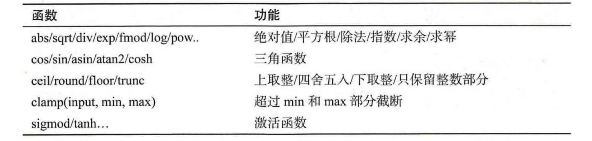

为了方便，对于很多操作，$PyTorch$都实现了运算符重载，所以可以直接使用运算符。例如$a**2$等价于$torch.pow(a,2)$。


##### 归并操作

与逐元素操作不同，此类操作会使输出形状小于输入形状，并且往往可以沿着某一维度进行指定操作。

<center>常见的归并操作</center>


```python
def sum(
    self,
    dim: Union[_int, _size], 
    keepdim: _bool=False,
    *,
    dtype: Optional[_dtype]=None)
```

可以看出，这类操作的参数往往会有$dim,keepdim$等属性。

##### 比较操作

比较操作对于选择元素往往十分有用。它们有一些类似于逐元素操作，有一些类似于归并操作。

<center>常见的比较操作</center>

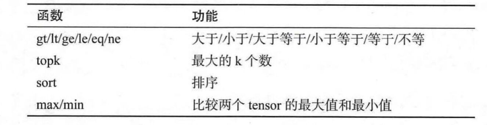

同样，为了方便，表中的第一行元素已经实现了运算符重载$a>b,a<b,a>=b,a<=b,a==b,a!=b$，返回的结果是$Tensor$，其值为$torch.bool$类型，可以用来选择元素。

```python
a=torch.tensor([[1,2,3],[4,5,6]])
print(torch.max(a,dim=1,keepdim=True))
```

##### 线性代数

<center>常见的线性代数操作</center>

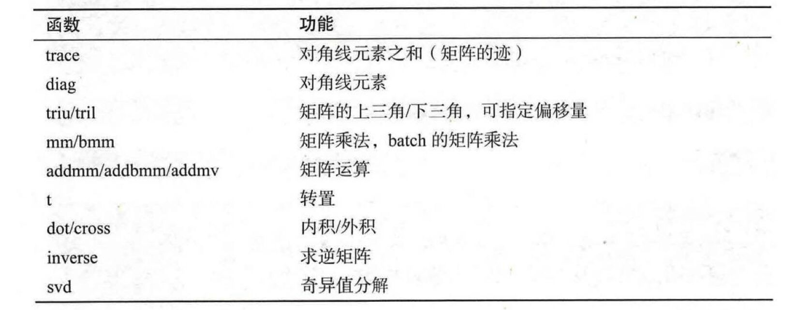

**矩阵的转置会导致存储空间不连续，调用$contiguous$方法将其转为连续以适应其它操作。**

值得注意的是，在$PyTorch$中，一维数组并不代表我们熟知的向量的形式，仅仅是**一维数组**。转置操作对它不起作用。**如果要区分行向量与列向量，我们必须用二维矩阵来表示。**$Andrew\ Ng$说过，写的时候最好别用这个一维数组，容易一不小心就写错了，要么写成$(n,1)$要么$(1,n)$。只不过现在向量也是$2$维的了。

```python
x=torch.tensor([[1,2],[3,4],[5,6]])#3*2
w=torch.tensor([1,2])#1*2
print(x.shape)#torch.Size([3, 2])
print(w.shape)#torch.Size([2])
w_t=w.t()
print(w_t.shape)#torch.Size([2])
c=torch.matmul(x,w)
print(c.shape)#torch.Size([3])
```

* $mul$：矩阵对位相乘

  ```python
  w=torch.tensor([1,2])
  x=torch.tensor([2,3])
  print(w*x)#tensor([2, 6])
  print(w.mul(x))
  print(torch.mul(w,x))
  ```

* $mm$：当相乘矩阵维数$>2$时将报错

  ```python
  w=torch.tensor([[1,2]])#1*2
  b=torch.tensor([[2],[3]])#2*1
  print(w.mm(b))#tensor([[8]])
  ```

* $bmm$：批量$(batch)$的矩阵乘法,$3$维

  ```python
  w=torch.tensor([[[1,2]],[[3,4]]])#2*1*2
  b=torch.tensor([[[2],[3]],[[4],[5]]])#2*2*1
  print(w.bmm(b))#2*1*1
  #tensor([[[ 8]],
  #        [[32]]])
  ```

* $matmul$：区别于$torch.bmm()$，它可以处理一些维度不同的$tensor$。

  我们约定：

  * 若两个都是$1$维的，则返回两个向量的**点积**。

    ```python
    x=torch.tensor([1,2])#3*2
    w=torch.tensor([3,4])#1*2
    print(torch.matmul(x,w))#torch.Size([2])
    print(torch.dot(x,w))#torch.Size([2])
    ```

  * 若两个都是$2$维的，则按照**$mm$**返回。

    ```python
    x=torch.tensor([[1,2],[3,4],[5,6]])#3*2
    w=torch.tensor([[1],[2]])#2*1
    print(torch.matmul(x,w))
    print(torch.mm(x,w))
    ```

  * 若第一个参数是多维，第二个参数是$1$维，则返回参数二对参数一每一“行”的**“点积”**。

    ```python
    x=torch.tensor([[1,2],[3,4],[5,6]])#3*2
    w=torch.tensor([1,2])#2
    print(torch.matmul(x,w))#tensor([ 5, 11, 17])
    
    x = torch.randn(2, 3, 4)
    y = torch.randn(4)
    print(torch.matmul(x,y).shape)#torch.Size([2, 3])
    ```

  * 若第一个参数是$1$维，第二个参数是多维，则将第一个参数**广播后做$mm$。**

    ```python
    w=torch.tensor([1,2,3])#3
    x=torch.tensor([[1,2],[3,4],[5,6]])#3*2
    print(torch.matmul(w,x))#tensor([22, 28])
    
    x = torch.randn(2, 3, 4)
    y = torch.randn(3)#广播成(2,1,3)
    print(torch.matmul(y, x).size()) #torch.Size([2, 4])
    ```


#### 广播操作

**广播是为了在实现相同运算的情况下，占用更少的空间资源。**里面描述的“相同运算”可以简单理解为用于大小不同数组的**逐元素函数**。因为数组大小的不同，在做逐元素操作时会产生歧义，比如标量加向量，是对向量中的个别元素加，还是对向量中的每个元素加。**而广播则是我们人为定义的解决这种歧义的一种约定而已，当然这种约定会使编程更加方便。**对于标量加向量，我们约定我们想要的是对向量中的每个元素加上这个标量，而不是把标量加到向量的首位元素这样莫名其妙且没有多大作用的操作。

**$Numpy$的广播运算法则定义如下：**

* 让所有输入数组都向其中$shape$最长的数组看齐，$shape$不足的部分通过在**维度前面**加$1$补齐。
* 两个数组要么在某一个维度的长度一致，要么其中一个为$1$，否则不能计算。

我们可以使用以下两个函数手动实现广播法则，以使$PyTorch$自动广播法则更为直观，不容易出错。

* $unsqueeze$或$view$，为数据某一维度的形状补$1$，适应广播法则$1$。
* $expand$或$expand\_as$，重复数组，该操作不会真的“复制数组”，所以不会占用额外的空间，适用广播法则$2$。

$repeat$实现与$expand$相类似的功能，但是它真的会复制元素，会占用额外的空间。

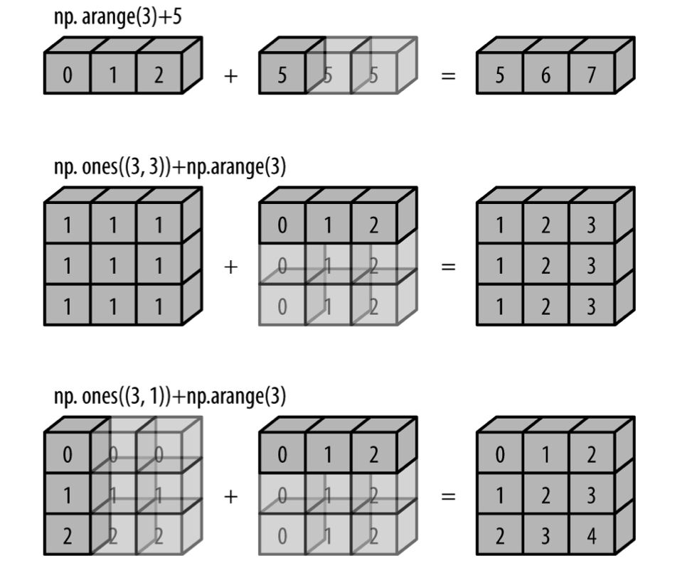

#### 多维数组中(张量)轴的概念

对于二维数组我们很好进行理解，因为我们编程时，在计算机屏幕上打出来的形状就是它的形状。

```python
arr = torch.tensor(
    [[1, 2, 3],
     [4, 5, 6],
     [7, 8, 9]])
```

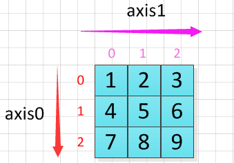

对其进行转置也就是我们线性代数学过的转置。

但是对于三维数据以及多维的话，我们不好理解对它的操作是因为**在计算机屏幕这个二维的东西上想要表现多维度的东西，就会变得不直观**。对于三维有两种方法，我们可以在脑子中还原成三维的图形，但是对于多维的数组，我们只能**降维**——借助于一些规则，在低维度计算高维度（核函数的味道）。实际上降维也可以使我们很好地理解三维二维的操作，毕竟程序员对它们的操作的定义就是这么推广到高维的。

```python
arr = torch.tensor([[[1, 2, 3],
                     [4, 5, 6]],

                    [[11,12,13],
                     [14, 15,16]]])
```

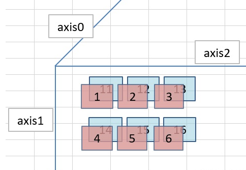

对$0$轴进行求和：

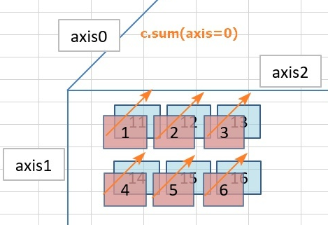


```python
tensor([[12, 14, 16],
        [18, 20, 22]])
```

对$1$轴进行求和：

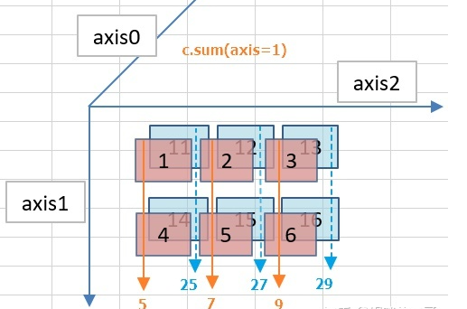

```python
tensor([[ 5,  7,  9],
        [25, 27, 29]])
```

对$2$轴进行求和：

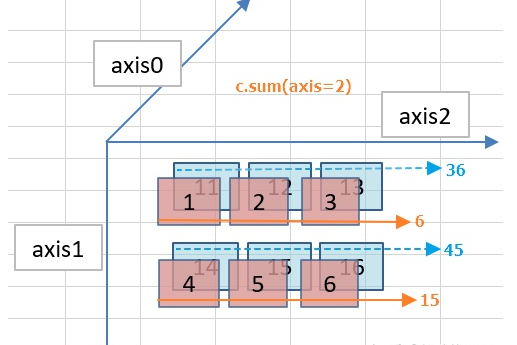


```python
tensor([[ 6, 15],
        [36, 45]])
```

***

我们现在来将其降维，也就是说将最里边的三个数看成一个整体——向量：

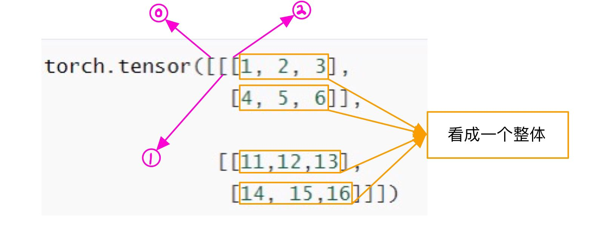

在代码中我们这样来构建：

```python
A = [0, 1, 2, 3]
B = [4, 5, 6, 7]
C = [8, 9, 10, 11]
D = [12, 13, 14, 15]
arr = torch.tensor(
    [[A, B],
     [C, D]])
```

这样我们又将数据变成了$2$维，可以看出通过这种变换，我们就把原数组从形式上转化成了一个二维数组，但是一定要注意**这里的A、B、C、D均为一维数组，对它们进行操作时，要按照向量而非标量的运算法则进行**。

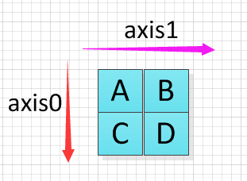


对$0$轴求和得到：（形状的重要性：对哪一维求和该维度就会消失）

```python
tensor([[ 8, 10, 12, 14],
        [16, 18, 20, 22]])
```

对$1$轴求和得到：

```python
tensor([[ 4,  6,  8, 10],
        [20, 22, 24, 26]])
```

对$2$轴求和得到：

```python
tensor([[ 6, 22],
        [38, 54]])
```

由此可知，**对于多维数组对轴的编号是先行后列，由外向内！**实际中三维数组算是维度比较高的了，至于四维及以上的不太常见，因此没必要讲，但是为了验证我们刚才提到的这个结论，我们再举一个四维数组来证明。

```python
arr = torch.tensor([ 0,  1,  2,  3,  4,  5,  6,  7,  8,  9, 10, 11, 12, 13, 14, 15, 16,
       17, 18, 19, 20, 21, 22, 23, 24, 25, 26, 27, 28, 29, 30, 31])
arr=arr.view(4,2,2,2)
```

其形状是这样的：

```python
tensor([[[[ 0,  1],
          [ 2,  3]],
         [[ 4,  5],
          [ 6,  7]]],

        [[[ 8,  9],
          [10, 11]],
         [[12, 13],
          [14, 15]]],

        [[[16, 17],
          [18, 19]],
         [[20, 21],
          [22, 23]]],

        [[[24, 25],
          [26, 27]],
         [[28, 29],
          [30, 31]]]])
```

 为了手算出结果，同样的，我们需要对原数组进行降维，降维方法是将内部的二维数组分别用字母表示，即有：

```python
A = [[0, 1], [2, 3]]
B = [[4, 5], [6, 7]]
C = [[8, 9], [10, 11]]
D = [[12, 13], [14, 15]]
E = [[16, 17], [18, 19]]
F = [[20, 21], [22, 23]]
G = [[24, 25], [26, 27]]
H = [[28, 29], [30, 31]]
arr2 = torch.tensor([[A, B],
				  	 [C, D],
                     [E, F],
                     [G, H]])
```

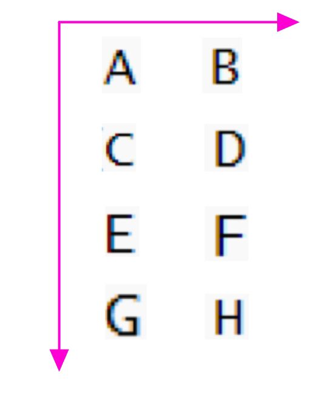

显然我们对$0,1$轴求和就变得很简单，结果分别为：（因为其元素为向量，所以求和按照向量加法法则）

```python
tensor([[[48, 52],
         [56, 60]],

        [[64, 68],
         [72, 76]]])
tensor([[[ 4,  6],
         [ 8, 10]],

        [[20, 22],
         [24, 26]],

        [[36, 38],
         [40, 42]],

        [[52, 54],
         [56, 58]]])
```

对$2$轴求和：

```python
tensor([[[ 2,  4],
         [10, 12]],

        [[18, 20],
         [26, 28]],

        [[34, 36],
         [42, 44]],

        [[50, 52],
         [58, 60]]])
```

对$3$轴求和：

```python
tensor([[[ 1,  5],
         [ 9, 13]],

        [[17, 21],
         [25, 29]],

        [[33, 37],
         [41, 45]],

        [[49, 53],
         [57, 61]]])
```

这就证明了我们上面的结论是完全正确的，当维度$N\geqslant 5$时，原理是一样的，只是稍微繁琐一些。**需要注意的是，如果我们要手算，应该进行降维，降维后的维度最好是$2$，因为这是我们能直观理解的最佳维度，外层计算完后，计算内层时，内层元素进行维度还原时，也最好是二维数组**。但是实际上在操作的过程中，我们是根据括号的相对位置来确定的并且用“留下来的维度”对结果来验证。

#### 交换轴

**按照你想的来即可，因为开发者就是方便实现你想的来开发法的。**

```python
arr = torch.tensor([[[1, 2, 3],
                     [4, 5, 6]],

                    [[11,12,13],
                     [14, 15,16]]])
```

形状为：


* 本来轴的顺序为$(0, 1, 2)$ ，现在对其按任意轴序进行转置，假定轴序为$(1, 0, 2)$，也就是说我们将$1$轴作为“最外的轴”，$2$轴作为最里的轴。则转置代码为：

  ```python
  arr=arr.permute(1,0,2)
  ```

  

  形状为：

  ```python
  tensor([[[ 1,  2,  3],
           [11, 12, 13]],
  
          [[ 4,  5,  6],
           [14, 15, 16]]])
  ```

  

* 本来轴的顺序为$(0, 1, 2)$ ，现在对其按任意轴序进行转置，假定轴序为$(2, 0, 1)$，也就是说我们将$2$轴作为“最外的轴”，$1$轴作为最里的轴。则转置代码为：

```python
arr=arr.permute(2,0,1)
```

形状为：

```python
tensor([[[ 1, 11],
         [ 2, 12],
         [ 3, 13]],

        [[ 4, 14],
         [ 5, 15],
         [ 6, 16]]])
```

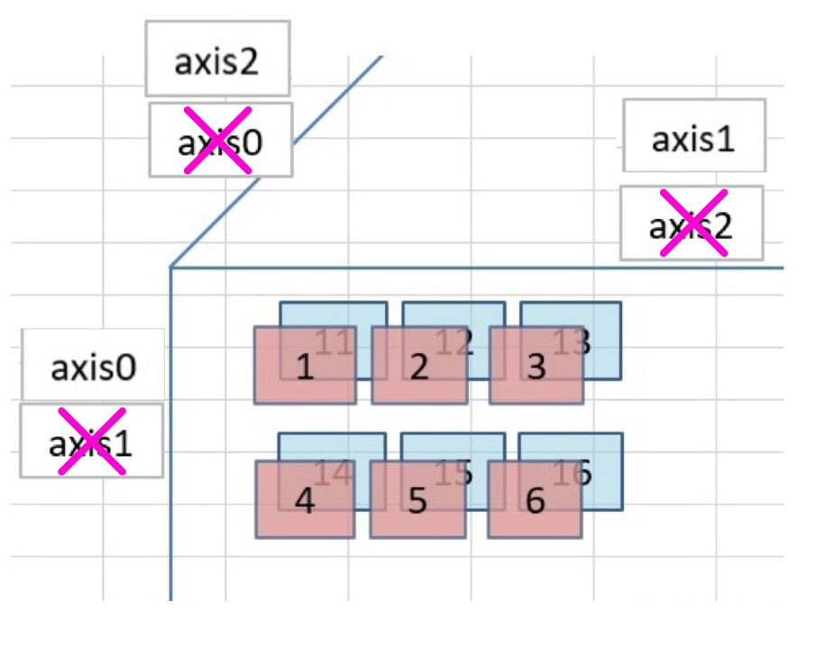

**我们可以这样理解，数据的位置并没有变，我们观察数据的方式变了而已。**

所以当卷积神经网络的参数为$(b,c,h,w)$而数据形状为$(c,b,h,w)$，我们只需要用$Tensor.permute(1,0,2,3)$调整即可。

例子：

```python
arr = torch.tensor([[[[1, 2], [3,4]],
                     [[5, 6],[7,8]]],

                    [[[9,10],[11,12]],
                     [[13,14], [15,16]]]])
```

我们执行：

```python
arr=arr.permute(1,0,2,3)#实际上就是后两轴看成一个整体，前两轴进行转置，就得到结果(channel,batch,height,width)
```

最后得到：

```python
tensor([[[[ 1,  2],
          [ 3,  4]],

         [[ 9, 10],
          [11, 12]]],


        [[[ 5,  6],
          [ 7,  8]],

         [[13, 14],
          [15, 16]]]])
```

对于比较复杂的，这里举一例，$4$维的，形状为$(2,2,2,2)$：

```python
arr = torch.tensor([[[[1, 2], [3,4]],
                     [[5, 6],[7,8]]],

                    [[[9,10],[11,12]],
                     [[13,14], [15,16]]]])
```

我们执行

```python
arr=arr.permute(3,2,0,1)
```

相当于是执行

```python
arr=arr.permute(2,3,0,1)
arr=arr.permute(1,0,2,3)
```

我们并不能将前两轴看成一体，后两轴看成一体：$((0,1),(2,3))$。解释一下，因为降维我们都是从后往前$(0,(1,(2,3)))$。所以只能从后往前将轴看成整体，而不能从前往后也看成整体。

```html
<div STYLE="page-break-after: always;"></div>
```

### $nn$

阅读$PyTorch.nn$文档时，我们主要关注以下三点：

* **构造函数的参数**：如$torch.nn.Linear(*in_features, out_features, bias=True, device=None,dtype=None*)$

* **实际的可学习参数**：如$torch.nn.Linear$有$weight$和$bias$两个可学习参数。

* **输入输出的形状**：如$torch.nn.Linear$的输入形状为$(*,input\_features,out)$，

  ​							       输出形状为$(*,output_features)$。

模型定义三步：

* 必须**继承$nn.Module$**，让$ PyTorch$知道这个类是一个$Module$。
* 在$\_\_init\_\_(self)$中设置需要的**组件**如$conv,pooling,Linear,BatchNorm$，也可以是自己定义的层，一般从$nn,functional$中获取。
* 在$forward(self,x)$中用定义好的组件进行**组装**。

$torch.nn$是专为神经网络设计的模块化接口。$torch.nn$构建于$autograd$之上，因为$autograd$虽然实现了自动微分系统，但是**过于低层，抽象程度较低**，如果用来实现深度学习模型，编写代码量太大，所以我们引入了更高级的抽象。

***

$nn.Module$是最重要的类，可以把它看成是一个网络的封装，包含网络各层定义及$forward$方法——可以返回前向传播的结果。$Module$中的$\_\_init\_\_$如下：

``` python
 def __init__(self):
        self.training = True
        self._parameters = OrderedDict()
        self._buffers = OrderedDict()
        self._backward_hooks = OrderedDict()
        self._forward_hooks = OrderedDict()
        self._forward_pre_hooks = OrderedDict()
        self._state_dict_hooks = OrderedDict()
        self._load_state_dict_pre_hooks = OrderedDict()
        self._modules = OrderedDict()
```

* $\_parameters$：变量字典。保存用户**直接设置的$parameter$**。
* $\_modules$：子$module$字典。通过$self.sub\_module=nn.Linear(3,4)$指定的子$module$会保存于此。
* $\_buffers$：缓存。如$batchnorm$使用$momentum$机制，下一次的前向传播需要用到上一次前向传播的结果。
* $\_hooks$：钩子技术。用来提取中间变量。
* $training$：标志。$BatchNorm$与$Dropout$层在训练（$train$）阶段和测试（$evaluate$）阶段采取不通的策略，通过判断$training$的值来决定前向传播策略。

只要在$nn.Module$的子类中定义了$forward$函数，$backward$函数就会被自动实现（利用$autograd$）。

通常把**可学习参数的层**放在构造函数$\_\_init\_\_$中，如果某一层如$Relu$不具有可学习的参数，可以放进去，也可以不放进去。而后这些可学习的参数通过$net.parameters()$返回，$net.named\_parameters()$可同时返回可学习的参数及名称。

```python
class Linear(nn.Module):
    def __init__(self,in_features,out_features):
        nn.Module.__init__(self)
        self.w=nn.Parameter(torch.randn(in_features,out_features))
        self.b=nn.Parameter(torch.randn(out_features))
    def forward(self,x):
        x=x.mm(self.w)
        return x+self.b.expand_as(x)
```

将$Module$放在$GPU$上运行也十分简单，只需要两步：

* $model=model.cuda()$：将模型的所有参数转存到$GPU$上。
* $input.cuda()$：将输入数据放置到$GPU$上。

#### 全连接神经网络

相比于自己实现全连接神经网络，使用$PyTorch$往往会更加方便、高效且不易出错。

```python
import torch
import torch.nn as nn
from torchvision import datasets, transforms
from torch.utils.data import DataLoader

device = torch.device('cuda' if torch.cuda.is_available() else 'cpu')
batch_size=100
# 导入数据
train_dataset = datasets.MNIST(root = 'data/', train = True,
                               transform = transforms.ToTensor(), download = True)
test_dataset = datasets.MNIST(root = 'data/', train = False,
                               transform = transforms.ToTensor(), download = True)
# 加载数据，打乱顺序并一次给模型100个数据
train_iter = DataLoader(dataset=train_dataset, batch_size=100, shuffle=True)
test_iter = DataLoader(dataset=test_dataset, batch_size=100, shuffle=True)

#定义网络结构
class TwoLayerNet(nn.Module):
    def __init__(self, input_size, hidden_size, output_size):
        nn.Module.__init__(self)
        self.TwoLayer = nn.Sequential(
            nn.Flatten(),
            nn.Linear(input_size, hidden_size),
            nn.ReLU(),
            nn.Linear(hidden_size, output_size)
        )

    def forward(self, data):
        return self.TwoLayer(data)

net = TwoLayerNet(input_size=784, hidden_size=50, output_size=10)
net = net.to(device)  # 将网络加载到GPU上
print("training on ", device)
#超参数
num_epochs = 10
lr = 0.01

loss = torch.nn.CrossEntropyLoss()#交叉熵损失
optimizer = torch.optim.SGD(net.parameters(), lr=lr)#定义优化器


def evaluate_accuracy(data_iter, net, device=None):
    if device is None:
        # 如果没指定device就使用net的device
        device = list(net.parameters())[0].device  # 其实就是获取一下net的device
    acc_sum, n = 0.0, 0
    with torch.no_grad():
        net.eval()  # 评估模式,就一行代码return self.train(False),这会关闭dropout，BatchNorm等东西
        for X, y in data_iter:
            acc_sum += (net(X.to(device)).argmax(dim=1) == y.to(device)).float().sum().cpu().item()
            n += y.shape[0]  # 总数
        net.train()  # 改回训练模式
    return acc_sum / n
#开始训练
for epoch in range(num_epochs):
    train_l_sum, train_acc_sum, n, batch_count = 0.0, 0.0, 0, 0  # 这是定义在cpu上的
    for X, y in train_iter:
        X = X.to(device)
        y = y.to(device)
        y_hat = net(X)
        l = loss(y_hat, y)  # 传入两个参数比较即可计算出损失
        optimizer.zero_grad()  # 梯度清零
        l.backward()  # 从最终的损失开始反向传播梯度
        optimizer.step()  # 所有的optimizer都实现了step()方法，这个方法会更新所有的参数
        train_l_sum += l.cpu().item()
        train_acc_sum += (y_hat.argmax(dim=1) == y).sum().cpu().item()
        n += y.shape[0]
        batch_count += 1
    test_acc = evaluate_accuracy(test_iter, net)
    print('epoch %d, loss %.4f, train acc %.3f, test acc %.3f' % (
        epoch + 1, train_l_sum / batch_count, train_acc_sum / n, test_acc))

```

**对于前馈网络，每次都要写复杂的$forward()$会有些麻烦，在此就有两种简化方式：**$ModuleList$和$Sequential$。其中$Sequential$是一个特殊的$Module$，它包含几个子$module$，前向传播时会将输入一层接一层地传递下去。$ModuleList$也是一个特殊的$Module$，可以包含几个子$Module$，可以像$list$一样使用它，但是不能直接把输入传递给$ModuleList$，因为它没有实现$forward$方法，所以接收不了。

```python
net1 = nn.Sequential()
net1.add_module('conv', nn.Conv2d(3, 3, 3))
net1.add_module('batchnorm', nn.BatchNorm2d(3))
net1.add_module('activation_layer', nn.ReLU())

net2 = nn.Sequential(
    nn.Conv2d(3, 3, 3),
    nn.BatchNorm2d(3),
    nn.ReLU()
)

from collections import OrderedDict
net3 = nn.Sequential(OrderedDict([
    ('conv', nn.Conv2d(3, 3, 3)),
    ('batchnorm', nn.BatchNorm2d(3)),
    ('activation_layer', nn.ReLU())
]))
```

现在我们来研究一下$nn.ModuleList$，不同于$ nn.Sequential$ ，它并没有实现了内部 $forward$函数。它与$list$的区别仅在于**它会将参数加到计算图中参与网络的训练**：我们可以重复使用$Modulelist$中的模块，这样子是参数共享的。

```python
modellist=nn.ModuleList([nn.Linear(3,4),nn.ReLU(),nn.Linear(4,2)])
input=torch.randn(1,3)
for model in modellist:
    input=model(input)
    return input
output=modellist(input)#会报错，因为modellist没有实现forward方法
```

#### 卷积神经网络

$nn.Conv1d$

```python
def __init__(self, in_channels, out_channels, kernel_size, stride=1,
                 padding=0, dilation=1, groups=1,
                 bias=True, padding_mode='zeros')
```

```python
m = nn.Conv1d(16, 33, 3, stride=2)
input = torch.randn(20, 16, 50)
output = m(input)
```

$nn.Conv2d$

```python
def __init__(self, in_channels, out_channels, kernel_size, stride=1,
             padding=0, dilation=1, groups=1,
             bias=True, padding_mode='zeros'):
```

```python
m = nn.Conv2d(16, 33, (3, 5), stride=(2, 1), padding=(4, 2), dilation=(3, 1))
input = torch.randn(20, 16, 50, 100)
output = m(input)
```

#### 循环神经网络

* $nn.RNN,nn.GRU,nn.LSTM$
  - **input_size**：期望的输入$x$的特征值的维度。
  - **hidden_size**：隐状态的维度。
  - **num_layers**：$RNN$的层数。
  - **nonlinearity**：指定非线性函数使用`tanh`还是`relu`。默认是`tanh`。（$nn.RNN$独有）
  - **bias**：如果为`False`，那么`RNN`层将不会使用`bias`，默认为`True`。
  - **batch_first**：如果为`True`的话，那么输入和输出的`tensor`的形状是`(batch, seq, feature)`。
  - **dropout**：如果非零的话，将会在`RNN`的输出上加个`dropout`，最后一层除外，默认为$0$。
  - **bidirectional**：如果为`True`，将会变成一个双向`RNN`，默认为`False`。

````python
rnn = nn.RNN(10, 20, 2)#输入的维度，隐状态的维度，RNN的参数
input = torch.randn(5, 3, 10)
h0 = torch.randn(2, 3, 20)
output, hn = rnn(input, h0)
````

#### $Embedding$

```python
torch.nn.Embedding(num_embeddings, embedding_dim, padding_idx=None, max_norm=None, norm_type=2.0, scale_grad_by_freq=False, sparse=False, _weight=None, device=None, dtype=None)
```

函数初始化参数：

- `num_embeddings`：词典的大小尺寸，比如总共出现$5000$个词，那就输入$5000$。此时$index$为（$0-4999$）

- `embedding_dim`：嵌入向量的维度，即用多少维来表示一个符号。

- `padding_idx`：填充$id$，比如，输入长度为$100$，但是每次的句子长度并不一样，后面就需要用统一的数字填充，而这里就是指定这个数字，这样，网络在遇到填充$id$时，就不会计算其与其它符号的相关性。**（初始化为0）**

  如果你指定了$padding\_idx$，注意这个$padding\_idx$也是在$num_embeddings$尺寸内的，比如符号总共有$500$个，指定了$padding\_idx$，那么$num\_embeddings$应该为$501$。

- `max_norm` (float, optional)：最大范数，如果嵌入向量的范数超过了这个界限，就要进行再归一化。

- `norm_type` (float, optional)：指定利用什么范数计算，并用于对比$max\_norm$，默认为$2$范数。

- `scale_grad_by_freq`(boolean, optional)：根据单词在$mini-batch$中出现的频率，对梯度进行放缩。默认为$False$。

- `sparse` (bool, optional)若为$True$，则与权重矩阵相关的梯度转变为稀疏张量。

Input: (*)， 输入只能是**编号**张量，不能是$one-hot$向量。

Output: (*,H)， 其中的\*是输入的形状,H则是嵌入后每个符号的维度。

```python
tensor = torch.ones(4, 4)
embedding=nn.Embedding(10,3)#10个词，每个词的维度是3
print(embedding.weight)
input = torch.LongTensor([[1,2,4,5],[4,3,2,9]])#两句话，每句话4个词
a = embedding(input)
print(a)
```

#### 注意力机制


#### $Module$的一些函数

`model.eval()`：在模型测试阶段使用，`pytorch`会自动把`BN`和`DropOut`固定住，不会取平均，而是用训练好的值。不然的话，一旦`test`的`batch_size`过小，很容易就会被`BN`层导致生成图片颜色失真极大；

`model.train()`： 让`model`变成训练模式，此时`dropout`和`batch normalization`的操作在训练起到防止网络过拟合的问题

总结： `model.train()` 和 `model.eval()` 一般在模型训练和评价的时候会加上这两句，主要是针对由于`model` 在训练时和评价时`Batch Normalization`和`Dropout`方法模式不同；**因此，在使用`PyTorch`进行训练和测试时一定注意要把实例化的`model`指定`train/eval`；**


```html
<div STYLE="page-break-after: always;"></div>
```

### $nn.functional$

$nn$中的大多数$layer$在$functional$中都有一个与之相对应的函数。两者的区别在于：

* $nn.Module$实现的$layers$是一个特殊的**类**，都是由$class\ Layer(nn.Module)$定义，会**自动提取可学习的参数**
* $nn.functional$中的函数更像是纯函数，由$def\ function(input)$定义。

**你可能会疑惑为什么需要这两个功能如此相近的模块**，其实这么设计是有其原因的。如果我们只保留$nn.functional$下的函数的话，在训练或者使用时，我们就要手动去维护$weight, bias, stride$这些中间量的值，这显然是给用户带来了不便。而如果我们只保留$nn$下的类的话，**其实就牺牲了一部分灵活性**，因为做一些简单的计算都需要创造一个类，这也与$PyTorch$的风格不符。所以可以将$nn$看做是$function$的升级版，在简单情况下我们使用$function$更方便，比如激活函数$(ReLU,sigmoid,tanh)、池化(MaxPool)$没有要学习的参数。而其它有参数的则用$nn.Module$比较好。

##### $Convolution$函数

```python
torch.nn.functional.conv1d(input, weight, bias=None, stride=1, padding=0, dilation=1, groups=1)
torch.nn.functional.conv2d(input, weight, bias=None, stride=1, padding=0, dilation=1, groups=1)
.......
```

##### $Pooling$函数 

```python
torch.nn.functional.avg_pool1d(input, kernel_size, stride=None, padding=0, ceil_mode=False, count_include_pad=True)
torch.nn.functional.avg_pool2d(input, kernel_size, stride=None, padding=0, ceil_mode=False, count_include_pad=True)
......
```

##### 激活函数

```python
torch.nn.functional.relu(input, inplace=False)
torch.nn.functional.leaky_relu(input, negative_slope=0.01, inplace=False)
torch.nn.functional.tanh(input)
torch.nn.functional.sigmoid(input)
......
```

##### $Normalization$函数

##### 线性函数

```python
torch.nn.functional.linear(input, weight, bias=None)
```


##### $Dropout$函数

```python
torch.nn.functional.dropout(input, p=0.5, training=False, inplace=False)
```


##### 损失函数

```python
torch.nn.functional.cross_entropy(input, target, weight=None, size_average=True)
```

```python
torch.nn.functional.binary_cross_entropy(input, target, weight=None, size_average=None,reduce=None, reduction='mean')
   
    
target=torch.tensor([0,1,0],dtype=torch.double)#二分类属于的类别
b=torch.tensor([0.1,0.2,0.3])#属于类别0的得分（不是概率）
a=(torch.sigmoid(b))#属于类别0的概率
print(a)
print(-torch.log(torch.tensor([0.475,0.5498,0.4256])).sum())#要知道这三个数字怎么来的
print(-(torch.log(((1-a-target).abs())).sum()))
print(F.binary_cross_entropy_with_logits(b,target,reduction='sum'))


```


```html
<div STYLE="page-break-after: always;"></div>
```

### $nn.init$

良好的初始化能让模型更快收敛，并达到更好的水平，而糟糕的初始化可能使模型不能学习，甚至迅速崩溃。

权值初始化流程分两步：

* 先设定什么层用什么样的初始化方法
* 实例化一个模型后，执行该函数，即可完成初始化

***

我们知道我们可以**用权值衰减抑制过拟合**，提高泛化能力，所以我们能否一开始就将权重设置为较小的值。如果我们将权值全部设置为$0$会怎样。

实际上，将无法正确学习。因为这样用反向传播算法的时候，所有的权值都会进行相同的更新，再加上初始化也一样，所以神经网络拥有许多不同的权值的意义丧失了。为了防止瓦解这种对称结构，我们必须随机生成初始值。

##### 常数初始化

```python
torch.nn.init.const_(tensor,val)
```

##### 均匀分布初始化

```python
torch.nn.init.uniform_(tensor,a=0,b=1)#值服从均匀分布U(a,b)
```

##### 正态分布初始化

* 均值为$0$，标准差为$0.01$的高斯分布初始化

  如果我们输入的数据符合均值为$0$，标准差为$0.01$的高斯分布，那么经过多层传递，激活值$(sigmoid)$将偏向$0,1$，这会导致梯度消失问题：

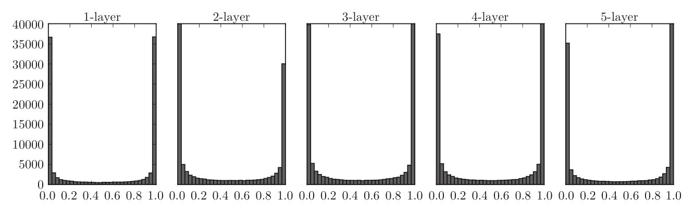

* 均值为$0$，标准差为$1$的高斯分布初始化

  这次呈集中于$0.5$附近，不会发生梯度消失的问题，但是，激活值的这种分布偏向会导致表现力受限，因为如果多个神经元输出相同的值，我们会以为这些神经元在网络中表现同样的作用，所以也就是有冗余的。

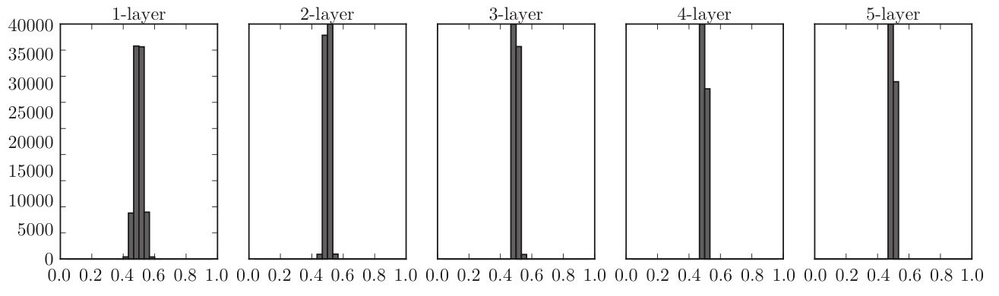

##### $Xavier$初始化

* $Xavier$正态分布

  ```python
  torch.nn.init.xavier_normal_(tensor,gain=1)
  ```

  $Xavier$初始值是以激活函数是线性函数推导出来的，结论是：如果前一层的节点数为$n$，那么初始值使用标准差为$\dfrac{1}{\sqrt{n}}$的高斯分布。由于$sigmoid$和$tanh$函数左右对称，中央附近可以视作线性函数，所以可以使用这种初始化。

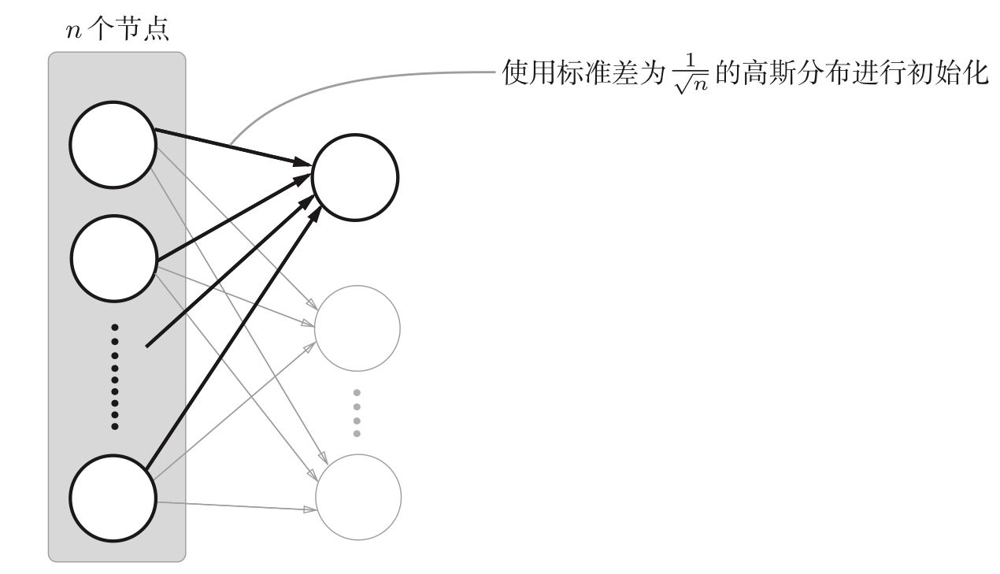

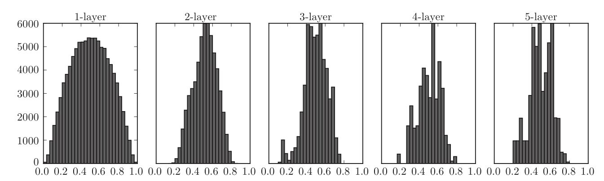

* $Xavier$均匀分布

  ```python
  torch.nn.init.xavier_normal_(tensor,gain=1)
  ```

  该方法服从均匀分布$U(-a,a)$，分布的参数$a=gain\times \sqrt{\dfrac{6}{fan\_in+fan\_out}}$。$gain$是根据激活函数来定的。$fan\_in$是权值张量中的输入单位的数量，$fan\_out$是权值张量中的输出单位的数量。

  ```python
  w = torch.empty(3, 5)
  nn.init.xavier_uniform_(w, gain=nn.init.calculate_gain('relu'))
  ```

##### $Kaiming$初始化

* $Kainming$正态初始化

  ```python
  torch.nn.init.kaiming_normal_(tensor, a=0, mode='fan_in', nonlinearity='leaky_relu')
  ```

  由于$ReLU$函数的特性与$sigmoid$和$tanh$不同，所以何恺明提出初始值使用标准差为$\dfrac{1}{\sqrt{n}}$的高斯分布。

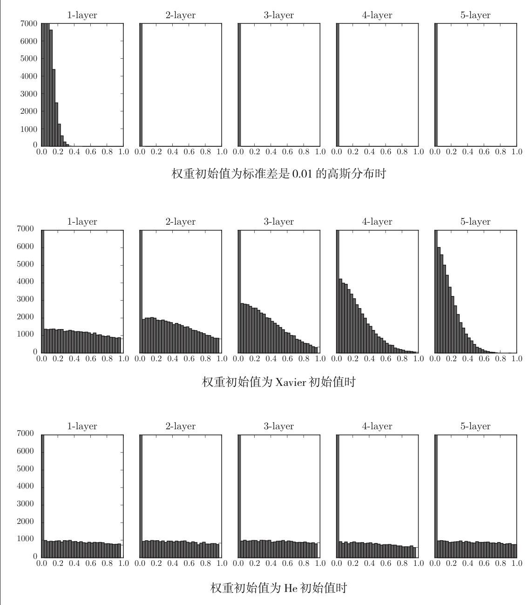

* $Kainming$均匀初始化

  ```python
  torch.nn.init.kaiming_uniform_(tensor, a=0, mode='fan_in', nonlinearity='leaky_relu')
  ```

  

### 损失函数

将损失函数看做特殊的$layer$，$PyTorch$也将这些损失函数实现为$nn.Module$的子类。**然而在实际中通常将这些损失函数提取出来，作为独立的一部分，因为没有什么参数要学的。**

#### $L1loss$

$$
l(x,y)=L=\{l_1,l_2,\dots,l_N\}^T,l_n=|x_n-y_n|\\
l(x,y)=\left\{
\begin{aligned}
&mean(L),if\ reduvtion='mean'\\
&sum(L),if\ reduvtion='sum'
\end{aligned}
\right.
$$


```python
#CLASStorch.nn.L1Loss(size_average=None, reduce=None, reduction='mean')
loss = nn.L1Loss()
input = torch.randn(3, 5, requires_grad=True)
target = torch.randn(3, 5)
output = loss(input, target)
output.backward()
```


#### $MSELoss$

$$
l(x,y)=L=\{l_1,l_2,\dots,l_N\}^T,l_n=(x_n-y_n)^2\\
l(x,y)=\left\{
\begin{aligned}
&mean(L),if\ reduvtion='mean'\\
&sum(L),if\ reduvtion='sum'
\end{aligned}
\right.
$$

```python
#CLASStorch.nn.MSELoss(size_average=None, reduce=None, reduction='mean')
loss = nn.MSELoss()
input = torch.randn(3, 5, requires_grad=True)
target = torch.randn(3, 5)
output = loss(input, target)
output.backward()
```

#### $CrossEntropyLoss$

该方法实际上是将$nn.LogSoftmax$（可以看成是激活函数）和$nn.NLLLoss$（可以看成是损失函数）进行了结合。

```python
import torch
import torch.nn.functional as F
target=torch.tensor([0,1,2],dtype=torch.long)
output=torch.tensor([[0.1,0.2,0.7],[0.2,0.3,0.5],[0.3,0.4,0.3]],dtype=torch.double)
loss=F.cross_entropy(output,target,reduction='sum')
a=F.log_softmax(output,dim=1)
print(a)
print(loss)

import torch
import torch.nn as nn

loss = nn.CrossEntropyLoss()
input = torch.randn(3, 5, requires_grad=True)
print(input)
target = torch.empty(3, dtype=torch.long).random_(5)
print(target)
output = loss(input, target)
print(output)

f=nn.LogSoftmax(dim=1)
f1=nn.NLLLoss()
print(f1(f(input),target))
```

$$
l(x,y)=L=\{l_1,\dots,l_N\}^T,l_n=-w_{y_n}log\dfrac{e^{x_{n,y_n}}}{\sum^C_{c=1}e^{x_{n,c}}}\cdot 1\{y_n \neq ignore\_index\}\\
l(x,y)=\left\{
\begin{aligned}
&mean(L),if\ reduvtion='mean'\\
&sum(L),if\ reduvtion='sum'
\end{aligned}
\right.
$$


```python
#CLASStorch.nn.CrossEntropyLoss(weight=None, size_average=None, ignore_index=- 100, reduce=None, reduction='mean', #label_smoothing=0.0)
# Example of target with class indices
loss = nn.CrossEntropyLoss()
input = torch.randn(3, 5, requires_grad=True)
target = torch.empty(3, dtype=torch.long).random_(5)
output = loss(input, target)
output.backward()
```

#### $nlloss$

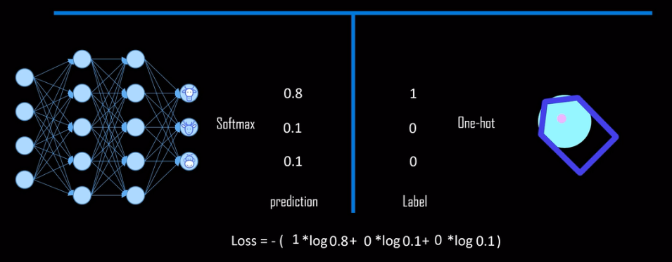

由上图可知就是对应类别上的输出取一个负号而已！
$$
l(x,y)=L=\{l_1,\dots,l_N\}^T,l_n=-w_{y_n}x_{n,y_n},w_c=weight[c]\cdot 1\{c\neq ignore\_index\}\\
l(x,y)=\left\{
\begin{aligned}
&mean(L),if\ reduvtion=mean\\
&sum(L),if\ reduvtion=sum
\end{aligned}
\right.
$$


```python
a=nn.LogSoftmax(dim=1)
loss = nn.CrossEntropyLoss(reduction='sum')
input = torch.randn(3, 5, requires_grad=True)
target = torch.empty(3, dtype=torch.long).random_(5)
print(input)
print(F.cross_entropy(input,target))
print(F.log_softmax(input,dim=1))
print(F.nll_loss(F.log_softmax(input,dim=1),target))
```

* $PoissonNLLLoss$
* $KLDivLoss$
* $BCELoss$
* $BCEWithLogitsLoss$
* $MarginRankingLoss$
* $HingeEmbeddingLoss$
* $MultiLabelMarginLoss$
* $SmoothL1Loss$
* $SoftMarginLoss$
* $MultiLabelSoftMarginLoss$
* $CosineEmbeddingLoss$
* $MultiMarginLoss$
* $TripletMarginLoss$

```html
<div STYLE="page-break-after: always;"></div>
```

### $optim$

**当数据、模型和损失函数确定，任务的数学模型就已经确定了，接着就要选择一个合适的优化器对该模型进行优化。**

$PyTorch$将深度学习中常用的优化方法全部封装在$torch.optim$中，其设计十分灵活，能够很方便地扩展成自定义的优化方法。所有的优化方法都是继承基类$optim.Optimizer$，并实现了自己的优化步骤。一个必要的形参是神经网络的参数和相应的梯度。

$optimizer$对参数的管理是基于“组”的概念，即**参数组**。可以为每一个参数组配置特定的$lr,momentum,weight\_decay$等。

参数组在$optimizer$中表现为一个$list$，其中每个元素是$dict$，表示一个参数及其配置，包含$params,weight_decay,lr,momentum$等字段。

```python
w1 = torch.randn(2, 2)
w1.requires_grad = True

w2 = torch.randn(2, 2)
w2.requires_grad = True

w3 = torch.randn(2, 2)
w3.requires_grad = True

# 一个参数组
optimizer_1 = optim.SGD([w1, w3], lr=0.1)
print('len(optimizer.param_groups): ', len(optimizer_1.param_groups))
print(optimizer_1.param_groups, '\n')
#len(optimizer.param_groups):  1
#[{'params': [tensor([[-0.9876, -1.7521],
#        [ 0.4333, -0.6037]], requires_grad=True), tensor([[-1.4005, -0.8966],
#        [-0.8247, -1.0509]], requires_grad=True)], 'lr': 0.1, 'momentum': 0, 'dampening': 0, 'weight_decay': 0, #'nesterov': False}] 


# 两个参数组
optimizer_2 = optim.SGD([{'params': w1, 'lr': 0.1},
                         {'params': w2, 'lr': 0.001}])
print('len(optimizer.param_groups): ', len(optimizer_2.param_groups))
print(optimizer_2.param_groups)
#len(optimizer.param_groups):  2
#[{'params': [tensor([[-0.9876, -1.7521],
#        [ 0.4333, -0.6037]], requires_grad=True)], 'lr': 0.1, 'momentum': 0, 'dampening': 0, 'weight_decay': 0, #'nesterov': False}, {'params': [tensor([[ 1.7329,  0.6773],
#        [ 1.5786, -0.3435]], requires_grad=True)], 'lr': 0.001, 'momentum': 0, 'dampening': 0, 'weight_decay': 0, #'nesterov': False}]
```

#### 一些必要的函数

* $zero\_grad()$

  由于$PyTorch$是自动累加梯度，不会自动清零梯度，所以在每一次更新前我们会进行此操作。

  ```python
  w1 = torch.randn(2, 2)
  w1.requires_grad = True
  
  w2 = torch.randn(2, 2)
  w2.requires_grad = True
  
  optimizer = optim.SGD([w1, w2], lr=0.001, momentum=0.9)
  
  optimizer.param_groups[0]['params'][0].grad = torch.randn(2, 2)
  
  print('参数w1的梯度：')
  print(optimizer.param_groups[0]['params'][0].grad, '\n')  # 参数组，第一个参数(w1)的梯度
  
  optimizer.zero_grad()
  print('执行zero_grad()之后，参数w1的梯度：')
  print(optimizer.param_groups[0]['params'][0].grad)  # 参数组，第一个参数(w1)的梯度
  # ----------------------------------------------------------------------
  #参数w1的梯度：
  #tensor([[-0.3035, -0.4120],
  #        [-1.2879,  0.2902]]) 
  
  #执行zero_grad()之后，参数w1的梯度：
  #tensor([[0., 0.],
  #        [0., 0.]])
  ```

* $state\_dict()$

  获取模型当前的参数，以一个有序字典形式返回。

  ```python
  class Net(nn.Module):
      def __init__(self):
          super(Net, self).__init__()
          self.conv1 = nn.Conv2d(3, 1, 3)
          self.pool = nn.MaxPool2d(2, 2)
          self.fc1 = nn.Linear(1 * 3 * 3, 2)
  
      def forward(self, x):
          x = self.pool(F.relu(self.conv1(x)))
          x = x.view(-1, 1 * 3 * 3)
          x = F.relu(self.fc1(x))
          return x
  
  
  net = Net()
  
  # 获取网络当前参数
  net_state_dict = net.state_dict()
  
  print('net_state_dict类型：', type(net_state_dict))
  print('net_state_dict管理的参数: ', net_state_dict.keys())
  for key, value in net_state_dict.items():
      print('参数名: ', key, '\t大小: ',  value.shape)
  # ----------------------------------------------------------------------
  #net_state_dict类型： <class 'collections.OrderedDict'>
  #net_state_dict管理的参数:  odict_keys(['conv1.weight', 'conv1.bias', 'fc1.weight', 'fc1.bias'])
  #参数名:  conv1.weight 	大小:  torch.Size([1, 3, 3, 3])
  #参数名:  conv1.bias 	大小:  torch.Size([1])
  #参数名:  fc1.weight 	大小:  torch.Size([2, 9])
  #参数名:  fc1.bias 	大小:  torch.Size([2])
  ```

* $load\_state\_dict()$

  将$state\_dict$的参数加载到当前网络，常用于$finetune$。

  ```python
  class Net(nn.Module):
      def __init__(self):
          super(Net, self).__init__()
          self.conv1 = nn.Conv2d(3, 1, 3)
          self.pool = nn.MaxPool2d(2, 2)
          self.fc1 = nn.Linear(1 * 3 * 3, 2)
  
      def forward(self, x):
          x = self.pool(F.relu(self.conv1(x)))
          x = x.view(-1, 1 * 3 * 3)
          x = F.relu(self.fc1(x))
          return x
  
      def zero_param(self):
          for m in self.modules():
              if isinstance(m, nn.Conv2d):
                  torch.nn.init.constant_(m.weight.data, 0)
                  if m.bias is not None:
                      m.bias.data.zero_()
              elif isinstance(m, nn.Linear):
                  torch.nn.init.constant_(m.weight.data, 0)
                  m.bias.data.zero_()
  net = Net()
  
  # 保存，并加载模型参数(仅保存模型参数)
  torch.save(net.state_dict(), 'net_params.pkl')   # 假设训练好了一个模型net
  pretrained_dict = torch.load('net_params.pkl')
  # 将net的参数全部置0，方便对比
  net.zero_param()
  net_state_dict = net.state_dict()
  print('conv1层的权值为:\n', net_state_dict['conv1.weight'], '\n')
  
  # 通过load_state_dict 加载参数
  net.load_state_dict(pretrained_dict)
  print('加载之后，conv1层的权值变为:\n', net_state_dict['conv1.weight'])
  ```

* $add\_param\_group()$

  给$optimizer$管理的参数组增加一组参数，可以为改组参数定制$lr,momentum,weight\_decay$等,，在$finetune$中常用。

  ```python
  w1 = torch.randn(2, 2)
  w1.requires_grad = True
  
  w2 = torch.randn(2, 2)
  w2.requires_grad = True
  
  w3 = torch.randn(2, 2)
  w3.requires_grad = True
  
  # 一个参数组
  optimizer_1 = optim.SGD([w1, w2], lr=0.1)
  print('当前参数组个数: ', len(optimizer_1.param_groups))
  print(optimizer_1.param_groups, '\n')
  
  # 增加一个参数组
  print('增加一组参数 w3\n')
  optimizer_1.add_param_group({'params': w3, 'lr': 0.001, 'momentum': 0.8})
  
  print('当前参数组个数: ', len(optimizer_1.param_groups))
  print(optimizer_1.param_groups, '\n')
  
  print('可以看到，所有参数组组成一个list，一个元素是一个dict，每个dict中都有lr, momentum等参数，这些都是可单独管理，单独设定，十分灵活！')
  
  
  ```

* $step(closure)$

  执行一步权值更新，其中可传入参数$closure$（一个闭包）。

#### $SGD$

批量梯度下降$(Batch\ Gradient\ Descent)$，每次使用整个训练集合计算梯度，这样计算的梯度比较稳定，相比于$SGD$不那么容易震荡。但是因为某次都需要更新整个数据集，**所以计算起来非常慢**，所以批量梯度非常慢且无法放在内存中计算，当然也**无法运用于在线学习系统**。但是$SGD$每次随机抽取一个样本计算$loss$和梯度并对参数进行更新，由于每次不需要遍历所有的数据，所以迭代速度快，但是这种算法比较弱，往往容易走偏，$SGD$ 因为更新比较频繁，会造成$cost\ function$有严重的震荡，反而违反了初衷，增加了好多轮迭代。它可以用于在线学习系统，可使得系统学到快速新的变化。

| 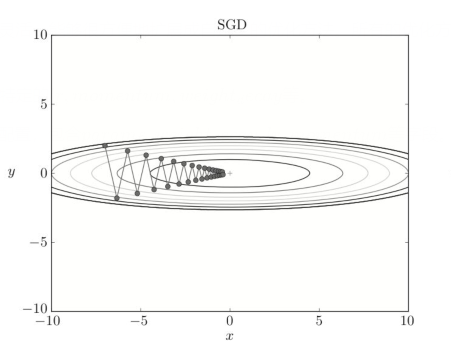 | 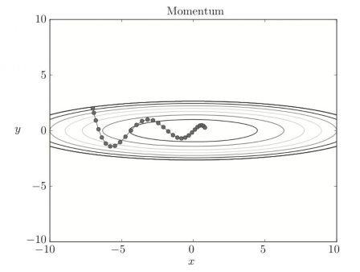 |
| :----------------------------------------------------------: | :----------------------------------------------------------: |

$$
W\leftarrow W-\eta \dfrac{\partial L}{\partial W}\quad\quad\quad\quad\quad\quad\quad\quad\quad\quad\quad\quad\quad\quad\quad\quad\quad\quad\quad\quad\quad\quad v\leftarrow \alpha v-\eta\dfrac{\partial L}{\partial W}\\
\quad\quad\quad\quad\quad\quad\quad\quad\quad\quad\quad\quad\quad\quad\quad\quad\quad\quad\quad\quad\quad\quad\quad\quad\quad\quad\quad\quad\quad W \leftarrow W+v
$$

上述$SGD$图片的缺点是，如果函数的形状是非均项的，也就是说$x$和$y$的梯度大小相差较大，如$f(x,y)=\dfrac{1}{20}x^2+y^2$，那么就会呈之字形移动，效率低下。将小球找最低点的过程看做一个物理运动过程，可以很自然地引入$Momentum$。它**旨在加速学习**。当物体不受力时，将$\alpha$设置为$0.9$之类的值，对应物理上的地面摩擦或者空气阻力。我们需要注意，$v$初始化为$0$，当第一次调用后，$v$会以字典变量的形式保存与参数结构相同的数据（因为可能有多个变量，每个变量对应一个梯度）。直观来说，虽然每次$x$方向上的导数很小，但是每次都会累积，而$y$方向上的导数很大，但是正负方向上的力会抵消大部分，所以$y$方向没有发生太大变化。

```python
def __init__(self, params, 
				   lr=required, 
				   momentum=0,
             	   dampening=0,
             	   weight_decay=0, nesterov=False):
```

```python
optimizer = torch.optim.SGD(model.parameters(), lr=0.1, momentum=0.9)#传进去参数梯度信息
optimizer.zero_grad()
loss_fn(model(input), target).backward()
optimizer.step()
```

值得注意的是，$PyTorch$中使用$SGD$十分需要注意的是，更新公式与其他框架不同，它是这样的：
$$
v_{t+1}=\mu\times v_t+g_{t+1}\\
p_{t+1}=p_t-lr\times v_{t+1}
$$
而其它框架是这样的：
$$
v_{t+1}=\mu\times v_t+lr\times g_{t+1}\\
p_{t+1}=p_t-v_{t+1}
$$

#### $AdaGrad\&Adam$ 

| 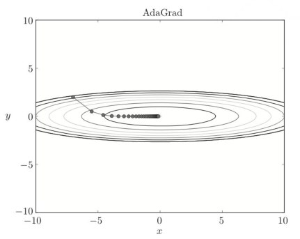 | 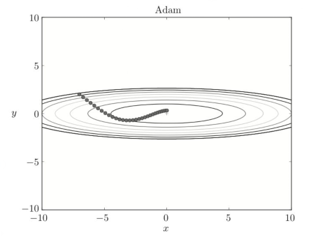 |
| :----------------------------------------------------------: | :----------------------------------------------------------: |

$$
h\leftarrow h+\dfrac{\partial L}{\partial W}\odot\dfrac{\partial L}{\partial W}\quad\quad\quad\quad\quad\quad\quad\quad\quad\quad\quad\quad\quad\quad\quad\quad\quad\quad\quad\quad\quad\quad v\leftarrow \alpha v-\eta\dfrac{\partial L}{\partial W}\\
 W \leftarrow W-\eta\dfrac{1}{\sqrt{h}}\dfrac{\partial L}{\partial W}\quad\quad\quad\quad\quad\quad\quad\quad\quad\quad\quad\quad\quad\quad\quad\quad\quad\quad\quad\quad\quad W \leftarrow W+v
$$

在神经网络的学习中，学习率的值也是很重要的，学习率过小，会导致话费过多时间；反过来，学习率郭大大，则会导致学习发散而不能正确进行。$AdaGrad$可以采用学习率衰减的技巧，让一开始多学习， 后来少学习，并且学习率是为每个变量量身定制的。$AdaGrad$会记录所有梯度的平方和。因此学习越深入，更新的幅度就越小。

$Momentum$参照小球在碗中滚动的物理规则进行移动，$AdaGrad$为参数的每个元素适当地调整更新步伐。而$Adam$的基本思路是将两者结合起来。

* $ASGD$

  $Averaged\ Stochastic\ Gradient\ Decent$，简单地说$ASGD$就是用空间换时间的一种$SGD$。

* $Rprop$

  

* $Adadelta$

* $RMSprop$

  $AdaGrad$如果到了后期（即学习了很长时间），那么更新量就会变为$0$，完全不再更新。为了改善这个问题，可以使用$RMSProp$方法。它不是将过去所有的梯度一视同仁地相加，而是逐渐地遗忘过去的梯度，在做加法运算时将新梯度的信息更多地反映出来（用指数移动平均实现）。

* $AMSGrad$

* $Adamax$

* $SparseAdam$

* $LBFGS$


```html
<div STYLE="page-break-after: always;"></div>
```

### $autograd$

$autograd$是为了方便用户使用，专门开发的一套自动求导引擎，它能够根据输入和前向传播过程自动构建计算图，并执行反向传播。

$torch.autograd$提供了类和函数用来对**任意标量函数**进行求导。$PyTorch$中，所有神经网络的核心是 $autograd$包。

$autograd$会随着用户的操作记录生成当前$Tensor$的所有操作，由此建立一个有向无环图。每一个前向传播操作的函数都有与之对应的反向传播函数用来计算输入的各个$Tensor$的梯度，这些函数的函数名通常用$Backward$结尾。

```python
x=torch.ones(1)
b=torch.rand(1,requires_grad=True)
w=torch.rand(1,requires_grad=True)
y=w*x
z=y+b
print(x.is_leaf,b.is_leaf,w.is_leaf,y.is_leaf,z.is_leaf)#True True True False False
print(z.grad_fn)#<AddBackward0 object at 0x000002202321F308>
#False True True True True
print(x.requires_grad,b.requires_grad,w.requires_grad,y.requires_grad,z.requires_grad)
#((<MulBackward0 object at 0x000002556C1AF308>, 0), (<AccumulateGrad object at 0x000002556C1F2EC8>, 0))
print(z.grad_fn.next_functions)
print(z.grad_fn.next_functions[0][0]==y.grad_fn)
```

变量的$requires\_grad$属性默认为$False$，如果某一个结点的$requires\_grad$被设置为$True$，那么所有依赖它的变量的$requires\_grad$都是$True$。

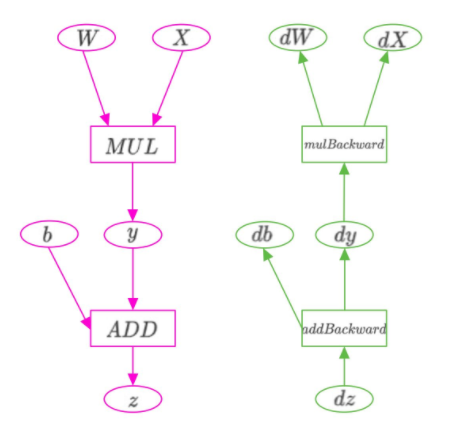


可以看出，计算$w$的梯度时需要用到$x$的数值（$\dfrac{\partial y}{\partial w}=x$），这些数值在前向过程中会保存成$buffer$，在计算完梯度之后会自动清空，为了能够多次反向传播需要指定$retain\_graph$来保留这些$buffer$。$PyTorch$使用的是动态图，它的计算图在运行时每次前向传播时都是从头开始构建的，所以它能够使用$Python$的控制语句（$for,if$），根据需求创建计算图，也即在前向传播结束时，计算图才构建完毕。意**味着你不需要事先构建所有可能用到的图路径，只有需要这条路径才会出现在图中。**

```html
<div STYLE="page-break-after: always;"></div>
```

### $utils.data$


#### 数据划分

收集完或者读取完数据后将进行数据集的划分：训练集，验证集，测试集。

#### 数据读取

* 读哪些数据？`Sampler`输出的`index`。
* 从哪里读数据？`Dataset`中的`data_dir`。
* 怎么读数据？`Dataset`中的`getitem`。

在使用`PyTorch`构建和训练模型的过程中，经常需要把原始的数据（比如图片等）转换为张量的格式，为了能够方便地批量处理图片数据，`PyTorch`引入了一些列工具来对这个过程进行包装。

```python
DataLoader(dataset, batch_size=1, shuffle=False, sampler=None,
           batch_sampler=None, num_workers=0, collate_fn=None,
           pin_memory=False, drop_last=False, timeout=0,
           worker_init_fn=None, *, prefetch_factor=2,
           persistent_workers=False)
```

* `dataset`：一个`torch.utils.data.Dataset`的实例；决定样本从哪里读取以及如何读取。
* `batch_size`：批次的大小；
* `shuffle`：代表数据会不会被随机打乱；
* `sampler`：自定义的采样器（`shuffle=True`时会构建默认的采样器，也可以构造一个`torch.utils.data.Sampler`的实例来进行采样，并设置`shuffle=False`），其中采样器是$Python$的迭代器，每次迭代的时候会返回一个数据的下标索引。
* `batch_sampler`：类似于`sampler`，不过返回的是一个迷你批次的数据索引，而`sampler`返回的仅仅是一个下标索引；
* `num_workers`：数据载入器使用的进程的数目，默认为$0$，即使用单进程来处理输入数据；
* `collate_fn`：定义如何把一批`dataset`的实例转换为包含迷你批次数据的张量；
* `pin_memory`：会把数据转移到`GPU`内存相关的`CPU`内存（`pinned Memory`）中，从而能够加快`GPU`载入数据的速度；
* `drop_last`：当样本数不能被`batch_size`整除时，是否要把最后一个迷你批次的数据丢弃掉；决定每个`epoch`有多少个`batch_size`的数据。
* `timeout`的值如果大于$0$，就会决定在多进程情况下对数据的等待时间；
* `worker_init_fn`：每个载入数据的子进程开始运行的函数。

为了能够使用`DataLoader`类，首先需要构造关于单个数据的`torch.utils.data.Dataset`类。（`torch.utils.data.Dataset`是表示数据的抽象类，所有其他数据集都应该进行子类化。所有子类应该重写`__len__`和`__getitem__`，前者提供了数据集的大小，后者支持整数索引，范围从$0$到$len(self)$，也就是接收一个索引，返回一个样本）这个类有两种，第一种是映射类型的，对于这个类型，每一个数据有一个对应的索引，通过输入具体的索引，就能得到对应的数据，其构造方式如下：

```python
class Dataset(object):
    def __getitem__(self,index):
        #index：数据索引（整数，范围从0到数据数目-1）
        #返回数据张量
 	def __len__(salf):
        #返回数据的数目
```


## 实践

### 手写数字识别

* 获取数据

```python
batch_size_train = 64 #每次训练的样本数量
batch_size_test = 1000
#训练集数据
train_loader = torch.utils.data.DataLoader(
torchvision.datasets.MNIST('./data/', train=True, download=True,
                             transform=torchvision.transforms.Compose([
                               torchvision.transforms.ToTensor(),
                               torchvision.transforms.Normalize((0.1307,), (0.3081,))])), #Normalize()转换使用的值0.1307和0.3081是该数据集的全局平均值和标准偏差，这里将它们作为给定值
  								batch_size=batch_size_train, shuffle=True)
#测试集数据
test_loader = torch.utils.data.DataLoader(
torchvision.datasets.MNIST('./data/', train=False, download=True,
                             transform=torchvision.transforms.Compose([
                               torchvision.transforms.ToTensor(),
                               torchvision.transforms.Normalize((0.1307,), (0.3081,))])),
  								batch_size=batch_size_test, shuffle=True)
```

* 定义卷积神经网络

```python
#定义卷积神经网络
class Net(nn.Module):
    def __init__(self):
        super(Net, self).__init__()
        self.conv1 = nn.Conv2d(1, 10, kernel_size=5)
        self.conv2 = nn.Conv2d(10, 20, kernel_size=5) #
        self.conv2_drop = nn.Dropout2d() 
        self.fc1 = nn.Linear(320, 50) 
        self.fc2 = nn.Linear(50, 10)
    def forward(self, x):
        x = F.relu(F.max_pool2d(self.conv1(x), 2)) 
        x = F.relu(F.max_pool2d(self.conv2_drop(self.conv2(x)), 2)) 
        x = x.view(-1, 320) # batch*20*4*4 -> batch*320
        x = F.relu(self.fc1(x)) #进入全连接层
        x = F.dropout(x, training=self.training) #减少遇到过拟合问题，dropout层是一个很好的规范模型。
        x = self.fc2(x)
        return F.log_softmax(x)#计算log(softmax(x))
#初始化网络和优化器
#如果我们使用GPU进行训练，应使用例如network.cuda()将网络参数发送给GPU。将网络参数传递给优化器之前，将它们传输到适当的设备很重要，否则优化器无法以正确的方式跟踪它们。
network = Net()
```

* 定义优化器

```python
learning_rate = 0.01
momentum = 0.5 #优化器的超参数
optimizer = optim.SGD(network.parameters(), lr=learning_rate,momentum=momentum)
```

* 定义训练函数

```python
def train(epoch):
    network.train() #在训练模型时会在前面加上
    for batch_idx, (data, target) in enumerate(train_loader):
        optimizer.zero_grad() #使用optimizer.zero_grad()手动将梯度设置为零，因为PyTorch在默认情况下会累积梯度
        output = network(data) #生成网络的输出(前向传递)
        loss = F.nll_loss(output, target) #计算输出（output）与真值标签（target）之间的负对数概率损失
        loss.backward() #对损失反向传播
        optimizer.step() #收集一组新的梯度，并使用optimizer.step()将其传播回每个网络参数
        if batch_idx % log_interval == 0: #log_interval=10，每10次投喂后输出一次，也就是640个数据
            print('Train Epoch: {} [{}/{} ({:.0f}%)]\tLoss: {:.6f}'.format(epoch, batch_idx * len(data), len(train_loader.dataset),100. * batch_idx / len(train_loader), loss.item()))
            train_losses.append(loss.item()) #添加进训练损失列表中
            train_counter.append((batch_idx * 64) + ((epoch - 1) * len(train_loader.dataset)))
            #神经网络模块以及优化器能够使用.state_dict()保存和加载它们的内部状态。这样，如果需要，我们就可以继续从以前保存的状态dict中进行训练——只需调用.load_state_dict(state_dict)。
            torch.save(network.state_dict(), './model.pth')
            torch.save(optimizer.state_dict(), './optimizer.pth')
```

`nll_loss`是$softmax$的负对数形式的损失函数：
$$
L=-logo_i(z)=-log\dfrac{exp(z_i)}{\sum_jexp(z_j)}=-z_i-log\sum_j(exp(z_j))
$$

```python
def nll_loss(input, target, weight=None, size_average=None, ignore_index=-100,reduce=None, reduction='mean')
```

`nll_loss`函数接收两个`tensor`第一个是模型的`output`，第二个是`label target`，`output`中每一行与一个标签中每一列的元素对应，根据`target`的取值找出`output`行中对应位置元素，取负后求和取平均值（`reduction`是`sum`的话是求和）。

例如算出来的$log\ softmax$张量是：

```python
tensor([[-3.2056, -1.7804, -0.4350, -3.9833, -2.0795],
    [-2.1543, -1.8606, -1.5360, -1.1057, -1.7025],
    [-2.3243, -0.7615, -1.1595, -2.5594, -3.1195]]
```

而目标是：

```python
tensor([1, 0, 4])
```

标签代表了tensor中每一行向量应该检查的位置，例如第一个标签是1，这表示在tensor第一行中应该选择1号位置的元素$-1.7804$（代表了模型将数据分为$1$类的概率）取出，同理取第$2$行$0$号位置元素$-2.1543$,取第三行$4$号位置元素$-3.1195$，将它们去除负号求和再取均值。
则该模型输出$output$与$target$之间误差$L$应为：$\dfrac{(1.7804+2.1543+3.1195)}{3} = 2.3514$。

* 定义测试函数

  ```python
  def test():
      network.eval() #在测试模型时在前面使用
      test_loss = 0
      correct = 0
      with torch.no_grad(): #使用上下文管理器no_grad()，我们可以避免将生成网络输出的计算结果存储在计算图（with是使用的意思）
          for data, target in test_loader:
              output = network(data) #生成网络的输出(前向传递)
              # 将一批的损失相加
              test_loss += F.nll_loss(output, target, size_average=False).item() 
              pred = output.data.max(1, keepdim=True)[1] ## 找到概率最大的下标
              correct += pred.eq(target.data.view_as(pred)).sum() #预测正确的数量相加
      test_loss /= len(test_loader.dataset)
      test_losses.append(test_loss)
      print('\nTest set: Avg. loss: {:.4f}, Accuracy: {}/{} ({:.0f}%)\n'.format(
          test_loss, correct, len(test_loader.dataset),
          100. * correct / len(test_loader.dataset)))
  ```

  

### 猫狗分类

### 自动写诗


## <center>$torchvision$</center>

$torchvision$是一个视觉工具包，提供了很多视觉图像处理的工具，其中$transforms$模块提供了对$PIL\ Image$对象和$Tensor$对象的常用操作。

主要包含以下三部分：

* $models$：提供深度学习中各种经典网络的网格结构以及预训练好的模型，包括$Alex-Net,VGG系列，ResNet系列，Inception系列$。
* $datasets$：提供常用的数据集加载，设计上都是继承$torch.utils.data.Dataset$，主要包括$MNIST,CIFAR10/100,ImageNet,COCO等$。
* $transforms$：提供常用的数据预处理操作，主要包括对$Tensor$及$PIL\ Image$对象的操作。

### $datasets$

`ImageFolder`假设所有的文件按文件夹保存，每个文件夹下存储同一个类别的图片，文件夹名为类名，其构造函数如下：

```python
datasets.ImageFolder(root, transform=None, target_transform=None, loader=default_loader)
```

`root`：在`root`指定的路径下寻找图片
`transform`：对`PIL Image`进行的转换操作，`transform`的输入是使用`loader`读取图片的返回对象
`target_transform`：对`label`的转换
`loader`：给定路径后如何读取图片，默认读取为`RGB`格式的`PIL Image`对象。


下面从这个包的角度来看一下在$torchvision$里是如何实现一个具体的$torch.utils.data.Dataset$类

```python
class MNIST(self, root, train=True, transform=None, target_transform=None, download=False)
```

* `root`：`MNIST/raw/train-images-idx3-ubyte` 和 `MNIST/raw/t10k-images-idx3-ubyte` 存在的根目录。
* `train`：如果为`True`，就从`train-images-idx3-ubyte`获取数据，否则从`t10k-images-idx3-ubyte`获取数据。
* `download`：如果为`True`，就从网上下载数据并放到根目录中；数据已经下载好的话，就不重复下载。
* `transform`：转换`PIL`格式的图片。
* `target_transform`：转换`target`。

具体而言

```python
class MNIST(VisionDataset):
    """`MNIST <http://yann.lecun.com/exdb/mnist/>`_ Dataset.

    Args:
        root (string): Root directory of dataset where ``MNIST/processed/training.pt``
            and  ``MNIST/processed/test.pt`` exist.
        train (bool, optional): If True, creates dataset from ``training.pt``,
            otherwise from ``test.pt``.
        download (bool, optional): If true, downloads the dataset from the internet and
            puts it in root directory. If dataset is already downloaded, it is not
            downloaded again.
        transform (callable, optional): A function/transform that  takes in an PIL image
            and returns a transformed version. E.g, ``transforms.RandomCrop``
        target_transform (callable, optional): A function/transform that takes in the
            target and transforms it.
    """

    resources = [
        ("http://yann.lecun.com/exdb/mnist/train-images-idx3-ubyte.gz", "f68b3c2dcbeaaa9fbdd348bbdeb94873"),
        ("http://yann.lecun.com/exdb/mnist/train-labels-idx1-ubyte.gz", "d53e105ee54ea40749a09fcbcd1e9432"),
        ("http://yann.lecun.com/exdb/mnist/t10k-images-idx3-ubyte.gz", "9fb629c4189551a2d022fa330f9573f3"),
        ("http://yann.lecun.com/exdb/mnist/t10k-labels-idx1-ubyte.gz", "ec29112dd5afa0611ce80d1b7f02629c")
    ]

    training_file = 'training.pt'
    test_file = 'test.pt'
    classes = ['0 - zero', '1 - one', '2 - two', '3 - three', '4 - four',
               '5 - five', '6 - six', '7 - seven', '8 - eight', '9 - nine']

    @property
    def train_labels(self):
        warnings.warn("train_labels has been renamed targets")
        return self.targets

    @property
    def test_labels(self):
        warnings.warn("test_labels has been renamed targets")
        return self.targets

    @property
    def train_data(self):
        warnings.warn("train_data has been renamed data")
        return self.data

    @property
    def test_data(self):
        warnings.warn("test_data has been renamed data")
        return self.data

    def __init__(self, root, train=True, transform=None, target_transform=None,
                 download=False):
        super(MNIST, self).__init__(root, transform=transform,
                                    target_transform=target_transform)
        self.train = train  # training set or test set

        if download:
            self.download()

        if not self._check_exists():
            raise RuntimeError('Dataset not found.' +
                               ' You can use download=True to download it')

        if self.train:
            data_file = self.training_file
        else:
            data_file = self.test_file
        self.data, self.targets = torch.load(os.path.join(self.processed_folder, data_file))

    def __getitem__(self, index):
        """
        Args:
            index (int): Index

        Returns:
            tuple: (image, target) where target is index of the target class.
        """
        img, target = self.data[index], int(self.targets[index])

        # doing this so that it is consistent with all other datasets
        # to return a PIL Image
        img = Image.fromarray(img.numpy(), mode='L')

        if self.transform is not None:
            img = self.transform(img)

        if self.target_transform is not None:
            target = self.target_transform(target)

        return img, target

    def __len__(self):
        return len(self.data)

    @property
    def raw_folder(self):
        return os.path.join(self.root, self.__class__.__name__, 'raw')

    @property
    def processed_folder(self):
        return os.path.join(self.root, self.__class__.__name__, 'processed')

    @property
    def class_to_idx(self):
        return {_class: i for i, _class in enumerate(self.classes)}

    def _check_exists(self):
        return (os.path.exists(os.path.join(self.processed_folder,
                                            self.training_file)) and
                os.path.exists(os.path.join(self.processed_folder,
                                            self.test_file)))

    def download(self):
        """Download the MNIST data if it doesn't exist in processed_folder already."""

        if self._check_exists():
            return

        os.makedirs(self.raw_folder, exist_ok=True)
        os.makedirs(self.processed_folder, exist_ok=True)

        # download files
        for url, md5 in self.resources:
            filename = url.rpartition('/')[2]
            download_and_extract_archive(url, download_root=self.raw_folder, filename=filename, md5=md5)

        # process and save as torch files
        print('Processing...')

        training_set = (
            read_image_file(os.path.join(self.raw_folder, 'train-images-idx3-ubyte')),
            read_label_file(os.path.join(self.raw_folder, 'train-labels-idx1-ubyte'))
        )
        test_set = (
            read_image_file(os.path.join(self.raw_folder, 't10k-images-idx3-ubyte')),
            read_label_file(os.path.join(self.raw_folder, 't10k-labels-idx1-ubyte'))
        )
        with open(os.path.join(self.processed_folder, self.training_file), 'wb') as f:
            torch.save(training_set, f)
        with open(os.path.join(self.processed_folder, self.test_file), 'wb') as f:
            torch.save(test_set, f)

        print('Done!')

    def extra_repr(self):
        return "Split: {}".format("Train" if self.train is True else "Test")
```


### $models$

### $transforms$

数据增强是对训练集进行变换使得训练集更加丰富，增强模型的泛化能力。

常用的图像预处理方法：

* 格式转换：`ToTensor()`
  - 先由`HWC`转置为`CHW`格式；
  - 再转为`float`类型；
  - 最后，每个像素除以`255`。

```python
class ToTensor(object):
    """Convert a ``PIL Image`` or ``numpy.ndarray`` to tensor.

    Converts a PIL Image or numpy.ndarray (H x W x C) in the range
    [0, 255] to a torch.FloatTensor of shape (C x H x W) in the range [0.0, 1.0]
    if the PIL Image belongs to one of the modes (L, LA, P, I, F, RGB, YCbCr, RGBA, CMYK, 1)
    or if the numpy.ndarray has dtype = np.uint8

    In the other cases, tensors are returned without scaling.
    """

    def __call__(self, pic):
        """
        Args:
            pic (PIL Image or numpy.ndarray): Image to be converted to tensor.

        Returns:
            Tensor: Converted image.
        """
        return F.to_tensor(pic)

    def __repr__(self):
        return self.__class__.__name__ + '()'
```

* 数据中心化

* 数据标准化：`Normalize`（均值变为0，标准差变为1）

  ```python
  class Normalize(object):
      """Normalize a tensor image with mean and standard deviation.
      Given mean: ``(M1,...,Mn)`` and std: ``(S1,..,Sn)`` for ``n`` channels, this transform
      will normalize each channel of the input ``torch.*Tensor`` i.e.
      ``output[channel] = (input[channel] - mean[channel]) / std[channel]``
  
      .. note::
          This transform acts out of place, i.e., it does not mutate the input tensor.
  
      Args:
          mean (sequence): Sequence of means for each channel.
          std (sequence): Sequence of standard deviations for each channel.
          inplace(bool,optional): Bool to make this operation in-place.
  
      """
  
      def __init__(self, mean, std, inplace=False):
          self.mean = mean
          self.std = std
          self.inplace = inplace
  
      def __call__(self, tensor):
          """
          Args:
              tensor (Tensor): Tensor image of size (C, H, W) to be normalized.
  
          Returns:
              Tensor: Normalized Tensor image.
          """
          return F.normalize(tensor, self.mean, self.std, self.inplace)
  ```

* 缩放：`Resize()`

  ```python
  class Resize(object):
      """Resize the input PIL Image to the given size.
  
      Args:
          size (sequence or int): Desired output size. If size is a sequence like
              (h, w), output size will be matched to this. If size is an int,
              smaller edge of the image will be matched to this number.
              i.e, if height > width, then image will be rescaled to
              (size * height / width, size)
          interpolation (int, optional): Desired interpolation. Default is
              ``PIL.Image.BILINEAR``
      """
  
      def __init__(self, size, interpolation=Image.BILINEAR):
          assert isinstance(size, int) or (isinstance(size, Iterable) and len(size) == 2)
          self.size = size
          self.interpolation = interpolation
  
      def __call__(self, img):
          """
          Args:
              img (PIL Image): Image to be scaled.
  
          Returns:
              PIL Image: Rescaled image.
          """
          return F.resize(img, self.size, self.interpolation)
  
      def __repr__(self):
          interpolate_str = _pil_interpolation_to_str[self.interpolation]
          return self.__class__.__name__ + '(size={0}, interpolation={1})'.format(self.size, interpolate_str)
  ```

  

* 裁剪：

  * `CenterCrop(size)`：从图像中心裁剪图片

    ```python
    class CenterCrop(object):
        """Crops the given PIL Image at the center.
    
        Args:
            size (sequence or int): Desired output size of the crop. If size is an
                int instead of sequence like (h, w), a square crop (size, size) is
                made.
        """
    
        def __init__(self, size):
            if isinstance(size, numbers.Number):
                self.size = (int(size), int(size))
            else:
                self.size = size
    
        def __call__(self, img):
            """
            Args:
                img (PIL Image): Image to be cropped.
    
            Returns:
                PIL Image: Cropped image.
            """
            return F.center_crop(img, self.size)
    
        def __repr__(self):
            return self.__class__.__name__ + '(size={0})'.format(self.size)
    ```

  * `torchvision.transforms.RandomCrop(size, padding=None, pad_if_needed=False,padding_mode='constant',fill=0)`：从图片中随机裁剪出尺寸为`size`的图片。

    `padding_mode`：填充的模式，`constant`，`edge`，`reflect`，`symmetric`。

    `fill`：当填充模式为`constant`时，填充的像素值。

    ```python
    class RandomCrop(object):
        """Crop the given PIL Image at a random location.
    
        Args:
            size (sequence or int): Desired output size of the crop. If size is an
                int instead of sequence like (h, w), a square crop (size, size) is
                made.
            padding (int or sequence, optional): Optional padding on each border
                of the image. Default is None, i.e no padding. If a sequence of length
                4 is provided, it is used to pad left, top, right, bottom borders
                respectively. If a sequence of length 2 is provided, it is used to
                pad left/right, top/bottom borders, respectively.
            pad_if_needed (boolean): It will pad the image if smaller than the
                desired size to avoid raising an exception. Since cropping is done
                after padding, the padding seems to be done at a random offset.
            fill: Pixel fill value for constant fill. Default is 0. If a tuple of
                length 3, it is used to fill R, G, B channels respectively.
                This value is only used when the padding_mode is constant
            padding_mode: Type of padding. Should be: constant, edge, reflect or symmetric. Default is constant.
    
                 - constant: pads with a constant value, this value is specified with fill
                 - edge: pads with the last value on the edge of the image
                 - reflect: pads with reflection of image (without repeating the last value on the edge)
                    padding [1, 2, 3, 4] with 2 elements on both sides in reflect mode
                    will result in [3, 2, 1, 2, 3, 4, 3, 2]
    
                 - symmetric: pads with reflection of image (repeating the last value on the edge)
                    padding [1, 2, 3, 4] with 2 elements on both sides in symmetric mode
                    will result in [2, 1, 1, 2, 3, 4, 4, 3]
    
        """
    
        def __init__(self, size, padding=None, pad_if_needed=False, fill=0, padding_mode='constant'):
            if isinstance(size, numbers.Number):
                self.size = (int(size), int(size))
            else:
                self.size = size
            self.padding = padding
            self.pad_if_needed = pad_if_needed
            self.fill = fill
            self.padding_mode = padding_mode
    
        @staticmethod
        def get_params(img, output_size):
            """Get parameters for ``crop`` for a random crop.
    
            Args:
                img (PIL Image): Image to be cropped.
                output_size (tuple): Expected output size of the crop.
    
            Returns:
                tuple: params (i, j, h, w) to be passed to ``crop`` for random crop.
            """
            w, h = _get_image_size(img)
            th, tw = output_size
            if w == tw and h == th:
                return 0, 0, h, w
    
            i = random.randint(0, h - th)
            j = random.randint(0, w - tw)
            return i, j, th, tw
    
        def __call__(self, img):
            """
            Args:
                img (PIL Image): Image to be cropped.
    
            Returns:
                PIL Image: Cropped image.
            """
            if self.padding is not None:
                img = F.pad(img, self.padding, self.fill, self.padding_mode)
    
            # pad the width if needed
            if self.pad_if_needed and img.size[0] < self.size[1]:
                img = F.pad(img, (self.size[1] - img.size[0], 0), self.fill, self.padding_mode)
            # pad the height if needed
            if self.pad_if_needed and img.size[1] < self.size[0]:
                img = F.pad(img, (0, self.size[0] - img.size[1]), self.fill, self.padding_mode)
    
            i, j, h, w = self.get_params(img, self.size)
    
            return F.crop(img, i, j, h, w)
    
        def __repr__(self):
            return self.__class__.__name__ + '(size={0}, padding={1})'.format(self.size, self.padding)
    ```

    

  * `torchvision.transforms.RandomResizedCrop(size, scale=(0.08, 1.0), ratio=(0.75, 1.3333333333333333), interpolation=<InterpolationMode.BILINEAR: 'bilinear'>)`

    ```python
    class RandomResizedCrop(object):
        """Crop the given PIL Image to random size and aspect ratio.
    
        A crop of random size (default: of 0.08 to 1.0) of the original size and a random
        aspect ratio (default: of 3/4 to 4/3) of the original aspect ratio is made. This crop
        is finally resized to given size.
        This is popularly used to train the Inception networks.
    
        Args:
            size: expected output size of each edge
            scale: range of size of the origin size cropped
            ratio: range of aspect ratio of the origin aspect ratio cropped
            interpolation: Default: PIL.Image.BILINEAR
        """
    
        def __init__(self, size, scale=(0.08, 1.0), ratio=(3. / 4., 4. / 3.), interpolation=Image.BILINEAR):
            if isinstance(size, (tuple, list)):
                self.size = size
            else:
                self.size = (size, size)
            if (scale[0] > scale[1]) or (ratio[0] > ratio[1]):
                warnings.warn("range should be of kind (min, max)")
    
            self.interpolation = interpolation
            self.scale = scale
            self.ratio = ratio
    
        @staticmethod
        def get_params(img, scale, ratio):
            """Get parameters for ``crop`` for a random sized crop.
    
            Args:
                img (PIL Image): Image to be cropped.
                scale (tuple): range of size of the origin size cropped
                ratio (tuple): range of aspect ratio of the origin aspect ratio cropped
    
            Returns:
                tuple: params (i, j, h, w) to be passed to ``crop`` for a random
                    sized crop.
            """
            width, height = _get_image_size(img)
            area = height * width
    
            for _ in range(10):
                target_area = random.uniform(*scale) * area
                log_ratio = (math.log(ratio[0]), math.log(ratio[1]))
                aspect_ratio = math.exp(random.uniform(*log_ratio))
    
                w = int(round(math.sqrt(target_area * aspect_ratio)))
                h = int(round(math.sqrt(target_area / aspect_ratio)))
    
                if 0 < w <= width and 0 < h <= height:
                    i = random.randint(0, height - h)
                    j = random.randint(0, width - w)
                    return i, j, h, w
    
            # Fallback to central crop
            in_ratio = float(width) / float(height)
            if (in_ratio < min(ratio)):
                w = width
                h = int(round(w / min(ratio)))
            elif (in_ratio > max(ratio)):
                h = height
                w = int(round(h * max(ratio)))
            else:  # whole image
                w = width
                h = height
            i = (height - h) // 2
            j = (width - w) // 2
            return i, j, h, w
    
        def __call__(self, img):
            """
            Args:
                img (PIL Image): Image to be cropped and resized.
    
            Returns:
                PIL Image: Randomly cropped and resized image.
            """
            i, j, h, w = self.get_params(img, self.scale, self.ratio)
            return F.resized_crop(img, i, j, h, w, self.size, self.interpolation)
    
        def __repr__(self):
            interpolate_str = _pil_interpolation_to_str[self.interpolation]
            format_string = self.__class__.__name__ + '(size={0}'.format(self.size)
            format_string += ', scale={0}'.format(tuple(round(s, 4) for s in self.scale))
            format_string += ', ratio={0}'.format(tuple(round(r, 4) for r in self.ratio))
            format_string += ', interpolation={0})'.format(interpolate_str)
            return format_string
    ```

    

  * `FiveCrop(size)`：裁剪出五张图片（左上，右上，中间，左下，右下）

    ```python
    lass FiveCrop(object):
        """Crop the given PIL Image into four corners and the central crop
    
        .. Note::
             This transform returns a tuple of images and there may be a mismatch in the number of
             inputs and targets your Dataset returns. See below for an example of how to deal with
             this.
    
        Args:
             size (sequence or int): Desired output size of the crop. If size is an ``int``
                instead of sequence like (h, w), a square crop of size (size, size) is made.
    
        Example:
             >>> transform = Compose([
             >>>    FiveCrop(size), # this is a list of PIL Images
             >>>    Lambda(lambda crops: torch.stack([ToTensor()(crop) for crop in crops])) # returns a 4D tensor
             >>> ])
             >>> #In your test loop you can do the following:
             >>> input, target = batch # input is a 5d tensor, target is 2d
             >>> bs, ncrops, c, h, w = input.size()
             >>> result = model(input.view(-1, c, h, w)) # fuse batch size and ncrops
             >>> result_avg = result.view(bs, ncrops, -1).mean(1) # avg over crops
        """
    
        def __init__(self, size):
            self.size = size
            if isinstance(size, numbers.Number):
                self.size = (int(size), int(size))
            else:
                assert len(size) == 2, "Please provide only two dimensions (h, w) for size."
                self.size = size
    
        def __call__(self, img):
            return F.five_crop(img, self.size)
    
        def __repr__(self):
            return self.__class__.__name__ + '(size={0})'.format(self.size)
    ```

  * `TenCrop(size,vertical_flip)`：对`FiveCrop(size)`裁剪的五张图片镜像。

    ```python
    class TenCrop(object):
        """Crop the given PIL Image into four corners and the central crop plus the flipped version of these (horizontal flipping is used by default)
    
        .. Note::
             This transform returns a tuple of images and there may be a mismatch in the number of
             inputs and targets your Dataset returns. See below for an example of how to deal with
             this.
    
        Args:
            size (sequence or int): Desired output size of the crop. If size is an
                int instead of sequence like (h, w), a square crop (size, size) is
                made.
            vertical_flip (bool): Use vertical flipping instead of horizontal
    
        Example:
             >>> transform = Compose([
             >>>    TenCrop(size), # this is a list of PIL Images
             >>>    Lambda(lambda crops: torch.stack([ToTensor()(crop) for crop in crops])) # returns a 4D tensor
             >>> ])
             >>> #In your test loop you can do the following:
             >>> input, target = batch # input is a 5d tensor, target is 2d
             >>> bs, ncrops, c, h, w = input.size()
             >>> result = model(input.view(-1, c, h, w)) # fuse batch size and ncrops
             >>> result_avg = result.view(bs, ncrops, -1).mean(1) # avg over crops
        """
    
        def __init__(self, size, vertical_flip=False):
            self.size = size
            if isinstance(size, numbers.Number):
                self.size = (int(size), int(size))
            else:
                assert len(size) == 2, "Please provide only two dimensions (h, w) for size."
                self.size = size
            self.vertical_flip = vertical_flip
    
        def __call__(self, img):
            return F.ten_crop(img, self.size, self.vertical_flip)
    
        def __repr__(self):
            return self.__class__.__name__ + '(size={0}, vertical_flip={1})'.format(self.size, self.vertical_flip)
    ```

    

* 旋转：`RandomRotation(degrees,resample=False,expand=False,center=None)`：旋转的角度；重采样方法；是否扩大图片，以保持原图信息；旋转点设置，默认中心旋转

* 翻转

  * `RandomHorizontalFlip(p)`：`p`是翻转概率 
  * `RandomVerticalFlip(p)`：p`是翻转概率`

* 填充：`Pad(padding, fill=0, padding_mode='constant')`

  ```python
  class Pad(object):
      """Pad the given PIL Image on all sides with the given "pad" value.
  
      Args:
          padding (int or tuple): Padding on each border. If a single int is provided this
              is used to pad all borders. If tuple of length 2 is provided this is the padding
              on left/right and top/bottom respectively. If a tuple of length 4 is provided
              this is the padding for the left, top, right and bottom borders
              respectively.
          fill (int or tuple): Pixel fill value for constant fill. Default is 0. If a tuple of
              length 3, it is used to fill R, G, B channels respectively.
              This value is only used when the padding_mode is constant
          padding_mode (str): Type of padding. Should be: constant, edge, reflect or symmetric.
              Default is constant.
  
              - constant: pads with a constant value, this value is specified with fill
  
              - edge: pads with the last value at the edge of the image
  
              - reflect: pads with reflection of image without repeating the last value on the edge
  
                  For example, padding [1, 2, 3, 4] with 2 elements on both sides in reflect mode
                  will result in [3, 2, 1, 2, 3, 4, 3, 2]
  
              - symmetric: pads with reflection of image repeating the last value on the edge
  
                  For example, padding [1, 2, 3, 4] with 2 elements on both sides in symmetric mode
                  will result in [2, 1, 1, 2, 3, 4, 4, 3]
      """
  
      def __init__(self, padding, fill=0, padding_mode='constant'):
          assert isinstance(padding, (numbers.Number, tuple))
          assert isinstance(fill, (numbers.Number, str, tuple))
          assert padding_mode in ['constant', 'edge', 'reflect', 'symmetric']
          if isinstance(padding, Sequence) and len(padding) not in [2, 4]:
              raise ValueError("Padding must be an int or a 2, or 4 element tuple, not a " +
                               "{} element tuple".format(len(padding)))
  
          self.padding = padding
          self.fill = fill
          self.padding_mode = padding_mode
  
      def __call__(self, img):
          """
          Args:
              img (PIL Image): Image to be padded.
  
          Returns:
              PIL Image: Padded image.
          """
          return F.pad(img, self.padding, self.fill, self.padding_mode)
  
      def __repr__(self):
          return self.__class__.__name__ + '(padding={0}, fill={1}, padding_mode={2})'.\
              format(self.padding, self.fill, self.padding_mode)
  ```

  

* 噪声添加

* 灰度变换

* 线性变换

* 仿射变换

* 亮度、饱和度及对比度变换

`torchvision.transforms.RandomChoice([transforms1,transforms2,transforms3])`：从一系列`transforms`方法中随机挑选一个。

`torchvision.transforms.RandomApply([transforms1,transforms2,transforms3])`：依据概率执行一组`transforms`操作。

`torchvision.transforms.RandomOrder([transforms1,transforms2,transforms3])`：对一组`transforms`操作打乱顺序。 

`torchvision.transforms.Compose([transforms1,transforms2,transforms3])`：对一系列`transforms`方法组合。

```python
class Compose(object):
    def __init__(self, transforms):
        self.transforms = transforms

    def __call__(self, img):
        for t in self.transforms:
            img = t(img)
        return img

    def __repr__(self):
        format_string = self.__class__.__name__ + '('
        for t in self.transforms:
            format_string += '\n'
            format_string += '    {0}'.format(t)
        format_string += '\n)'
        return format_string
```

`torchvision.transforms.ToTensor(pic)`：将`PIL Image` 或者 `numpy.ndarray` 转成`tensor`。

`ToTensor()`能够把灰度范围从$0-255$变换到$0-1$之间。

```python
class ToTensor(object):
    def __call__(self, pic):
        return F.to_tensor(pic)

    def __repr__(self):
        return self.__class__.__name__ + '()'
```

`torchvision.transforms.Normalize(mean, std, inplace=False)`：

对每个通道而言，`Normalize`执行以下操作：
$$
image=\dfrac{image-mean}{std}
$$

```python
class Normalize(object):
    def __init__(self, mean, std, inplace=False):
        self.mean = mean#每个通道的均值（列表）
        self.std = std#每个通道的标准差（列表）
        self.inplace = inplace#Bool to make this operation in-place

    def __call__(self, tensor):
        return F.normalize(tensor, self.mean, self.std, self.inplace)

    def __repr__(self):
        return self.__class__.__name__ + '(mean={0}, std={1})'.format(self.mean, self.std)
```


### $utils$


<div STYLE="page-break-after: always;"></div>


<center>参考文献</center>

[$view()$与$reshape()$辨析](https://blog.csdn.net/Flag_ing/article/details/109129752)

