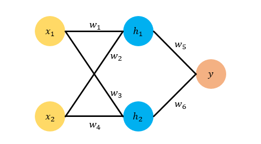

# <center>反向传播算法</center>

<center> **我现在对反向传播算法“深感怀疑”，深度学习可能需要“推倒重来”。——Geffory Hinton**  </center>


***

**问题：**

* **为什要求梯度？求谁关于谁的梯度？**

下图展示了一个神经网络。神经网络可以看做是一个函数：$y=f_\boldsymbol w(\boldsymbol x)$，$\boldsymbol x$是输入，$y$是输出，$\boldsymbol w$是$f$的参数。其中，$\boldsymbol w$的真实值就是我们的目标，但现在我们有的只是一些$\boldsymbol x$和与之对应的真实的$y=f(\boldsymbol x)$的值，所以我们要用到这两个值去估计$\boldsymbol w$的真实值。我们将其转化为最优化问题：$\mathop{min}\limits_\boldsymbol w\sum\|f_\boldsymbol w(\boldsymbol x)-y\|^2$。

我们令$E=\sum\|f_\boldsymbol w(\boldsymbol x)-y\|^2$，并称其为误差项($Error)$。我们的目标就是求一组$\boldsymbol w$使得$E$最小。**所谓的学习，其实就是指通过调节$\boldsymbol w$使得$E$最小。**

求解这种问题有个经典的方法叫做梯度下降法$(Gradient Descent)$，这个算法一开始先随机生成一个$\boldsymbol w$，然后用公式$\boldsymbol w=\boldsymbol w-\eta\dfrac{\partial E}{\partial \boldsymbol w}$不断更新$\boldsymbol w$的值，最终能够逼近真实结果。其中，$\dfrac{\partial E}{\partial \boldsymbol w}$是当前的误差$E$关于$\boldsymbol w$的梯度，它的物理意义是当$\boldsymbol w$变化时$E$随之变化的幅度，$\eta$叫做学习率，用来控制更新的步长。

**答案：**

* **求梯度的原因是我们需要用它来更新$\boldsymbol w$，求的是误差项$E$关于参数$ \boldsymbol w$的梯度。**

***

#### 反向传播$(Back\  Propagation)$​​的基础——链式法则

**求导的链式法则是$BP$的基础和核心。**假设$y=g(x)$，$z=f(y)$，那么$z=h(x)$，$h=f\cdot g$。我们知道$\dfrac{dy}{dx}=g'(x)$，$\dfrac{dz}{dy}=f'(y)$，那么根据链式法则，我们如此求$z$对$x$的导数$h'(x)$：
$$
h'(x)=\dfrac{dz}{dx}=\dfrac{dz}{dy}\cdot\dfrac{dy}{dx}
$$
该法则可以推广到多层复合函数。

***

#### 反向传播算法$(Back\ Propagation)$



上图神经网络有两层，输入层有两个神经元$x_1,x_2$，隐藏层有两个神经元$h_1,h_2$，最终有一个输出神经元$y$​，各个神经元之间**全连接**。为了直观起见，给各个参数赋上具体的数值。我们令$x_1=1$，$x_2=0.5$，然后我们令$w_1,w_2,w_3,w_4$的真实值分别是$1,2,3,4$，令$w_5,w_6$的真实值分别是$0.5,0.6$​。这样可以算出$y$的真实值是$t=4$。

***

为了模拟一个$BP$的过程，假设我们只知道$x_1=1,x_2=0.5$，以及对应的目标$t=4$。

我们不知道$w_1\sim w_6$的真实值，首先假设随机初始化它们的值分别为：
$$
w_1=0.5,\\w_2=1.5,\\w_3=2.3,\\w_4=3,\\w_5=1,\\w_6=1
$$
即我们随机初始化了参数向量$\boldsymbol w$。

首先在每一轮反向传播前我们需要计算**前向传播**，也即是预测的$h_1,h_2,y$和误差项$E$，其中$E=\dfrac{1}{2}(t-y)^2$。根据网络结构示意图，各个变量的计算公式为：
$$
\begin{aligned}
h_1=w_1\cdot x_1+w_2\cdot x_2=1.25 \\
h_2=w_3\cdot x_1+w_4\cdot x_2=3.8 \\
y=w_5\cdot h_1+w_6\cdot h_2=5.05 \\
E=\dfrac{1}{2}(y-t)^2=0.55125
\end{aligned}
$$
$y$是神经网络预测的值，真实的输出是$t=4$。那么，要更新$w_5$的值我们就要算$\dfrac{\partial E}{\partial w_5}$，根据链式法则有$\dfrac{\partial E}{\partial w_5}=\dfrac{\partial E}{\partial y}\cdot \dfrac{\partial y}{\partial w_5}$。因为$E=\dfrac{1}{2}(t-y)^2$，所以$\dfrac{\partial E}{\partial y}=-(t-y)=5.05-4=1.05$，而$y=w_5*h_1+w_6*h_2$，所以$\dfrac{\partial y}{\partial w_5}=h1=1.25$，所以$\dfrac{\partial E}{\partial w_5}=\dfrac{\partial E}{\partial y}\cdot \dfrac{\partial y}{\partial w_5}=(y-t)\cdot h_1=1.05\times 1.25=1.3125$。

运用梯度下降法更新$w_5$（此处假设$\eta=0.1$）：
$$
\begin{aligned}
w_5^\boldsymbol +&=w_5-\eta\cdot\frac{\partial E}{\partial w_5} \\
&=1-0.1\times1.3125\\
&=0.86875
\end{aligned}
$$

同理更新$w_6$:
$$
\begin{aligned}
w_6^\boldsymbol +&=w_6-\eta\cdot\frac{\partial E}{\partial w_6} \\
&=1-0.1\times3.99\\
&=0.601
\end{aligned}
$$
接着求解$w_1,w_2,w_3,w_4$的导数，由于在同一层，所以求解的方法相同，以$w_1$的推导为例：
$$
\dfrac{\partial E}{\partial w_1}=\dfrac{\partial E}{\partial y}\cdot\dfrac{\partial y}{\partial h_1}\cdot\dfrac{\partial h_1}{\partial w_1}
$$
**值得注意的是：$\dfrac{\partial E}{\partial y}=y-t$在求$\dfrac{\partial E}{\partial w_5}$的时候已经求过了。**
$$
\dfrac{\partial y}{\partial h_1}=w_5\\
\dfrac{\partial h_1}{\partial w_1}=x_1
$$
因此可得：
$$
\dfrac{\partial E}{\partial w_1}=(y-t)\cdot w_5\cdot x_1
$$
运用梯度下降法更新$w_1$：
$$
\begin{aligned}
w_1^\boldsymbol +&=w_1-\eta\cdot\frac{\partial E}{\partial w_1} \\
&=w_1-\eta\cdot (y-t)\cdot w_5\cdot x_1\\
&=0.5-0.1\times1.05\times 1\times1\\
&=0.395
\end{aligned}
$$
然后重复这个步骤更新$w_2,w_3,w_4$。可得$w_2^\boldsymbol +=1.4475,w_3^\boldsymbol +=2.195,w_4^\boldsymbol +=2.9475$。

以上，我们更新完了梯度，完成了一次梯度下降法，我们用$\boldsymbol w^\boldsymbol +$再来预测一次神经网络输出值，根据前向传播，得到$y^\boldsymbol +=3.1768$，新的误差是$E^\boldsymbol +=0.3388$，相比于之前的确实下降了。**只要重复以上步骤，不断更新网络参数就能学习得到更准确的模型。**

***

#### 再探$BP$    [原文链接](http://colah.github.io/posts/2015-08-Backprop/)

计算图是现代深度学习框架的核心，它为自动求导算法——反向传播提供了理论支持。

**我们可以将简单的式子表达成图的形式，以此来明确看出计算的依赖（层级）关系。实际上也可以看成是函数调用图。这一切要归功于“$\rightarrow$”表达出了序关系。**
$$
c=a+b\\
d=b+1\\
e=c*d
$$


显然，我们只需要传入起点$a,b$的具体数值，就完全可以计算出任意结点的具体数值。


如果你想了解计算图上是如何微分的，那么你需要从图中的**箭头**开始探究。比如$a$可以影响$c$的值，那么它是如何影响的呢？我们可以通过给$a$一个很小的变化来观察$c$的变化。这就是我们所谓的[偏导数](https://en.wikipedia.org/wiki/Partial_derivative)的定义：
$$
f'(x)=\lim_{h\rightarrow 0}\dfrac{f(x+h)-f(x)}{h}
$$
使用定义，我们可以求任意函数在任意点的导数，但是往往枯燥易错而且效率低下。因为每一次求导实际上是分离的，没有用到上一次求导的信息。**实际上，我们可以利用已经求得的一部分函数的导数加上一些简单的法则来获得复杂函数的导数。**而引入计算图就是“分块”也即分成简单的函数并通过“$\rightarrow$”来记录如和组成复杂的函数。

为了计算这个图，我们应该明确一些需要运算的导数：

* 加法直接传递，不用记录信息：


```python
class Addlayer:
    def __init__(self):
        pass
    def forward(self,x,y):
        out=x+y
        return out
    def backward(self,dout):
        dx=dout#
        dy=dout
        return dx,dy
```

* 向量加法：

  

  例子：

  

  

  ​		

* 补充一下重复的操作：因为广播的时候会用到

  

  

  

* 乘法，需要记录输入信息$x_1,x_2$：


```python
class MulLayer:
    def __init__(self):
        self.x=None
        self.y=None
    def forward(self,x,y):
        self.x=x
        self.y=y
        out=x*y
        return out
    def backward(self,dout):
        dx=dout*self.y
        dy=dout*self.x
        return dx,dy
```

* 矩阵乘法：

  

  实际上**根据形状来说**，我们很容易推出上式的$\dfrac{\partial L}{\partial x}=\dfrac{\partial L}{\partial y}W^T$，$\dfrac{\partial L}{\partial W}=x^T\dfrac{\partial L}{\partial y}$

* 全连接层：

  

  ```python
  class Affine:
      def __init__(self,W,b):
          self.params=[W,b]
          self.grads=[np.zeros_like(W),np.zeros_like(b)]
          self.x=None
      def forward(self,x):
          W,b=self.params
          out=np.dot(x,W)+b
          self.x=x
          return out
      def backward(self,dout):
          W,b=self.params
          dx=np.dot(dout,W.T)
          dW=np.dot(self.x.T,dout)
          db=np.sum(dout,axis=0)
          self.grads[0][...]=dW
          self.grads[1][...]=db
          return dx
  ```

* $Relu$需要记录输入$x$：


​	

```python
class Relu:
    def __init__(self):
        self.mask=None
    def forward(self,x):
        self.mask=(x<=0)
        out=x.copy()
        out[self.mask]=0
        return out
    def backward(self,dout):
        dout[self.mask]=0
        dx=dout
        return dx
```

* $sigmoid$需要记录输出$y$：


```python
class Sigmoid:
    def __init__(self):
        self.out=None
    def forward(self,x):
        out=1/(1+np.exp(-x))#广播
        self.out=out
        return out
    def backward(self,dout):
        dx=dout*(1-self.out)*self.out
        return dx
```

实际上我们经常这么做：利用前向传播计算得到的结果再应用于反向传播时求导。这往往是选取激活函数的一个原因，比如$tanh$也是如此。

***

除了上边的规则外，我们需要先准备三个求导法则：[加法法则](https://en.wikipedia.org/wiki/Sum_rule_in_differentiation)和[乘法法则](https://en.wikipedia.org/wiki/Product_rule)，以及[复合函数求导法则](https://zh.wikipedia.org/zh-hans/%E9%93%BE%E5%BC%8F%E6%B3%95%E5%88%99)。

* 加法法则：
  $$
  h(x)=f(x)+g(x)\rightarrow h'(x)=f'(x)+g'(x)
  $$
  将其表示成计算图可得：

  

  

* 乘法法则：
  $$
  h(x)=f(x)g(x)\rightarrow h'(x)=f'(x)g(x)+f(x)g'(x)
  $$
  将其表示成计算图可得：

  

  

* 复合函数求导法则（链式求导法则）
  $$
  h(x)=f(g(x))\rightarrow h'(x)=f'(g(x))g'(x)
  $$
  

  将其表示成计算图可得：

  

我们可以应用这三个法则来高效求出复杂函数的导数，也即可以用以上三个图组成复杂的计算图。

我们先简单应用前两个法则可得出下图：(实际上也可求出更多的导数，但是需要隔层带入，这里我们假设已经分好适当的模块，不再拆分与扩展。也就是说，我们将用第三条法则来隔层求导。下边的计算图不包含复杂的运算如$e^x,\dfrac{1}{1+e^{(-x)}},tanh(x)$）。


**那么问题来了，那些不直接连接的节点是如何互相影响的呢？**我们考察$e$与$a$的关系，假设上图中$a$以加$1$的速度增长，那么$c$会随着也以加$1$的速度增长，而$e$会随着$c$的增长而以加$2$的速度增长。从而可以得到$e$会随着$a$的变化以$2$倍的速度随之变化，即$e$关于$a$的偏导数为$2$。（假设$b=1$）上面说过，我们也可以将$c=a+b$代入$e$，这样可以直接计算出$\dfrac{\partial e}{\partial a}$。

如果多次试验，我们可以从图中观察这个规律是**遍历起点与终点之间的所有路径，每条路径箭头上的偏导相乘，再将每个路径的该值相加**（实际上做题的时候我们就是这么做的）。这样来计算$e$对于$b$的偏导数有：
$$
\dfrac{\partial e}{\partial b}=1*2+1*3
$$
这就是$b$如何通过$c$与$d$来影响$e$的，这种将所有路径的结果相加的方法就是我们在求导中使用的**[多变量链式求导](https://en.wikipedia.org/wiki/Chain_rule#Higher_dimensions)**方法的另一种展现。

#### 权值路径

上面的方法很简单，但是很容易导致路径规模爆炸。一个简单的例子，下图X到Y有三条路径，Y到Z又有三条路径，那么X到Z一共有九条路径。


$$
\dfrac{\partial Z}{\partial X}=\alpha \delta+\alpha\epsilon+\alpha\zeta+\beta\delta+\beta\epsilon+\beta\zeta+\gamma \delta+\gamma\epsilon+\gamma\zeta
$$
我们也可以换一种方式计算：
$$
\dfrac{\partial Z}{\partial X}=(\alpha +\beta+\gamma)(\delta+\epsilon+\zeta)
$$
从上式的思想中我们可以引入**前向微分**和**反向微分**的概念了，它们都是计算路径权值和的高效算法。**这两个算法不是简单地将路径值相加，而是通过合并节点的方法来高效计算总和，**事实上，这两个算法只会对每个箭头处理一次，然后合并相应的小模块成为更适合的模块，之后只要计算这个较大的模块即可。（相比于之前简单的路径组合，会多次计算同一个箭头）

* 前向微分


* 反向微分

  

**前向微分**就是从输入开始，沿着图的方向计算直到结束。在途经的每个节点，将该节点的所有输入相加，这样就获得了该节点对所有输入变化的反馈，即微分值。然后继续向后移动，重复上述方法，最终计算出最终结果。

简单的说这两种方法，其实就是：前者是对每个节点计算 $\dfrac{d}{dx}$，而后者则是对每个节点计算$\dfrac{dz}{d}$。

#### 快捷计算

说到这里，你估计还在觉得这两种算法如此相似，为什么大家更关心**反向微分**呢？和**前向微分**相比它的计算方法很别扭，难道它有特别的优势吗？是的，它确实有特别的优势，并且这种优势可以从前边的两个算子$\dfrac{d}{dx},\dfrac{dz}{d}$看出。

让我们重新考虑开始的计算图：


我们使用**前向微分**来计算$e$对于$b$的偏微分值，由此我们需要计算出图中所有节点对$b$的偏微分值，当计算到达顶点时，可以获得**一个**偏微分结果，即$\dfrac{de}{db} = 5$：


但我们来使用**反向微分**来计算同样的任务时，我们会计算出$e$对于图中**所有节点**的偏微分值，但计算到达底端时，我们获得了**两个**偏微分结果，即$\dfrac{de}{da} = 2,\dfrac{de}{db} = 5$：


看到没有，这个差别十分明显，**前向微分**一次只能计算输出关于**一个输入参数的**偏导数，而**反向微分**则可以计算出关于**所有**输入的偏导数，而且还有中间节点的偏导数（即中间节点对输出的影响）。

这个图中只有两个参数，因此可能影响不大，但是假设有一百万个输入和一个输出的系统中，前向微分需要我们通过数一百万次重复计算来获得偏导数，而反向微分则只需一次！一百万的加速是相当不错的！

实际上两者各有春秋，因为我们也能明显地看到前向微分，可以一次求出单个变量对所有结点的影响。而针对神经网络，我们一般会在输出时计算损失函数来评价网络的好坏，来针对网络中的许许多多参数进行优化，这正好是符合**很多输入，一个输出**的模型，使用反向微分可以直接一次计算出所有参数对输出的影响（梯度），从而将整个系统的计算速度大大提升。

说到这里，当然我们也可以得出一个结论：前向微分也有好用的时候，即当系统是**一个输入，很多输出**的时候。我想这个应该不难理解。

#### 这个算法很难吗吗？

当我第一次搞明白反向传播算法时，我的第一感觉是“这不就是链式求导法则吗？没什么不得了的 啊，为什么他们花了那么久才搞出来这个算法？”事实上，我不是唯一这么想的人。如果你只是问：“有没有一种快速计算前馈神经网络中，参数的偏导数的方法？”，那么针对这个问题来找到这个算法作为答案确实很简单。（我的意思是，如果你知道了你需要用偏导数来更新网络，你的目标明确了，那么你很容易找到这个算法。）

但是，在反向传播算法被发明时，首先前馈神经网络本身就不被关注（译者注：当时神经网络受制于硬件条件，性能很差），而且由于没有反向微分算法，所以偏导数计算消耗很大，通过偏导数（梯度）来训练网络也不是主流思想，导致更加没有人研究反向传播算法，**这是一个循环的困境**。所以说哪怕是以今天的视角来看，这个算法在当时发明也是很厉害的。

所以说这就是个事后诸葛亮的问题，一旦你知道了采用这种方法会有好的结果，那么其实就等于你找到了这种方法。事实是，在你不知道这个方法会有效，甚至并不知道这种方法存在时，你怎么去找到这个方法呢？这才是最难的部分。
