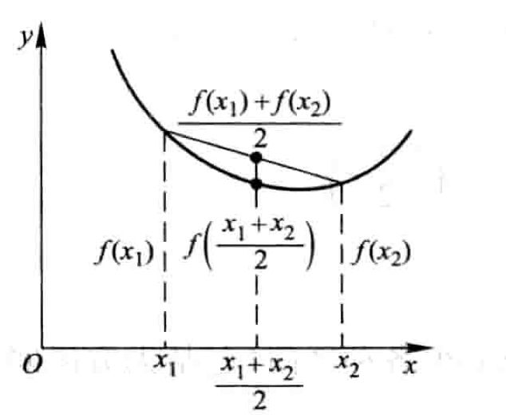

# $EM(Expectation-maximization )$算法及其推广

## $EM$算法的引入

### 两硬币模型

***

假设有两枚硬币，它们随机抛掷的结果如下表：

| $1.\quad B$ | $H\ T\ T\ T\ H\ H\ T\ H\ T\ H\ $ |
| :---------: | :------------------------------: |
| $2.\quad A$ | $H\ H\ H\ H\ T\ H\ H\ H\ H\ H\ $ |
| $3.\quad A$ | $H\ T\ H\ H\ H\ H\ H\ T\ H\ H\ $ |
| $4.\quad B$ | $H\ T\ H\ T\ T\ T\ H\ H\ T\ T\ $ |
| $5.\quad A$ | $T\ H\ H\ H\ T\ H\ H\ H\ T\ H\ $ |

我们很容易估计（**这里也是用的极大似然估计，推导过程略，可以得出就是频率比值**）出两枚硬币出现正面的概率：
$$
\theta_A=\dfrac{24}{30}=0.8\\
\theta_B=\dfrac{9}{20}=0.45
$$
现在我们不记录硬币标记，则上述表格改变如下：

| $1.\quad *$ | $H\ T\ T\ T\ H\ H\ T\ H\ T\ H\ $ |
| :---------: | :------------------------------: |
| $2.\quad *$ | $H\ H\ H\ H\ T\ H\ H\ H\ H\ H\ $ |
| $3.\quad *$ | $H\ T\ H\ H\ H\ H\ H\ T\ H\ H\ $ |
| $4.\quad *$ | $H\ T\ H\ T\ T\ T\ H\ H\ T\ T\ $ |
| $5.\quad *$ | $T\ H\ H\ H\ T\ H\ H\ H\ T\ H\ $ |

这种情况下，我们该如何估计$\theta_A$和$\theta_B$呢？

为了描述清楚问题，我们引入一个隐变量$Z=(z_1,z_2,z_3,z_4,z_5)$，代表每一轮所使用的硬币种类。为什么叫做隐变量？因为我们虽然知道有这个变量，但我们无法对其进行观测从而得到其确定的值。这时对于原来的问题会出现矛盾：

* 如果我们不知道$Z$，显然我们是无法使用上面的极大似然估计法去估计$\theta_A$和$\theta_B$的。要想用老方法去估计，我们必须先求出$Z$。

* 可要用极大似然估计法去估计出$Z$，我们又得先知道$\theta_A$和$\theta_B$。

解决方法就是先随机初始化$\theta_A$和$\theta_B$，然后用**最大似然**去估计$Z$，然后基于$Z$按照**最大似然**去估计出新的$\theta_A$和$\theta_B$，**循环直至收敛！**

***

求解如下：

我们随机初始化$\theta_A=0.6$和$\theta_B=0.5$。

* 第一轮抛掷：

  如果是硬币$A$则出现实验结果的概率为$0.6^5\times0.4^5$；如果是硬币$B$则出现实验结果的概率为$0.5^5\times0.5^5$；根据贝叶斯公式，可得：
  $$
  P_A=\dfrac{0.6^5\times0.4^5}{(0.6^5\times0.4^5)+(0.5^5\times0.5^5)}=0.45\\
  P_B=\dfrac{0.5^5\times0.5^5}{(0.6^5\times0.4^5)+(0.5^5\times0.5^5)}=0.55
  $$
  同理可得五轮的概率如下：

  | $NO.$ | $Coin.A$ | $Coin.B$ |
  | :---: | :------: | :------: |
  | $1.$  |  $0.45$  |  $0.55$  |
  | $2.$  |  $0.80$  |  $0.20$  |
  | $3.$  |  $0.73$  |  $0.27$  |
  | $4.$  |  $0.35$  |  $0.65$  |
  | $5.$  |  $0.65$  |  $0.35$  |

  * **由概率可以看出估计的硬币应该如下所示：**

  | $1.\quad B$ | $H\ T\ T\ T\ H\ H\ T\ H\ T\ H\ $ |
  | :---------: | :------------------------------: |
  | $2.\quad A$ | $H\ H\ H\ H\ T\ H\ H\ H\ H\ H\ $ |
  | $3.\quad A$ | $H\ T\ H\ H\ H\ H\ H\ T\ H\ H\ $ |
  | $4.\quad B$ | $H\ T\ H\ T\ T\ T\ H\ H\ T\ T\ $ |
  | $5.\quad A$ | $T\ H\ H\ H\ T\ H\ H\ H\ T\ H\ $ |

  这时再利用**最大似然估计**去重新估计$\theta_A、\theta_B$。
  $$
  \theta_A=\dfrac{24}{30}=0.8\\
  \theta_B=\dfrac{9}{20}=0.45
  $$
  用新的$\theta_A、\theta_B$去重新用**最大似然估计**法去估计$Z$，然后再估计$\theta_A、\theta_B$，会发现收敛，所以我们认为地选定它作为真实值。

  ***

  * **还有一种方法：我们可以求出每轮抛掷硬币$A$和硬币$B$对$10$次的贡献：**

  |  $NO.$   |     $Coin.A$      |     $Coin.B$      |
  | :------: | :---------------: | :---------------: |
  |   $1.$   | $2.2H\quad 2.2T$  | $2.8H\quad 2.8T$  |
  |   $2.$   | $7.2H\quad 0.8T$  | $1.8H\quad 0.2T$  |
  |   $3.$   | $5.9H\quad 1.5T$  | $2.1H\quad 0.5T$  |
  |   $4.$   | $1.4H\quad 2.1T$  | $2.6H\quad 3.9T$  |
  |   $5.$   | $4.5H\quad 1.9T$  | $2.5H\quad 1.1T$  |
  | $Total.$ | $21.3H\quad 8.6T$ | $11.7H\quad 8.4T$ |

然后用极大似然估计来估计出新的$\theta_A$和$\theta_B$：
$$
\theta_A=\dfrac{21.3}{21.3+8.6}=0.71\\
\theta_B=\dfrac{11.7}{11.7+8.4}=0.58
$$
如此反复迭代，我们可以求出最终的参数值，$10$轮之后分别是$0.80,0.52$。

***

### $EM$算法的导出

***

**$Jensen$（琴生）不等式**：

若$f$是凸函数，则：
$$
f(tx_1+(1-t)x_2)\leqslant tf(x_1)+(1-t)f(x_2)\quad t\in[0,1]
$$

将上式中的$t$推广到$n$个同样成立，也即：
$$
f(t_1x_1+t_2x_2+\cdots+t_nx_n)\leqslant t_1f(x_1)+t_2f(x_2)+\cdots+t_nf(x_n)\quad t_1\cdots\in[0,1],t_1+\cdots+t_n=1
$$
再将$t_1\cdots t_n$视为概率，不难得到:
$$
f(E[X])\leqslant E[f(X)]
$$
其中$X$是随机变量，$f$是凸函数，$E[X]$表示$X$的期望。（**期望的函数小于函数的期望**），我们要用这个不等式去放缩下面的似然函数。

***

我们面对一个有隐变量$Z$的概率模型，目标是**极大化观测数据$Y$关于参数$\theta$的对数似然函数**，即极大化：
$$
L(\theta)=ln\ P(Y|\theta)=ln\ \sum_ZP(Y,Z|\theta)=ln \left(\sum_ZP(Z|\theta)\cdot P(Y|Z;\theta)\right)
$$
**注意：上式中的$\theta$并不是随机变量，我们目前不知道它的具体值，但是我们知道在确定它的情况下，$P(Y)$等概率也是可以确定的。**

困难在于：上式中包含**未观测数据$Z$**以及**和（连续型就是积分）的对数**。

$EM$算法采用的是**通过逐步迭代近似极大化**$L(\theta)$：

直观来说就是我们会求出一个序列$\theta_1,\theta_2,\cdots,\theta_n$，更靠后的$\theta$都会比前一个$\theta$使得似然函数$L(\theta)$更大。

***

* 假设在第$i$此迭代后$\theta $的估计值是$\theta^{(i)}$，我们希望新的估计值$\theta$能使$L(\theta)$增加，即$L(\theta)>L(\theta^{(i)})$，然后以此达到极大值。为此我们考虑**两者的差**：
  $$
  \begin{aligned}
  L(\theta)-L(\theta^{(i)})&=ln\left(\sum_ZP(Z|\theta)\cdot P(Y|Z;\theta)\right)-ln\ P(Y|\theta^{(i)})\\
  &=ln \left(\sum_ZP(Z|Y;\theta^{(i)})\cdot\dfrac{P(Z|\theta)\cdot P(Y|Z;\theta)}{P(Z|Y;\theta^{(i)})}\right)-ln\ P(Y|\theta^{(i)})\\
  &\geqslant\sum_ZP(Z|Y;\theta^{(i)})ln\ \dfrac{P(Y|Z;\theta)P(Z|\theta)}{P(Z|Y;\theta^{(i)})}-ln\ P(Y|\theta^{(i)})\\
  &=\sum_ZP(Z|Y;\theta^{(i)})ln\ \dfrac{P(Y|Z;\theta)P(Z|\theta)}{P(Z|Y;\theta^{(i)})}-1\cdot ln\ P(Y|\theta^{(i)})\\
  &=\sum_ZP(Z|Y;\theta^{(i)})ln\ \dfrac{P(Y|Z;\theta)P(Z|\theta)}{P(Z|Y;\theta^{(i)})}-\sum_ZP(Z|Y;\theta^{(i)})ln\ P(Y|\theta^{(i)})\\
  &=\sum_ZP(Z|Y;\theta^{(i)})ln\ \dfrac{P(Y|Z;\theta)P(Z|\theta)}{P(Z|Y;\theta^{(i)})P(Y|\theta^{(i)})}\\
  &=\sum_ZP(Z|Y;\theta^{(i)})ln\ \dfrac{P(Y,Z|\theta)}{P(Y,Z|\theta^{(i)})}
  \end{aligned}
  $$
  简单移项可得：
  $$
  L(\theta)\geqslant L(\theta^{(i)})+\sum_ZP(Z|Y;\theta^{(i)})ln\ \dfrac{P(Y|Z;\theta)P(Z|\theta)}{P(Z|Y;\theta^{(i)})P(Y|\theta^{(i)})}
  $$
  
  **注意：**其中的$ln$函数是凹函数，故利用$Jensen$不等式结论（与凸函数相反）。且上式中并没有用到$f(E[X])\geqslant E[f(X)]$，而是用到了原来的结论：$\sum_ZP(Z|Y;\theta^{(i)})$是$1$，也就是说仅仅将$P(Z|Y;\theta^{(i)})$看做是和为$1$的系数而已，并未强调其是概率。

***

令        $B(\theta,\theta^{(i)})=L(\theta^{(i)})+\sum_ZP(Z|Y;\theta^{(i)})ln\ \dfrac{P(Y|Z;\theta)P(Z|\theta)}{P(Z|Y;\theta^{(i)})P(Y|\theta^{(i)})}$，其中具体到每一步而言$\theta^{(i)}$是已知的，但是每一次迭代的$\theta_i$都可能是不同的，所以我们有必要显示地表示出来以示这是一个迭代过程。

则        $L(\theta)\geqslant B(\theta,\theta^{(i)})$

即函数$B(\theta,\theta^{(i)})$是$L(\theta)$的一个**下界**，若我们有能力求得$\theta^{(i+1)}$使得$B(\theta,\theta^{(i)})$达到极大（只是在$\theta_i$的小范围内最大，而不是全局最大），则可以得到
$$
B(\theta^{(i+1)},\theta^{(i)})\geqslant B(\theta^{(i)},\theta^{(i)})
$$
**然后我们将新的$\theta^{(i+1)}$代入到原来的$L(\theta)$观察是否会变大，如果会变大，那么我们就可以极大化$B(\theta,\theta^{(i)})$来达到更新$L(\theta)$的目的。**

我们注意到：$B(\theta^{(i)},\theta^{(i)})=L(\theta^{(i)})$，所以可以进一步推得：
$$
L(\theta ^{(i+1)})\geqslant B(\theta ^{(i+1)},\theta^{(i)})\geqslant B(\theta^{(i)},\theta^{(i)})=L(\theta^{(i)}))
$$

因此，任何可以使$B(\theta,\theta^{(i)})$增大的$\theta$，也可以使$L(\theta)$增大，我们将原问题转化为了求使得$B(\theta,\theta^{(i)})$达到极大值的$\theta^{(i+1)}$，即
$$
\begin{aligned}
\theta^{(i+1)}&=\mathop{arg\ max}_\theta B(\theta,\theta^{(i)})\\
&=\mathop{arg\ max}_\theta \left( L(\theta^{(i)})+\sum_ZP(Z|Y;\theta^{(i)})ln\ \dfrac{P(Y|Z;\theta)P(Z|\theta)}{P(Z|Y;\theta^{(i)})P(Y|\theta^{(i)})}\right)\\
&=\mathop{arg\ max}_\theta \left(\sum_ZP(Z|Y;\theta^{(i)})ln\ P(Y|Z;\theta)P(Z|\theta)\right)\\
&=\mathop{arg\ max}_\theta \left(\sum_ZP(Z|Y;\theta^{(i)})ln\ P(Y,Z|\theta)\right)\\
&=\mathop{arg\ max}_\theta \ Q(\theta,\theta^{(i)})
\end{aligned}
$$
这就是从$\theta^{(i)}$到$\theta^{(i+1)}$的一次迭代，求出的$\theta^{(i+1)}$作为下一次的$\theta^{(i)}$。

值得说明的是，对于具体的求解$\theta^{(i+1)}$的每一步算法过程中，$L(\theta^{(i)}),P(Y|\theta^{(i)}),P(Z|Y;\theta^{(i)})$是一个常数。

到此我们来阐明$EM$算法：

* $E$步：计算**完全数据的对数似然函数**$ln\ P(Y,Z|\theta)$关于给定观测数据$Y$和当前参数$\theta^{(i)}$（第一次是假设的）条件下对隐变量$Z$的条件概率分布$P(Z|Y,\theta^{(i)})$（实际上是一个后验分布）的**期望**，也即是**$Q$函数**：（极大似然估计）
  $$
  Q(\theta,\theta^{(i)})=E_Z\left[lnP(Y,Z|\theta)|Y;\theta^{(i)}\right]=\sum_ZP(Z|Y;\theta^{(i)})ln\ P(Y,Z|\theta)
  $$

* $M$步：求使得$Q$函数达到**极大的$\theta$**作为$\theta^{(i+1)}$。

* 重复上述过程，直至收敛。

***

### 三硬币模型

假设有三枚硬币，分别记作$A,B,C$。这些硬币出现正面的概率分别是$\pi,p,q$。进行如下抛硬币试验：先抛掷硬币$A$，如果是正面选硬币$B$进行第二次抛掷；如果是反面选硬币$C$进行第二次抛掷；第二次抛掷出现正面记作$1$，出现反面记作$0$；独立重复进行$n$次试验，假设$n=10$，观测结果如下：
$$
1,1,0,1,0,0,1,0,1,1
$$
问如何**估计三枚硬币正面出现的概率**，即三硬币模型的参数。

解答：

首先，对**单次实验**可以建模如下：
$$
\begin{aligned}
P(y|\theta)&=\sum\limits_zP(y,z|\theta)\\
&=\sum\limits_zP(z|\theta)P(y|z;\theta)\\
&=\left\{
\begin{aligned}
&\pi p+(1-\pi)q\quad &if\ y=1;\\
&\pi(1-p)+(1-\pi)(1-q)\quad &if\ y=0;
\end{aligned}
\right.\\\\
&=\pi p^y(1-p)^{1-y}+(1-\pi)q^y(1-q)^{1-y}
\end{aligned}
$$
上述式子中，$y$就是最后的观测变量，取值为$0,1$。随机变量$z$是隐变量，三硬币例子中表示的就是未观测到的抛掷硬币$A$的结果。$\theta=(\pi,p,q)$是模型的参数。

以上为了考虑进去隐变量用到了公式$P(A)=P(AB_1)+P(AB_2)+\cdots+P(AB_n)$，$P(AB)=P(A)P(B|A)$。

接下来对**整个实验**进行建模：

将观测数据表示为$Y=(Y_1,Y_2,\cdots,Y_n)^T$，则观测数据的**似然函数**为：
$$
P(Y|\theta)=\prod\limits_{j=1}^n[\pi p^{y_i}(1-p)^{1-y_i}+(1-\pi)q^{y_i}(1-q)^{1-y_i}]
$$
求模型参数$\theta$的极大似然估计为：
$$
\hat{\theta}=\mathop{arg\ max\ log}\limits_\theta P(Y|\theta)
$$
问题**没有解析解**，只有通过迭代的算法，$EM$算法不过是求解这个问题的一种迭代算法。

***

先选取初值$\theta^{(0)}={\pi^{(0)},p^{(0)},q^{(0)}}={0.5,0.5,0.5}$。

* $E$步：计算在模型参数$\theta^{(i)}$的**条件下观测数据$y_j$来自硬币$B$的概率**，也即推测出硬币$A$为正面的概率。
  
  * **第一步求出在观测数据下隐变量的条件概率分布：**（给定观测数据$Y$和当前的参数估计值$\theta^{(i)}$的条件，此处求出观测数据来自硬币$B$的概率值，记为$\mu_j^{(i+1)}$），如果未给定观测数据$Y$，则可以简单地得到$P(z_j=1|\theta^{(i)})=\pi^{(i)}$，实际上此处是**计算$\pi^{(i)}$在观察到$y_j$的后验**，视每次$y_{i}$取值的不同而改变。
  
  $$
  P(z_j=1|y_j,\theta^{(i)})=\mu_j^{(i+1)}=\dfrac{\pi^{(i)}(p^{(i)})^{y_j}(1-p^{(i)})^{1-y_j}}{\pi^{(i)}(p^{(i)})^{y_j}(1-p^{(i)})^{1-y_j}+(1-\pi^{(i)})(q^{(i)})^{y_j}(1-q^{(i)})^{1-y_j}}
  $$
  * **进一步求出期望：**

  $$
  Q(\theta|\theta^{(i)})=\sum_{j=1}^N\left\{\mu_j^{(i+1)}ln[\pi p^{y_j}(1-p)^{1-y_j}]+(1-\mu_j^{(i+1)})ln[(1-\pi) q^{y_j}(1-q)^{1-y_j}]\right\}
  $$
  
  这里我们可以明确地看到，**$Q$函数是对原来的“对数似然函数”关于隐变量的后验分布求期望。可以看作是对原来无法直接求解的对数似然函数做了一个改造，变得可以求解了。**
  
* $M$步：计算模型参数的新估计值（这实际上是极大化$Q$，即令偏导数为$0$推导出来的，此处省略推导过程）
  $$
  \pi^{(i+1)}=\dfrac{1}{n}\sum\limits_{j=1}^{n}\mu_j^{(i+1)}
  $$
  直观理解就是
  $$
  A出现正面的概率=\dfrac{B出现的概率和}{B出现的概率和+C出现的概率和}=\dfrac{B出现的概率和}{n}
  $$

  ***

  $$
  p^{(i+1)}=\dfrac{\sum\limits_{j=1}^n\mu_j^{(i+1)}y_j}{\sum\limits_{j=1}^n\mu_j^{(i+1)}}
  $$

  值得注意的是，上式中在$u_j^{(i+1)}$对于$y$的各种取值不相等的情况下，不能化简成$\dfrac{\sum\limits_{j=1}^ny_j}{n}$。

  直观理解就是
  $$
  B出现正面的概率=\dfrac{B出现正面的概率和}{B出现的概率和}
  $$

  ***

$$
q^{(i+1)}=\dfrac{\sum\limits_{j=1}^n(1-\mu_j^{(i+1)})y_j}{\sum\limits_{j=1}^n(1-\mu_j^{(i+1)})}
$$

直观的理解就是
$$
C出现正面的概率=\dfrac{C出现正面的概率和}{C出现的概率和}
$$
将$\theta ^{(0)}$代入可得对于$y_j=1$或$y_j=0$来说，$\mu_j^{(1)}=0.5$

代入公式可以得到：
$$
\pi^{(1)}=0.5,p^{(1)}=0.6,q^{(1)}=0.6
$$
继续迭代得到：
$$
\mu_j^{(2)}=0.5,\pi^{(2)}=0.5,p^{(2)}=0.6,q^{(2)}=0.6
$$
可以看出，已经收敛，于是得到参数$\theta$的极大似然估计。

