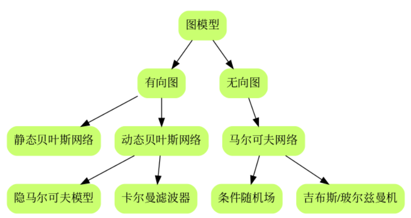
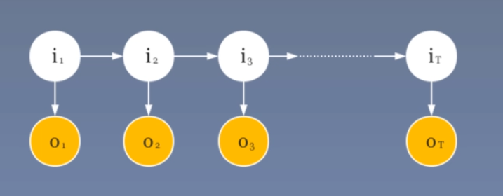
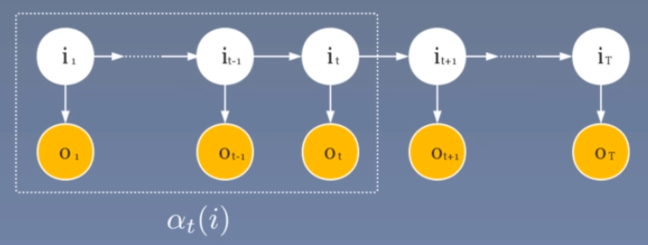
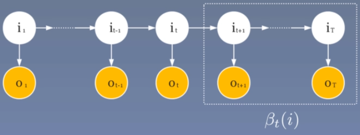
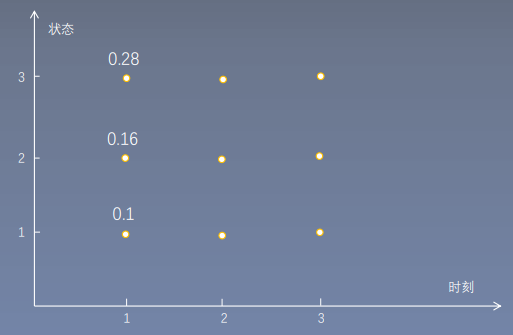
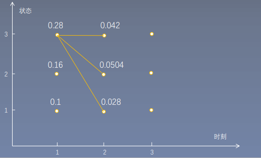
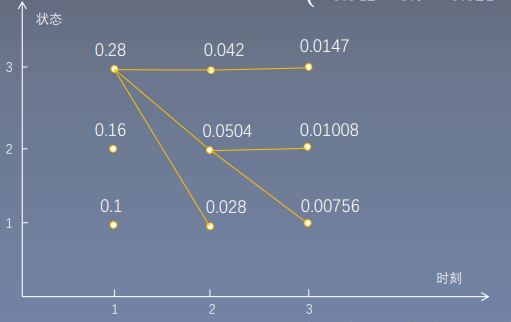

# 隐马尔可夫模型

## 隐马尔可夫模型的基本概念

隐马尔可夫模型由**初始概率分布**、**状态转移概率分布**以及**观测概率分布**确定。

* $Q$是所有$N$种可能的**状态的集合**：$Q=\{q_1,q_2,\cdots ,q_N\}$，$V$是所有$M$种可能的**观测的集合**：$V=\{v_1,v_2,\cdots,v_M\}$。

* $I$是长度为$T$的**状态序列**：$I=(i_1,i_2,\cdots,i_T)$，$O$是对应的**观测序列**：$O=(o_1,o_2,\cdots,o_T)$。

* $A$是**状态转移概率矩阵**：$A=[a_{ij}]_{N\times N}$，其中$a_{ij}=P(i_{t+1}=q_j|i_t=q_i)\quad i=1,2,\cdots,N;j=1,2,\cdots,N$；

* $B$是**观测概率矩阵**：$B=[b_{jk}]_{N\times M}$，其中$b_{jk}=P(o_{t}=v_k|i_t=q_j)\quad j=1,2,\cdots,N;k=1,2,\cdots,M$；

* $\pi$是**初始状态概率向量**：$\pi=(\pi_1,\pi_2,\cdots,\pi_N)$，其中，$\pi_i=P(i_1=q_i),i=1,2,\cdots,N$。

隐马尔可夫模型由初始状态概率向量$\pi$、状态转移概率矩阵$A$和观测概率矩阵$B$**决定**。**$\pi$和$A$决定状态序列，$B$决定观测序列**，因此隐马尔可夫模型可以用三元符号来表示，即：$\lambda=(A,B,\pi)$。

**两个基本假设：**

* **齐次马尔可夫性假设：**即隐藏的马尔科夫链在任意$t$时刻的状态只依赖于其前一时刻的状态，与其他时刻的状态及观测无关，也与时刻$t$本身无关：

  $P(i_t|i_{t-1},o_{t-1},\cdots,i_1,o_1)=P(i_t|i_{t-1}),t=1,2\cdots,T$

* **观测独立性假设：**即假设任意时刻的观测只依赖于该时刻的马尔可夫链的状态，与其他观测及状态无关：
  $$
  P(o_t|i_T,o_T,i_{T-1},o_{T-1},\cdots,i_{t},o_{t},\cdots,i_1,o_1)=P(o_t|i_t)
  $$

**三个基本问题：**

* **概率计算问题：**

  给定模型参数$\lambda=(A,B,\pi)$和观测序列$O=(o_1,o_2,\cdots,o_T)$，计算在模型$\lambda$下**观测序列**$O$出现的概率$P(O|\lambda)$。（状态序列未知）换言之，如何评估模型和观测序列的匹配程度？

* **学习问题：**

  **已知观测序列$O=(o_1,o_2,\cdots,o_T)$，估计模型$\lambda=(A,B,\pi)$参数，使得在该模型下观测序列概率$P(O|\lambda)$最大，**即用极大似然估计的方法估计参数。换言之，如何训练模型使其能最好地描述观测数据？

* **预测问题：**

  已知模型$\lambda=(A,B,\pi)$和观测序列$O=(o_1,o_2,\cdots,o_T)$，求**给定观测序列**下概率$P(I|O)$最大的**状态序列**$I=(i_1,i_2,\cdots,i_T)$。换言之，如何根据观测序列推断出隐藏的模型状态？

***

## 学习算法

 ### 监督学习

假设已给出训练数据包含$S$个**长度相同的**观测序列和对应的状态序列$\{(o_1,i_1),(o_2,i_2),\cdots,(o_S,i_S)\}$，那么可以利用**极大似然估计法**来估计$HMM$的参数：

* 转移概率$a_{ij}$的估计：

$$
a_{ij}=\dfrac{A_{ij}}{\sum\limits_{j=1}^NA_{ij}}	
$$
​	其中$A_{ij}$是样本时刻$t$处于状态$i$而$t+1$时刻转移到状态$j$的频数。

* 观测概率$b_{jk}$的估计：

$$
b_{jk}=\dfrac{B_{jk}}{\sum\limits_{k=1}^MB_{jk}}
$$
* 初始状态$\pi_i$的估计为$S$个样本中初始状态为$q_i$的概率。

***

**例子：**

考虑模型$\lambda=(A,B,\pi)$，状态集合$Q=\{1,2,3\}$，观测集合$V=\{a，b\}$。假设我们已知两组观测和状态序列：$O_1:\{a,a,b\},I_1:\{2,1,1\};O_1:\{a,b,a\},I_1:\{1,3,2\}$。
$$
\begin{aligned}
a_{11}=\dfrac{1}{2}\quad b_{1a}=\dfrac{2}{3}\\
a_{12}=0\quad b_{1b}=\dfrac{1}{3}\\
a_{13}=\dfrac{1}{2}\\
\cdots
\end{aligned}
$$
得到状态转移概率矩阵：
$$
\begin{aligned}
A=
\begin{vmatrix}
0.5 & 0& 0.5\\
1 & 0 & 0\\
0&1 &0\\
\end{vmatrix}
\end{aligned}
$$
观测概率矩阵：
$$
\begin{aligned}
B=
\begin{vmatrix}
\dfrac{2}{3} & \dfrac{1}{3}\\
1 & 0 \\
0&1 \\
\end{vmatrix}
\end{aligned}
$$
初始状态概率向量$\pi=\{0.5,0.5,0\}$。

***

### $Baum-Welch$算法

如果用监督算法，一般需要人工标注大量状态序列，代价特别高，而且很多应用不可能做到此事。所以我们采用无监督学习，也即$EM$算法进行参数估计。
$$
P(O|\lambda)=\sum_IP(O|I;\lambda)P(I|\lambda)
$$

* 确定$Q$函数

  * 确定完全数据的对数似然函数：

    * 此时观测数据为$O=(o_1,o_2,\cdots,o_T)$，隐藏数据为$I=(i_1,i_2,\cdots,i_T)$，则完全数据为$(O,I)$，其对数似然函数为：
      $$
      lnP(O,I|\lambda)
      $$
      其中$P(O,I|\lambda)=\pi_{i_1}b_{i_1o_1}a_{i_1i_2}b_{i_2o_2}\cdots a_{i_{T-1}i_T}b_{i_To_T}$，所以进一步可得：
      $$
      lnP(O,I|\lambda)=ln(\pi_{i_1}b_{i_1o_1}a_{i_1i_2}b_{i_2o_2}\cdots a_{i_{T-1}i_T}b_{i_To_T})=ln\pi_{i_1}+\sum\limits_{t=1}^{T-1}lna_{i_ti_{t+1}}+\sum_{t=1}^Tlnb_{i_t}o_t
      $$

    * 求$Q$函数$Q(\lambda,\hat{\lambda})$：
      $$
      Q(\lambda,\hat{\lambda})=\sum_IP(I|O;\hat{\lambda})lnP(O,I|\lambda)
      $$
      
      
      
  
      进一步：
      $$
      \begin{aligned}
      Q(\lambda,\hat{\lambda})&=\sum_IP(I|O;\hat{\lambda})lnP(O,I|\lambda)\\
      &=\sum_I\dfrac{P(I,O|\hat{\lambda})}{P(O|\hat{\lambda)}}lnP(O,I|\lambda)
      \end{aligned}
      $$
      由于当前的$\hat{\lambda}$是已经知道的，我们极大化$\lambda$的时候可以只将其看做常数，而且观测序列$O$也是确定的，所以$P(O|\hat{\lambda})$即为常数可以省略。
      $$
      \begin{aligned}
      Q(\lambda,\hat{\lambda})&=\sum_IP(I,O|\hat{\lambda})lnP(O,I|\lambda)\\
      &=\sum_IP(I,O|\hat{\lambda})\left(ln\pi_{i_1}+\sum\limits_{t=1}^{T-1}lna_{i_ti_{t+1}}+\sum_{t=1}^Tlnb_{i_t}o_t\right)\\
      &=\sum_IP(I,O|\hat{\lambda})ln\pi_{i_1}+\sum_IP(I,O|\hat{\lambda})\left(\sum\limits_{t=1}^{T-1}lna_{i_ti_{t+1}}\right)+\sum_IP(I,O|\hat{\lambda})\left(\sum_{t=1}^Tlnb_{i_t}o_t\right)
      \end{aligned}
      $$
  
  * 极大化$Q$函数可以得到：
    $$
    \pi_i=\dfrac{P(O,i_1=q_i|\hat{\lambda})}{P(O|\hat{\lambda})}=P(i_1=q_i|O,\hat{\lambda})=\gamma_t(i)=\dfrac{P(i_t=q_i,O|\lambda)}{\sum\limits_{j=1}^NP(i_t=q_j,O|\lambda)}=\dfrac{\alpha_t(i)\beta_t(i)}{\sum\limits_{j=1}^N\alpha_t(j)\beta_t(j)}
    $$
    $$
    a_{ij}=\dfrac{\sum\limits_{t=1}^{T-1}\xi_t(i,j)}{\sum\limits_{t=1}^{T-1}\gamma_t(i)}
    $$
    $$
    b_{jk}=\dfrac{\sum\limits_{t=1,o_t=v_k}^{T}\gamma_t(j)}{\sum\limits_{t=1}^{T}\gamma_t(j)}
    $$

## 概率计算算法

### 直接计算法

给定模型$\lambda=(A,B,\pi)$和观测序列$O=(o_1,o_2,\cdots,o_T)$，对于求$P(O|\lambda)$最直接的方法就是按照全概率公式直接计算，即:
$$
P(O|\lambda)=\sum_IP(O,I|\lambda)=\sum_IP(I|\lambda)P(O|I;\lambda)
$$
其中，$P(I|\lambda)$表示给定模型参数$\lambda$时，产生**状态序列**$I=(i_1,i_2,\cdots,i_T)$的概率：
$$
P(I|\lambda)=\pi_{i_1}a_{i_1i_2}a_{i_2i_3}\cdots a_{i_{T-1}i_T}
$$
$P(O|I;\lambda)$表示给定模型参数$\lambda$**且**状态序列为$I=(i_1,i_2,,\cdots,i_T)$时，产生**观测序列**$O=(o_1,o_2,\cdots,o_T)$的概率：
$$
P(O|I;\lambda)=b_{i_1o_1}b_{i_2o_2}\cdots b_{i_To_T}
$$
所以
$$
P(O|\lambda)=\sum_IP(O|I;\lambda)P(I|\lambda)=\sum_{i_1,i_2\cdots,i_T}\pi_{i_1}b_{i_1o_1}a_{i_1i_2}b_{i_2o_2}\cdots a_{i_{T-1}i_T}b_{i_To_T}
$$
其中，$\sum\limits_{i_1,i_2\cdots,i_T}$共有$N^T$种可能，设计算$\pi_{i_1}b_{i_1o_1}a_{i_1i_2}b_{i_2o_2}\cdots a_{i_{T-1}i_T}b_{i_To_T}$的时间复杂度为$O(T)$，所以计算上式的时间复杂度为$O(TN^T)$，如果序列长度$T$很大，显然这种算法是不可行的。

* **问题：**

  重复计算，比如仅最后一个状态改变，那么前边已经计算过的概率要重新计算，不能利用已经计算过的结果。考虑用**动态规划**的思想消除冗余计算。

***

### 前向算法

**前向概率：**给定隐马尔可夫模型$\lambda$，**定义**到时刻$t$部分观测序列为$o_1,o_2,\cdots ,o_t$，且**当前状态为$q_i$**的概率为前向概率，记作：
$$
\alpha_t(i)=P(o_1,o_2,\cdots,o_t,i_t=q_i|\lambda)
$$
**值得注意的是：**此时的模型$\lambda$和观测序列$O$已经确定，我们唯一不确定的就是隐变量，为简单起见，该式子我们假设$q_i$是确定的，即我们假设**“终点”**是确定的，所谓的确定就是现在假定该状态只取一个确定的值，等到算出来该值，其他状态形式一致，只需要$\sum$即可。

根据前向概率的定义可推得
$$
P(O|\lambda)=P(o_1,o_2,\cdots,o_T|\lambda)=\sum_{i=1}^NP(o_1,o_2,\cdots,o_T,i_T=q_i|\lambda)=\sum_{i=1}^N\alpha_T(i)
$$
于是求解$P(O|\lambda)$的问题就被**转化成了求解前向概率$\alpha_T(i)$的问题**，我们可做如下推导：
$$
\begin{aligned}
&\alpha_1(i)=P(o_1,i_1=q_i|\lambda)=\pi_ib_{io_1}\\
&\alpha_2(i)=P(o_1,o_2,i_2=q_i|\lambda)=\left[\sum_{j=1}^N\pi_jb_{jo_1}a_{ji}b_{io_2}\right]=\left[\sum_{j=1}^N\alpha_1(j)a_{ji}\right]\times b_io_2\\
&\alpha_3(i)=P(o_1,o_2,o_3,i_3=q_i|\lambda)=\left[\sum_{j=1}^N\sum_{k=1}^N\pi_kb_{ko_1}a_{kj}b_{jo_2}a_{ji}b_{io_3}\right]=\left[\sum_{j=1}^N\alpha_{1}(k)a_{kj}b_{jo_2}a_{ji}b_{io_3}\right]=\left[\sum_{j=1}^N\alpha_2(j)a_{ji}\right]\times b_io_3\\
&\cdots\cdots\\
&\alpha_{t+1}(i)=\left[\sum_{j=1}^N\alpha_t(j)a_{ji}\right]\times b_io_{t+1}\\
&\cdots\cdots\\
&\alpha_T(i)=\left[\sum_{j=1}^N\alpha_{T-1}(j)a_{ji}\right]\times b_io_{T}
\end{aligned}
$$
代回到
$$
P(O|\lambda)=P(o_1,o_2,\cdots,o_T|\lambda)=\sum_{i=1}^NP(o_1,o_2,\cdots,o_T,i_t=q_i|\lambda)=\sum_{i=1}^N\alpha_T(i)
$$
即可求得$P(O|\lambda)$。

前向算法的计算量是$O(N^2T)$阶的，它高效的关键是其局部计算前向概率，然后利用路径结构“递推”到全局。减少计算量的原因在于每一次计算直接引用前一个时刻的计算结果，避免重复计算。

* **例子：**

  考虑盒子和球模型$\lambda=(A,B,\pi)$，状态集合$Q=\{1,2,3\}$，观测集合$V=\{红，白\}$，
  $$
  A=\left[
  \begin{aligned}
  0.5\quad 0.2\quad 0.3\\
  0.3\quad 0.5\quad 0.2\\
  0.2\quad 0.3\quad 0.5\\
  \end{aligned}
  \right],\quad
  B=\left[
  \begin{aligned}
  0.5\quad 0.5\\
  0.4\quad 0.6\\
  0.7\quad 0.3\\
  \end{aligned}
  \right],\quad
  \pi=\left[
  \begin{aligned}
  0.2\\
  0.4\\
  0.4\\
  \end{aligned}
  \right]
  $$
  设$T=3,O=(红，白，红)$，试用前向算法计算$P(O|\lambda)$。
  $$
  \begin{aligned}
  &\alpha_1(1)=\pi_1b_1(o_1)=0.2\times0.5=0.10\\
  &\alpha_1(2)=\pi_2b_2(o_1)=0.4\times 0.4=0.16\\
  &\alpha_1(3)=\pi_3b_3(o_1)=0.4\times0.7=0.28\\
  &\alpha_2(1)=\left[\sum_{i=1}^3\alpha_1(i)a_{i1}\right]b_1(o_2)=[0.1\times0.5+0.16\times0.3+0.28\times0.2]\times0.5=0.154\times0.5=0.077\\
  &\alpha_2(2)=\left[\sum_{i=1}^3\alpha_1(i)a_{i2}\right]b_2(o_2)=0.184\times0.6=0.1104\\
  &\alpha_2(3)=\left[\sum_{i=1}^3\alpha_1(i)a_{i3}\right]b_3(o_2)=0.202\times0.3=0.0606\\
  &\alpha_3(1)=\left[\sum_{i=1}^3\alpha_2(i)a_{i1}\right]b_1(o_3)=0.04187\\
  &\alpha_3(2)=\left[\sum_{i=1}^3\alpha_2(i)a_{i2}\right]b_2(o_3)=0.03551\\
  &\alpha_3(3)=\left[\sum_{i=1}^3\alpha_2(i)a_{i3}\right]b_3(o_3)=0.05284\\
  &P(O|\lambda)=\sum_{i=1}^3\alpha_3(i)=0.13022
  \end{aligned}
  $$

### 后向算法

**后向概率：**给定隐马尔可夫模型$\lambda$，**定义**在时刻$t$状态为$q_i$的条件下，从$t+1$到$T$的部分观测序列为$o_{t+1},o_{t+2},\cdots ,o_T$的概率为后向概率，记作：
$$
\beta_t(i)=P(o_{t+1},o_{t+2},\cdots,o_T|i_t=q_i,\lambda)
$$
**注意：此时我们同前向概率一样假定了$q_i$是确定的。即“起点”是确定的。**

* 补充：不难看出，所谓的“起点”确定和"终点"确定表现在式子中就是作为条件和结果。

由后向概率的定义可知：
$$
\begin{aligned}
&\beta_T(i)=P(i_T=q_i,\lambda)=1\\
&\beta_{T-1}(i)=P(o_T|i_{T-1}=q_i,\lambda)=\sum_{j=1}^{N}a_{ij}b_{jo_T}\times1=\sum_{j=1}^{N}a_{ij}b_{jo_T}\beta_T(j)\\
&\beta_{T-2}(i)=P(o_{T-1},o_T|i_{T-2}=q_i,\lambda)=\sum_{j=1}^{N}a_{ij}b_{jo_{T-1}}\sum_{k=1}^{N}a_{jk}b_{ko_{T}}=\sum_{j=1}^{N}a_{ij}b_{jo_{T-1}}\beta_{T-1}(j)\\
&\cdots\cdots\\
&\beta_t(i)=\sum_{j=1}^Na_{ij}b_{jo_{t+1}}\beta_{t+1}(j)\\
&\cdots\cdots\\
&\beta_1(i)=\sum_{j=1}^Na_{ij}b_{jo_{2}}\beta_{2}(j)\\
\end{aligned}
$$
又
$$
P(O|\lambda)=P(o_1,o_2,\cdots,o_T|\lambda)=\sum_{i=1}^NP(o_1,i_1=q_i|\lambda)P(o_2,o_3,\cdots,o_T|i_1=q_i,\lambda)=\sum_{i=1}^N\pi_ib_{io_1}\beta_1(i)
$$
即可求得$P(O|\lambda)$。

* **例子：**

  考虑盒子和球模型$\lambda=(A,B,\pi)$，状态集合$Q=\{1,2,3\}$，观测集合$V=\{红，白\}$，
  $$
  A=\left[
  \begin{aligned}
  0.5\quad 0.2\quad 0.3\\
  0.3\quad 0.5\quad 0.2\\
  0.2\quad 0.3\quad 0.5\\
  \end{aligned}
  \right],\quad
  B=\left[
  \begin{aligned}
  0.5\quad 0.5\\
  0.4\quad 0.6\\
  0.7\quad 0.3\\
  \end{aligned}
  \right],\quad
  \pi=\left[
  \begin{aligned}
  0.2\\
  0.4\\
  0.4\\
  \end{aligned}
  \right]
  $$
  设$T=4,O=(红，白，红，白)$，试用后向算法计算$P(O|\lambda)$。

  * 初始化：
    $$
    \beta_4(i)=1,\quad i=1,2,3
    $$

  * 递推计算：
    $$
    \begin{aligned}
    &\beta_3(1)=\sum_{j=1}^3a_{1j}b_{jo_4}\beta_4(j)=0.5\times0.5+0.2\times0.6+0.3\times0.3=0.25+0.12+0.09=0.46\\
    &\beta_3(2)=\sum_{j=1}^3a_{1j}b_{jo_4}\beta_4(j)=0.15+0.3+0.06=0.51\\
    &\beta_3(3)=\sum_{j=1}^3a_{1j}b_{jo_4}\beta_4(j)=0.1+0.18+0.15=0.43\\
    &\beta_2(1)=\sum_{j=1}^3a_{1j}b_{jo_3}\beta_3(j)=0.25\times0.46+0.08\times0.51+0.21\times 0.43=0.2461\\
    &\beta_2(2)=\sum_{j=1}^3a_{1j}b_{jo_3}\beta_3(j)=0.15\times0.46+0.2\times0.51+0.14\times 0.43=0.2312\\
    &\beta_2(3)=\sum_{j=1}^3a_{1j}b_{jo_3}\beta_3(j)=0.1\times0.46+0.12\times0.51+0.35\times 0.43=0.2577\\
    &\beta_1(1)=\sum_{j=1}^3a_{1j}b_{jo_2}\beta_2(j)=0.25\times0.2461+0.12\times0.2312+0.09\times 0.2577=0.112462\\
    &\beta_1(2)=\sum_{j=1}^3a_{1j}b_{jo_2}\beta_2(j)=0.15\times0.2461+0.3\times0.2312+0.06\times 0.2577=0.121737\\
    &\beta_1(3)=\sum_{j=1}^3a_{1j}b_{jo_2}\beta_2(j)=0.1\times0.2461+0.18\times0.2312+0.15\times 0.2577=0.104881\\
    \end{aligned}
    $$

  * 终止
    $$
    P(O|\lambda)=\sum_{i=1}^3\pi_ib_{iO_1}\beta_1(i)=0.2\times0.5\times0.112462+0.4\times0.4\times0.121737+0.4\times0.7\times0.104881=0.0600908
    $$

***

* **推论：**

  利用前向概率和后向概率，可以得到关于**单个状态概率和两个状态概率**的一些计算公式：

  * 给定模型参数$\lambda$和观测$O$，**在时刻$t$处于状态$q_i$的概率**，记为$\gamma_t(i)=P(i_t=q_i|O,\lambda)$
    $$
    \gamma_t(i)=P(i_t=q_i|O;\lambda)=\dfrac{P(i_t=q_i,O|\lambda)}{P(O|\lambda)}=\dfrac{P(i_t=q_i,O|\lambda)}{\sum\limits_{j=1}^NP(i_t=q_j,O|\lambda)}
    $$
    又由前向概率和后向概率的定义可知：
    $$
    \begin{aligned}
    &P(i_t=q_i,O|\lambda)\\
    &=P(o_1,o_2,\cdots,o_{t-1}|\lambda)P(i_t=q_i,o_t|\lambda)P(o_{t+1},o_{t+2},\cdots,o_{T}|\lambda)\\
    &=P(o_1,o_2,\cdots,o_t,i_t=q_i|\lambda)P(o_{t+1},o_{t+2},\cdots,o_T|i_t=q_i;\lambda)=\alpha_t(i)\beta_t(i)\\
    \end{aligned}
    $$
    注意第二个等式是由于**两个基本假设**。
    
    直观地想来就是，当时刻$t$的状态确定时，后向概率的“起点”和前向概率的“终点”确定，并且并无交叉。
    
    所以
    $$
    \gamma_t(i)=\dfrac{P(i_t=q_i,O|\lambda)}{\sum\limits_{j=1}^NP(i_t=q_j,O|\lambda)}=\dfrac{\alpha_t(i)\beta_t(i)}{\sum\limits_{j=1}^N\alpha_t(j)\beta_t(j)}
    $$
    
  * 给定模型参数$\lambda$和观测$O$，**在时刻$t$处于状态$q_i$且在时刻$t+1$处于状态$q_j$的概率**，记为$\xi_t(i,j)=P(i_t=q_i,i_{t+1}=q_j|O;\lambda)$
  
    进行如下推导：
    $$
    \xi_t(i,j)=\dfrac{P(i_t=q_i,i_{t+1}=q_j,O|\lambda)}{P(O|\lambda)}=\dfrac{P(i_t=q_i,i_{t+1}=q_j,O|\lambda)}{\sum\limits_{i=1}^N\sum\limits_{j=1}^NP(i_t=q_i,i_{t+1}=q_j,O|\lambda)}
    $$
  
  对分子进行如下变形：
  $$
  \begin{aligned}
  &P(i_t=q_i,i_{t+1}=q_j,O|\lambda)\\
  &=P(i_t=q_i,i_{t+1}=q_j,o_1,o_2,\cdots,o_T|\lambda)\\
  &=P(o_1,o_2,\cdots o_{t-1}|\lambda)P(o_t,o_{t+1},i_t=q_i,i_{t+1}=q_j|\lambda)P(o_{t+2},o_{t+3},\cdots o_T|i_{t+1}=q_j;\lambda)\\
  &=P(o_1,o_2,\cdots o_{t-1}|\lambda)P(o_t,i_t=q_i|\lambda)P(o_{t+1},i_{t+1}=q_j|i_t=q_i;\lambda)P(o_{t+2},o_{t+3},\cdots o_T|i_{t+1}=q_j;\lambda)\\
  &=P(o_1,o_2,\cdots o_t,i_t=q_i|\lambda)P(o_{t+1},i_{t+1}=q_j|i_t=q_i;\lambda)P(o_{t+2},o_{t+3},\cdots o_T|i_{t+1}=q_j;\lambda)\\
  &=\alpha_t(i)a_{ij}b_{jo_{t+1}}\beta_{t+1}(j)
  \end{aligned}
  $$
  注意第二、三个等式是由于**两个基本假设**和概率的乘法公式。
  
  所以：
  $$
  \xi_t(i,j)=\dfrac{P(i_t=q_i,i_{t+1}=q_j,O|\lambda)}{\sum\limits_{i=1}^N\sum\limits_{j=1}^NP(i_t=q_i,i_{t+1}=q_j,O|\lambda)}=\dfrac{\alpha_t(i)a_{ij}b_{jo_{t+1}}\beta_{t+1}(j)}{\sum\limits_{i=1}^N\sum\limits_{j=1}^N\alpha_t(i)a_{ij}b_{jo_{t+1}}\beta_{t+1}(j)}
  $$

## 预测算法

### 近似算法

分别求出在每个时刻最有可能出现的状态$i_t^*$，从而得到一个状态序列$I^*=(i_1^*,i_2^*,\cdots,i_T^*)$，将它作为预测结果即可。

给定$HMM$的参数$\lambda$和观测序列$O$，在时刻$t$处于状态$q_i$的概率$\gamma_t(i)$：
$$
\gamma_t(i)=\dfrac{\alpha_t(i)\beta_t(i)}{\sum\limits_{j=1}^N\alpha_t(j)\beta_t(j)}
$$
在每一个时刻$t$最有可能的状态$i_t^*$是：
$$
i^*_T=\mathop{arg\ max}\limits_{1\leqslant i\leqslant N}[\gamma_t(i)],\quad t=1,2,\cdots,T
$$
但是，局部的状态并不能确定全局最优的状态序列：我们计算的时候仅考虑了当前状态，并没有考虑前面的状态。如果状态转移概率矩阵中有为$0$的，那么实际上求出来的状态是不存在的。

### 维特比算法

**用动态规划来求最大概率的路径，实际上，从图的角度来看计算最优隐状态序列概率等价于计算最大路径。也就是说，维特比算法与前向概率计算思想一致，只是将加法替换为求最大。**

* 定义在时刻$t$状态为$q_i$的所有单个路径$(i_1,i_2,\cdots,i_t)$中概率最大为

$$
\delta_t(i)=\mathop{max}_{i_1,i_2,\dots,i_{t-1}}P(o_1,\cdots,o_t,i_1,\cdots,i_{t-1},i_t=q_i)
$$
则：
$$
\begin{aligned}
&\delta_1(i)=\pi_ib_{io_1}\\
&\delta_2(i)=\mathop{max}_{1\leqslant j\leqslant N}[\delta_1(j)a_{ji}]b_{io_2}\\
&\delta_3(i)=\mathop{max}_{1\leqslant j\leqslant N}[\delta_2(j)a_{ji}]b_{io_3}\\
&\cdots\\
&\delta_t(i)=\mathop{max}_{1\leqslant j\leqslant N}[\delta_{t-1}(j)a_{ji}]b_{io_t}\\
\end{aligned}
$$
* 定义在$t$时刻状态为$q_i$的所有单个路径$(i_1,i_2,\cdots,i_{t-1},i_t)$中概率最大的路径的第$t-1$个节点为

$$
\psi_t(i)=\mathop{arg\ max}\limits_{1\leqslant j\leqslant N}[\delta_{t-1}(j)a_{ji}]
$$

​		这个形式化的定义就是为了回溯前面的状态。

***

**例子：**

假设有三个盒子，每个盒子里面都装有红白两种颜色的球，盒子里的红白球数如下所示：

|  盒子  | $1$  | $2$  | $3$  |
| :----: | :--: | :--: | :--: |
| 红球数 | $5$  | $4$  | $7$  |
| 白球数 | $5$  | $6$  | $3$  |

按照下面的方法抽球，产生一个球的颜色观测序列：首先以$0.2,0.4,0.4$的概率从$1,2,3$号盒子中选取一个盒子，从这个盒子中随机抽取一个球，记录颜色后放回，接着按以下概率选取下一个盒子：

|      |  $1$  |  $2$  |  $3$  |
| :--: | :---: | :---: | :---: |
| $1$  | $0.5$ | $0.2$ | $0.3$ |
| $2$  | $0.3$ | $0.5$ | $0.2$ |
| $3$  | $0.2$ | $0.3$ | $0.5$ |

确定转移的盒子后，再从盒子里随机抽取一个球，记录颜色后放回，如此下去重复三次，最终得到的观测序列为$O=\{红，白，红\}$，记选取的盒子序列为状态序列，试求最优状态序列，即最优路径$I^*=(i_1^*,i_2^*,i_3^*)$。

***

确定$HMM$模型的参数为:
$$
\begin{aligned}
A=
\begin{vmatrix}
0.5&0.2&0.3\\
0.3&0.5&0.2\\
0.2&0.3&0.5\\
\end{vmatrix}
\quad
B=
\begin{vmatrix}
0.5&0.5\\
0.4&0.6\\
0.7&0.3\\
\end{vmatrix}
\quad
\pi=
\begin{vmatrix}
0.2\\
0.4\\
0.4\\
\end{vmatrix}
\end{aligned}
$$
按照维特比算法进行如下计算：
$$
\begin{aligned}
&\delta_1(1)=\pi_1b_{1o_1}=0.2\times 0.5=0.1,\quad\psi_1(1)=0\\
&\delta_1(2)=\pi_2b_{2o_1}=0.4\times 0.4=0.16,\quad\psi_1(2)=0\\
&\delta_1(3)=\pi_3b_{3o_1}=0.4\times 0.7=0.28,\quad\psi_1(3)=0
\end{aligned}
$$

$$
\delta_2(1)=\mathop{max}_{1\leqslant j\leqslant3}[\delta_1(j)a_{j1}]b_{1o_2}=max
\left\{
\begin{aligned}
&0.1\times0.5=0.05\\
&0.16\times0.3=0.048\\
&0.28\times0.2=0.056\\
\end{aligned}
\right\}
\times0.5=0.028\quad \psi_2(1)=\mathop{arg\ max}_{1\leqslant j \leqslant 3}[\delta_1(j)a_{j1}]=3\\
\delta_2(2)=\mathop{max}_{1\leqslant j\leqslant3}[\delta_1(j)a_{j2}]b_{2o_2}=max
\left\{
\begin{aligned}
&0.1\times0.2=0.02\\
&0.16\times0.5=0.08\\
&0.28\times0.3=0.084\\
\end{aligned}
\right\}
\times0.6=0.0504\quad \psi_2(2)=\mathop{arg\ max}_{1\leqslant j \leqslant 3}[\delta_1(j)a_{j2}]=3\\
\delta_2(3)=\mathop{max}_{1\leqslant j\leqslant3}[\delta_1(j)a_{j3}]b_{3o_2}=max
\left\{
\begin{aligned}
&0.1\times0.3=0.03\\
&0.16\times0.2=0.032\\
&0.28\times0.5=0.14\\
\end{aligned}
\right\}
\times0.3=0.042\quad \psi_2(3)=\mathop{arg\ max}_{1\leqslant j \leqslant 3}[\delta_1(j)a_{j3}]=3
$$

$$
\delta_3(1)=\mathop{max}_{1\leqslant j\leqslant3}[\delta_1(j)a_{j1}]b_{1o_2}=max
\left\{
\begin{aligned}
&0.028\times0.5=0.014\\
&0.0504\times0.3=0.01512\\
&0.042\times0.2=0.0084\\
\end{aligned}
\right\}
\times0.5=0.00756\quad \psi_3(1)=\mathop{arg\ max}_{1\leqslant j \leqslant 3}[\delta_2(j)a_{j1}]=2\\
\delta_3(2)=\mathop{max}_{1\leqslant j\leqslant3}[\delta_1(j)a_{j2}]b_{2o_2}=max
\left\{
\begin{aligned}
&0.028\times0.2=0.0056\\
&0.0504\times0.5=0.0252\\
&0.042\times0.3=0.0126\\
\end{aligned}
\right\}
\times0.4=0.01008\quad \psi_3(2)=\mathop{arg\ max}_{1\leqslant j \leqslant 3}[\delta_2(j)a_{j2}]=2\\
\delta_3(3)=\mathop{max}_{1\leqslant j\leqslant3}[\delta_1(j)a_{j3}]b_{3o_2}=max
\left\{
\begin{aligned}
&0.028\times0.3=0.0084\\
&0.0504\times0.2=0.01008\\
&0.042\times0.5=0.021\\
\end{aligned}
\right\}
\times0.7=0.0147\quad \psi_3(3)=\mathop{arg\ max}_{1\leqslant j \leqslant 3}[\delta_2(j)a_{j3}]=3
$$

