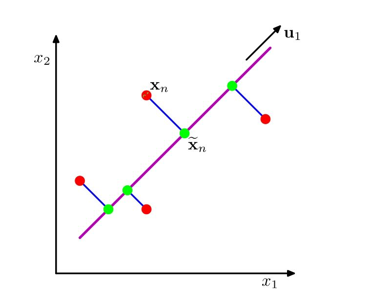
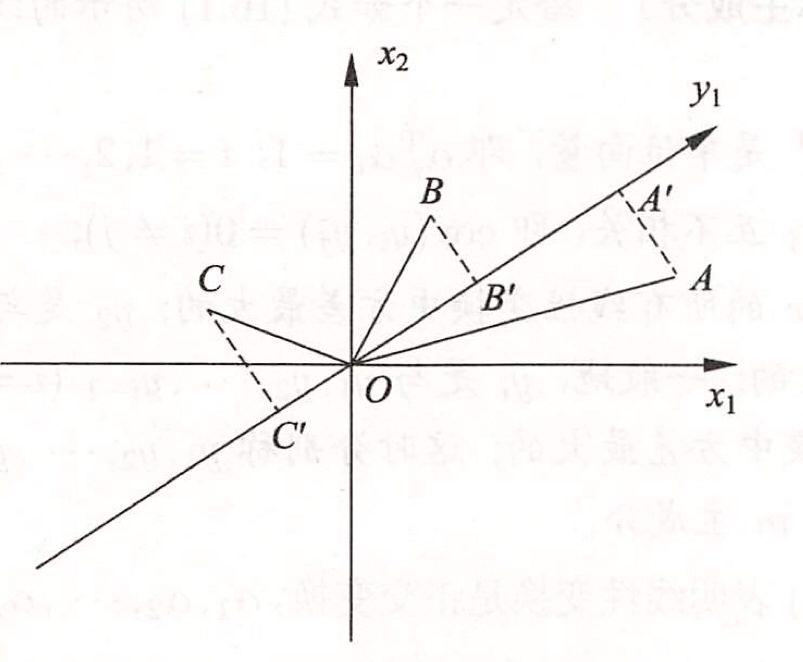

# 主成分分析

主成分分析$(principal\ component\ analysis,PCA)$是一种常用的无监督学习方法，这一方法利用**正交变换**把由**线性相关变量**表示的观测数据转换为少数几个由**线性无关变量**表示的数据，线性无关的变量称为**主成分**。并且主成分的个数通常小于原始变量的个数，所以主成分分析属于**降维**方法。在数据总体上进行的分析称为总体主成分分析，在有限样本上进行的主成分分析称为样本主成分分析。

## 基础知识

* 正交矩阵：

  如果$n$阶矩阵$\boldsymbol A$满足$\boldsymbol A^T\boldsymbol A=\boldsymbol E$即$\boldsymbol A^{-1}=\boldsymbol A^T$，那么称$\boldsymbol A$为正交矩阵。方阵$\boldsymbol A$为正交矩阵的充分必要条件是$\boldsymbol A$的列向量都是单位向量且两两正交。

* 对称矩阵：

  满足$\boldsymbol A^T=\boldsymbol A$。对于对称矩阵来说，必有正交矩阵$\boldsymbol P$使得$\boldsymbol P^{-1}\boldsymbol A\boldsymbol P=\boldsymbol P^{T}\boldsymbol A\boldsymbol P=\boldsymbol \varLambda$，其中$\boldsymbol \varLambda$是以$\boldsymbol A$的$n$个特征值为对角元的对角矩阵。

* 方差：用来度量**单个随机变量**的**离散程度**

  设$x$是一个随机变量，若$E\{[x-E(x)]^2\}$存在，则称其为$x$的方差，记为$Var(x)$或$D(x)$。

* 协方差：一般用来刻画**两个随机变量**的**相似程度**

  称$E\{[x-E(x)][y-E(y)]\}$为随机变量$x,y$的协方差，记为$Cov(x,y)$，可以看到方差是协方差的特殊情况。统计学中，每个样本可以理解为一个$m$维的随机向量。同时，每个维度可以理解为一个随机变量。样本的协方差矩阵说的是，$m$个随机变量之间的协方差，所构成的矩阵。由于有$m$个随机变量，因此样本的协方差矩阵为$m\times m$；

* 相关系数：

  $\rho_{xy}=\dfrac{Cov(x,y)}{\sqrt {D(x)}\sqrt {D(y)}}$称为随机变量$x,y$的相关系数。

* 协方差矩阵：

  一般而言，可视作由方差和协方差组合而成。即方差构成了对角线上的元素，协方差构成了非对角线上的元素。

* 向量内积的几何意义：

  向量$\boldsymbol a$和$\boldsymbol b$的内积可以表示为$\boldsymbol a\cdot\boldsymbol  b=|\boldsymbol a|\times|\boldsymbol b|cos\theta$，几何意义就是一个向量在另一个向量上的投影与这个向量模长的**积**，也就是同方向的积。特别地，如果一个向量$\boldsymbol a$是某个坐标轴的单位坐标向量，那么向量的内积自然就是$|\boldsymbol b|cos\theta$，也就是向量$\boldsymbol b$在此坐标轴上的坐标值。因此，如果想要将一个向量变换到新的坐标系，那么只要对新坐标系向量进行内积运算即可。

## 总体主成分分析

### 基本想法

### 定义和导出

假设$\boldsymbol x=(x_1,x_2,\cdots,x_m)^T$是$m$维随机向量，意即每一维都是单独的随机变量，但是相关性未知。设其均值向量是$\boldsymbol \mu=E(\boldsymbol x)=(\mu_1.\mu_2,\cdots,\mu_m)^T$，**协方差矩阵**是$\boldsymbol \varSigma=Cov(\boldsymbol x,\boldsymbol x)=E\{(\boldsymbol x-\boldsymbol \mu)(\boldsymbol x-\boldsymbol \mu)^T\}$。它是多维随机变量各维度**两两之间的协方差**组合而成的矩阵：
$$
\begin{aligned}
\varSigma&=E
\left(\begin{bmatrix}
x_1-\mu_1\\x_2-\mu_2\\\vdots\\x_m-\mu_m
\end{bmatrix}
\begin{bmatrix}
x_1-\mu_1&x_2-\mu_2&\cdots&x_m-\mu_m
\end{bmatrix}\right)
\\&=
E\begin{bmatrix}
(x_1-\mu_1)^2&(x_1-\mu_1)(x_2-\mu_2)&\cdots&(x_1-\mu_1)(x_m-\mu_m)\\
(x_2-\mu_2)(x_1-\mu_1)&(x_2-\mu_2)^2&\cdots&(x_2-\mu_2)(x_m-\mu_m)\\
\vdots&\vdots&\vdots&\vdots&\\
(x_m-\mu_m)(x_1-\mu_1)&(x_m-\mu_m)(x_2-\mu_2)&\cdots&(x_m-\mu_m)^2\\
\end{bmatrix}
\end{aligned}
$$
以上可以看出协方差矩阵$\boldsymbol \varSigma$是**对称矩阵**。

考虑由$m$维随机变量$\boldsymbol x$到$m$维随机变量$\boldsymbol y=(y_1,y_2,\cdots,y_m)$的线性变换$\boldsymbol \alpha_i^T$：

$\boldsymbol \alpha_i^T$本质上是个实系数向量而已，不是随机变量。
$$
y_i=\boldsymbol \alpha_i^T\boldsymbol x=\alpha_{1i}^Tx_1+\alpha_{2i}^Tx_2+\cdots+\alpha_{mi}^Tx_m
$$
由随机变量的性质可知：（下面的公式将$\boldsymbol x$看成是$m$个随机变量的组合容易理解，而$y_i$本身就是一个一维的随机变量）
$$
\begin{aligned}
&E(y_i)=\alpha_i^TE(x)=\alpha_i^T\mu\\\\
&\begin{aligned}
Var(y_i)&=E\{[y_i-E(y_i)]^2\}\\
&=E\{(\alpha_i^Tx-\alpha_i^T\mu)^2\}\\
&=E\{[\alpha_i^T(x-\mu)][\alpha_i^T(x-\mu)]\}\\
&=E\{[\alpha_i^T(x-\mu)(x-\mu)^T\alpha_i]\}\\
&=\alpha_i^TE\{[(x-\mu)(x-\mu)^T]\}\alpha_i\\
&=\alpha_i^T\varSigma\alpha_i\\
\end{aligned}\\\\
&\begin{aligned}
Cov(y_i,y_j)&=E\{(y_i-E(y_i))((y_j-E(y_j)\}\\
&=E\{(\alpha_i^Tx-\alpha_i^T\mu)(\alpha_j^Tx-\alpha_j^T\mu)\}\\
&=E\{(\alpha_i^Txx^T\alpha_j-2\alpha_i^T\mu x\alpha_j+\alpha_i^T\mu\mu^T\alpha_j)\}\\
&=E\{\alpha^T_i((\boldsymbol x-\boldsymbol \mu)(\boldsymbol x-\boldsymbol \mu)^T)\alpha_j\}\\
&=\alpha_i^T\varSigma\alpha_j
\end{aligned}
\end{aligned}
$$
值得注意的是：以上三个的最终结果均是一个数。其中的$\varSigma$定义是$\boldsymbol x$的协方差矩阵，一般的协方差矩阵定义如下：
$$
\begin{aligned}
Cov(x,y)&=E\{(x-\mu)(y-\nu)^T\}\\
&=E\left(\begin{bmatrix}
x_1-\mu_1\\x_2-\mu_2\\\vdots\\x_m-\mu_m
\end{bmatrix}
\begin{bmatrix}
y_1-\nu_1&y_2-\nu_2&\cdots&y_m-\nu_m
\end{bmatrix}\right)
\\&=E\begin{bmatrix}
(x_1-\mu_1)(y_1-\nu_1)&(x_1-\mu_1)(y_2-\nu_2)&\cdots&(x_1-\mu_1)(y_m-\nu_m)\\
(x_2-\mu_2)(y_1-\nu_1)&(x_2-\mu_2)(y_2-\nu_2)&\cdots&(x_2-\mu_2)(y_m-\nu_m)\\
\vdots&\vdots&\vdots&\vdots&\\
(x_m-\mu_m)(y_1-\nu_1)&(x_m-\mu_m)(y_2-\nu_2)&\cdots&(x_m-\mu_m)(y_m-\nu_m)\\
\end{bmatrix}
\end{aligned}
$$

***

主成分分析对数据进行正交变换，具体地，对原坐标系进行旋转变换，并将数据在新坐标系表示。比如原数据由变量$(x_1,x_2)$表征，那么变换后在新坐标系里就由变量$(y_1,y_2)$表征。主成分分析选择方差最大的方向作为新坐标系的第一坐标轴$y_1$轴，然后选择与第一坐标轴正交，且方差最大的方向作为新坐标系的第二坐标轴$y_2$轴。

**定理：**设$\boldsymbol x$是$m$维随机变量，$\boldsymbol \varSigma$是$\boldsymbol x$的**协方差矩阵**，$\boldsymbol \varSigma$的**特征值**分别为$\lambda_1\geqslant\lambda_2\geqslant\cdots\lambda_m\geqslant0$，特征值对应的**单位特征向量**分别为$\boldsymbol \alpha_1,\boldsymbol \alpha_2,\cdots,\boldsymbol \alpha_m$，则$\boldsymbol x$的第$k$个主成分是
$$
y_k=\boldsymbol \alpha_k^T\boldsymbol x=\alpha_{1k}^Tx_1+\alpha_{2k}^Tx_2+\cdots+\alpha_{mk}^Tx_m
$$
$\boldsymbol x$的第$k$个主成分的**方差**为
$$
Var(y_k)=\boldsymbol \alpha_k^T\boldsymbol \varSigma\boldsymbol \alpha_k=\lambda_k
$$

证明：

首先，我们来求$\boldsymbol x$的第一主成分$y_1=\boldsymbol \alpha_1^T\boldsymbol x$，即求系数向量$\boldsymbol \alpha_1$，这个$\boldsymbol \alpha_1$实际上就是变换后的坐标轴。因为$\boldsymbol \alpha_1$是单位向量，所以由内积的几何意义得知，$y_1$就是$\boldsymbol x$变换后在$\boldsymbol \alpha_1$上的坐标（此时投影就是坐标）。而选取方差最大的变量，也就是旋转变换后坐标值的平方和最大的轴。

实际上就是求解约束最优化问题：
$$
\mathop{max}_{\boldsymbol \alpha_1}\quad \boldsymbol \alpha_1^T\varSigma\boldsymbol \alpha_1\\
s.t.\quad \boldsymbol \alpha_1^T\boldsymbol \alpha_1=1
$$
定义拉格朗日函数$\boldsymbol \alpha_1^T\varSigma\boldsymbol \alpha_1-\lambda(\boldsymbol \alpha_1^T\boldsymbol \alpha_1-1)$。将拉格朗日函数对$\boldsymbol \alpha_1$求导，并令其为$0$，得
$$
\varSigma\boldsymbol \alpha_1-\lambda\boldsymbol \alpha_1=0
$$
因此$\lambda$就是对应的特征值，$\boldsymbol \alpha_1$是对应的单位特征向量。于是代回目标函数可以得出$\boldsymbol \alpha_1^T\varSigma\boldsymbol \alpha_1=\boldsymbol \alpha_1^T\lambda\boldsymbol \alpha_1=\lambda\boldsymbol\alpha_1^T\boldsymbol \alpha_1=\lambda$。也就是说最大的方差就是最大的特征值，而相应的$\boldsymbol \alpha_1$就是该特征值对应的单位特征向量。

***

### 总体主成分的性质

* 总体主成分$\boldsymbol y$的协方差矩阵是对角矩阵，对角线上的元素即是每个分量的方差。

* 总体主成分$\boldsymbol y$的**方差之和**等于随机变量$\boldsymbol x$的**方差之和**，即$\sum\limits_{i=1}^m\lambda_i=\sum\limits_{i=1}^m\sigma_{i}^2$。其中$\sigma_{i}^2$是随机变量$x_i$的方差，即协方差矩阵$\boldsymbol \varSigma$的对角元素。实际上是说，$\boldsymbol y$的协方差矩阵的迹等于$\boldsymbol x$的协方差矩阵的迹。

* 第$k$个主成分与变量$x_i$的相关系数$\rho(y_k,x_i)$称为因子负荷量。计算公式为
  $$
  \rho(y_k,x_i)=\dfrac{Cov(y_k,x_i)}{\sqrt{Var(y_k)Var(x_i)}}=\dfrac{\sqrt{\lambda_k}\alpha_{ik}}{\sqrt{\sigma_{i}^2}}
  $$

* 第$k$个主成分$y_k$与$m$个变量的因子负荷量满足$\sum\limits_{i=1}^m\sigma_{i}^2\rho^2(y_k,x_i)=\lambda_k$。

* $m$个主成分与第$i$个变量$x_i$的因子负荷量满足$\sum\limits_{k=1}^m\rho^2(y_k,x_i)=1$。

## 样本主成分分析

上述的主成分分析是定义在样本总体上的，在实际问题中，需要在观测数据上进行主成分分析，这就是样本主成分分析。

### 定义和性质

假设对$m$维随机变量$\boldsymbol x=(x_1,x_2,\cdots,x_m)^T$进行$n$次独立观测，$\boldsymbol x_1,\boldsymbol x_2\cdots,\boldsymbol x_n$表示观测样本，其中$\boldsymbol x_j=(x_{1j},x_{2j},\cdots,x_{mj})^T$表示第$j$个观测样本，$x_{ij}$表示第$j$个观测样本的第$i$个变量，则$n$次观测数据可以用样本矩阵$\boldsymbol X$表示，记作：
$$
\boldsymbol X=\begin{bmatrix}
\boldsymbol x_1&\boldsymbol x_2&\cdots&\boldsymbol x_n
\end{bmatrix}
=\begin{bmatrix}
x_{11}&x_{12}&\cdots&x_{1n}\\
x_{21}&x_{22}&\cdots&x_{2n}\\
\vdots&\vdots&&\vdots\\
x_{m1}&x_{m2}&\cdots&x_{mn}\\
\end{bmatrix}
$$
以上可以看出，一列为一个样本，一行可以看作是一个特征。给定了样本我们就可以估计样本均值$\boldsymbol {\bar{x}}$和样本协方差矩阵$\boldsymbol S$：
$$
\boldsymbol {\bar{x}}=\dfrac{1}{n}\sum_{j=1}^n \boldsymbol x_j\\
s_{ij}=\dfrac{1}{n-1}\sum_{k=1}^n(x_{ik}-\bar{x}_i)(x_{jk}-\bar{x}_j)\\
\boldsymbol S=[s_{ij}]_{m\times m}=\dfrac{1}{n-1}\sum\limits_{l=1}^n(\boldsymbol x_l-\bar {\boldsymbol x})(\boldsymbol x_l-\bar{\boldsymbol x})^T=\dfrac{1}{n-1}\boldsymbol X’\boldsymbol X'^T\\
$$
其中，$\boldsymbol X'$定义$\boldsymbol X$中心化后的样本数据。为$m$维向量$\boldsymbol x=(x_1,x_2,\cdots,x_m)^T$到$m$维向量$\boldsymbol y=(y_1,y_2,\cdots,y_m)^T$的线性变换$\boldsymbol y=\boldsymbol A^T\boldsymbol x$。

其中
$$
A=\begin{bmatrix}
\boldsymbol a_1&\boldsymbol a_2&\cdots&\boldsymbol a_m
\end{bmatrix}
=\begin{bmatrix}
a_{11}&a_{12}&\cdots&a_{1m}\\
a_{21}&a_{22}&\cdots&a_{2m}\\
\vdots&\vdots&&\vdots\\
a_{m1}&a_{m2}&\cdots&a_{mm}\\
\end{bmatrix}
$$
则
$$
\boldsymbol y=\boldsymbol A^T\boldsymbol x=\begin{bmatrix}
\boldsymbol a_1^T\\\boldsymbol a_2^T\\\vdots\\\boldsymbol a_m^T
\end{bmatrix}x=\begin{bmatrix}
\boldsymbol a_1^T\boldsymbol x\\\boldsymbol a_2^T\boldsymbol x\\\vdots\\\boldsymbol a_m^T\boldsymbol x
\end{bmatrix}
=\begin{bmatrix}
a_{11}&a_{21}&\cdots&a_{m1}\\
a_{12}&a_{22}&\cdots&a_{m2}\\
\vdots&\vdots&&\vdots\\
a_{1m}&a_{2m}&\cdots&a_{mm}\\
\end{bmatrix}\begin{bmatrix}
x_1\\x_2\\\vdots\\x_m
\end{bmatrix}
$$

考虑$\boldsymbol y$中的任意的一个线性变换
$$
y_i=\boldsymbol a_i^T\boldsymbol x=a_{1i}^Tx_1+a_{2i}^Tx_2+\cdots+a_{mi}^Tx_m
$$
其中$y_i$是$m$维向量$\boldsymbol y$的第$i$个随机变量，均值为$\bar{y_i}=\dfrac{1}{n}\sum\limits_{j=1}^n\boldsymbol a_i^T\boldsymbol x_j=\boldsymbol a_i^T\bar{\boldsymbol x}$。$y_i$的样本方差为
$$
\begin{aligned}
Var(y_i)&=\dfrac{1}{n-1}\sum\limits_{j=1}^n(\boldsymbol a_i^T\boldsymbol x_j-\boldsymbol a_i^T\bar{\boldsymbol x})^2\\
&=\boldsymbol a_i^T[\dfrac{1}{n-1}\sum\limits_{j=1}^n(\boldsymbol x_j-\bar {\boldsymbol x})(\boldsymbol x_j-\bar{\boldsymbol x})^T]\boldsymbol a_i=\boldsymbol a_i^TS\boldsymbol a_i
\end{aligned}
$$
对任意两个线性变换$y_i=\boldsymbol a_i^T\boldsymbol x,y_k=\boldsymbol a_k^T\boldsymbol x$，样本协方差为$Cov(y_i,y_k)=a_i^TSa_k$。其中$S$是对称的，所以$Cov(y_i,y_k)=Cov(y_k,y_i)$，其实由$y_i,y_k$是一维随机变量，由一维随机变量协方差的对称性也可得出。

对于一组给定的数据点$\{\boldsymbol v_1,\boldsymbol v_2,\cdots,\boldsymbol v_n\}$，规范化后的表示为$\{\boldsymbol x_1,\boldsymbol x_2,\cdots,\boldsymbol x_n\}=\{\dfrac{\boldsymbol v_1-\boldsymbol \mu}{\sqrt{\boldsymbol s}},\dfrac{\boldsymbol v_2-\boldsymbol \mu}{\sqrt{\boldsymbol s}},\cdots,\dfrac{\boldsymbol v_1-\boldsymbol \mu}{\sqrt{\boldsymbol s}}\}$，其中$\boldsymbol \mu=\dfrac{1}{n}\sum\limits_{i=1}^n \boldsymbol v_i$，$\boldsymbol s$是每个特征维度的方差组合而成的向量。对于规范化后的数据点，我们可以得出协方差矩阵就是$\dfrac{1}{n-1}XX^T$。

