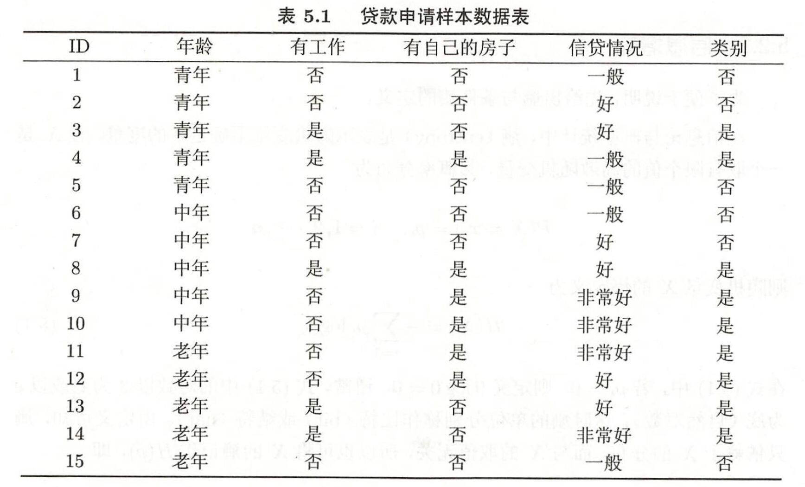
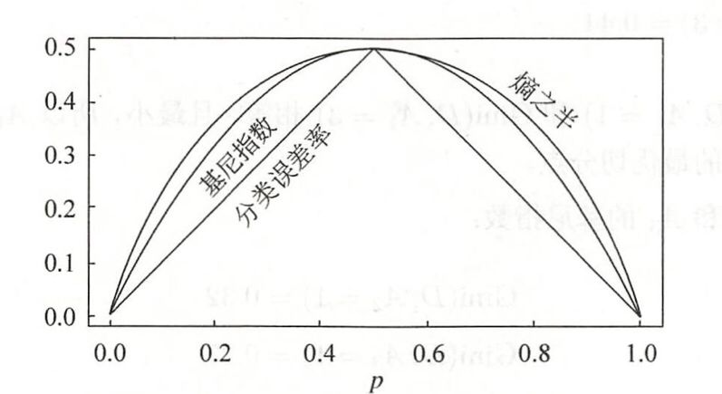
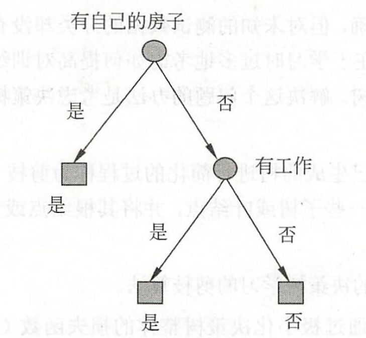

# 决策树

## 决策树的模型与学习

## 特征选择

### 信息增益

* 信息增益：特征$A$对训练数据集$D$的信息增益$g(D,A)$，定义为集合$D$的经验熵$H(D)$与特征$A$在给定条件下$D$的经验条件熵$H(D|A)$之差，即
  $$
  g(D,A)=H(D)-H(D|A)
  $$
  一般地，熵$H(Y)$与条件熵$H(Y|X)$之差称为互信息。决策树学习中的**信息增益**等价于训练数据集中类与特征的**互信息**。

假设训练数据集为$D$，$|D|$表示其样本容量，即样本个数。设有$K$个类$C_k,\ k=1,2,\dots,K$，$|C_k|$为属于类$C_K$的样本个数，$\sum_\limits{k=1}^K|C_k|=|D|$。设特征$A$有$n$个不同的取值${a_1,a_2,\dots,a_n}$，根据特征$A$的取值将$D$划分为$n$个子集$D_1,D_2,\cdots,D_n$，$|D_i|$为$D_i$的样本个数，$\sum\limits_{i=1}^{n}|D_i|=|D|$。记子集$D_i$属于类$C_k$的样本的集合为$D_{ik}$，即$D_{ik}=D_i\cap C_k$，$|D_{ik}|$为$D_{ik}$的样本个数。于是信息增益算法如下：

* 输入：训练数据集$D$和特征$A$；
* 输出：特征$A$对训练数据集$D$的信息增益$g(D,A)$。

1. 计算数据集$D$的经验熵$H(D)$
   $$
   H(D)=-\sum_{k=1}^K\dfrac{|C_k|}{D}log_2\dfrac{|C_k|}{D}
   $$

2. 计算特征$A$对数据集$D$的经验条件熵$H(D|A)$
   $$
   H(D|A)=\sum\limits_{i=1}^n\dfrac{|D_i|}{|D|}H(D_i)=-\sum\limits_{i=1}^n\dfrac{|D_i|}{|D|}\sum\limits_{i=1}^K\dfrac{D_{ik}}{D_i}log_2\dfrac{D_{ik}}{D_i}
   $$

3. 计算信息增益
   $$
   g(D,A)=H(D)-H(D|A)
   $$

例子：

根据上表由**信息增益**准则选出最优特征。

首先计算出经验熵$H(D)$。
$$
H(D)=-\dfrac{9}{15}log_2\dfrac{9}{15}-\dfrac{6}{15}log_2\dfrac{6}{15}=0.971
$$
然后计算各特征对数据集$D$的信息增益。分别以$A_1,A_2,A_3,A_4$表示年龄、有工作，有自己的房子和信贷情况$4$个特征，则
$$
\begin{align}
g(D,A_1)&=H(D)-[\dfrac{5}{15}H(D_1)+\dfrac{5}{15}H(D_2)+\dfrac{5}{15}H(D_3)]\\
&=0.971-[\dfrac{5}{15}(-\dfrac{2}{5}log_2\dfrac{2}{5}-\dfrac{3}{5}log_2\dfrac{3}{5})+\dfrac{5}{15}(-\dfrac{3}{5}log_2\dfrac{3}{5}-\dfrac{2}{5}log_2\dfrac{2}{5})+\dfrac{5}{15}(-\dfrac{4}{5}log_2\dfrac{4}{5}-\dfrac{1}{5}log_2\dfrac{1}{5})]\\
&=0.971-0.888=0.083
\end{align}
$$

$$
\begin{aligned}
g(D,A_2)&=H(D)-[\dfrac{10}{15}H(D_1)+\dfrac{5}{15}H(D_2)]\\
&=H(D)-[\dfrac{10}{15}(-\dfrac{4}{10}log_2\dfrac{4}{10}-\dfrac{6}{10}log_2\dfrac{6}{10})+\dfrac{5}{15}(-\dfrac{5}{5}log_2\dfrac{5}{5}-0)]\\
&=0.324
\end{aligned}
$$

$$
\begin{aligned}
g(D,A_3)&=H(D)-[\dfrac{9}{15}H(D_1)+\dfrac{6}{15}H(D_2)]\\
&=0.971-[\dfrac{9}{15}(-\dfrac{3}{9}log_2\dfrac{3}{9}-\dfrac{6}{9}log_2\dfrac{6}{9})-\dfrac{6}{15}(-\dfrac{6}{6}log_2\dfrac{6}{6}-0)]\\
&=0.971-0.551=0.420
\end{aligned}
$$

$$
\begin{aligned}
g(D,A_4)&=H(D)-[\dfrac{5}{15}(-\dfrac{1}{5}log_2\dfrac{1}{5}-\dfrac{4}{5}log_2\dfrac{4}{5})+\dfrac{6}{15}(-\dfrac{4}{6}log_2\dfrac{4}{6}-\dfrac{2}{6}log_2\dfrac{2}{6})+\dfrac{4}{15}(-\dfrac{4}{4}log_2\dfrac{4}{4}-0)]\\
&=0.971-0.608=0.363
\end{aligned}
$$

由于特征$A_3$（有自己的房子）的信息增益值最大，所以选择特征$A_3$作为最优特征。

***

### 信息增益比

**以信息增益作为划分训练数据集的特征，存在偏向于选择取值较多的特征问题**。使用信息增益比可以对这一问题进行校正。

* 信息增益比：特征$A$对训练数据集$D$的信息增益比$g_R(D,A)$定义为其信息增益$g(D,A)$与训练数据集$D$关于特征$A$的值的熵$H_A(D)$之比，即
  $$
  g_r(D,A)=\dfrac{g(D,A)}{H_A(D)}
  $$
  其中$H_A(D)=-\sum\limits_{i=1}^n\dfrac{|D_i|}{|D|}log_2\dfrac{|D_i|}{|D|}$。

### 基尼指数

* 基尼指数：分类问题中，假设有$K$个类，样本点属于第$k$类的概率为$p_k$，则概率分布的基尼指数定义为
  $$
  Gini(p)=\sum_{k=1}^Kp_k(1-p_k)=1-\sum_{k=1}^Kp_k^2
  $$
  对于二分类问题，若样本点属于第$1$个类的概率为$p$，则样本分布的基尼指数为
  $$
  Gini(p)=2p(1-p)
  $$
  对于给定的样本集合$D$，其基尼指数为
  $$
  Gini(D)=1-\sum_{k=1}^K(\dfrac{|C_k|}{|D|})^2
  $$
  其中$|C_k|$是$D$中属于第$k$类的样本子集，$K$是类的个数。

  如果样本集合$D$根据特征$A$是否取某一可能的值$a$被分割成$D_1$和$D_2$**两部分**，则在特征$A$的条件下，集合$D$的基尼指数定义为
  $$
  Gini(D,A=a)=\dfrac{|D_1|}{|D|}Gini(D_1)+\dfrac{|D_2|}{|D|}Gini(D_2)
  $$
  基尼指数$Gini(D)$表示集合$D$的不确定性，基尼指数$Gini(D,A)$表示经过$A=a$分割后集合$D$的不确定性。基尼指数值越大，样本集合的不确定性也就越大，这一点与熵类似。

  二分类中，基尼指数、熵的一半和分类误差率的关系如下：

  

***

## 决策树的生成

### $ID3$算法

算法的核心是在决策树的各个结点上应用**信息增益准则**选择特征，递归地构建决策树。

* 例子：对上表的训练数据集，利用$ID3$算法建立决策树。

  * 由于上例中$A_3$的信息增益值最大，所以选择特征$A_3$作为根节点的特征它将训练数据集$D$划分为两个子集$D_1$和$D_2$。由于$D_1$只有**同一类**的样本点，所以它成为一个叶节点，结点的标记记为"是"。

  * 对$D_2$则需从特征$A_1$（年龄），$A_2$（有工作）和$A_4$（信贷情况）中选择新的特征，计算各个特征的信息增益：
    $$
    \begin{aligned}
    &g(D_2,A_1)=H(D_2)-H(D_2|A_1)=0.918-0.667=0.251\\
    &g(D_2,A_2)=H(D_2)-H(D_2|A_2)=0.918\\
    &g(D_2,A_4)=H(D_2)-H(D_2|A_4)=0.474
    \end{aligned}
    $$
    选择信息增益最大的特征$A_2$（有工作）作为结点的特征。由于$A_2$有两个可能取值，从这一结点引出两个子结点：一个对应“是”，一个对应“否“。每个结点均为同一类，所以都是叶节点。最后生成的决策树如下：

    

### $C4.5$算法

算法的核心是在决策树的各个结点上应用**信息增益比准则**选择特征，递归地构建决策树。

* 例子：对上表的训练数据集，利用$C4.5$算法建立决策树。

  * $$
    \begin{aligned}
    &g_R(D,A_1)=\dfrac{g(D,A_1)}{H_{A_1}(D)}=\dfrac{0.083}{[(-\dfrac{1}{3}log_2\dfrac{1}{3})+(-\dfrac{1}{3}log_2\dfrac{1}{3})+(-\dfrac{1}{3}log_2\dfrac{1}{3})]}=\dfrac{0.083}{log_23}=\dfrac{0.083}{1.585}=0.052\\
    &g_R(D,A_2)=\dfrac{g(D,A_2)}{H_{A_2}(D)}=\dfrac{0.324}{[(-\dfrac{1}{3}log_2\dfrac{1}{3})+(-\dfrac{2}{3}log_2\dfrac{2}{3})]}=\dfrac{0.324}{\dfrac{2}{3}-log_23}=\dfrac{0.324}{0.918}=0.352\\
    &g_R(D,A_3)=\dfrac{g(D,A_3)}{H_{A_3}(D)}=\dfrac{0.420}{[(-\dfrac{3}{5}log_2\dfrac{3}{5})+(-\dfrac{2}{5}log_2\dfrac{2}{5})]}=\dfrac{0.420}{0.970}=0.433\\
    &g_R(D,A_4)=\dfrac{g(D,A_4)}{H_{A_4}(D)}=\dfrac{0.363}{[(-\dfrac{2}{5}log_2\dfrac{2}{5})+(-\dfrac{4}{15}log_2\dfrac{4}{15})+(-\dfrac{1}{3}log_2\dfrac{1}{3})]}=\dfrac{0.363}{1.566}=0.232
    \end{aligned}
    $$

    由于上例中$A_3$的信息增益比最大，所以选择特征$A_3$作为根节点的特征它将训练数据集$D$划分为两个子集$D_1$和$D_2$。由于$D_1$只有**同一类**的样本点，所以它成为一个叶节点，结点的标记记为"是"。

  * 对$D_2$则需从特征$A_1$（年龄），$A_2$（有工作）和$A_4$（信贷情况）中选择新的特征，计算各个特征的信息增益比：
    $$
    \begin{aligned}
    &g_R(D_2,A_1)=\dfrac{g(D_2,A_1)}{H_{A_1}(D_2)}=\dfrac{0.251}{(-\dfrac{2}{9}log_2\dfrac{2}{9})+(-\dfrac{4}{9}log_2\dfrac{4}{9})+(-\dfrac{1}{3}log_2\dfrac{1}{3})}=0.164\\
    &g_R(D_2,A_2)=\dfrac{g(D_2,A_2)}{H_{A_2}(D_2)}=\dfrac{0.918}{(-\dfrac{1}{3}log_2\dfrac{1}{3})+(-\dfrac{2}{3}log_2\dfrac{2}{3})}=1\\
    &g_R(D_2,A_4)=\dfrac{g(D_2,A_1)}{H_{A_1}(D_2)}=\dfrac{0.414}{(-\dfrac{4}{9}log_2\dfrac{4}{9})+(-\dfrac{4}{9}log_2\dfrac{4}{9})+(-\dfrac{1}{9}log_2\dfrac{1}{9})}=0.340\\
    \end{aligned}
    $$
    选择信息增益比最大的特征 $A2$（有工作），作为分支的特征条件，将 $D2$划分为两部分， $D3$（有工作），$D4$（没有工作）。

    $D_3$此时全为“是”的类别，样本集$D_4$此时全为“否”的类别。

### $CART$算法

算法的核心是在决策树的各个结点上应用**基尼指数**选择特征，递归地构建决策树。

* 例子：对上表的训练数据集，利用$CART$算法建立决策树。

  * 求特征$A_1$的基尼指数：
    $$
    \begin{aligned}
    &Gini(D,A_1=1)=\dfrac{1}{3}(2\times \dfrac{2}{5}\times\frac{3}{5})+\dfrac{2}{3}(2\times\dfrac{7}{10}\times\dfrac{3}{10})=0.44\\
    &Gini(D,A_1=2)=0.48\\
    &Gini(D,A_1=3)=0.44
    \end{aligned}
    $$
    由于$Gini(D,A_1=1)$和$Gini(D,A_1=3)$相等，且最小，所以$A_1=1$和$A_1=3$都可以选作$A_1$的最优切分点。

    求特征$A_2$和$A_3$的基尼指数：
    $$
    Gini(D,A_2=1)=0.32\\
    Gini(D,A_3=1)=0.27
    $$
    由于$A_2$和$A_3$只有一个切分点，所以它们就是最优切分点。

    求特征$A_4$的基尼指数：
    $$
    \begin{aligned}
    &Gini(D,A_4=1)=0.36\\
    &Gini(D,A_4=2)=0.47\\
    &Gini(D,A_4=3)=0.32
    \end{aligned}
    $$
    由于$Gini(D,A_3=1)$最小，所以选择$A_3$为**最优特征**，$A_3=1$为其**最优切分点**。于是根节点生成两个子结点，一个是叶结点，对另一个结点继续使用上述方法，结果得到**最优特征**为$A_2$，**最优切分点**为$A_2=1$。至此，所有结点都是叶结点。

***

## 决策树的剪枝

