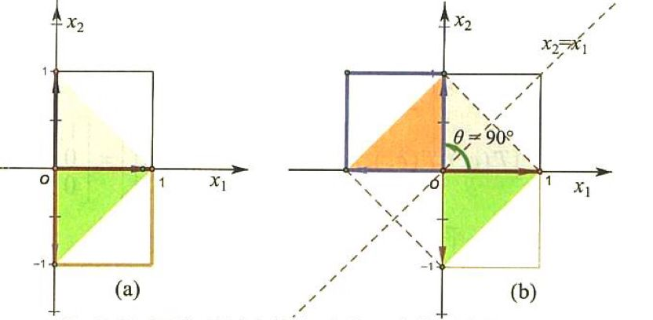
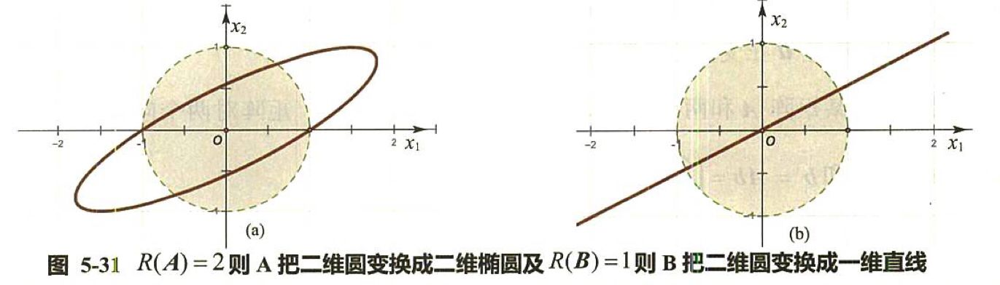
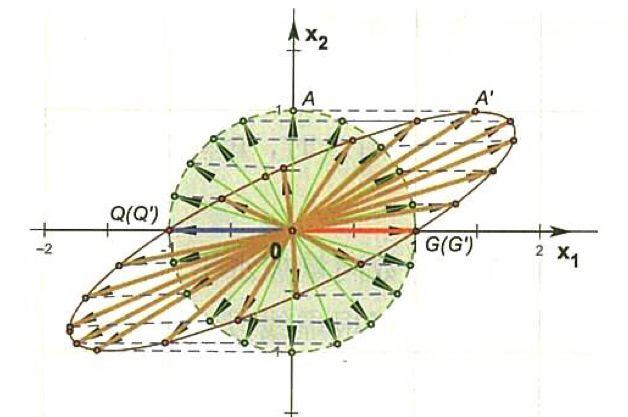
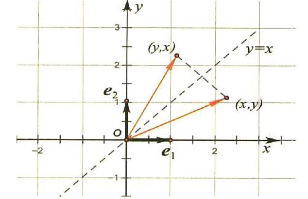
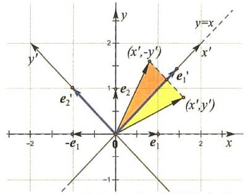

# 奇异值分解

奇异值分解是一种矩阵因子分解方法，是线性代数的内容，被引入到机器学习中。

## 基础知识

* 特征值和特征向量

  设$A$是$n$阶矩阵，如果数$\lambda$和$n$维非零列向量$x$使关系式$Ax=\lambda x$成立。那么，这样的数$\lambda$被称为矩阵$A$的特征值，非零向量$x$被称为矩阵$A$对应于特征值$\lambda$的特征向量。

* 矩阵与向量乘法的几何意义

  矩阵与向量的乘积比如$Ax$表现为矩阵$A$对一个向量$x$作用的结果，其作用的主要过程是对一个向量进行旋转和缩放的综合过程（线性变换）。一个$m$行$n$列的矩阵$A_{m\times n}$就是一个$R^n\rightarrow R^m$上的线性变换，或者说，矩阵$A_{m\times n}$把一个$n$维空间的$n$维向量变换为$m$维空间的$m$维向量，**也就是把这个向量映射到矩阵的列空间中去。**
  $$
  \begin{aligned}A\cdot d
  &=\begin{bmatrix}
  a_1&a_2&a_3\\
  b_1&b_2&b_3\\
  c_1&c_2&c_3\\
  \end{bmatrix}
  \begin{bmatrix}
  d_1\\
  d_2\\
  d_3\\
  \end{bmatrix}
  =\begin{bmatrix}
  a_1&a_2&a_3\\
  b_1&b_2&b_3\\
  c_1&c_2&c_3\\
  \end{bmatrix}
  \left(d_1\begin{bmatrix}
  1\\
  0\\
  0\\
  \end{bmatrix}
  +d_2\begin{bmatrix}
  0\\
  1\\
  0\\
  \end{bmatrix}
  +d_3\begin{bmatrix}
  0\\
  0\\
  1\\
  \end{bmatrix}
  \right)
  \\&=d_1\begin{bmatrix}
  a_1&a_2&a_3\\
  b_1&b_2&b_3\\
  c_1&c_2&c_3\\
  \end{bmatrix}
  \begin{bmatrix}
  1\\
  0\\
  0\\
  \end{bmatrix}
  +d_2\begin{bmatrix}
  a_1&a_2&a_3\\
  b_1&b_2&b_3\\
  c_1&c_2&c_3\\
  \end{bmatrix}
  \begin{bmatrix}
  0\\
  1\\
  0\\
  \end{bmatrix}
  +d_3\begin{bmatrix}
  a_1&a_2&a_3\\
  b_1&b_2&b_3\\
  c_1&c_2&c_3\\
  \end{bmatrix}
  \begin{bmatrix}
  0\\
  0\\
  1\\
  \end{bmatrix}\\
  &=d_1\begin{bmatrix}
  a_1\\
  b_1\\
  c_1\\
  \end{bmatrix}
  +d_2\begin{bmatrix}
  a_2\\
  b_2\\
  c_2\\
  \end{bmatrix}
  +d_3\begin{bmatrix}
  a_3\\
  b_3\\
  c_3\\
  \end{bmatrix}
  \end{aligned}
  $$
  由上式可以看出，矩阵$A$对任意向量$d$的乘积可以分为三个操作过程：首先，矩阵$A$分别对**单位向量$(i,j,k)$进行伸缩旋转变换**得到三个向量；然后对这三个向量$(Ai,Aj,Ak)$再分别进行伸缩变换，得到$d_1,Ai,d_2Aj,d_3Ak$；最后这三个向量相加得到的就是$A\cdot d$。

  如果想象成向量不动，而坐标轴变化的话。那么也就是说该向量在标准坐标系下的坐标（就是在每个坐标轴上的投影）$(f_1,f_2,f_3)^T$与在$A$坐标系下的坐标$(d_1,d_2,d_3)$有如下关系：
  $$
  \begin{aligned}
  \begin{bmatrix}
  f_1\\
  f_2\\
  f_3\\
  \end{bmatrix}
  &=\begin{bmatrix}
  a_1&a_2&a_3\\
  b_1&b_2&b_3\\
  c_1&c_2&c_3\\
  \end{bmatrix}
  \begin{bmatrix}
  d_1\\
  d_2\\
  d_3\\
  \end{bmatrix}
  \end{aligned}
  $$

* 矩阵乘法的几何意义

  

对于第一象限的正方形实施关于$x_1$轴的反射变换$A=\begin{bmatrix}1&0\\0&-1\end{bmatrix}$，再实施关于标准轴$x_2=x_1$的反射变换$B=\begin{bmatrix}0&1\\1&0\end{bmatrix}$，得到的图形正好是将原来的正方形逆时针旋转$90^\circ$所得到的。这一结果用矩阵运算表示为$BA=\begin{bmatrix}0&1\\1&0\end{bmatrix}\begin{bmatrix}1&0\\0&-1\end{bmatrix}=\begin{bmatrix}0&-1\\1&0\end{bmatrix}=C$，新矩阵表示的就是原来两个矩阵表示的变换的复合。但是需要注意矩阵乘法不满足交换律，也不满足消去律。

* 矩阵秩的几何意义

  **任何矩阵行空间的维数等于列空间的维数等于这个矩阵的秩。**下面来看矩阵的秩对图形变换的影响。矩阵乘以一个向量就是把这个向量映射到列空间中去，同时矩阵的秩也就是其列空间的维数，因此变换后的图形维最大不能超过列空间的维数。

  对于二阶矩阵$A=\begin{bmatrix}1&1.5\\0&1\end{bmatrix}$和$B=\begin{bmatrix}1&2\\0.5&1\end{bmatrix}$，对单位圆上的向量变化图形如图所示：

  

* 矩阵的特征值和特征向量的几何意义

  如果矩阵对某些向量只发生伸缩变换，不对这些向量产生旋转效果，那么这些向量就是这个矩阵的特征向量，伸缩比例就是特征值；如果伸缩的比例值是负值，原向量的方向改变为反方向，原向量仍然是这个矩阵的特征向量。

  

  从图中我们可以看出大部分的向量都发生了旋转和伸缩变换，只有$x_1$轴上的向量没有变换（准确地来说是没有旋转而且伸缩比例为$1$）。所以矩阵有一个特征值$1$和两个方向的特征向量$[1,0],[-1,0]$。

* 相似矩阵

  相似方阵$\boldsymbol A$和$\boldsymbol B$满足$\boldsymbol A=\boldsymbol P\boldsymbol B\boldsymbol P^{-1}$，那么矩阵$\boldsymbol A$变换到矩阵$\boldsymbol B$的过程，被称为矩阵的相似变换。实际上，相似矩阵$\boldsymbol A$和$\boldsymbol B$表示的是**同一个线性变换**在**两个不同的基**下的表示矩阵，而可逆矩阵$\boldsymbol P$就是**基变换矩阵**。我们知道，对于一个线性变换，只要选定一组基，那么就可以找到一个确定的矩阵来描述这个线性变换，换一组基，就得到另一个不同的矩阵。所有这些矩阵都是这同一个线性变换的描述，但又不是线性变换本身。

  例题：设有一个线性变换：它将任意向量$\begin{bmatrix}x\\y\end{bmatrix}$映射为关于$45^\circ$直线的镜像$\begin{bmatrix}y\\x\end{bmatrix}$。

  

取直角坐标系，其标准正交基$e_1=\begin{bmatrix}1\\0\end{bmatrix}$和$e_1=\begin{bmatrix}0\\1\end{bmatrix}$，根据线性变换的矩阵定理，在这组基下的相应的变换矩阵$A$就是$\begin{bmatrix}0&1\\1&0\end{bmatrix}$。

下面我们找一组新的基底:$e_1'=\begin{bmatrix}1\\1\end{bmatrix}$，$e_2'=\begin{bmatrix}-1\\1\end{bmatrix}$。则新的基与旧基的转换关系为
$$
\left\{
\begin{aligned}
e_1'=e_1+e_2\\
e_2'=-e_1+e_2\\
\end{aligned}
\right.
$$
将其改写为
$$
(e_1',e_2')=(e_1,e_2)\begin{bmatrix}1&-1\\1&1\end{bmatrix}
$$
在这组新的基上，线性变换实际上被简化了，变换后的向量与变换前的向量坐标关系为$\begin{bmatrix}x'\\-y'\end{bmatrix}=\begin{bmatrix}1&0\\0&-1\end{bmatrix}\begin{bmatrix}x'\\y'\end{bmatrix}$

所以此时的线性变换矩阵为$B=\begin{bmatrix}1&0\\0&-1 \end{bmatrix}$。

## 特征值分解

特征值分解是将矩阵$\boldsymbol A$分解成$\boldsymbol A=\boldsymbol Q\boldsymbol \varSigma \boldsymbol Q^{-1}$的形式，前提是$\boldsymbol A$必须是$n$阶方阵且可对角化，$\boldsymbol A$和$\boldsymbol \varSigma$被称为相似矩阵。

公式中，$\boldsymbol Q$是$\boldsymbol A$的特征向量组成的矩阵，$\boldsymbol \varSigma$是对角阵，其主对角线上的元素是$\boldsymbol A$的特征值。$\boldsymbol Q$中的第$i$个列向量与$\boldsymbol \varSigma$的第$i$行对角线上的特征值相对应。
$$
\boldsymbol A=\begin{bmatrix}
4&2\\
1&5
\end{bmatrix}=\begin{bmatrix}
1&-2\\
1&1
\end{bmatrix}\times\begin{bmatrix}
6&0\\
0&3
\end{bmatrix}
\times\begin{bmatrix}
\dfrac{1}{3}&\dfrac{2}{3}\\
-\dfrac{1}{3}&\dfrac{1}{3}
\end{bmatrix}
$$

## 奇异值分解的定义与性质

特征值分解仅适用于提取方阵特征，但在实际应用中，大部分数据对应的矩阵都不是方阵。奇异值分解是将任意较复杂 的矩阵用更小更简单的$3$个子矩阵的相乘表示。

### 定义

矩阵的奇异值分解是指，将一个非$0$的$m\times n$的实矩阵$\boldsymbol A,\ \boldsymbol A\in R^{m\times n}$，表示为以下三个实矩阵的乘积：
$$
\boldsymbol A=\boldsymbol U\boldsymbol \varSigma \boldsymbol V^T
$$
其中$\boldsymbol U$是**$m$阶正交矩阵**，$\boldsymbol V$是**$n$阶正交矩阵**，$\boldsymbol \varSigma$是由降序排列的非负的对角线元素组成的**$m\times n$矩形对角矩阵**。也即：
$$
\begin{aligned}
&\boldsymbol U\boldsymbol U^T=\boldsymbol I\\
&\boldsymbol V\boldsymbol V^T=\boldsymbol I\\
&\boldsymbol \varSigma=diag(\sigma_1,\sigma_2\cdots,\sigma_p)\\
&\sigma_1\geqslant\sigma_2\cdots\geqslant\sigma_p\geqslant0\\
&p=min(m,n)
\end{aligned}
$$
**奇异值分解并不要求矩阵$A$是方阵，事实上矩阵的奇异值分解可以看做是方阵对角化的推广。**

### 奇异值分解基本定理

**定理：**若$\boldsymbol A$为一$m\times n$实矩阵，则$\boldsymbol A$的奇异值分解存在：$\boldsymbol A=\boldsymbol U\boldsymbol \varSigma \boldsymbol V^T$，其中$\boldsymbol U$是**$m$阶正交矩阵**，$\boldsymbol V$是**$n$阶正交矩阵**，$\boldsymbol \varSigma$是由降序排列的非负的对角线元素组成的**$m\times n$矩形对角矩阵**。

**构造性证明：**

1. 确定$V$和$\varSigma$：

   $\boldsymbol A^T\boldsymbol A$是$n$阶实对称矩阵，所以存在一个$n$阶正交矩阵$\boldsymbol V$实现$\boldsymbol A^T\boldsymbol A$的对角化，即有$\boldsymbol V^T(\boldsymbol A^T\boldsymbol A)\boldsymbol V=\boldsymbol \varLambda$。其中$\boldsymbol A^T\boldsymbol A$的特征值都是非负的。事实上，令$\lambda$是其一个特征值，$\boldsymbol x$是对应的特征向量，则
   $$
   \|\boldsymbol A\boldsymbol x\|^2=(\boldsymbol A\boldsymbol x)^T(\boldsymbol A\boldsymbol x)=\boldsymbol x^T\boldsymbol A^T\boldsymbol A\boldsymbol x=\lambda \boldsymbol x^T\boldsymbol x=\lambda \|\boldsymbol x\|^2
   $$
   于是有$\lambda=\dfrac{\|\boldsymbol A\boldsymbol x\|^2}{\|\boldsymbol x\|^2}>0$。

   假定正交矩阵$\boldsymbol V$的列的排列使得对应的特征值形成降序排列$\lambda_1\geqslant\lambda_2\geqslant\cdots\lambda_n\geqslant0$，计算特征值的平方根（**实际上就是矩阵$A$的奇异值**）$\sigma_j=\sqrt{\lambda_j}$。设矩阵$\boldsymbol A$的秩是$r$，则矩阵$\boldsymbol A^T\boldsymbol A$的秩也是$r$。由于$\boldsymbol A^T\boldsymbol A$是对称矩阵，它的秩等于正的特征值的个数**（可能有相同的）**。所以有$\lambda_1\geqslant\lambda_2\geqslant\cdots\lambda_r>0,\lambda_{r+1}=\lambda_{r+2}=\cdots\lambda_n=0$，进一步地$\sigma_1\geqslant\sigma_2\geqslant\cdots\sigma_r>0,\sigma_{r+1}=\sigma_{r+2}=\cdots\sigma_n=0$，那么$\boldsymbol V$可以表示为$\boldsymbol V=[\boldsymbol V_1\ \boldsymbol V_2]$，其中$\boldsymbol V_1=[v_1,v_2,\cdots v_r]$是正特征值对应的特征向量，$\boldsymbol V_2=[v_{r+1},v_{r+2},\cdots v_{n}]$为特征值$0$对应的特征向量。

   **这就是矩阵$\boldsymbol A$的奇异值分解中的$n$阶正交矩阵$\boldsymbol V$。**

   令
   $$
   \boldsymbol \varSigma_1=\begin{bmatrix}
   \sigma_1&&&\\
   &\sigma_2&&\\
   &&\ddots&\\
   &&&\sigma_r\\
   \end{bmatrix}
   $$
   **所以矩阵$A$的奇异值分解中的$m\times n$矩形对角矩阵$\varSigma$如下：**
   $$
   \boldsymbol \varSigma=\begin{bmatrix}
   \boldsymbol \varSigma_1&0\\
   0&0
   \end{bmatrix}
   $$
   ***

   下面推出后面要用到的一个公式。由以上知，$\boldsymbol V_2$的列向量就是$\boldsymbol A^T\boldsymbol A$对应于特征值为$0$的特征向量，因此$\boldsymbol A^T\boldsymbol A\boldsymbol v_j=\boldsymbol 0,\quad j=r+1,\cdots,n$。因此有$\boldsymbol A\boldsymbol V_2=\boldsymbol 0$，而$\boldsymbol I=\boldsymbol V\boldsymbol V^T=[\boldsymbol V_1\ \boldsymbol V_2][\boldsymbol V_1\ \boldsymbol V_2]^T=\boldsymbol V_1\boldsymbol V_1^T+\boldsymbol V_2\boldsymbol V_2^T$，所以得到$\boldsymbol A=\boldsymbol A\boldsymbol I=\boldsymbol A\boldsymbol V_1\boldsymbol V_1^T+\boldsymbol A\boldsymbol V_2\boldsymbol V_2^T=\boldsymbol A\boldsymbol V_1\boldsymbol V_1^T$。

2. 确定$\boldsymbol U$

   令
   $$
   \boldsymbol u_j=\dfrac{1}{\sigma_j}\boldsymbol A\boldsymbol v_j,j=1,2,\cdots,r\\
   \boldsymbol U_1=[\boldsymbol u_1,\boldsymbol u_2\cdots,\boldsymbol u_r]
   $$
   有$\boldsymbol A\boldsymbol V_1=\boldsymbol U_1\boldsymbol \varSigma_1$。

   $\boldsymbol U_1$的列向量构成了一组标准的正交基，证明如下：
   $$
   \begin{aligned}
   \boldsymbol u_i^T\boldsymbol u_j&=(\dfrac{1}{\sigma_i}\boldsymbol v_i^T\boldsymbol A^T)(\dfrac{1}{\sigma_j}\boldsymbol A\boldsymbol v_j)\\
   &=\dfrac{1}{\sigma_i\sigma_j}\boldsymbol v_i^T(\boldsymbol A^T\boldsymbol A\boldsymbol v_j)\\
   &=\dfrac{\sigma_j}{\sigma_i}\boldsymbol v_i^T\boldsymbol v_j\\
   &=\delta_{ij}
   \end{aligned}
   $$
   令$\boldsymbol U_2=\{\boldsymbol u_{r+1},\boldsymbol u_{r+2}\cdots \boldsymbol u_m\}$为$A^T$的零空间$N(\boldsymbol A^T)$的一组标准正交基，且令$\boldsymbol U=\{\boldsymbol U_1\ \boldsymbol U_2\}$

3. 证明以上的$\boldsymbol U\boldsymbol \varSigma\boldsymbol  V^T=\boldsymbol A$

## 奇异值分解的计算

求矩阵
$$
\boldsymbol A=\begin{bmatrix}
1&1\\
2&2\\
0&0
\end{bmatrix}
$$
的奇异值分解。

1. **求矩阵$\boldsymbol A^T\boldsymbol A$的特征值和特征向量。**
   $$
   \boldsymbol A=\begin{bmatrix}
   5&5\\
   5&5\\
   \end{bmatrix}
   $$
   特征值$\lambda$和特征向量$\boldsymbol x$满足方程
   $$
   (\boldsymbol A^T\boldsymbol A-\lambda \boldsymbol I)\boldsymbol x=0
   $$
   即为齐次线性方程组
   $$
   \left\{
   \begin{aligned}
   (5-\lambda)x_1+5x_2=0\\
   5x_1+(5-\lambda)x_2=0\\
   \end{aligned}
   \right.
   $$
   解得到$\lambda_1=10,\lambda_2=0$。分别代入原方程可得对应的**单位特征向量**为$\boldsymbol v_1=[\dfrac{1}{\sqrt{2}}\ \dfrac{1}{\sqrt{2}} ]^T,\boldsymbol v_2=[\dfrac{1}{\sqrt{2}}\  -\dfrac{1}{\sqrt{2}} ]^T$。

2. 求正交矩阵$\boldsymbol V$和对角矩阵$\boldsymbol \varSigma$。

   由上一步得到
   $$
   \boldsymbol V=\begin{bmatrix}
   \dfrac{1}{\sqrt{2}}&\dfrac{1}{\sqrt{2}}\\
   \dfrac{1}{\sqrt{2}}&-\dfrac{1}{\sqrt{2}}\\
   \end{bmatrix}
   $$

   $$
   \boldsymbol \varSigma=\begin{bmatrix}
   \sqrt{10}&0\\
   0&0\\
   0&0
   \end{bmatrix}
   $$

   **注意要注意$\boldsymbol \varSigma$的形状，必要时加上$0$行向量使其能与$\boldsymbol U,\boldsymbol V$进行矩阵乘法。**

3. 求正交矩阵$\boldsymbol U$。

   基于矩阵$\boldsymbol A$的正奇异值计算得到列向量$\boldsymbol u_1$：
   $$
   \boldsymbol u_1=\dfrac{1}{\sigma_1}\boldsymbol A\boldsymbol v_1=\dfrac{1}{\sqrt{10}}
   \begin{bmatrix}
   1&1\\
   2&2\\
   0&0
   \end{bmatrix}
   \begin{bmatrix}
   \dfrac{1}{\sqrt{2}}\\
   \dfrac{1}{\sqrt{2}}
   \end{bmatrix}=
   \begin{bmatrix}
   \dfrac{1}{\sqrt{5}}\\
   \dfrac{2}{\sqrt{5}}\\
   0
   \end{bmatrix}
   $$
   列向量$\boldsymbol u_2,\boldsymbol u_3$是$A^T$的**零空间$N(\boldsymbol A^T)$的一组标准正交基**。即求解以下方程组
   $$
   \boldsymbol A^T\boldsymbol x=\begin{bmatrix}
   1&2&0\\
   1&2&0\\
   \end{bmatrix}
   \begin{bmatrix}
   x_1\\
   x_2\\
   x_3
   \end{bmatrix}=\begin{bmatrix}
   0\\
   0\\
   \end{bmatrix}
   $$
   即是解以下方程
   $$
   x_1+2x_2=0\\
   x_1+2x_2=0
   $$
   取$(x_2,x_3)$分别为$(1,0)$和$(0,1)$，得到$N(\boldsymbol A^T)$的基
   $$
   (-2,1,0)^T,(0,0,1)^T
   $$
   标准化之后得到
   $$
   \boldsymbol u_2=(-\dfrac{2}{\sqrt5},\dfrac{1}{\sqrt5},0),\boldsymbol u_3=(0,0,1)
   $$
   正交矩阵$\boldsymbol U$如下
   $$
   U=\begin{bmatrix}
   \dfrac{1}{\sqrt{5}}&-\dfrac{2}{\sqrt{5}}&0\\
   \dfrac{2}{\sqrt{5}}&\dfrac{1}{\sqrt{5}}&0\\
   0&0&1
   \end{bmatrix}
   $$

4. 综上所述
   $$
   A=U\varSigma V^T=\begin{bmatrix}
   \dfrac{1}{\sqrt{5}}&-\dfrac{2}{\sqrt{5}}&0\\
   \dfrac{2}{\sqrt{5}}&\dfrac{1}{\sqrt{5}}&0\\
   0&0&1
   \end{bmatrix}
   \begin{bmatrix}
   \sqrt{10}&0\\
   0&0\\
   0&0
   \end{bmatrix}
   \begin{bmatrix}
   \dfrac{1}{\sqrt{2}}&\dfrac{1}{\sqrt{2}}\\
   \dfrac{1}{\sqrt{2}}&-\dfrac{1}{\sqrt{2}}\\
   \end{bmatrix}
   =\begin{bmatrix}
   1&1\\
   2&2\\
   0&0
   \end{bmatrix}
   $$
   

### 紧奇异值分解与截断奇异值分解

给定一个$5\times 4$的矩阵$A$与它的**完全奇异值分解**：
$$
A=\begin{bmatrix}
1&0&0&0\\
0&0&0&4\\
0&3&0&0\\
0&0&0&0\\
2&0&0&0
\end{bmatrix}
=U\varSigma V^T=
\begin{bmatrix}
0&0&\sqrt{0.2}&0&\sqrt{0.8}\\
1&0&0&0&0\\
0&1&0&0&0\\
0&0&0&1&0\\
0&0&\sqrt{0.8}&0&\sqrt{0.2}\\
\end{bmatrix}
\begin{bmatrix}
4&0&0&0\\
0&3&0&0\\
0&0&\sqrt{5}&0\\
0&0&0&0\\
0&0&0&0\\
\end{bmatrix}
\begin{bmatrix}
0&0&0&1\\
0&1&0&0\\
1&0&0&0\\
0&0&1&0\\
\end{bmatrix}
$$

* **紧奇异值分解：**

  设有$m\times n$实矩阵$A$，其秩为$rank(A)=r,r\leqslant min(m,n)$，则称$U_r\varSigma_rV_r^T$为$A$的紧奇异值分解。$A=U\varSigma V^T$
  $$
  A=\begin{bmatrix}
  1&0&0&0\\
  0&0&0&4\\
  0&3&0&0\\
  0&0&0&0\\
  2&0&0&0
  \end{bmatrix}
  =U_r\varSigma_r V_r^T=
  \begin{bmatrix}
  0&0&\sqrt{0.2}\\
  1&0&0\\
  0&1&0\\
  0&0&0\\
  0&0&\sqrt{0.8}\\
  \end{bmatrix}
  \begin{bmatrix}
  4&0&0\\
  0&3&0\\
  0&0&\sqrt{5}\\
  \end{bmatrix}
  \begin{bmatrix}
  0&0&0&1\\
  0&1&0&0\\
  1&0&0&0\\
  \end{bmatrix}
  $$

* **截断奇异值分解：**

  设有$m\times n$实矩阵$A$，其秩为$rank(A)=r,r\leqslant min(m,n),0<k<r$，则称$U_k\varSigma_kV_k^T$为$A$的截断奇异值分解。$A\approx U\varSigma V^T$
  $$
  A=\begin{bmatrix}
  1&0&0&0\\
  0&0&0&4\\
  0&3&0&0\\
  0&0&0&0\\
  2&0&0&0
  \end{bmatrix}
  \approx U_k\varSigma_k V_k^T=
  \begin{bmatrix}
  0&0\\
  1&0\\
  0&1\\
  0&0\\
  0&0\\
  \end{bmatrix}
  \begin{bmatrix}
  4&0\\
  0&3\\
  \end{bmatrix}
  \begin{bmatrix}
  0&0&0&1\\
  0&1&0&0\\
  \end{bmatrix}
  =\begin{bmatrix}
  0&0&0&0\\
  0&0&0&4\\
  0&3&0&0\\
  0&0&0&0\\
  0&0&0&0\\
  \end{bmatrix}
  $$

可以看出紧奇异值分解对应着无损压缩，截断奇异值分解对应着有损压缩。

## 奇异值分解与矩阵近似

###  弗罗贝尼乌斯范数

矩阵的弗罗贝尼乌斯范数是向量的$L_2$范数的直接推广，对应着机器学习中的平方损失函数，定义如下：

设矩阵$A\in R^{m\times n},A=[a_{ij}]_{m\times n}$，定义矩阵$A$的**弗罗贝尼乌斯范数**为$\|A\|_F=\left(\sum\limits_{i=1}^m\sum\limits_{j=1}^n(a_{ij})^2\right)^{\frac{1}{2}}$。

设矩阵$A\in R^{m\times n}$，奇异值分解为$U\varSigma V^T$，其中$\varSigma=diag(\sigma_1,\sigma_2\cdots,\sigma_n)$，则
$$
\|A\|_F=(\sigma_1^2+\sigma_2^2+\cdots+\sigma_n^2)^{\frac{1}{2}}
$$
以上定理的证明仅仅用到正交变换不改变向量的长度，所以$\|A\|_F=\|U\varSigma V^T\|_F=\|\varSigma\|_F$。

### 矩阵的最优近似

在秩不超过$k$的$m\times n$的矩阵的集合中，存在矩阵$A$的弗罗贝尼乌斯范数意义下的最优近似矩阵$X$。而$A'=U\varSigma'V^T$是达到最优值的一个矩阵。

截断奇异值分解得到的矩阵的秩为$k$，通常小于原始矩阵的秩$r$，所以是由低秩矩阵实现了对原始矩阵的压缩。

### 矩阵的外积展开式

矩阵$A$的奇异值分解$U\varSigma V^T$也可以由外积形式表示。事实上，我们可以将$A$的奇异值分解看成矩阵$U\varSigma$和$V^T$的乘积，将$U\varSigma$按列分块，将$V^T$按行向量分块如下：
$$
U\varSigma=[\sigma_1u_1\quad \sigma_2u_2\quad\cdots \sigma_nu_n\ ]\\
V^T=\begin{bmatrix}
v_1^T\\
v_2^T\\
\vdots\\
v_n^T\\
\end{bmatrix}
$$
则$A=\sigma_1u_1v_1^T+\sigma_2u_2v_2^T+\cdots+\sigma_nu_nv_n^T=\sum\limits_{k=1}^n\sigma_ku_kv_k^T$。这就是$A$的外积展开式，其中$u_kv_k^T$为$m\times n$矩阵，是列向量$u_k$和行向量$v_k^T$的外积：
$$
u_iv_j^T=
\begin{bmatrix}
u_{1i}\\
u_{2i}\\
\vdots\\
u_{mi}\\
\end{bmatrix}
\begin{bmatrix}
v_{1j}&v_{2j}\cdots v_{nj}
\end{bmatrix}
=
\begin{bmatrix}
u_{1i}v_{1j}&u_{1i}v_{2j}\cdots& u_{1i}v_{nj}\\
u_{2i}v_{1j}&u_{2i}v_{2j}\cdots &u_{2i}v_{nj}\\
\vdots&\vdots&&\vdots\\
u_{mi}v_{1j}&u_{mi}v_{2j}\cdots &u_{mi}v_{nj}\\
\end{bmatrix}
$$
则我们可以定义秩为$n-1$的$A_{n-1}$如下：
$$
A_{n-1}=\sigma_1u_1v_1^T+\sigma_2u_2v_2^T+\cdots+\sigma_{n-1}u_{n-1}v_{n-1}^T=\sum\limits_{k=1}^{n-1}\sigma_ku_kv_k^T
$$
类似地我们可以定义秩为$k$的$A_{k}$如下：
$$
A_{n-1}=\sigma_1u_1v_1^T+\sigma_2u_2v_2^T+\cdots+\sigma_{k}u_{k}v_{k}^T
$$
并且该矩阵就是在弗罗贝尼乌斯范数意义下的$A$的最优近似矩阵，也就是截断奇异值分解。