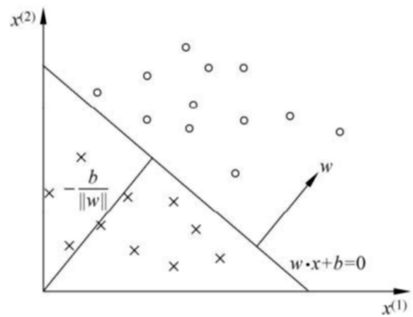
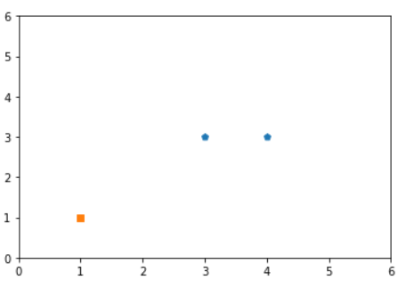
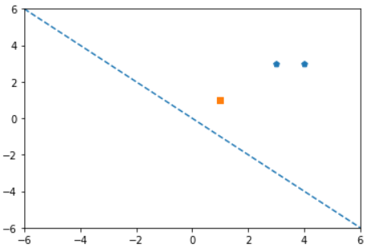
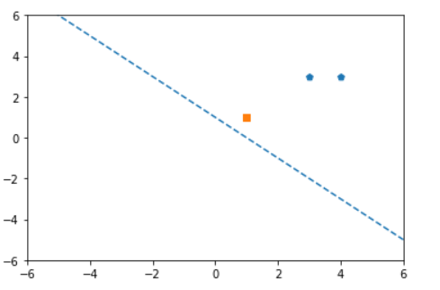
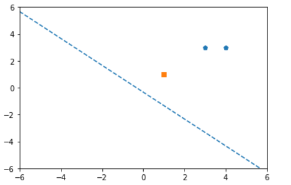
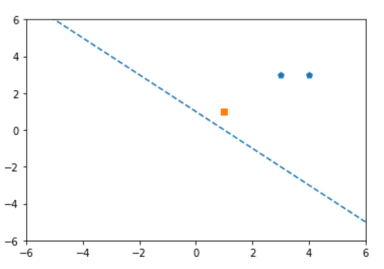
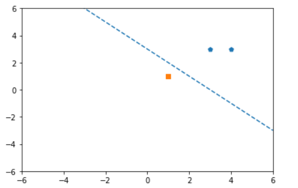
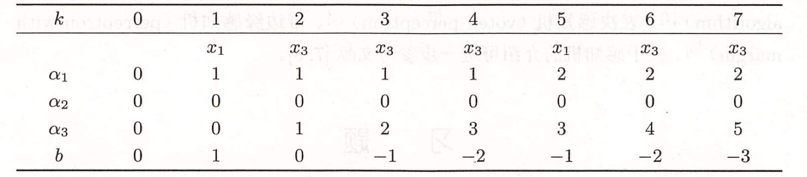

# 感知机

## 感知机模型

假设输入空间是$\cal{X}\sub R^n$，输出空间是$\cal Y=\{1,0\}$。输入$\boldsymbol x\in \cal X$表示实例的特征向量，对应于输入空间的点；输出$y \in \cal Y$表示实例的类别。由输入空间到输出空间的如下函数
$$
f(x)=sgn(\boldsymbol w^T\boldsymbol x+b)
$$
称为感知机。其中$\boldsymbol w$和$b$称为感知机模型参数。$sgn$是阶跃函数，即
$$
sgn(z)=\left\{
\begin{aligned}
1\quad z\geqslant0\\-1\quad z\leqslant0
\end{aligned}
\right.
$$

### 感知机的几何解释

线性方程$\boldsymbol w^T\boldsymbol x+b=0$对应于特征空间（线性空间）$R^n$中的一个超平面$S$，其中$\boldsymbol w$是超平面的法向量，$b$是超平面的截距。这个超平面将特征空间划分为两个部分。位于两边的点被分为正负两类，因此超平面$S$称为分离超平面。

## 感知机学习策略

假设训练数据集是线性可分的，（当训练集线性不可分时，感知机学习算法不收敛，迭代结果会发生震荡）我们需要确定一个学习策略，即定义（经验）**损失函数**并将损失函数极小化。

损失函数一个自然的选择就是误分类点的总数，但是这样损失函数不是$\boldsymbol w,b$的可导函数，不易优化。实际上，我们采用误分类点到超平面$S$的总距离作为损失函数。

我们知道输入空间$R^n$中任意一点$\boldsymbol x_0$到超平面$S$的距离为：$\dfrac{1}{\|\boldsymbol w\|}|\boldsymbol w\cdot \boldsymbol x_0+b|$。

我们观察到对于误分类的数据$(\boldsymbol x_i,j_i)$来说，$-y_i(\boldsymbol w\cdot \boldsymbol x_i+b)>0$，为了去掉不易优化的绝对值，我们可以将误分类点到超平面的距离化成这样的形式：$-\dfrac{1}{\|\boldsymbol w\|}y_i(\boldsymbol w\cdot \boldsymbol x_i+b)$。

这样假设误分类点集合为$M$，那么损失函数就为$-\dfrac{1}{\|\boldsymbol w\|}\sum\limits_{x_i\in M} y_i(\boldsymbol w\cdot \boldsymbol x_i+b)$。又因为我们假设数据是线性可分的，所以最后的误差肯定为$0$，也就是分子为$0$，所以实际上我们无需考虑分母，所以最后的损失函数为$-\sum\limits_{\boldsymbol x_i\in  M} y_i(\boldsymbol w\cdot x_i+b)$。

感知机的学习策略就是在假设空间中选取使损失函数最小的模型参数$\boldsymbol w,b$，得到感知机模型。

***

## 感知机学习算法

感知机学习问题就转化成了**求解损失函数的最优化问题**，数学上求函数的极小值就是求函数的一阶导数，但是感知机损失函数用统计求和函数表达，没办法计算解析解。

### 感知机学习算法的原始形式

首先，任意选取一个超平面$\boldsymbol w_0,b_0$，然后采用**随机梯度下降法**：不是选取所有误分类点的梯度下降，而是一次随机选取一个误分类点使其梯度下降。

损失函数对$\boldsymbol w,b$求导可得$\nabla _{\boldsymbol w}L(\boldsymbol w,b)=-\sum\limits_{\boldsymbol x_i\in M}y_i\boldsymbol x_i$，$\nabla _bL(\boldsymbol w,b)=-\sum\limits_{\boldsymbol x_i\in M}y_i$。

由于是随机选取一个误分类点$(\boldsymbol x_i,y_i)$，对$\boldsymbol w,b$进行更新：
$$
\boldsymbol w\leftarrow \boldsymbol w+\eta y_i\boldsymbol x_i\\
b\leftarrow b+\eta y_i
$$
**其中如果$y_i(\boldsymbol w\cdot \boldsymbol x_i+b)\leqslant 0$就是误分类点。**

这样通过迭代，可以期待损失函数$L(\boldsymbol w,b)$不断减小，直到为$0$。

* **例子：**

  训练数据集中正实例点为$x_1=(3,3)^T,x_2=(4,3)^T$，负实例点是$x_3=(1,1)^T$。试求解感知机模型$f(\boldsymbol x)=sign(\boldsymbol w\cdot \boldsymbol x+b)$。

  

  * 取初值，$\boldsymbol w_0=\boldsymbol 0,b_0=0$；并且设$\eta=1$；

  * 对样本$x_1=(3,3)^T$，$y_1(\boldsymbol w_0\cdot \boldsymbol x_1+b_1)=0$，没有正确分类，更新$\boldsymbol w,b$（**其实此时平面上所有点都没有被正确分类**）
    $$
    \boldsymbol w_1=\boldsymbol w_0+y_1\boldsymbol x_1=(3,3)^T,b_1=b_0+y_1=1
    $$
    得到线性模型$3x^{(1)}+3x^{(2)}+1$。

    

  * 对于$\boldsymbol x_1,\boldsymbol x_2$，$y_i(\boldsymbol w_1\cdot \boldsymbol x_i+b_1)>0$，正确分类。不修改$\boldsymbol w,b$。而$y_3(\boldsymbol w_1\cdot \boldsymbol x_3+b_1)=-7<0$，被误分类，更新$\boldsymbol w,b$.
    $$
    \boldsymbol w_2=\boldsymbol w_1+y_3\boldsymbol x_3=(3,3)^T+-1\times(1,1)^T=(2,2)^T,b_2=b_1+y_3=0
    $$
    

  * 对于$\boldsymbol x_1,\boldsymbol x_2$，$y_i(\boldsymbol w_1\cdot \boldsymbol x_i+b_1)>0$，正确分类。不修改$\boldsymbol w,b$。而$y_3(\boldsymbol w_2\cdot \boldsymbol x_3+b_1)=-4<0$，被误分类，更新$\boldsymbol w,b$.
    $$
    \boldsymbol w_3=\boldsymbol w_2+y_3\boldsymbol x_3=(2,2)^T+-1\times(1,1)^T=(1,1)^T,b_3=b_2+y_3=-1
    $$
    

    

  * 对于$\boldsymbol x_1,\boldsymbol x_2$，$y_i(\boldsymbol w_1\cdot \boldsymbol x_i+b_1)>0$，正确分类。不修改$\boldsymbol w,b$。而$y_3(\boldsymbol w_3\cdot \boldsymbol x_3+b_1)=-3<0$，被误分类，更新$\boldsymbol w,b$.
    $$
    \boldsymbol w_4=\boldsymbol w_3+y_3\boldsymbol x_3=(1,1)^T+-1\times(1,1)^T=(0,0)^T,b_4=b_3+y_3=-2
    $$

  * 对于样本$\boldsymbol x_1$， $y_1(\boldsymbol w_1\cdot \boldsymbol x_1+b_1)=-2<0$（实际上此时所有点都未被正确分类），被误分类，更新$\boldsymbol w,b$：
    $$
    \boldsymbol w_5=\boldsymbol w_4+y_1\boldsymbol x_1=(0,0)^T+(3,3)^T=(3,3)^T,b_5=b_4+y_1=-1
    $$
    

  * 对于$\boldsymbol x_1,\boldsymbol x_2$，$y_i(\boldsymbol w_1\cdot \boldsymbol x_i+b_1)>0$，正确分类。不修改$\boldsymbol w,b$。而$y_3(\boldsymbol w_1\cdot \boldsymbol x_3+b_1)=-5<0$，被误分类，更新$\boldsymbol w,b$.
    $$
    \boldsymbol w_6=\boldsymbol w_5+y_3\boldsymbol x_3=(3,3)^T+(-1)\times(1,1)^T=(2,2)^T,b_6=b_5+y_3=-2
    $$
    

  * 对于$\boldsymbol x_1,\boldsymbol x_2$，显然，$\boldsymbol y_i(w_1\cdot \boldsymbol x_i+b_1)>0$，正确分类。不修改$\boldsymbol w,b$。而$y_3(\boldsymbol w_1\cdot \boldsymbol x_3+b_1)=-2<0$，被误分类，更新$\boldsymbol w,b$.
    $$
    \boldsymbol w_7=\boldsymbol w_6+y_3\boldsymbol x_3=(2,2)^T+(-1)\times(1,1)^T=(1,1)^T,b_7=b_6+y_3=-3
    $$
    

  * 此时没有误分类点，结束。

值得注意的是，采取不同的初值或者误分类点，那么解可以不同。

***

### 感知机学习算法的对偶形式

**感知机学习算法的原始形式和对偶形式和支持向量机的原始形式和对偶形式相对应。**对偶形式的目的是降低每次迭代的运算量，但是并不是在任何情况下都能降低运算量，而是**在特征空间的维度远大于数据集大小时才起作用**。

基本想法是，将$\boldsymbol w,b$表示为实例$\boldsymbol x_i$和标记$y_i$的线性组合的形式，通过求解其系数而等价于求得$\boldsymbol w,b$。

我们假设初值为$\boldsymbol w_0=\boldsymbol 0,b_0=0$。则对于误分类的点，通过
$$
\boldsymbol w\leftarrow \boldsymbol w+\eta y_i\boldsymbol x_i\\
b\leftarrow b+\eta y_i
$$
逐步修改$\boldsymbol w,b$，设共修改$n$次，则$\boldsymbol w,b$关于$(\boldsymbol x_i,y_i)$的增量分别是$n_i\eta y_i\boldsymbol x_i$和$n_i\eta y_i$。为简单起见，令$\alpha_i=n_i\eta$这样，到最后学得模型时，$\boldsymbol w,b$分别变为
$$
\boldsymbol w=\sum_{i=1}^N \alpha_i y_i\boldsymbol x_i\\
b=\sum_{i=1}^N\alpha_iy_i
$$
所以最后输出的模型就变为$f(\boldsymbol x)=sign\left(\sum\limits_{j=1}^N\alpha_jy_j\boldsymbol x_j\cdot \boldsymbol x+b\right)$。令$\alpha=(\alpha_1,\alpha_2\cdots,\alpha_N)^T$。而中间确定误分类点也就变为$y_i\left(\sum\limits_{j=1}^N\alpha_jy_j\boldsymbol x_j\cdot \boldsymbol x_i+b\right)\leqslant0$。更新时我们不再直接更新$\boldsymbol w$，而是更新$\boldsymbol \alpha$。即$\alpha_i\leftarrow \alpha_i+\eta$。

我们可以发现，对偶形式的实例仅以内积的形式出现，也就是判别是否是误分类点时需要计算$\boldsymbol x_j\cdot \boldsymbol x_i$。

* 例子：数据同上

  * 取初值$\alpha=0,b=0,\eta=0$。

  * 计算$Gram$矩阵
    $$
    G=\begin{bmatrix}
    3&3\\
    4&3\\
    1&1
    \end{bmatrix}
    \times\begin{bmatrix}
    3&4&1\\
    3&3&1\\
    \end{bmatrix}
    =
    \begin{bmatrix}
    18&21&6\\
    21&25&7\\
    6&7&2
    \end{bmatrix}
    $$
  
* 对样本$x_1=(3,3)^T$，$y_i\left(\sum\limits_{j=1}^N\alpha_jy_jx_j\cdot x_i+b\right)=0$，没有正确分类，更新$\alpha_1,b$（其实此时平面上所有点都没有被正确分类）
    $$
    \alpha_1=\alpha_1+1=1,b=b+y_1=1
    $$
  
* 对于样本$x_1,x_2$，$y_i\left(\sum\limits_{j=1}^N\alpha_jy_jx_j\cdot x_i+b\right)>0$，都被正确分类，而对样本$x_3=(1,1)^T$，$y_i\left(\sum\limits_{j=1}^N\alpha_jy_jx_j\cdot x_i+b\right)=-7<0$，没有正确分类，更新$\alpha_3,b$：
    $$
    \alpha_3=\alpha_3+1=1,b=b+y_3=0
    $$
  
* 对于样本$x_1,x_2$，$y_i\left(\sum\limits_{j=1}^N\alpha_jy_jx_j\cdot x_i+b\right)>0$，都被正确分类，而对样本$x_3=(1,1)^T$，$y_i\left(\sum\limits_{j=1}^N\alpha_jy_jx_j\cdot x_i+b\right)=-4<0$，没有正确分类，更新$\alpha_3,b$：
    $$
    \alpha_3=\alpha_3+1=2,b=b+y_3=-1
    $$
  
* 以此类推，迭代过程如下表
  
  
  
* 则$w=2x_1+0x_2-5x_3=(1,1)^T，b=-3$。
  
  分离超平面就是$x^{(1)}+x^{(2)}-3=0$，感知机模型就是$f(x)=sign(x^{(1)}+x^{(2)}-3)$。

***

## 感知机收敛性

对于线性可分数据集感知机学习算法原始形式收敛，即经过有限次的迭代可以得到一个将训练数据集完全正确划分的分离超平面。

如果有一个超平面，能够将正类和负类分开，令这时候的目标权重为$\hat{w}_{opt}$，并且令$\|\hat{w}_{opt}\|=1$，则对于每个点，必然满足：
$$
y_{i}(\hat{w}_{opt}\cdot\hat{x})=y_i(w_{opt}\cdot x_{i}+b_{opt})>0
$$
所以便存在这样一个数
$$
\gamma=\mathop{min}\limits_{i}\{y_i(w_{opt}\cdot x_{i}+b_{opt})\}
$$
也即
$$
y_{i}(\hat{w}_{opt}\cdot\hat{x})=y_i(w_{opt}\cdot x_{i}+b_{opt})\geqslant \gamma
$$

* 令$\hat{w}_{k-1}=(w_{k-1}^T,b_{k-1})^T$是第$k$个误分类实例之前的扩充权重向量，则第$k$个误分类实例$(x_i,y_i)$的条件是
  $$
  y_{i}(\hat{w}_{k-1}\cdot\hat{x})=y_i(w_{k-1}\cdot x_{i}+b_{k-1})\leqslant0
  $$
  根据算法我们进行如下更新：
  $$
  w_k\leftarrow w_{k-1}+\eta y_ix_i\\
  b_k\leftarrow b_{k-1}+\eta y_i
  $$
  即
  $$
  \hat{w}_k=\hat{w}_{k-1}+\eta y_i\hat{x}_i
  $$
  所以
  $$
  \hat{w}_k\cdot \hat{w}_{opt}=\hat{w}_{k-1}\cdot \hat{w}_{opt}+\eta y_i\hat{w}_{opt}\cdot x_i\geqslant \hat{w}_{k-1}\cdot \hat{w}_{opt}+\eta \gamma
  $$
  递推可得：
  $$
  \hat{w}_k\cdot \hat{w}_{opt}\geqslant \hat{w}_{k-1}\cdot \hat{w}_{opt}+\eta \gamma\geqslant \hat{w}_{k-2}\cdot \hat{w}_{opt}+2\eta \gamma\geqslant\cdots\geqslant k\eta\gamma
  $$

  ***

  $$
  \begin{aligned}
  \|\hat{w}_k\|^2&=\|\hat{w}_{k-1}+\eta y_i\hat{x}_i\|^2\\
  &=\|\hat{w}_{k-1}\|^2+2\eta y_i\hat{w}_{k-1}\cdot\hat{x}_i+\eta^2\|\hat{x}_i\|^2\\
  &\leqslant\|\hat{w}_{k-1}\|^2+\eta^2\|\hat{x}_i\|^2\\
  &\leqslant\|\hat{w}_{k-1}\|^2+\eta^2R^2\\
  &\leqslant\|\hat{w}_{k-2}\|^2+2\eta^2R^2\leqslant \cdots\\
  &\leqslant k\eta^2R^2
  \end{aligned}
  $$

  其中$R=\mathop{max}\limits_{1\leqslant i\leqslant N}\|\hat{x}_i\|$。

  ***

  综合上述两个不等式可以得到：
  $$
  k\eta\gamma\leqslant \hat{w}_k\hat{w}_{opt}\leqslant\|\hat{w}_k\|\|\hat{w}_{opt}\|\leqslant\sqrt{k}\eta R
  $$
  化简得：
  $$
  k\leqslant({\dfrac{R}{\gamma}})^2
  $$
  上式表明，误分类的次数$k$是有上界的。

  
