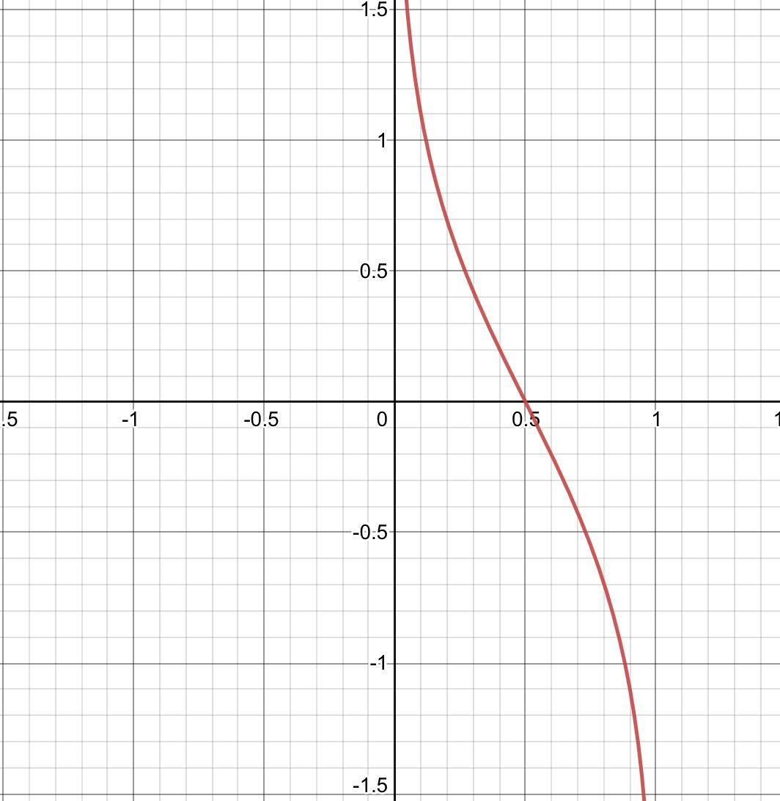
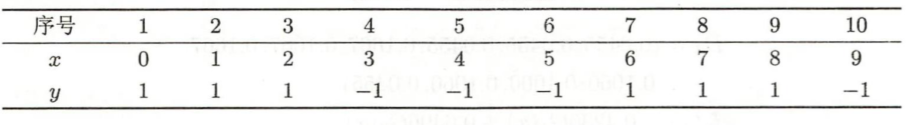

# 提升方法

大多数的提升方法都是改变训练数据的概率分布（训练数据的权值分布），针对不同的训练数据分布调用弱学习算法学习一系列弱分类器，然后组合这些弱分类器构成一个强分类器。

## $AdaBoost$算法

输入：训练数据集$T=\{(x_1,y_1),(x_2,y_2),\cdots,(x_N,y_N)\}$，其中$x_i\in {\cal{X}}\subset R^n,y_i\in {\cal{Y}}=\{+1,-1\}$；弱学习算法。

输出：最终分类器$G(x)$。

* 初始化训练数据的权值分布
  $$
  D_1=(w_{11},\cdots,w_{1i},\cdots w_{1N}),w_{1i}=\dfrac{1}{N},i=1,2,\cdots,N
  $$

* 对于得到分类器的个数$m=1,2,\cdots,M$

  * 使用具有权值分布的$D_m$的训练数据集学习，得到基本分类器：$G_m(x):\{{\cal X}\}\rightarrow \{+1,-1\}$

  * 计算$G_m(x)$在训练数据集上的分类误差率$e_m=\sum\limits_{i=1}^NP(G_m(x_i)\neq y_i)=\sum\limits_{i=1}^Nw_{mi}I(G_m(x_i)\neq y_i)$

  * 计算$G_m(x)$的系数$\alpha_m=\dfrac{1}{2}ln\dfrac{1-e_m}{e_m}$，所有系数之和不一定为$1$。

    

  * 更新训练数据集的权值分布
    $$
    D_{m+1}=(w_{m+1,1},\cdots,w_{m+1,i},\cdots w_{m+1,N})\\
    w_{m+1,i}=\dfrac{w_{mi}}{Z_m}e^{-\alpha_my_iG_m(x_i)}
    $$
    其中$Z_m$是规范化因子使得$D_{m+1}$构成一个概率分布。

* 构成基本分类器的线性组合$f(x)=\sum\limits_{m=1}^M\alpha_mG_m(x)$，得到最终分类器$G(x)=sign(f(x))$。

  

例子：

假设弱分类器由$x<v$或$x>v$产生，其阈值$v$使该分类器在训练集上分类器误差率最低。试用$AdaBoost$学习一个强分类器。

解：

* 初始化训练数据的权值分布
  $$
  D_1=(w_{11},w_{12},\cdots,w_{110})\\
  w_{1i}=0.1
  $$

* 对$m=1$

  * 在权值分布为$D_1$的训练数据上，阈值$v$取$2.5$时分类误差率最低，故基本分类器为
    $$
    G_1(x)=\left\{
    \begin{aligned}
    1,\quad x<2.5\\-1,\quad x>2.5
    \end{aligned}
    \right.
    $$

  * $G_1(x)$在训练集上的误差率为$e_1=P(G_1(x)\neq y_i)=0.3$

  * 计算$G_1(x)$的系数：$\alpha_1=\dfrac{1}{2}ln\dfrac{1-e_1}{e_1}=\dfrac{1}{2}ln\dfrac{1-0.3}{0.3}=0.4236$

  * 更新训练数据的权值分布：
    $$
    w_{2_i}=\dfrac{w_{1i}}{Z_1}e^{-\alpha_1y_iG_1(x_i)}\\
    D2=(0.07143,0.07143,0.07143,0.07143,0.07143,0.07143,0.16667,0.166670.16667,0,07143)
    $$

  取$f_1(x)=0.4236G_1(x)$，分类器$sign[f_1(x)]$在训练数据集上有$3$个误分类点。

* 对于$m=2$

  * 在权值分布为$D_2$的训练数据集上，阈值$v$是$8.5$时误差率最低，基本分类器为
    $$
    G_2(x)=\left\{
    \begin{aligned}
    1,\quad x<8.5\\-1,\quad x>8.5
    \end{aligned}
    \right.
    $$

  * $G_2(x)$在训练集上的误差率为$e_2=P(G_2(x)\neq y_i)=0.2143$

  * 计算$G_2(x)$的系数：$\alpha_2=\dfrac{1}{2}ln\dfrac{1-e_2}{e_2}=\dfrac{1}{2}ln\dfrac{1-0.2143}{0.2143}=0.6496$

  * 更新训练数据的权值分布：
    $$
    D2=(0.0455,0.0455,0.0455,0.1667,0.1667,0.1667,0.1060,0.1060,0.1060,,0.0455)
    $$

  取$f_2(x)=0.4236G_1(x)+0.6496G_2(x)$，分类器$sign[f_2(x)]$在训练数据集上有$3$个误分类点。

* 对于$m=3$

  * 在权值分布为$D_3$的训练数据上，阈值$v$是$5.5$时分类误差率最低，基本分类器为

  $$
  G_3(x)=\left\{
  \begin{aligned}
  1,\quad x<5.5\\-1,\quad x>5.5
  \end{aligned}
  \right.
  $$

  * $G_3(x)$在训练集上的误差率为$e_3=P(G_3(x)\neq y_i)=0.1820$

  * 计算$G_3(x)$的系数：$\alpha_3=\dfrac{1}{2}ln\dfrac{1-e_3}{e_3}=\dfrac{1}{2}ln\dfrac{1-0.1820}{0.1820}=0.7514$

  * 更新训练数据的权值分布：
    $$
    D_2=(0.125,0.125,0.125,0.102,0.102,0.102,0.065,0.065,0.065,0.125)
    $$
    于是得到：
    $$
    f_3(x)=0.4236G_1(x)+0.6496G_2(x)+0.7514G_3(x)
    $$
    分类器$sign[f_3(x)]$在训练数据集上有$0$个误分类点。

取最终的分类器为$sign(f_3(x))$。