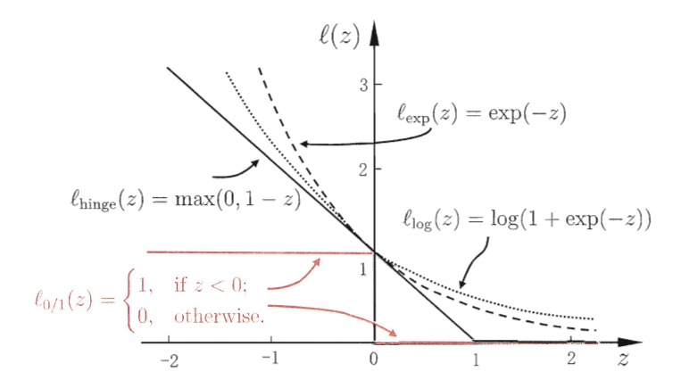

# 
支持向量机

**“这要从1989年说起，我那时正在研究神经网络和核方法的性能对比，直到我的丈夫决定使用Vladimir的算法，SVM就诞生了。”**

​                                                                                                                                                                                       ——Isabelle Guyon

## 
最大间隔分类器

***

### 超平面

***

#### 超平面是什么

* 维基百科定义：*In geometry a **hyperplane** is a subspace of one dimension less than its ambient space。*

  中文即是在几何中，超平面指的是比所处空间少一个维度的子空间。

  * $0$维的点可以把$1$维的线分成两部分。

    

  * $1$维的线可以把$2$维的面分成两部分。

    

    

  * $2$维的面可以把$3$维的体分成两部分。

  

  

  依此类推，$n-1$维的子空间可以把$n$维空间分成两部分。所以，超平面就是这个$n-1$维子空间，它就像$3$维空间中的平面，可以用来分割$n$维空间。

* 我们生活在$3$维空间，并把$2$维空间起名为“平面”，用来分割$3$维空间。对于更高维的空间$n$，既然可以被$n-1$维的空间进行分割，类似于三维空间的平面，而我们又没办法想象它的样子，也不好一一命名，不妨干脆就叫“超平面”，既简单，也比较直观，方便理解。

  所以，这个**超**的含义，更多的应该是**高维**。

***

#### 超平面的公式

* **对于一个$n$维空间，超平面应该如何表示？**

  设$\boldsymbol x_0$为超平面上的点，$\boldsymbol{w}(weight)$为超平面的法向量$(w_1,w_2\cdots w_m)$，**决定了超平面的方向**。超平面上任何一点$\boldsymbol{x}(x_1,x_2\cdots x_m)$，有
  $$
  \boldsymbol w^T\cdot(\boldsymbol x-\boldsymbol x_0)=\boldsymbol w^T\cdot \boldsymbol x-\boldsymbol w^T\cdot \boldsymbol x_0=0
  $$
  令$-\boldsymbol w^T\cdot \boldsymbol x_0=b$作为位移项$(bias)$，**决定了超平面与原点之间的距离**。则有$\boldsymbol w^T\cdot \boldsymbol x+b=0$。这就是超平面的公式。
  
  * **性质1：和法向量同向的点代入超平面方程恒大于0，否则小于等于0。**
  * **性质2：等倍缩放$\boldsymbol w$和$b$，超平面不变。**

#### 点到超平面的距离

*假设上图中横直线为超平面的横截面。*

上图中$\boldsymbol{x}$是平面外一点。我们要求的距离为$d$，也就是红色的线段。根据三角函数可以得：$  cos\theta=\dfrac{d}{\boldsymbol{\|A\|}}=\dfrac{d}{\|\boldsymbol x-\boldsymbol x'\|}$（空间中一点向超平面作垂线，$\theta$只能是锐角，不用担心正负。其中$\boldsymbol{x,x'}$分别代表向量$\overrightarrow{Ox},\overrightarrow{Ox'}$）。又因为$d$肯定和法向量平行，所以这样来算夹角：$|\boldsymbol w^T(\boldsymbol x-\boldsymbol x')|=\|\boldsymbol{w^T}\|\cdot\|\boldsymbol x-\boldsymbol x'\|\cdot cos\theta$。（因为法向量可能反向，所以给等式左边加上绝对值）。联立两个式子，即得$d=\dfrac{|\boldsymbol w^T(\boldsymbol x-\boldsymbol x')|}{\|\boldsymbol w^T\|}=\dfrac{|\boldsymbol w^T\boldsymbol x-\boldsymbol w^T\boldsymbol x'|}{\|\boldsymbol w^T\|}$，（利用投影的知识，可以一步得到此式子）因为$\boldsymbol x'$在超平面内，$\boldsymbol w^T\boldsymbol x'=-b$，于是最后得到的任意点到超平面的距离公式为$d=\dfrac{|\boldsymbol w^T\boldsymbol x+b|}{\|\boldsymbol w^T\|}$。

***

### 最大间隔分类器

***

支持向量机中最简单也是最早提出的模型是**最大间隔分类器**。它只能用于特征空间中线性可分的数据，因此不能再现实世界中的许多情况使用。它是最简单的算法，并且是更加复杂的支持向量机算法的主要模块，是分析和构造更加复杂的支持向量机的起点。

***

#### 原问题

通常来说，如果数据可以被超平面分隔开，那么事实上存在无数个这样的超平面（可以通过一个超平面平移、旋转得到）。我们要寻找一个方法从无数个超平面中合理地选出一个。

一个很自然的方法就是最大间隔超平面（最优分离超平面），**最大间隔超平面**就是离训练样本最远的那个分割超平面（此处的间隔是几何间隔，下面讲）。也就是说，首先计算每个训练样本到一个特定分隔超平面的垂直距离，这些距离的最小值就是训练样本与分割超平面的距离，这个距离被称作**间隔**。**最大间隔分类器**，就是用**最大间隔超平面**来判断测试样本落在哪一侧来测试样本的类别归属的分类器。

从某种意义上说，最大间隔超平面是能够插入两个类别之间的最宽的“平板”的**中线**。上图中，有三个样本点到最大间隔超平面的距离是一样的，并且都落在虚线上，虚线表明了（“平板”）间隔的宽度。这三个样本点就被称为**支持向量**，它们确实是$n$维空间中的向量，并且它们“支持”着最大间隔超平面，因为这三个点的样本稍微改变，最大间隔超平面也会随之移动。

* **重要性质：最大间隔超平面只由支持向量决定，与其他的样本点无关。**

***

##### 间隔

**函数间隔：**给定数据集$D={(\boldsymbol x_1,y_1),(\boldsymbol x_2,y_2),\cdots(\boldsymbol x_m,y_m)}$，$y_i\in{(-1,+1)}$和超平面$\boldsymbol w^T\cdot \boldsymbol x+b=0$。**定义**超平面关于样本$(\boldsymbol x_i,y_i)$的函数间隔为$\hat{\gamma_i}=y_i(\boldsymbol w^T\cdot \boldsymbol x_i+b)$。值得指出的是，感知机只需要关注函数间隔即可。**定义**超平面关于数据集的函数间隔为所有样本函数间隔的最小值，即$\hat{\gamma}=\mathop{min}\limits_{1,2\cdots m}\hat{\gamma_i}$。

* 如果分割超平面穿过正样本或者负样本，即存在分类错误的点。那么此时样本的函数间隔$\hat{\gamma}<0$。

* 假设可以构建一个超平面，把类别标签不同的训练样本分割开来。则分割超平面具有如下性质，即对于样本$(\boldsymbol{x_i},y_i)$：

$$
\left\{
\begin{aligned}
\boldsymbol w^T\boldsymbol x_i+b > 0 &&  y_i=+1\\
\boldsymbol w^T\boldsymbol x_i+b < 0&& y_i=-1
\end{aligned}
\right.
$$
​	等价于对于所有样本$y_i(\boldsymbol w^T\cdot\boldsymbol x_i+b)>0$，也即函数间隔$\hat{\gamma}>0$：

​		*1.* 如果分割超平面存在，就可以用它来构造分类器：**测试样本会被判定为哪个类别完全取决于它落在分割超平面的哪一侧。**令$f(\boldsymbol x)=\boldsymbol w^T\cdot \boldsymbol x+b$，则如果$f(\boldsymbol x)$的符号为正，则测试样本就被分入$1$类；如果$f(\boldsymbol x)$的符号为负，则测试样本就被分入$-1$类。

​		*2.* $f(\boldsymbol x)$值的大小可以衡量置信程度。如果$f(\boldsymbol x)$的值距离$0$很远，即$\boldsymbol x$距离分割超平面很远，我们非常确信对$\boldsymbol x$的类别归属的判断。相反，如果$f(\boldsymbol x)$的值很接近$0$，即$\boldsymbol x$就落在分割超平面周围，我们就更加不确定对$\boldsymbol x$的类别归属判断是否正确。

***

所以我们可以通过求$max(\hat{\gamma})$来求得使样本完全正确分类的超平面。但是离完美分类器还有两个问题：

* **问题1：**函数间隔越大，代表我们对于分类的结果非常确定。我们希望函数间隔越大越好。但是其实**我们可以在不改变这个超平面的情况下可以让函数间隔任意大。**因为由函数间隔的公式以及超平面性质$2$可以看出，只要等比例放大$\boldsymbol{w}$和$b$即可使函数间隔无限大。
* **问题2：我们没有采取任何措施，使得求出来的超平面在正负样本正中间。**

***

**几何间隔：定义**超平面关于样本$(\boldsymbol{x_i},y_i)$的几何间隔为$\gamma_i=\dfrac{\hat{\gamma_i}}{\|\boldsymbol w\|}$。**定义**超平面关于数据集的几何间隔为超平面关于数据集中所有样本的几何间隔最小值，也即$\gamma=\mathop{min}\limits_{1,2,\dots m}\gamma_i=\dfrac{\hat{\gamma}}{\|\boldsymbol w\|}$。

现在我们只需对$\gamma$求最大值，就能解决上述两个问题。说明如下：

* **问题1：**对于$\gamma$而言，等比例放大$\boldsymbol{w}$和$b$，会导致$\dfrac{\hat{\gamma}}{\|\boldsymbol w\|}$分子分母同时放大，所以会相互抵消。
* **问题2：**将$\dfrac{\hat{\gamma}}{\|\boldsymbol w\|}$展开为$\dfrac{y_{min}(\boldsymbol w^T\cdot \boldsymbol x_{min}+b)}{\|\boldsymbol w\|}=\dfrac{|\boldsymbol w^T\cdot \boldsymbol x_{min}+b|}{\|\boldsymbol w\|}$。可以看出就是$(\boldsymbol{x_{min}},y_{min})$到超平面的距离公式。所以求解$max(\gamma)=max(\mathop{min}\limits_{1,2,\dots m}\gamma_i)$即代表：使离超平面最近的那个点离超平面尽可能地远。只有超平面在正负样本正中间时，才得正解。否则偏向任何一边，都得不到最大值。

**核心思想：求一个与已知数据集几何间隔最大的那个超平面**，表达成数学形式也即
$$
\begin{aligned}
&max \quad   \gamma\\
&s.t.\quad  \gamma_i\geqslant\gamma,\quad i=1,2,\dots,m \quad 可以转化成min的形式：\gamma=min(\hat{\gamma})\\
&max \quad\dfrac{\hat{\gamma}}{\|\boldsymbol w\|}\\
&s.t.\quad\dfrac{\hat{\gamma_i}}{\|\boldsymbol w\|}\geqslant\dfrac{\hat{\gamma}}{\|\boldsymbol w\|},\quad i=1,2,\dots,m\\
&max \quad\dfrac{\hat{\gamma}}{\|\boldsymbol w\|}\\
&s.t.\quad y_i(\boldsymbol w^T\cdot \boldsymbol x_i+b)\geqslant\hat{\gamma},\quad i=1,2,\dots,m\\
\end{aligned}
$$
但是这样可以求出无数个超平面，同样只需要等比例缩放$\boldsymbol w$和$b$即可，$\hat{\gamma}$也会随之变化。为了求出特定的一个，需要对$\boldsymbol w$、$b$或$\hat{\gamma}$予以限制。因为现在求的就是$\boldsymbol w$和$b$，如果再加约束会增大求解难度，所以对$\hat{\gamma}$予以约束，令其固定为某个 值，比如$1$。
$$
\begin{aligned}
&max \quad\dfrac{1}{\|w\|}\\
&s.t.\quad y_i(\boldsymbol w^T\cdot \boldsymbol x_i+b)\geqslant 1,\quad i=1,2,\dots,m\\
\end{aligned}
$$
按照解优化问题的惯例，我们会把最大化问题转化为最小化问题：
$$
\begin{aligned}
&\mathop{min}\limits_{\boldsymbol w,b}\quad \dfrac{1}{2}\|\boldsymbol w\|^2=\dfrac{1}{2}\boldsymbol w^T\boldsymbol w\\
& s.t.\quad 1-y_i(\boldsymbol w^T\cdot \boldsymbol x_i+b)\leqslant 0\quad i=1,2,\dots,m
\end{aligned}
$$
此优化问题本身是很容易求解的凸优化问题，但是转用拉格朗日对偶求解有两个好处：

* **即使原问题不是凸的，拉格朗日对偶函数也恒为凹函数（开口向下），**转化成对偶问题，对偶问题也很容易求解，同时还可以很自然地引入核函数。
* 对偶问题的求解复杂度跟样本个数$m$成正比，主问题的求解复杂度跟参数维度成正比，所以当样本个数远小于参数维度的时候用拉格朗日对偶求解效率更高。

***

例子：

正例点$x_1=(3,3)^T,x_2=(4,3)^T$，负例点$x_3=(1,1)^T$。试求最大间隔分离超平面。

根据训练数据集可以构造最优化问题：
$$
\begin{aligned}
&\min_{w,b}\quad\dfrac{1}{2}(w_1^2+w_2^2)\\
&s.t.\quad3w_1+3w_2+b\geqslant 1\\
&\quad\quad\ \ \ 4w_1+3w_2+b\geqslant 1\\
&\quad\quad\ \ \ -w_1-w_2-b\geqslant 1\\
\end{aligned}
$$
先关注约束条件可得：$b\leqslant -2,w_1+w_2=1$。

补充：$③\times3+①$可得$b\leqslant -2$，将此结果代入$③$可得$w_1+w_2\leqslant 1$，代入$①$可得$w_1+w_2\geqslant1$。

将其代入$\dfrac{1}{2}(w_1^2+w_2^2)$，得$\dfrac{1}{2}(w_1^2+(1-w_1)^2)$，易知$w_1=w_2=\dfrac{1}{2}$时取得极值。

再代回到约束条件得到$b=-2$。

则最大间隔分离超平面为$\dfrac{1}{2}x_1+\dfrac{1}{2}x_2-2=0$。

***

#### 对偶问题

对上述式子的每一项添加拉格朗日乘子，该问题的拉格朗日函数可以写为
$$
L(\boldsymbol w,b,\boldsymbol \alpha)=\dfrac{1}{2}\|\boldsymbol w\|^2+\sum\limits_{i=1}^m\alpha_i(1-y_i(\boldsymbol w^T\cdot \boldsymbol x_i+b))
$$
其中$\boldsymbol\alpha=(\alpha_1,\alpha_2,\dots\alpha_m)$，$\alpha_i\geqslant 0$，并且可以知道$1-y_i(\boldsymbol w^T\cdot \boldsymbol x_i+b)\leqslant0$。**我们将约束条件考虑进了目标函数，转化成了一个式子。通过引入拉格朗日乘子，可将有$d$个变量与$k$个约束条件的最优化问题转化为具有$d+k$个变量的无约束优化问题求解。**详情参见周志华的《机器学习》$p403$。

##### 拉格朗日对偶

* **标准形式的优化问题：**

$$
\begin{align}
&min\quad f(\boldsymbol x)\\
&s.t.\quad g_i(\boldsymbol x)\leqslant0 \quad(i=1\dots m)\\
&\quad\quad\ \ h_j(\boldsymbol x)=0 \quad(j=1\dots n)  
\end{align}
$$

* **拉格朗日函数**

  拉格朗日对偶的基本思想是**在目标函数中考虑问题的约束条件，**即添加约束条件的加权和，得到增广的目标函数：

$$
L(\boldsymbol x,\boldsymbol \lambda,\boldsymbol \nu)=f(\boldsymbol x)+\sum\limits_{i=1}^m\lambda_ig_i(\boldsymbol x)+\sum\limits_{j=1}^p\nu_ih_i(\boldsymbol x)
$$

* **拉格朗日对偶函数**（以拉格朗日乘子为自变量的函数）：

  **定义拉格朗日对偶函数为拉格朗日函数关于$x$取得的下确界（此时函数就与$\boldsymbol x$无关了）**：即
  $$
  \Gamma(\boldsymbol \lambda,\boldsymbol \nu)=\mathop{inf}_x\ L(\boldsymbol x,\boldsymbol \lambda,\boldsymbol \nu)=\mathop{inf}_x \left(f(\boldsymbol x)+\sum\limits_{i=1}^m\lambda_ig_i(\boldsymbol x)+\sum\limits_{j=1}^p\nu_ih_i(\boldsymbol x)\right)
  $$

* **拉格朗日对偶问题**

  因为对于任意一组$(\boldsymbol \lambda,\boldsymbol \nu)$，其中$\boldsymbol \lambda\geq0$，拉格朗日对偶函数给出了原优化问题的最优值的一个下界，也即我们可以得到和参数$(\boldsymbol \lambda,\boldsymbol \nu)$相关的一个下界。一个很自然的问题是：**从拉格朗日函数中能得到的最好下界是什么（即我们能得到的最好的信息是什么）？即现在要考虑对$(\boldsymbol \lambda,\boldsymbol \nu)$最优化。使其取得“最大下界”，这就是我们能得到的关于原函数极值最多的信息。**

  可以将这个问题表述为优化问题：
  $$
  max\quad \Gamma(\boldsymbol \lambda,\boldsymbol \nu)\\
  subject \ to \quad\boldsymbol \lambda\geqslant0
  $$
  上述问题（求对偶函数最大值的问题）称为原标准优化问题的**拉格朗日对偶问题**。拉格朗日对偶问题是一个凸优化问题，这是因为极大化的目标函数是一个凹函数，且约束集合是凸集。因此对偶问题的凸性与原问题是否是凸优化问题无关。

***

对于$SVM$而言：
$$
\Gamma(\boldsymbol w,\boldsymbol \alpha)=inf\ L(\boldsymbol w,b,\boldsymbol \alpha)=inf \left(\dfrac{1}{2}\|\boldsymbol w\|^2+\sum\limits_{i=1}^m\alpha_i(1-y_i(\boldsymbol w^T\cdot \boldsymbol x_i+b))\right)
$$
如上所述，**转化为对偶问题后，对偶问题构成了原问题最优的下确界**。**并且可以证明$SVM$满足$slater$条件，”强对偶性“成立。所以求对偶函数最大值（即是求的最好的下界）即是原优化问题的最小值。**

* 补充：

  **$slater$条件：**若主问题是凸优化问题，且可行域中存在一点能使得所有不等式约束的不等号成立，则强对偶性成立。
  
  **强对偶性：**若原始问题(对偶问题)有一个确定的最优解，那么对偶问题(原始问题)也有一个确定的最优解，而且这两个最优解所对应的目标函数值相等，这就是强对偶性。

***

**我们可以通过把拉格朗日函数对于各个原变量的导数置$0$，并将得到的关系式代入原拉格朗日函数，将原问题转化为对偶问题并去除原变量的相关性。得到的函数将只包含对偶变量，并且在更简单的约束条件下最大化。**

令$L(\boldsymbol w,b,\boldsymbol \alpha)$对$\boldsymbol w$和$b$的偏导数为$0$可得
$$
\boldsymbol w=\sum\limits_{i=1}^m\alpha_iy_i\boldsymbol x_i\\
0=\sum\limits_{i=1}^m\alpha_iy_i
$$
将以上两式代入$L(\boldsymbol w,b,\boldsymbol \alpha)$，可将$\boldsymbol w$和$b$消去： 
$$
\begin{aligned}
\mathop{inf}\limits_{\boldsymbol w,b}L(\boldsymbol w,b,\alpha)&=\dfrac{1}{2}\boldsymbol w^T\boldsymbol w+\sum\limits_{i=1}^m \alpha_i-\sum\limits_{i=1}^m\alpha_iy_i\boldsymbol w^T\boldsymbol x_i-\sum\limits_{i=1}^m \alpha_iy_ib\\
&=\dfrac{1}{2}\boldsymbol w^T\sum\limits_{i=1}^m \alpha_iy_i\boldsymbol x_i-\boldsymbol w^T\sum\limits_{i=1}^m\alpha_iy_i\boldsymbol x_i+\sum\limits_{i=1}^m\alpha_i-b\sum\limits_{i=1}^m\alpha_iy_i\\
&=-\dfrac{1}{2}\boldsymbol w^T\sum\limits_{i=1}^m\alpha_iy_i\boldsymbol x_i+\sum\limits_{i=1}^m\alpha_i-b\sum\limits_{i=1}^m\alpha_iy_i\\
&=-\dfrac{1}{2}\boldsymbol w^T\sum\limits_{i=1}^m\alpha_iy_i\boldsymbol x_i+\sum\limits_{i=1}^m\alpha_i\\
&=-\dfrac{1}{2}\left(\sum\limits_{i=1}^m\alpha_iy_i\boldsymbol x_i\right)^T\left(\sum\limits_{i=1}^m\alpha_iy_i\boldsymbol x_i\right)+\sum\limits_{i=1}^m\alpha_i\\
&=-\dfrac{1}{2}\sum\limits_{i=1}^m\alpha_iy_i\boldsymbol x_i^T\sum\limits_{i=1}^m\alpha_iy_i\boldsymbol x_i+\sum\limits_{i=1}^m\alpha_i\\
&=\sum\limits_{i=1}^m\alpha_i-\dfrac{1}{2}\sum\limits_{i=1}^m\sum\limits_{j=1}^m\alpha_i\alpha_jy_iy_j\boldsymbol x_i^T\boldsymbol x_j
\end{aligned}
$$
所以
$$
\mathop{max}\limits_\boldsymbol \alpha\ \mathop{inf}\limits_{\boldsymbol w,b}L(\boldsymbol w,b,\boldsymbol \alpha)=\mathop{max}\limits_\boldsymbol \alpha\left( \sum\limits_{i=1}^m\alpha_i-\dfrac{1}{2}\sum\limits_{i=1}^m\sum\limits_{j=1}^m\alpha_i\alpha_jy_iy_j\boldsymbol x_i^T\boldsymbol x_j\right)
$$
所以将问题转化为对偶形式就是：
$$
\mathop{max}\limits_\alpha\ \left(\sum\limits_{i=1}^m\alpha_i-\dfrac{1}{2}\sum\limits_{i=1}^m\sum\limits_{j=1}^m\alpha_i\alpha_jy_iy_j\boldsymbol x_i^T\boldsymbol x_j\right)\\
s.t.\quad\sum\limits_{i=1}^m\alpha_iy_i=0\\
\ \ \ \ \ \ \ \ \ \ \ \ \ \ \ \ \  \  \quad \quad \quad\alpha_i\geqslant0\quad i=1,2,\dots,m
$$

* 补充：

  *1.*对于强对偶性成立的优化问题，其主问题的最优解$\boldsymbol x^*$一定满足$KKT$条件，而$KKT$条件中的条件$(1)$就要求最优解$x^*$能使得拉格朗日函数$\ L(x,\boldsymbol \lambda,\boldsymbol \nu)$关于$\boldsymbol x$的一阶导数为0。

  *2.*对于任意优化问题，若拉格朗日函数$L(\boldsymbol x,\boldsymbol \lambda,\boldsymbol \nu)$是关于$\boldsymbol x$的**凸函数**，那么此时对$L(\boldsymbol x,\boldsymbol \lambda,\boldsymbol \nu)$关于$\boldsymbol x$求导并令导数等于$0$解出来的点一定是最小值点。根据对偶函数的定义可知，将最小值点代回$L(\boldsymbol x,\boldsymbol \lambda,\boldsymbol \nu)$即可得到对偶函数。

***

### $KKT$条件

***

#### 等式约束优化问题

所谓等式约束优化问题是指：
$$
\begin{aligned}
&min\quad f(\boldsymbol x)\\
&s.t.\quad\ h_j(\boldsymbol x)=0 \quad(j=1\dots n)  
\end{aligned}
$$

* 我们令$L(\boldsymbol x,\boldsymbol \lambda)=f(\boldsymbol x)+\sum\limits_{k=1}^l\lambda_kh_k(\boldsymbol x)$，该函数被称为拉格朗日函数，参数$\boldsymbol \lambda$被称为拉格朗日乘子。

* 再联立方程组：
  $$
  \left\{
  \begin{aligned}
  &\dfrac{\partial L}{\partial x_i}=0,(i=1,2\cdots,n)\\
  &\dfrac{\partial L}{\partial \lambda_i}=0,(k=1,2\cdots,l)
  \end{aligned}
  \right.
  $$
  得到的解为**可能极值点**，由于我们用的是必要条件，具体是否为极值点需要根据问题本身的具体情况检验。这个方程组称为**等式约束的极值必要条件**。
  
  

* **补充：在极值点，等值线上的梯度向量和曲线上的梯度向量平行。**

#### 不等式约束优化问题 

**引入松弛变量将不等式约束条件变成等式约束条件。**

具体而言，看一个一元函数的例子：
$$
\begin{align}
&min\ f(x)\\
&s.t.\ g_1(x)=a-x\leqslant 0\\
&\quad \quad g_2(x)=x-b\leqslant0
\end{align}
$$
对于约束条件$g_1$和$g_2$，我们分别引入两个松弛变量$a_1^2$和$b_1^2$，得到$h_1(x,a_1)=g_1(x)+a_1^2=0$和$h_2(x,b_1)=g_2(x)+b_1^2=0$。注意这里直接加上平方项，而非$a_1$、$b_1$，是因为$g_1$和$g_2$这两个不等式的左边必须加上一个正数才能使不等式变为等式，而若加上$a_1$、$b_1$则要引入新的约束$a_1\geqslant 0$和$b_1\geqslant 0$。

由此，我们将不等式约束转化为了等式约束，并得到了拉格朗日函数
$$
\begin{aligned}
L(x,a_1,b_1,\mu_1,\mu_2)&=f(x)+\mu_1(a-x+a_1^2)+\mu_2(x-b+b_1^2)\\
&=f(x)+\mu_1g_1(x)+\mu_1a_1^2+\mu_2g_2(x)+\mu_2b_1^2
\end{aligned}
$$
我们再按照等式约束优化问题对其求解，联立方程
$$
\left\{
\begin{aligned}
&\dfrac{\partial F}{\partial x}=\dfrac{\partial f}{\partial x}+\mu_1\dfrac{d g_1}{d x}+\mu_2\dfrac{d g_2}{dx}=\dfrac{df}{dx}-\mu_1+\mu_2=0\\
&\dfrac{\partial F}{\partial \mu_1}=g_1+a_1^2=0,\quad\dfrac{\partial F}{\partial \mu_2}=g_2+b_1^2=0\\
&\dfrac{\partial F}{\partial a_1}=2\mu_1a_1=0,\quad \dfrac{\partial F}{\partial b_1}=2\mu_2b_1=0\\
&\mu_1\geqslant0,\quad\mu_2\geqslant0.
\end{aligned}
\right.
$$
开始解方程组：

对于$\mu_1a_1=0$，我们有两种情况：

1. $a_1\neq0$

   此时必有$\mu_1=0$，则$\mu_1g_1=0$，可以理解为约束$g_1$**不起作用**，且有$g_1(x)=a-x<0$。

2. $a_1=0$

   此时必有$g_1(x)=a-x=0$，可以理解为约束$g_1$**起作用**，且$\mu_1g_1=0$。

合并情形$1$和情形$2$可得：$\mu_1g_1=0$，且在约束起作用时$\mu_1>0$，$g_1(x)=0$；约束不起作用时，$\mu_1=0$，$g_1(x)<0$。

同理分析$\mu_2b_1=0$，可得出约束$g_2$起作用和不起作用的情形，并分析得到$\mu_2g_2=0$。

由此，方程组（极值必要条件）转化为
$$
\left\{
\begin{aligned}
&\dfrac{\partial f}{\partial x}+\mu_1\dfrac{d g_1}{d x}+\mu_2\dfrac{d g_2}{d x}=0\\
&\mu_1g_1=0,\mu_2g_2=0,\\
&\mu_1\geqslant0,\quad\mu_2\geqslant0.
\end{aligned}
\right.
$$
这是一元一次的情形。类似地，对于多元多次不等式约束问题，
$$
\begin{aligned}
&min\ f(x)\\
&s.t.g_i(x)\leqslant0\quad(j=1,2,\cdots,m)
\end{aligned}
$$
我们有
$$
\left\{
\begin{aligned}
&\dfrac{\partial f}{\partial x_i}+\sum\limits_{j=1}^m\mu_j\dfrac{\partial g_j}{\partial x_i}=0\quad(i=1,2,\cdots,n)\\
&\mu_jg_j(\boldsymbol x)=0\quad(j=1,2\cdots,m)\\
&\mu_j\geqslant0\quad(j=1,2\cdots,m).
\end{aligned}
\right.
$$

#### 总结

对于具有等式和不等式约束的一般优化问题
$$
\begin{aligned}
&min\quad f(\boldsymbol x)\\
&s.t.\quad g_i(\boldsymbol x)\leqslant0 \quad(i=1\dots m)\\
&\quad\quad\ \ h_j(\boldsymbol x)=0 \quad(j=1\dots n)  
\end{aligned}
$$
$KKT$条件给出了判断$\boldsymbol x^*$是否为最优解的必要条件，即
$$
\left\{
\begin{aligned}
&\dfrac{\partial f}{\partial x_i}+\sum\limits_{j=1}^m\mu_j\dfrac{\partial g_j}{\partial x_i}+\sum\limits_{k=1}^l\lambda_k\dfrac{\partial h_k}{\partial x_i}=0,(i=1,2\cdots,n)\\
&h_k(\boldsymbol x)=0,(k=1,2,\cdots,l) \\
&\mu_jg_j(\boldsymbol x)=0,(j=1,2\cdots,m)\\
&\mu_j\geqslant0.
\end{aligned}
\right.
$$
这样，我们就推导完了$KKT$条件，值得注意的是，对于等式约束的拉格朗日乘子，并没有非负的要求！以后求解极值点时，不必再引入松弛变量，直接使用$KKT$条件判断即可。

***

## 
支持向量分类器

***

#### 支持向量分类器概述

* 支持向量分类器也叫**软间隔分类器**，它产生于这样的场景：**两个类别的样本不一定能用超平面分开，即使可以分开，但仍有不可取的时候**。因为最大间隔分类器需要将所有样本均正确分类，这样的分类器对单个样本是敏感的，可能由于一个样本的加入，最大间隔超平面就发生巨大变化，这也说明它可能过拟合了训练数据。在这种情况下，为了提高分类器对单个样本分类的稳定性以及为了使大部分训练样本更好地被分类，暂且考虑不能完美分类的超平面分类器。通过小部分样本分类的错误来保证其余大部分样本更好地分类，这样的误差确实是值得的，即**允许一些样本落在间隔错误的一侧，甚至超平面错误的一侧**。

  * **两个类别的样本不一定能用超平面分开**

  

  * **即使可以分开，但仍有不可取的时候**

#### 支持向量分类器的细节

我们的思路是将硬间隔分类器时的硬性要求即约束条件$y_i(\boldsymbol w^T\cdot\boldsymbol x_i+b)>0$换成损失函数的形式。

线性不可分时的软间隔$SVM$：
$$
\mathop{min}\limits_{\boldsymbol w,b}\quad \dfrac{1}{2}\|\boldsymbol w\|^2+{C\sum\limits_{i=1}^m{\scr{l}}_{0/1}}(y_i(\boldsymbol w^Tx_i+b)-1)
$$
其中
$$
{\scr{l}}_{0/1}(z)=\left\{
 \begin{aligned}
   &0,if\ z\geqslant0  \\
  & 1 ,otherwise
\end{aligned}
\right.
$$
由于$0/1$损失函数非凸、不连续，数学性质不好，不易优化求解，因此需要考虑其他损失函数来近似替代，这里选取$hinge$损失函数
$$
{\scr{l}}_{hinge}(z)=max(0,1-z)
$$
该损失函数可以理解为：待考察变量$z$如果大于等于$1$就不惩罚，但是如果小于$1$就要惩罚，但是惩罚的程度取决于自身比$1$小的程度，显然合页损失函数很适合用来考察软间隔$SVM$里面的间隔值。

替换损失函数后的优化问题变为：
$$
\mathop{min}\limits_{\boldsymbol w,b}\ \dfrac{1}{2}\|\boldsymbol w\|^2+C\sum\limits_{i=1}^mmax(0,1-y_i(\boldsymbol w^Tx_i+b))
$$
为了引入松弛因子，令
$$
max(0,1-y_i(\boldsymbol w^Tx_i+b))=\xi_i
$$
由此能得到两个约束条件
$$
\begin{aligned}
& y_i(\boldsymbol w^Tx_i+b)\geqslant1-\xi_i\\
&\xi_i\geqslant0,i=1,2\dots m
\end{aligned}
$$
则上述优化问题可改写为
$$
\begin{aligned}
&\mathop{min}\limits_{\boldsymbol w,b,\xi}\ \dfrac{1}{2}\|\boldsymbol w\|^2+C\sum\limits_{i=1}^m\xi_i \\ 
&s.t.\ y_i(\boldsymbol w^Tx_i+b)\geqslant1-\xi_i\\
&\quad \quad \xi_i\geqslant0,i=1,2\dots m
\end{aligned}
$$

其中$C$是权重（超参数），用于平衡前后式子的重要程度。

***

## 支持向量回归

$SVR$和$SVM$唯一的联系就是优化目标函数很相像，但是其建模思路差别很大。$SVR$是加上就是找一个以$f(\boldsymbol x)$为中心，宽度为$2\epsilon$的包裹带，使得此间隔带尽可能地把所有样本都包含进去。也就是说不同于传统回归模型通常直接基于模型输出$f(\boldsymbol x)$与真实输出$y$之间的差别来计算损失，当且仅当$f(\boldsymbol x)$与$y$完全相同时，损失才为$0$。$SVR$假设我们能容忍$f(\boldsymbol x)$与$y$之间的最多有$\epsilon$的偏差，只有超出一定界限才计算损失。

我们将其形式化为：
$$
\mathop{min}\limits_{\boldsymbol w,b}\dfrac{1}{2}\|\boldsymbol w\|^2+C\sum\limits_{i=1}^m{\scr{l}}_\epsilon(f(\boldsymbol x_i)-y_i)
$$
其中$C$同样为正则化常数，${\scr{l}}_\epsilon$是下图所示的不敏感损失函数
$$
{\scr{l}}_\epsilon(z)=
\left\{
\begin{aligned}
&\ 0,\quad if|z|\leqslant\epsilon;\\
&\ |z|-\epsilon,\quad otherwise. 
\end{aligned}
\right.
$$

引入松弛变量$\xi_i$和$\hat{\xi}_i$，则可以重写上式为
$$
\begin{aligned}
&\mathop{min}_{\boldsymbol w,b,\xi_i,\hat{\xi}_i}\dfrac{1}{2}\|\boldsymbol w\|^2+C\sum\limits_{i=1}^m(\xi_i+\hat\xi_i)\\
s.t.&f(\boldsymbol x_i)-y_i\leqslant\epsilon+\xi_i\\
&y_i-f(\boldsymbol x_i)\leqslant\epsilon+\hat{\xi}_i\\
&\xi_i\geqslant0,\hat{\xi}_i\geqslant0,i=1,2,\dots,m
\end{aligned}
$$

* 对比$SVM$和$SVR$

***

## 核函数与核方法

## 支持向量机

## 
参考文献

1. 《凸优化》
2. 《机器学习》
3. 《支持向量机导论》
4. 《统计学习导论：基于R应用》

