# 机器学习基石

## 计算学习理论

该理论旨在回答如下问题：

* 在什么样的条件下成功的学习算法是可能的？
* 在什么条件下某个特定的学习算法可保证成功运行？

更详细的：

* 是否可能独立于学习算法之外来确定**学习问题的固有的难度**？
* 能否知道为保证成功的学习**有多少训练样本**才是充足的？
* 能否刻画出一类学习问题中固有的**计算复杂度**？

为简单起见，我们只讨论给定目标函数的训练样本和候选假设空间的条件下，对该未知的目标函数的归纳学习问题。

* 学习器所考虑的**假设空间的大小和复杂度**。
* 我们需要近似到目标函数怎样的**程度**。
* 学习器输出成功的假设的**可能性**。

为了回答以上问题，我们需要做出很多特殊的设定。例如定义什么是成功的学习器？一种定义如下：学习器是否输出等于目标函数的假设？另一种定义是：我们不要求完全等于目标函数，只希望在多数时间内与目标函数判断一致即可。

***

### $PAC$学习框架

我们应该如何描述可学习性呢？一种自然的选择是希望学习到使得$E_{out}=0$的假设$h$所需的训练样例数目，如果该数目在可获取的范围内，当然是可行的（前提是有有效的学习算法）。遗憾的是，这种定义实际上不可行，原因如下：

* 首先，除非我们穷尽$X$中每个可能的实例，否则我们会有多个假设$h$与训练样本一致。这很好理解，因为我们只需要保证$h$对于训练样本正确，然后对于其他的实例随意变换其预测值就能输出新的假设$h$。

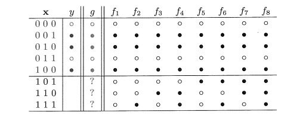

* 其次，由于训练样本是随机抽取的，我们总有一个非$0$的概率挑选出不具有代表性的样例，虽然这样的可能性很小。这很好理解，抛掷$10$枚硬币可能同时出现正面，我们当然会估计接下来的会全出现正面。当然这是在我们不引入一般的硬币正反面出现的概率都是$\dfrac{1}{2}$的先验情况下。

  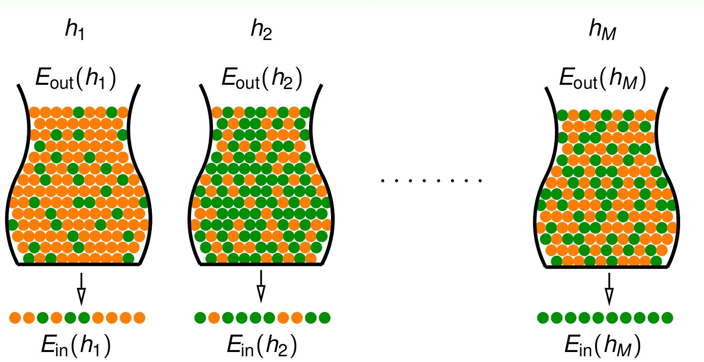

为了解决这两个困难，我们不要求一个完美的学习器，如果我们执着于此，那么实际上会无法进行。我门来对上面两个难题提出解决方法，实际上就是退而求其次：

* 首先，我们不要求学习器输出使$E_{out}=0$的假设$h$，而只要求其错误率被限定在某常数$\epsilon$的范围内，$\epsilon$可为任意小。
* 其次，不再要求学习器对所有的随机抽样的样本都能成功，只要求其失败的概率被限定在某个常数$\delta$的范围内，$\delta$也可以为任意小。

实际上，这才是真正符合人的设定，因为人有时候即是有正确的知识也会犯错误（对应于问题一），并且我们如果没有足够有效的样本也可能学到错误的知识（对应于问题二）。

综上，我们只要求学习器可能学习到一个近似正确的假设，即为$Probably\ approximately\ correct$。

***

我们将对计算任意元素$x\in \cal{X}$的代价的上界记为$O(n)$。

将对类$c\in C $计算表示的最大代价记为$size(c)$。

其实，上述两个定义分别定义了输入空间$X$和目标函数空间$C$中的固有复杂度而已。例如其中$n$可以简单地理解为特征的数目，而$C$假如至多由$k$个特征就可以确定，此处$k$不一定等于$n$，那么$size(c)$就为$k$。

**$PAC$学习框架定义如下：**

如果存在一个算法$\cal{A}$以及一个多项式函数$poly()$，使得对于任意的$\epsilon>0$和$\delta>0$，对于所有定义在$\cal{X}$上的分布$P$以及任意目标函数$c\in C$，对于满足$m>ploy(\frac{1}{\epsilon},\frac{1}{\delta},n,size(c))$的任意样本规模$m$均有下式成立，
$$
P[E_{out}(h_s)\leqslant \epsilon]\geqslant 1-\delta
$$
那么函数类$C$就是$PAC$可学习的。若$\cal{A}$的运行复杂度在$ploy(\frac{1}{\epsilon},\frac{1}{\delta},n,size(c))$内，那么函数类$C$是高效可学习的。

定义中一些要点：

* $PAC$学习框架并未对分布$D$做出任何特别的假设，仅假设其存在。
* 训练样本和测试样本产生于相同的分布$D$，这是泛化称为可能的必要条件。
* $PAC$学习框架考虑的是函数类$C$的学习框架，而不是一个特殊目标函数的可学习性。对于学习算法而言，$C$是已知的，而目标$c$是未知的。

在很多情况下，我们往往忽略$n$和$size(c)$的多项式约束而只聚焦于样本复杂度$m$。实际上，为显示某目标概念类别$C$是可$PAC$学习的，一个典型的途径是证明$C$中每个目标函数可以从多项式数量的训练样本中得到，而后证明每个样本的处理时间同样是多项式级别的。

#### 一个简单的例子

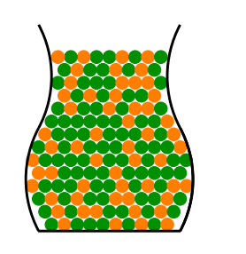

我们如何估计橘黄色球的概率$\mu$？

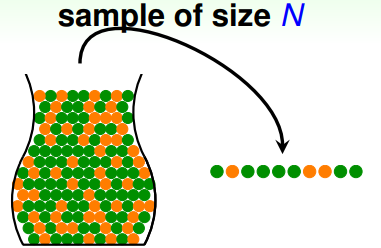

显然我们可以得出样本的概率$\nu$。

那么，$\nu$能否为估计$\mu$提供一些信息？

***

**$Hoeffding$不等式：**
$$
P[|\nu-\mu|>\epsilon]\leqslant 2e^{-2\epsilon^2N}
$$
我们可以看出右边的式子不依赖于未知的$\mu$，并且当$N$足够大的时候，我们有很大的把握说$\nu\approx \mu$。

我们将这个例子类比到机器学习中：

* 抽出橘黄球$\rightarrow h(x)\neq f(x)$。
* 抽出绿球$\rightarrow h(x)= f(x)$。
* $N$个球$\rightarrow$训练集中的样本数目$N$。

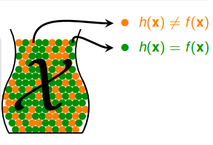

对于固定的$h$，我们由$hoeffding$不等式$P(|E_{in}(h)-E_{out}(h)|>\epsilon)\leqslant 2e^{-2\epsilon^2N}$会得出，当训练集中的样本数目$N$很大的时候$E_{in}(h)\approx E_{out}(h)$。

这样我们仅仅判断了该$h$在训练集和训练集之外的全体样本上的表现差不多一致，但仅仅这样并不能确定它是一个好的$h$！

如果$E_{in}(h)$很大的话，那么$E_{out}(h)$也会很大，$h$此时并不好。我们想要得到$E_{in}(h)$很小，从而加上上式的条件，$E_{out}(h)$也会很小。这样才是我们想要的结果。

***

以上例子我们都是对于确定的$h$来分析的，实际上会有很多的$h$来供我们的学习算法$\cal{A}$选择。

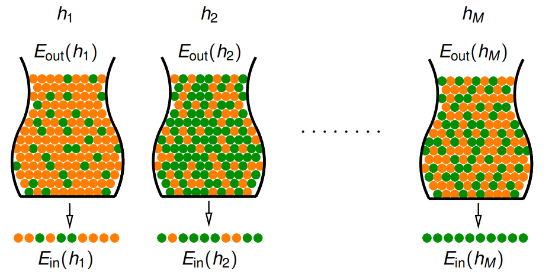

如果有一个$h$对训练集中的数据都判断正确，那么我们是否就可以选择这个$h$呢？显然不是的，因为此时的$E_{in}$可能不近似等于$E_{out}$，我们做如下说明：

$Hoeffding$不等式告诉我们，一个$h$在训练集上的表现在大概率都跟真实数据上的一样，也就是说大部分抽样我们都能取得代表性的数据。但是针对多个假设$\cal H$的时候，我们就会发现，实际上我们选择的对训练集上表现好的假设，对于全体样本空间来说可能不是好的，因为它可能使用了“坏的训练集”，也就是没有代表性的训练集。

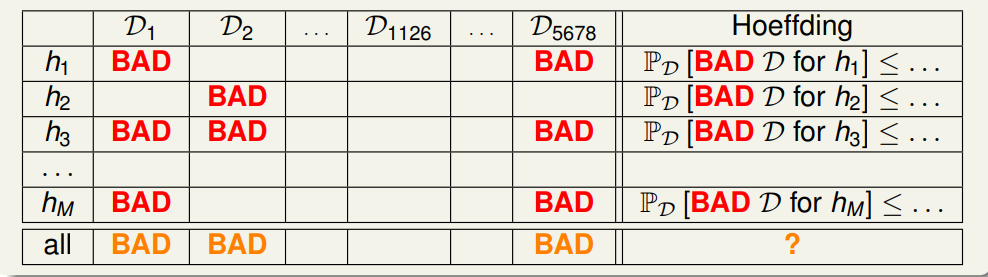

 我们先不考虑坏数据集的重复性，直接估算出坏数据出现的概率：
$$
\begin{aligned}
P_{\cal D}({\tiny BAD}\ {\cal D})&=P({\tiny BAD}\ {\cal D}\ for\ h_1 ||{\tiny BAD}\ {\cal D}\ for\ h_2\cdots{\tiny BAD}\ {\cal D}\ for\ h_M )\\
&\leqslant P({\tiny BAD}\ {\cal D}\ for\ h_1)+P({\tiny BAD}\ {\cal D}\ for\ h_2)+\cdots+P({\tiny BAD}\ {\cal D}\ for\ h_M)\\
&\leqslant2e^{-2\epsilon^2N}+2e^{-2\epsilon^2N}+\cdots+2e^{-2\epsilon^2N}\\
&=2Me^{-2\epsilon^2N}
\end {aligned}
$$
虽然上式我们放缩了两次，但是我们能清楚地看到，我们会选到“坏的数据”从而选择到”坏的$h$“的概率会变为$M$倍。所以说，现在这个上界不只与训练样本数$N$有关，还和假设空间假设数$M$密切相关，我们注意到：

**如果$M$有限**，对于充分大的$N$来说，我们仍有大概率避免掉坏的数据，从而让算法$\cal A$自由地从$H$中选择$h$，并且这个$h$是大概率在全体样本空间上表现也是好的。

但是对于$M$无限的情况，即使是再大的$N$，我们也做不到有效地学习。

**例子：**

我们取$\epsilon=0.1,\delta=0.05,M=100$，那么我们需要多少的数据才能达到需求？

$N=\dfrac{1}{2\epsilon^2}ln\dfrac{2M}{\delta}]=415$。

***

我们整理一下现在我们证明机器能够学习的方法：

* 首先我们想找到$f$，使得$E_{out}=0$；实际上是不可行的，所以我们希望找到$g$使得$E_{out}\approx 0$。
* 但是我们不能穷尽真实的数据，并且也不知道关于它的分布$D$，我们只能获取到不多的训练集，并且我们有能力选出$h$让$E_{in}\approx 0$。
* 我们能不能在某些限制的情况下，让$E_{out}\approx E_{in}$。这样我们就选出了$g$使得$E_{out}\approx 0$。

实际上，核心的问题就是：

* **我们能不能让$E_{out}\approx E_{in}$，泛化能力足够好。**
* **我们能不能让$E_{in}\approx 0$，预测足够准确。**

接下来讨论假设集$\cal H$的大小$M$跟上边两个问题的关系：

* 对于小的$M$，由于我们假设选择有限，可能将正确的或者近似正确的假设排除在外，我们固然很容易保证$E_{out}\approx E_{in}$。但是我们却不能保证学习到的$h$使$E_{in}\approx 0$。也就是说虽然泛化能力很大，但是正确率很低。
* 对于大的$M$，由于我们假设选择很多，有较大可能将正确的或者近似正确的函数容纳进来，我们很容易保证$E_{in}\approx 0$。但是我们却不能保证学习到的$h$使$E_{out}\approx E_{in}$。因为选择多的话，意味着我们的训练集是“坏的数据"的可能性变大，也就是说虽然在训练样本上正确率很大，但是泛化性很差。

在实际问题中，$M$往往是$\infty$，我们真的不能做到有效学习吗？让我们重新看一下上述不等式$P_{\cal D}({\tiny BAD}\ {\cal D})\leqslant2Me^{-2\epsilon^2N}$，我们放缩了两次，是否过分放缩了呢？而且$e^{-2\epsilon^2N}$是指数级降低，如果我们能将$M$用一个多项式级别的式子$m_\cal{H}$替代掉，那么我们只需要令$N$再大一些就好了。也就是说我们实际上不希望放缩那么大，希望找到一个更紧的界以此来推导出机器学习是可能的。为此将引入对分$(dichotomies)$、成长函数$(growth\ function)$、断点$(break\ point)$等概念来寻找这个替代值$m_\cal{H}$。

***

* 不同假设的坏事情是会重叠的

让我们来看个$PLA$（感知器）的例子，下图中蓝色部分、紫色部分分别是被目标函数$f$划分的两类，绿色、红色线分别是我们的假设函数$h_1,h_2$，显然他们非常接近。我们先看他们的$E_{in}$，如果$h_1$在某一个样本集$D$上出现了$E_{in}$偏离$E_{out}$。对于$h_2$，由于$h_1,h_2$非常接近，所以面对**同一个**$D$（这里是理解的关键，他们面对的是**同一个**！），$h_2$在$D$上也出现了$E_{in}$偏离$E_{out}$情况的**概率是非常非常大的**。同理，由于$h_1,h_2$非常接近，他们的$E_{out}$也是很接近的，可以看到黄色部分是他们$E_{out}$的差。由于两者$E_{in},E_{out}$都接近，因此坏事情发生很大概率是存在重叠的，何况这里只是两个接近的线，面对无穷多的假设函数，坏事情发生是存在重叠的。

实际上，我们可以更简单地来理解

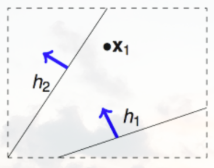

对于只有一个点的样本集，实际上我们只有两类线。再看一下有四个点的样本，只有$14$类分类线。

从上面的分析看出，虽然假设空间假设数$M$一般非常大（甚至无穷），但在特定的样本集上，有效的假设数目是有限的，也即式子应该改写成：
$$
\begin{aligned}
P_{\cal D}({\tiny BAD}\ {\cal D})\leqslant2\cdot effective({M})e^{-2\epsilon^2N}
\end {aligned}
$$

***

我们先不来讨论为什么$ m_\cal H$可以代替$M$，我们先讨论下面的一些概念：

* 对分$(A\ dichotomy)$：对一个假设函数$h:\{x_1,x_2,\cdots,x_N\}\rightarrow \{-1,+1\}$，
* 定义$|\cal H|$为$\cal H(x_1,x_2,\cdots,x_N)$上二分类的数量，其中$\cal H(x_1,x_2,\cdots,x_N)$表示假设空间$\cal{H}$在训练集$D$上的所有二分类：

$$
{\cal H}(x_1,x_2,\cdots,x_N)=\{h(x_1),h(x_2)\cdots,h(x_N)|h\in \cal H\}
$$

具体来讲，一个对分就是将$h$代入训练集$(x_1,x_2,\cdots,x_N)$得到$(-1,+1,\cdots,-1)$。但是我们不关心具体的对分，我们更加关心假设函数集合$\cal H$上有多少个对分。于是引入了$|\cal H|$，就是将$\cal H$中的的每一个假设$h$作用到$(x_1,x_2,\cdots,x_N)$上得到的若干不同的对分数目。值得注意的是，这个对分个数是随数据集$D=(x_1,x_2,\cdots,x_N)$变化而变化的。比如假设集$\cal H$都为不同的直线，但是对于不同的数据集，$|\cal{H}|$会不同，比如三个点排列在同一个直线上时只有$6$个对分，不是同一个直线有$8$个对分，以下两幅图说明了情况：

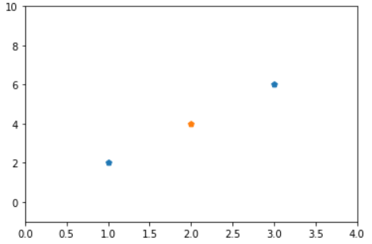

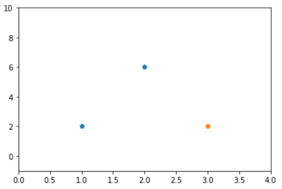

* 成长函数：

  由于不同的$D$，可以得到不同的$|\cal H|$，我们为了去除不同数据集（但是数据集的数目是相同的）对$|\cal H|$带来的影响（实际上我们就是取在所有可能的数据集上的最大值），引入了成长函数

$$
m_{\cal H}(N)=\mathop{max}\limits_{(x_1,x_2,\cdots,x_N)\in \cal X}|{\cal} H(x_1,x_2,\cdots,x_N)|
$$

​	其实成长函数描述了$\cal H$是任意抽样训练集样本$D$上最大的二分类个数，显然成长函数的上限是$2^N$。可以看出，$m_H(N)$越大，$\cal H$的表示能力越强。因此，增长函数描述了假设空间$\cal H$的表示能力，由此反映出假设空间的复杂度。

* 打散$(shatter)$：

  当假设空间$\cal H$作用于大小为$N$的样本集$D$时，产生的对分数量等于$2^N$，即$m_{\cal H}(N)=2^N$时，就称$D$被$\cal H$打散。

  其实就是指$N$个点所有的可能情形都可以被$\cal H$产生。

  

* 断点$(break\ point)$

  尽管成长函数把假设数从无穷缩小到了$2^N$，但是这个量级还是太大了，我们希望成长函数是多项式级别的，于是引入了断点。

  对于假设空间$\cal{H}$的成长函数$m_{\cal H}(N)$，从$N=1$出发逐渐增大，当增大到$k$时，出现$m_{\cal H}(N)<2^N$的情形，我们就说$k$是该空间的断点。实际是说，如果大小为$k$的数据集都（注意是“都”，也就是任意，如果存在一个可以被打散，那么实际上$k$不是断点）不可以被$\cal H$打散，那么$k$就是一个断点。比如$PLA$，其$m_{\cal H}(4)=14\neq2^4$，所以$4$就是断点，往后的$5,6\cdots$都是断点，可以用反证法证明：如果$5$不是断点，那么遮住一个点，$4$必然可以组成所有二分类，与$4$是断点矛盾。

让我们用一道题目检测下是否理解了上面的概念。

例子：我们有$3$个点，对一个假设集合，其断点是$2$，因此任意两个点不能产生所有的二分类。在这个限制下，问总共可以产生多少个二分类？

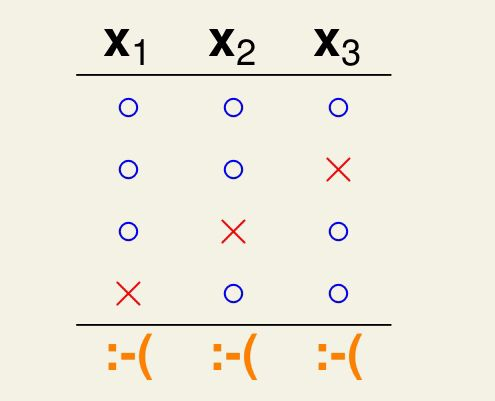

***

虑二分类的学习问题中，为了寻找$M$合适的替代物，我们提出了$Dichotomies$，为了确定在某一个$D$上$Dichotomies$的最大值。引入了**成长函数**，为了说明成长函数是多项式级别， 引入了**断点**，下一部分我们将说明两个问题：
 **1、为什么有断点的，成长函数是多项式级？**
 **2、为什么可以用成长函数代替$M$?**

为了说明**有断点的$m_H(N)$是多项式级别的**，我们希望如此$m_H(N)\leqslant \cdots\leqslant\cdots\leqslant a\ polynomial$，我们定义$B(N,K)$：在任意$N$个点上使得这$N$个点的任意大小为$K$的子集都不能被$shatter$的最大的对分数目，其中$K$是最小的断点数。所以下式仍成立：
$$
m_H(N)\leqslant B(N,K)\leqslant 2^N
$$
为什么小于等于$m_{\cal H}(N)$，因为由定义可以看出我们定义的$B(N,K)$是有断点的**最大的**，而$m_{\cal H}(N)$仅是有断点的，不能保证是最大的。

我们也可以理解为$B(N,K)$是断点存在且为 $K$ 的假设空间的增长函数上界。下面求解具体的$B(N,K)$的值。我们先来看$B(4,3)$：

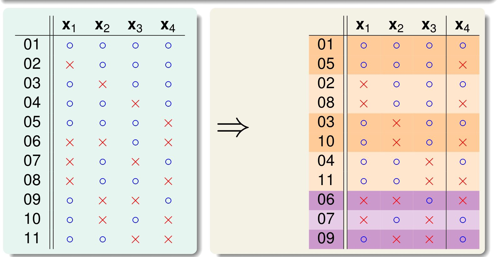

* 橘色的部分成双成对，我们把数目记作$2\alpha$，下边紫色的部分记作$\beta$。而$\alpha+\beta$是不能$shatter$任何$3$个点的。实际上可以得到$\alpha+\beta\leqslant B(3,3)$。（为什么这么选$\alpha$和$\beta$实际上我们是想与前面的点数产生关系，找出递推式）。

接下来我们只看橘色的一半：

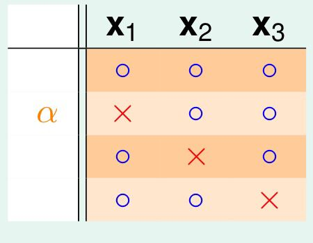

* 由于$x_4$点已经可能取到两个选择，我们只能让$\alpha\leqslant B(3,2)$，否则会有两个点的完全组合，配上$x_4$，实际上会$shatter3$个点，与前面的假设不符。

综上两点，我们可以得到$B(4,3)\leqslant B(3,3)+B(3,2)$。

同样地，推广也是成立的，所以$B(N,K)\leqslant B(N-1,K)+B(N-1,K-1)$。化简得到$B(N,K)\leqslant \sum\limits_{i=1}^{k-1}\begin{pmatrix}N\\i\end{pmatrix}$。所以我们有
$$
m_H(N)\leqslant B(N,K)\leqslant\sum\limits_{i=1}^{k-1}\begin{pmatrix}N\\i\end{pmatrix}\leqslant N^{k-1}\leqslant 2^N
$$
**也就是说成长函数是一个多项式级别的**！！！

那么可不可以用$m_{\cal{H}}(N)$直接替换$effective(M)$呢？不能直接替换，但是我们可以稍微改变下形式替换$M$：
$$
P[|E_{in}(g)-E_{out}(g)|>\epsilon]\leqslant 4m_H(2N)e^{-\dfrac{1}{8}\epsilon^2N}
$$

***

**一个假设空间的$VC$维$d_{vc}(H)$是满足$m_H(N)=2^N$的最大整数。**
$$
VC({\cal H})=max\ \{N:m_{\cal H}(N)=2^N\}
$$
换言之：就是$H$可以$shatter$的最大数据集$D$的大小$d$。其实就是$k-1$，而$k$就是$\cal H$的断点。需要注意的是，这并不意味着所有大小为$d$的数据集都能被$\cal H$打散，例如，二维平面上的所有直线构成的假设空间$\cal H$的$VC$维是$3$，但是它并不能打散位于同一条直线上的三个点。实际上这是存在性，不是任意性。所以：
$$
m_H(N)\leqslant B(N,K)\leqslant\sum\limits_{i=1}^{k-1}\begin{pmatrix}N\\i\end{pmatrix}\leqslant N^{d_{vc}(H)}\leqslant 2^N
$$
所以
$$
P[|E_{in}(g)-E_{out}(g)|>\epsilon]\leqslant 4(2N)^{d_{vc}(H)}e^{-\dfrac{1}{8}\epsilon^2N}
$$

所以我们可以知道如果一个假设集的$d_{vc}(H)$是有限的，那么这个假设集就是好的，也就是$E_{in}\approx E_{out}$。

***

#### 问题框架

为简明起见，这里的讨论将限制在二分类的情形，也即可能的标签只有两种，$\cal{Y}=\{0,1\}$，并且训练数据无噪声。

设输入空间为$X$，我们假定所有的样本都是独立同分布的，按照某概率分布$P$从$X$中随机产生。一般地，$P$是固定的但是对于学习器来说是未知的，我们仅假设$P$具有时间稳定性，也即该分布不会随时间变化，这样才能保证我们由过去的实例对未知的实例做出预测。

令$C$代表学习器要学习的目标函数的集合。$C$中每个目标函数$c$对应于一个等效的布尔函数$c:X\rightarrow \{0,1\}$。例如$X$是所有人的集合，$C$中的一个目标函数$c$可以为判断$x$是否是“滑雪运动员”，另一个$c$可以判断$x$是否是"程序员"。若回答是肯定的，那么$c(x)=1$，否则$c(x)=0$。

训练样本$x$也是按照$P$分布随机抽取的，然后与其目标值$c(x)$被提供给学习器学习。

学习器$L$必须从假设空间$H$中输出某假设$h$以作为对$c$的估计。我们通过$h$在$X$中抽取的新实例上的表现来评估$L$是否学习成功，显然抽取的过程仍然按照$P$分布，即与产生训练数据相同的分布。

我们要刻画的是不同学习器$L$的性能，这些学习器使用不同的假设空间$H$，并学习$C$中的不同的目标函数。

#### 

***

如果我们有一个包含$25$个样本的训练集$\cal{D}$，其中的数据来自于未知的函数$f:\cal{X}\rightarrow\cal{Y}$，其中$\cal{X}=R，Y={-1,+1}$，为了学得$f$。我们有一个假设空间${\cal{H}}=\{h_1,h_2\}$，其中$h_1$恒为$1$，$h_2$恒为$-1$。

我们有两个学习算法，$S(smart)$和$C(crazy)$，$S$总是选择训练集中符合假设最多的那个假设，而$C$正好相反。

假设$\cal{X}$服从这样一个概率分布，$P[f(x)=+1]=p$。

* $S$提供的假设是否比$C$提供的假设在训练集外的数据上表现得更好？

  * 即是在训练集上表现得更好，但不能保证在训练集以外的部分表现得很好。

* 假设训练集上的$y_n=+1$，那么$C$算法选择的假设会不会在训练集以外的数据上表现得比$S$还要好？

  * 此时利用$S$选择的假设在训练集上表现出的准确率为$1$，$C$选出的假设在训练集上表现出的准确率为$0$，但是训练集以外的部分，$C$算法得到的假设仍然有可能比$S$算法得到的假设表现好。

* 假设训练集上的$y_n=+1$，并且$p=0.9$，那么$S$选择的假设有多少的概率比$C$选择的要好？

  * 需要求出$P(P(f_s=f)>p(f_c=f))$。

    因为$f_s$恒等于$1$，所以$P(f_s=f)=P(f(x)=1)=p=0.9$。而 $P(f_c=f)=1-P(f_s=f)=0.1$。

    因此$P(P(f_s=f)>p(f_c=f))=P(0.9>0.1)=1$。

* 假设训练集上的$y_n=+1$，是否存在一个$p$，$C$选择的假设比$S$的要好？

  * 其实题目是在问是否存在$p$使得$P(P(f_s=f)>p(f_c=f))<0.5$。由上题知道$P(f_s=f)=p,P(f_c=f)=1-p$。

    所以当$p<0.5$时，$P(P(f_s=f)>p(f_c=f))=0<0.5$。

为了定义假设集$H$的$VC$维，我们先介绍分裂$(dichotomy)$以及打散$(shattering)$的概念。

* 给定一个假设集$H$，集合$S$的一个分裂是指用假设集$H$中一个元素$h$对$S$中的所有样本进行标记的一种可能方式。
* 对于一个有$m\geqslant1$个元素的集合$S$，当$H$的分裂覆盖了所有可能$S$中数据的排列组合时，称假设集$H$打散$S$，即$\Pi_H(m)=2^m$。

那么一个假设集$H$的$VC$维是指它能完全打散的最大集合的大小。

***

如果我们考虑二维感知机，由于其对应的假设空间$H$为平面中所有直线，我们把一个分裂对应的所有直线方程视为一个类别（也就是说原来无数**个**直线合为一**种**直线），显然它的分裂的数量小于等于所有数据点的排列组合数，因为有一些排列组合永远不能由假设集$H$中的$h$进行标记得到。

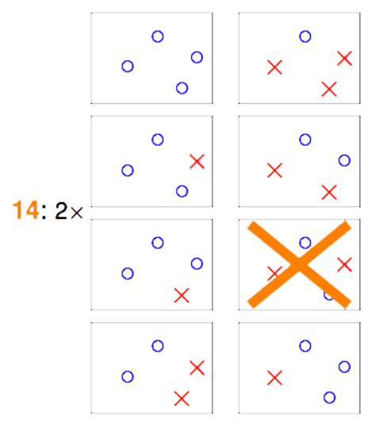

实际上这种方式相当于引入了一些先验知识，也即数据集是线性可分的，而不是线性不可分的，所以我们的假设集$H$中仍然只保持直线的设定。

上一篇说学习的可行性，讲到，如果遇上坏的样本集，那么样本集上的表现与真实世界上的表现就会差很多，此时学习显然不可行，因为样本集无法表征真实数据。遇到坏的样本集的概率与方程的数量以及数据量有关。然而假设集中方程的数量往往是无穷的(比如$2$维感知机的是平面上所有的直线（即使这种仅仅包括直线还不包括曲线）)，本篇则继续阐述，方程的数量看上去是无穷的，但真正有效的方程的数量却是有限的，这些方程的种类数我们只能依赖于样本集的个数和假设空间的性质。我们可以用成长函数来描述作用于会产生多少种有效的方程。如果用有限的成长函数（也就是说有限的方程种类）去代替无限的方程数，就有：但实际上我们很难确切知道各种的成长函数究竟长什么样子，我们只好通过$break\ point$去寻找成长函数的上界。不过这当中仍然有些情况没有考虑到，将在下一篇笔记中继续说明。

### 偏差与复杂性权衡

我们在之前看到，为了克服学习数据会很容易导致过拟合的问题，我们将搜索空间限制在某个假设$\cal{H}$下，可以认为，这种假设实际上反映了学习器关于任务的先验知识，认为假设类$\cal{H}$中存在一个假设是低错误概率模型。

这样的先验知识对学习的成功是否必要？是否存在一个通用的学习器（一个没有特定任务先验知识的，并可完成所有学习任务的学习器）？

实际上，由没有免费的午餐定理表明，不存在这样通用的学习器。因此，解决一个由分布$\cal D$所定义的特定的学习问题时，我们应该具有一些关于分布$\cal{D}$的先验知识。