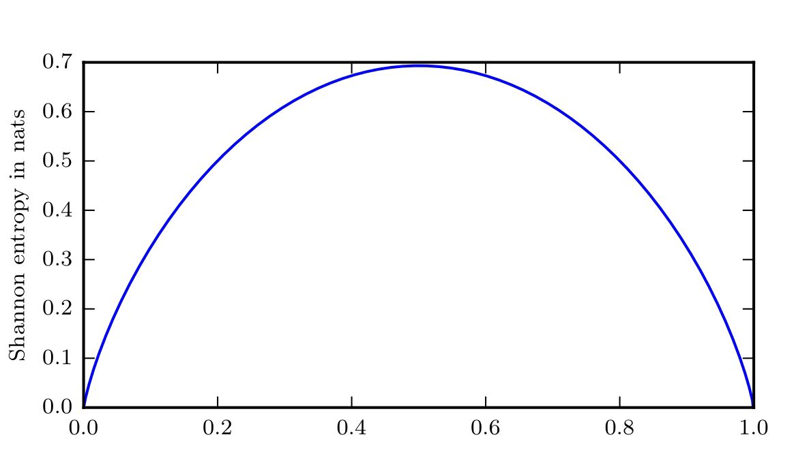
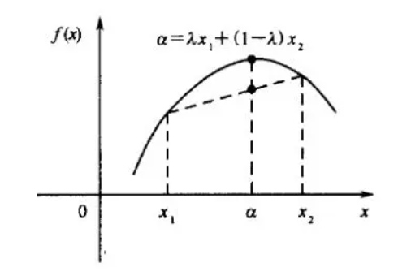
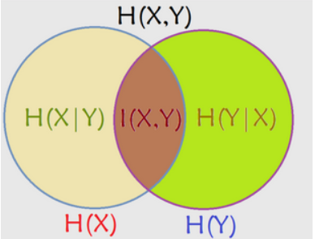
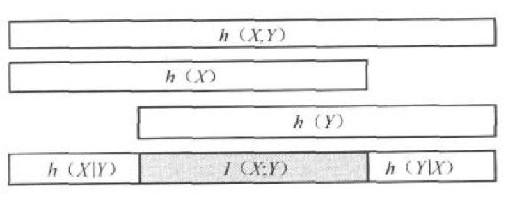

## 熵$(entropy)$

**在头脑中掌握第二定律比第一定律要困难得多。——克劳修斯**

***

在信息论中又称为信息熵，是**随机变量不确定度**的度量（信息熵越小，信息越确定）；也是平均意义上描述随机变量所需的信息量的度量。

设$X$是一个离散型随机变量，其取值空间为$\cal{X}$。它的信息熵公式表示如下：
$$
H(X)=-\sum\limits_{x\in\cal{X}}p(x)log\ p(x)
$$
上式中，$p(x)$表示随机变量$X$的概率密度函数。将式子变形为$H(x)=\sum\limits_{x\in\cal{X}}p(x)log\dfrac{1}{p(x)}$。所以熵又可以解释为随机变量$log\dfrac{1}{p(X)}$的期望值，即$E(log\dfrac{1}{p(X)})$。

**熵的范围满足以下不等式：**
$$
0\leqslant H(X)\leqslant log|X|
$$
$|X|$是$X$取值个数，当且仅当$X$的分布是均匀分布时右边等号成立。

设
$$
X=\left\{
\begin{aligned}
&1\quad 概率为p\\
&0\quad概率为1-p
\end{aligned}
\right.
$$
则
$$
H(X)=-plogp-(1-p)log(1-p)\mathop{=}\limits^{def}H(p)
$$

## 联合熵和条件熵

### 联合熵

我们将熵的定义推广至**两个随机变量**的情形。由于$(X,Y)$可以视为**单个向量值**随机变量，所以定义并无新鲜之处。对于服从联合分布为$p(x,y)$的一对离散型随机变量$(X,Y)$，其联合熵表示如下：
$$
H(X,Y)=-\sum_{x\in \cal{X}}\sum_{y\in \cal{Y}}p(x,y)logp(x,y)
$$
同样，我们将其表示成期望的形式：
$$
H(X,Y)=-E\left(log\ p(X,Y)\right)
$$

***

### 条件熵

我们也可以定义**一个随机变量在给定另一个随机变量下**的条件熵：它是条件概率分布的熵关于起条件作用的那个随机变量的**期望值**（注意这是人为的定义而已）。

若$(X,Y)\sim p(x,y)$，条件熵$H(Y|X)$定义为：
$$
\begin{aligned}
H(Y|X)&=\sum_{x\in \cal{X}}p(x)H(Y|X=x)\\
&=-\sum_{x\in \cal X} p(x)\sum_{y\in \cal Y} p(y|x)log(p(y|x))\\
&=-\sum_{x\in \cal X}\sum_{y\in \cal Y}p(x,y)log(p(y|x))\\
\end{aligned}
$$

### 链式法则

一对随机变量的**联合熵**等于其中一个随机变量的**熵**加上另一个随机变量的**条件熵**。
$$
H(X,Y)=H(X)+H(Y|X)
$$
证明如下：
$$
\begin{aligned}
H(X,Y)&=-\sum_{x\in \cal X}\sum_{y\in \cal Y} p(x,y)log(p(x,y))\\
&=-\sum_{x\in \cal X}\sum_{y\in \cal Y} p(x,y)log\left(p(x)p(y|x)\right)\\
&=-\sum_{x\in \cal X}\sum_{y\in \cal Y}p(x,y)log(p(x))-\sum_{x\in \cal X}\sum_{y\in \cal Y}p(x,y)logp(y|x)\\
&=-\sum_{x\in \cal{X}}p(x)log(p(x))-\sum_{x\in \cal X}\sum_{y\in \cal Y}p(x,y)log(p(y|x))\\
&=H(X)+H(Y|X)
\end{aligned}
$$

它所表达的物理含义是：对两个随机变量的随机系统，我们可以先观察一个随机变量获取信息量，观察完后，我们可以在拥有这个信息量的基础上观察第二个随机变量的信息量。

***

* **例子：**

| Y\X  |        1        |        2        |        3        |        4        |
| :--: | :-------------: | :-------------: | :-------------: | :-------------: |
|  1   | $\dfrac{1}{8}$  | $\dfrac{1}{16}$ | $\dfrac{1}{32}$ | $\dfrac{1}{32}$ |
|  2   | $\dfrac{1}{16}$ | $\dfrac{1}{8}$  | $\dfrac{1}{32}$ | $\dfrac{1}{32}$ |
|  3   | $\dfrac{1}{16}$ | $\dfrac{1}{16}$ | $\dfrac{1}{16}$ | $\dfrac{1}{16}$ |
|  4   | $\dfrac{1}{4}$  |       $0$       |       $0$       |       $0$       |

$$
\begin{aligned}
H(X)&=-\sum\limits_{x\in\cal{X}}^np(x)log\ p(x)\\
&=-\left( \dfrac{1}{2}\times log\dfrac{1}{2}+\dfrac{1}{4}\times log\dfrac{1}{4}+\dfrac{1}{8}\times log\dfrac{1}{8}+\dfrac{1}{8}\times log\dfrac{1}{8}\right)\\
&=-(-\dfrac{1}{2}-\dfrac{1}{2}-\dfrac{3}{8}-\dfrac{3}{8})\\
&=\dfrac{7}{4}(bit)
\end{aligned}
$$

同理可得：$H(Y)=2(bit)$。

并且：
$$
\begin{aligned}
H(X|Y))&=\sum_{y\in \cal{Y}}p(y)H(X|Y=y)\\
&=\dfrac{1}{4}H(\dfrac{1}{2},\dfrac{1}{4},\dfrac{1}{8},\dfrac{1}{8})+\dfrac{1}{4}H(\dfrac{1}{4},\dfrac{1}{2},\dfrac{1}{8},\dfrac{1}{8})+\dfrac{1}{4}H(\dfrac{1}{4},\dfrac{1}{4},\dfrac{1}{4},\dfrac{1}{4})+\dfrac{1}{4}H(1,0,0,0)\\
&=\dfrac{1}{4}\times\left(\dfrac{7}{4}+\dfrac{7}{4}+2+0+\right)\\
&=\dfrac{11}{8}(bit)
\end{aligned}
$$
值得说明的是，$H(Y|X)\ne H(X|Y)$，但$H(X)-H(X|Y)=H(Y)-H(Y|X)$。

***

## 相对熵（$KL$散度）

它是**同一个随机变量**的两个**不同概率分布**之间距离的度量。在统计学上，对应的是**似然比的对数期望**。举例来说：已知随机变量的真是分布$p$，可以构造平均长度为$H(p)$的码。但是如果我们此时采用了针对分布$q$的编码，那么在平均意义上就需要$H(p)+D(p\|q)$比特来描述这个随机变量。

其定义为：
$$
D(p\|q)=\sum_{x\in \cal{X}}p(x)log\dfrac{p(x)}{q(x)}=\sum_{x\in\cal{X}}p(x)log(p(x))-\sum_{x\in\cal{X}}p(x)log(q(x))=E_p\left(log\dfrac{p(X)}{q(X)}\right)
$$
* $KL$散度越小，它们之间的距离越近。我们可以看出$KL$散度由$p$所代表的随机变量自己的**熵**与$q$在$p$上的**期望**共同决定。

* $KL$散度总是**非负的**，也满足**同一性**（当且仅当$p=q$时为$0$，即仅当两个随机分布完全一样时，相对熵为0）。

但是$KL$散度并**不对称**，即一般情况下$D(p\|q)\ne D(q\|p)$；也**不满足三角不等式**，因此其并非两个分布间的真正距离。然而，将其视为分布之间的”距离“往往很有用。

* **证明其非负性：**
  $$
  D(p\|q)=\sum_{x\in \cal{X}}p(x)log\dfrac{p(x)}{q(x)}=-\sum_{x\in \cal{X}}p(x)log\dfrac{q(x)}{p(x)}\geqslant -log\sum_{x\in\cal{X}}p(x)\dfrac{q(x)}{p(x)}=-log1=0
  $$
  其中用到了**$log$函数为凹函数和$Jensen$不等式**，所以$E(log(x))\leqslant log(E(x))$。

  

* **例子：**

  设$\cal{X}=\{0,1\}$，考虑$\cal{X}$上两个分布$p$和$q$。设$p(0)=1-r,p(1)=r$和$q(0)=1-s,q(1)=s$，则
  $$
  D(p\|q)=(1-r)log\dfrac{1-r}{1-s}+rlog\dfrac{r}{s}
  $$
  以及
  $$
  D(q\|p)=(1-s)log\dfrac{1-s}{1-r}+slog\dfrac{s}{r}
  $$
  显然如果$r=s$，那么$D(p\|q)=D(q\|p)=0$。若$r=\dfrac{1}{2},s=\dfrac{1}{4}$，可以计算得到
  $$
  D(p\|q)=\dfrac{1}{2}log\dfrac{\dfrac{1}{2}}{\dfrac{3}{4}}+\dfrac{1}{2}log\dfrac{\dfrac{1}{2}}{\dfrac{1}{4}}=0.2075(bit)
  $$
  而
  $$
  D(p\|q)=\dfrac{3}{4}log\dfrac{\dfrac{3}{4}}{\dfrac{1}{2}}+\dfrac{1}{4}log\dfrac{\dfrac{1}{4}}{\dfrac{1}{2}}=0.1887(bit)
  $$

## 互信息

**一个随机变量包含另一个随机变量的度量。**同样可以理解为，**互信息也是在给定另一随机变量知识的条件下，原随机变量不确定度的缩减量。**考虑两个随机变量$X$和$Y$，则互信息$I(X;Y)$为联合分布$p(x,y)$和乘积分布$p(x)p(y)$之间的**相对熵**，即
$$
I(X;Y)=\sum_{x\in \cal X}\sum_{y\in\cal Y }p(x,y)log\dfrac{p(x,y)}{p(x)p(y)}=D(p(x,y)\|p(x)p(y))
$$

## 熵与互信息的关系

$$
\begin{aligned}
I(X;Y)&=\sum_{x,y}p(x,y)log\dfrac{p(x,y)}{p(x)p(y)}\\
&=\sum_{x,y}p(x,y)log\dfrac{p(x|y)}{p(x)}\\
&=\sum_{x,y}p(x,y)logp(x|y)-\sum_{x,y}p(x,y)logp(x)\\
&=H(X)-H(X|Y)
\end{aligned}
$$

由此证明出互信息是在给定$Y$知识的条件下$X$的不确定度的缩减量。显然取值范围在$0$到$min(H(X),H(Y))$之间。

同理，我们可以证明出$I(X;Y)=H(Y)-H(Y|X)$。因此$X$含有$Y$的信息量等同于$Y$含有$X$的信息量。再者，由之前的$H(X,Y)=H(X)+H(Y|X)$，可以得到$I(X;Y)=H(X)+H(Y)-H(X,Y)$。

特殊情况$I(X;X)=H(X)-H(X|X)=H(X)$。所以，熵有时又被称作**自信息**。

## 交叉熵

上面我们讨论过$KL$散度可以表示两个随机分布之间距离的度量，那么还要交叉熵做什么？

我们由$KL$散度的公式变形可以得到：
$$
D(p\|q)=\sum_{x\in\cal{X}}p(x)log(p(x))-\sum_{x\in\cal{X}}p(x)log(q(x))=-H(p(x))+\left[-\sum_{x\in\cal{X}}p(x)log(q(x))\right]
$$
（$KL$散度=交叉熵$-$熵）后半部分就是我们的**交叉熵**：
$$
H(p,q)=-\sum_{x\in\cal{X}}p(x)log(q(x))
$$
显然，对自己求交叉熵就是熵。

在机器学习中，我们常常使用$KL$散度来评估$predict$和$label$之间的差别，但是由于$KL$散度的前半部分是一个**常量**（**因为训练数据的分布是确定的，与模型的参数无关，所以梯度下降求导时，$\nabla H(P,Q)=\nabla D_{KL}(P\|Q)$，即最小化交叉熵与最小化$KL$散度是一样的，也即我们用$p(x)$用来描述真实分布，而$q(x)$来描述模型预测的分布**），所以我们常常将后半部分的交叉熵作为损失函数，其实二者是一样的。

**交叉熵可以用于计算“学习模型的分布”与“训练数据分布”之间的不同。当交叉熵最低时(等于训练数据分布的熵)，我们学到了“最好的模型”。**

***

## 
参考文献

1. 《熵：一种新的世界观》
2. 《溯源探幽：熵的世界》
3. 《信息论基础》