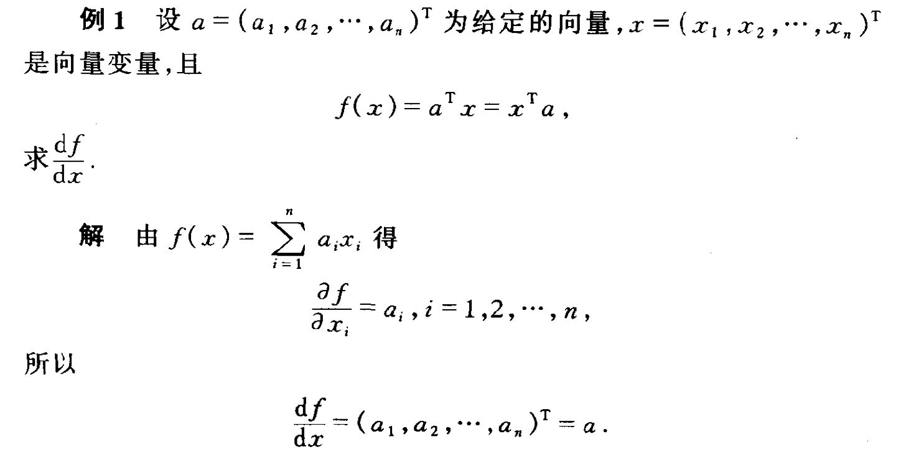

## 
矩阵微分

**花半秒钟就看透事物本质的人,和花一辈子都看不清事物本质的人,注定是截然不同的命运。——马里奥$\cdot$普佐**

***

在一般的线性代数中，主要是用代数的方法来研究矩阵，没有涉及到极限和微积分的运算规律。为了书写简便，我们通常把单个函数对多个变量或者多元函数对单个变量的偏导数**写成向量和矩阵的形式，使其可以被当做一个整体处理**。矩阵微积分是多元微积分的**一种表达方式**，即使用矩阵和向量来表示因变量每个成分关于自变量每个成分的偏导数。

***

矩阵分析理论和数学分析一样，是建立在极限的概念之上。

### 向量序列的极限

对于向量序列$\{ \boldsymbol X^{(k)} \}$，其中$X^{(k)}=(x_1^{(k)},x_2^{(k)},\cdots,x_n^{(k)})$，若其每一个分量$x_i^{(k)}$当$k\to \infty$，都有极限$x_i$，即$\mathop{lim} \limits_{k\to \infty}x_i^{(k)}=x_i,i=1,2,\cdots,n$，则称向量序列$\{X^{(k)}\}$有极限$X=(x_1,x_2,\cdots,x_n)$，或称$\{X^{(k)}\}$收敛于$\boldsymbol X$，记为$\mathop{lim}\limits_{k\to\infty}X^{(k)}=\boldsymbol X$。

由于实数序列的极限是唯一的，所以向量序列的极限必定是唯一的。

### 矩阵序列的极限

矩阵序列的收敛性和向量序列类似。

设有同阶矩阵序列$\{A_k\}=\{[a_{ij}^k]_{m\times n}\}$，若存在矩阵$\boldsymbol A=[a_{ij}]_{m\times n}$，当$k\to \infty$时，$a_{ij}^k$收敛于$a_{ij}$。则称矩阵序列$\{A_k\}$收敛于$A$。即$\mathop{lim}\limits_{k\to \infty}A_k=\boldsymbol A$。矩阵$\boldsymbol A$称为矩阵序列$\{A_k\}$的极限。

**收敛的矩阵序列与收敛的标量数列有类似的性质。**

### 函数矩阵

设矩阵
$$
\boldsymbol A(x)=\begin{bmatrix}
a_{11}(x) & a_{12}(x) & \cdots & a_{1n}(x)\\
a_{21}(x) & a_{22}(x) & \cdots & a_{2n}(x)\\
\cdots & \cdots & \cdots & \cdots\\
a_{m1}(x) & a_{m2}(x) & \cdots & a_{mn}(x)\\
\end{bmatrix}
$$
其中每个元素都是实变量$x$的函数，则称矩阵$\boldsymbol A(x)$为函数矩阵。

若对每一个元素$a_{ij}(x)$，当$x\to x_0$时，都存在着极限$a_{ij}$（常数），则称矩阵$A(x)$在$x_0$处有极限，且极限值为矩阵$\boldsymbol A=[a_{ij}]_{m\times n}$。

**函数矩阵的极限，具有函数极限的类似性质。**

## 
函数矩阵的微分

本节所研究的内容：是用**矩阵来描述微积分中的若干结果**，在工程实际中常见的三个问题，即是函**数矩阵关于自变量的微分和积分；标量函数关于矩阵的微分；向量函数关于向量的微分。**

***

### 标量函数关于向量的偏导数

对于向量$\boldsymbol x$​​​和函数$y=f(\boldsymbol x)$​​​，若$y$​​对于$\boldsymbol x$各元素均可微分，则$y$关于$\boldsymbol x$的偏导数为$\dfrac{\partial y}{\partial \boldsymbol x}=[\dfrac{\partial y}{\partial x_1},\cdots ,\dfrac{\partial y}{\partial x_M}]^T$​​​​。

至于为什么写成转置的形式，是因为这里才用了**分母布局**，即列向量的形式（分子布局：行向量的形式），以下同理。

### 向量函数关于标量的偏导数

对于标量$x$​和函数$\boldsymbol y =f(x)$​，若$\boldsymbol{y}$中元素对于$x$均可微分，则$\boldsymbol y$关于$x$的偏导数为$[\dfrac{\partial y_1}{\partial x},\cdots, \dfrac{\partial y_N}{\partial x}]^T$​。

### 向量函数关于向量的偏导数

不难想象，向量函数关于向量的偏导数理所应当是一个矩阵：

对于向量$\boldsymbol x$和函数$\boldsymbol y=f(x)$，则$f(\boldsymbol x)$关于$\boldsymbol x$的偏导数为
$$
\dfrac{\partial f(\boldsymbol x)}{\partial \boldsymbol x}=\begin{bmatrix} \dfrac{\partial y_1}{\partial x_1} &  \cdots & \dfrac{\partial y_N}{\partial x_1}\\\cdots&\cdots&\cdots \\ \dfrac{\partial y_1}{\partial x_M} &  \cdots & \dfrac{\partial y_N}{\partial x_M}\\ \end{bmatrix}
$$
此为函数$f(\boldsymbol x)$的**$jacobi$矩阵的转置**。

### 标量函数关于矩阵的偏导数

设函数$f(x)$是以矩阵$X=[x_{ij}]_{m\times n}$中的$m\times n$元素$x_{ij}$为自变量的**可微标量**函数，即
$$
f(\boldsymbol X)=f(x_{11},x_{12},\cdots ,x_{1n};x_{21},x_{22},\cdots,x_{2n};\cdots;x_{m1},x_{m2},\cdots,x_{mn})
$$
则$f(x)$对矩阵$X$的导数有如下定义：

设矩阵$X=[x_{ij}]_{m\times n}$​，若标量函数$f(x)$对自变量$x_{ij}$可微，则定义$f$对矩阵$X$的导数如下：
$$
\dfrac{d}{dX}=\begin {bmatrix}
\dfrac{\partial f}{\partial x_{11}} & \dfrac{\partial f}{\partial x_{12}} & \cdots & \dfrac{\partial f}{\partial x_{1n}}\\
\dfrac{\partial f}{\partial x_{21}} & \dfrac{\partial f}{\partial x_{22}} & \cdots & \dfrac{\partial f}{\partial x_{2n}}\\
\cdots & \cdots & \cdots & \cdots\\
\dfrac{\partial f}{\partial x_{m1}} & \dfrac{\partial f}{\partial x_{m2}} & \cdots & \dfrac{\partial f}{\partial x_{mn}}\\
\end {bmatrix}
$$
或$\dfrac{\partial f}{\partial X}=[\dfrac{\partial f}{\partial x_{ij}}]_{m\times n}$。**即标量函数$f$对矩阵$X$逐元素求导数而已。**特别地，以$\boldsymbol x=(x_1,x_2,\cdots,x_n)^T$为自变量的函数$f(\boldsymbol x)$的导数$\dfrac{df}{d\boldsymbol x}=(\dfrac{\partial f}{\partial x_1},\dfrac{\partial f}{\partial x_2},\cdots,\dfrac{\partial f}{\partial x_n})$称为**数量函数对向量变量**的导数。

设矩阵
$$
X=\begin{bmatrix}
x_{11} &x_{12} &\cdots &x_{1n}\\ 
x_{21} &x_{22} &\cdots &x_{2n}\\ 
\cdots &\cdots &\cdots &\cdots\\ 
x_{m1} &x_{m2} &\cdots &x_{mn}\\ 
\end{bmatrix}
$$
和标量函数
$$
f(X)=x_{11}^2+x_{12}^2+\cdots+x_{1n}^2+x_{21}^2+x_{22}^2+\cdots+x_{2n}^2+\cdots+x_{m1}^2+x_{m2}^2+\cdots+x_{mn}^2
$$
求$\dfrac{df}{dX}$。

**解：**因为$\dfrac{\partial f}{\partial x_{i,j}}=2x_{i,j}  (i=1,2,\cdots,m; j=1,2\cdots,n)$​，所以$\dfrac{d}{dX}f(x)=2 \begin{bmatrix}x_{11}&x_{12}&\cdots&x_{1n} \\x_{21}&x_{22}&\cdots&x_{2n}\\\cdots&\cdots&\cdots&\cdots\\x_{m1}&x_{m2}&\cdots&x_{mn}   \end{bmatrix} =2X$​。

又因为有$f(X)=tr(XX^T)$​，由此可以得出一些关于**迹的重要公式：**

* $\dfrac{d}{dX}tr(XX^T)=2X$
* $\dfrac{d}{dX}tr(BX)=\dfrac{d}{dX}tr(X^TB^T)=B^T$
* $\dfrac{d}{dX}tr(X^TAX)=(A+A^T)X$​

其中$X=[x_{ij}]_{m\times n};B=[b_{ij}]_{n\times m};A=[a_{ij}]_{m\times m}$。

此外，还可以验证对于标量函数$f(X)、g(X)$有如下运算法则：
$$
\begin{align} 
\dfrac{d}{dX}(f+g)=\dfrac{df}{dX}+\dfrac{dg}{dX}\\
\dfrac{d}{dX}fg=\dfrac{df}{dX}g+f\dfrac{dg}{dX}
\end{align}
$$
公式中的乘积可以交换。

***

### 函数矩阵关于标量的偏导数

设函数矩阵$A(x)=[a_{ij}(x)]_{m\times n}(i=1,2,\cdots,m;j=1,2,\cdots,n)$​，如果对于所有元素$a_{ij}(x)$​在$x=x_0$​点或某一区间上是可微的，则称该函数矩阵$A(x)$​在$x=x_0$​​点或该区间上是可微的。并定义
$$
\dfrac{d}{dx}A(x)=A'(x)=
\begin{bmatrix} 
a'_{11}(x)& a'_{12}(x) & \cdots & a'_{1n}(x)\\
a'_{21}(x)& a'_{22}(x) & \cdots & a'_{2n}(x)\\
\cdots & \cdots & \cdots & \cdots\\
a'_{m1}(x)& a'_{m2}(x) & \cdots & a'_{mn}(x)\\
\end{bmatrix}
$$
为函数矩阵$\boldsymbol A(x)$对$x$的导数，**即是函数矩阵$\boldsymbol A$逐元素对标量$x$求导数而已。**

**由函数矩阵的导数定义，可以推算出关于函数矩阵的导数运算法则。**

设函数矩阵$\boldsymbol A(x)$与$\boldsymbol B(x)$是可微的，则有：

* **矩阵加法：**$\boldsymbol A(x)+\boldsymbol B(x)$也是可微的，且满足$\dfrac{d}{dx}[\boldsymbol A(x)+\boldsymbol B(x)]=\dfrac{d}{dx}\boldsymbol A(x)+\dfrac{d}{dx}\boldsymbol B(x)$
* **标量乘法：**$\dfrac{d}{dx}[k\boldsymbol A(x)]=k\dfrac{d}{dx}\boldsymbol A(x)$，其中$k$是任意常数。
* **标量函数乘法**：$\dfrac{d(a\boldsymbol{B})}{dx}=(\dfrac{da}{dx})\boldsymbol{B}+a(\dfrac{d\boldsymbol{B}}{dx})$。其中$a$是$x$的标量函数，且对$x$可微分。
* **矩阵乘法：**在$\boldsymbol A(x)\boldsymbol B(x)$有定义的情况下，$A(x)B(x)$也是可微的，且有$\dfrac{d}{dx}[\boldsymbol A(x)\boldsymbol B(x)]=[\dfrac{d}{dx}\boldsymbol A(x)]\boldsymbol B(x)+\boldsymbol A(x)\dfrac{d}{dx}\boldsymbol B(x)$。**公式中的乘积次序是不能交换的。**
* **复合：**设矩阵$\boldsymbol A$是$u$的函数，$u=f(x)$，则有$\dfrac{d}{dx}[\boldsymbol A[f(x)]]=\dfrac{d}{du}\boldsymbol A(u)\cdot f'(x)$或者$\dfrac{d}{dx}[\boldsymbol A[f(x)]]=\dfrac{d}{du}f'(x)\cdot \boldsymbol A(u)$。
* **逆：**若矩阵$\boldsymbol A(x)$为正则矩阵，则其逆矩阵$\boldsymbol A^{-1}(x)$也可微分，$\dfrac{d}{dx}\boldsymbol A^{-1}(x)=\boldsymbol -\boldsymbol A^{-1}(x)\dfrac{d\boldsymbol A(x)}{dx}\boldsymbol A^{-1}(x)$。

***

### 常见向量函数的导数

$$
\dfrac{\partial \boldsymbol x}{\partial \boldsymbol x}=\boldsymbol I \\
\dfrac{\partial \boldsymbol {x^Ta}}{\partial \boldsymbol x}=\dfrac{\partial \boldsymbol {a^Tx}}{\partial \boldsymbol x}=\boldsymbol{a} \\
\dfrac{\partial \boldsymbol {Ax}}{\partial \boldsymbol x}=\boldsymbol A^T \\
\dfrac{\partial \boldsymbol {x^TA}}{\partial \boldsymbol x}=\boldsymbol A \\
$$

## 
矩阵求导

本文使用小写字母$x$表示标量，粗体小写字母$\boldsymbol{x}$表向量，大写粗体字母$\boldsymbol X$表示矩阵。

***

首先来琢磨一下定义，**标量$f$对矩阵$\boldsymbol X$的导数，定义为$\dfrac{\partial f}{\partial \boldsymbol X}$=$[\dfrac{\partial f}{\partial \boldsymbol X_{ij}}]$，**即$f$对$\boldsymbol X$逐元素求导排成与$\boldsymbol X$尺寸相同的矩阵。

然而，这个定义在计算中并不好用，实用上的原因是对函数较复杂的情形**难以逐元素求导；**哲理上的原因是逐元素求导破坏了矩阵**整体性**。试想，为何我们要改变常见想法，将$f$看做矩阵$\boldsymbol X$而不是各元素$\boldsymbol X_{ij}$的函数呢？答案是用**矩阵运算更简便整洁，软件工具对矩阵也有相关优化**。所以在求导时**不宜拆开矩阵，而是要找一个从整体出发的算法。**

为此，我们来回顾，一元微积分中的导数**（标量对标量的导数）**与微分的联系：$df=f^{'}(x)dx$​​​​​。​​

多元微积分中的梯度（**标量对向量的导数**）也与微分有联系：
$$
\ df=\sum\limits^{n}_{i=1}\dfrac{\partial f}{\partial \boldsymbol x_i}d\boldsymbol x_i=\left(\dfrac{\partial f^T}{\partial  \boldsymbol{x}}\right)d \boldsymbol{x}
$$
**值得注意的是：$\sum ab$往往可以转化成向量内积的形式，对应程序中的实现就是$for$循环变为向量运算。而$\sum\sum ab$往往可以转化成矩阵内积的形式，对应程序中的实现就是双层$for$循环变为矩阵运算。**

* 第一个等号是全微分公式（对每个分量$\boldsymbol x_i$分别求微分，然后相加）
* 第二个等号表达了**梯度与微分**的联系：全微分$df$​​是梯度向量$\dfrac{\partial f}{\partial \boldsymbol x}(n×1)$​​，与微分向量$d\boldsymbol x(n\times 1)$​​​​​的**内积**；受此启发，我们将矩阵导数与微分建立联系：

$$
df=\sum\limits_{i=1}^m\sum\limits_{j=1}^n \frac{\partial f}{\partial \boldsymbol X_{ij}}d\boldsymbol X_{ij}=tr(\frac{\partial f^T}{\partial \boldsymbol X}d\boldsymbol X)
$$
其中$tr$代表迹：方阵对角线元素之和。满足性质：对尺寸相同的矩阵$\boldsymbol A,\boldsymbol B$，$tr(\boldsymbol A^T\boldsymbol B)=\sum\limits_{i,j}\boldsymbol A_{i,j}\boldsymbol B_{i,j}$，即$tr(\boldsymbol A^T\boldsymbol B)$是矩阵$\boldsymbol A,\boldsymbol B$的**内积**。与梯度相似，这里第一个等号是全微分公式，第二个等号表达了**矩阵导数与微分**的联系：全微分$df$是导数$\dfrac{\partial f}{\partial \boldsymbol X}(m\times n)$与微分矩阵$d\boldsymbol X(m\times n)$的内积。

* 补充：
  * 设矩阵$\boldsymbol A=(a_{ij})$，把矩阵$A$的元素按行的顺序排列成一个列向量，$vec \boldsymbol A=(a_{11},a_{12},\dots,a_{1n},a_{21},a_{22},\cdots,a_{2n},\cdots,a_{m1},a_{m2},\cdots,a_{mn})^T$，则称向量$vec \boldsymbol A$​为矩阵$\boldsymbol A$按行拉直的列向量。
  * 设矩阵$\boldsymbol A,\boldsymbol B$​​，称$\boldsymbol A \cdot \boldsymbol B=\langle \boldsymbol A,\boldsymbol B \rangle =tr(\boldsymbol A^T \boldsymbol B)=\sum \limits_{i=1}^{n}\sum \limits_{j=1}^{n}a_{ij}b_{ij}=(vec\boldsymbol{A}^Tvec\boldsymbol B)$​​为矩阵$\boldsymbol A,\boldsymbol B$​​的**内积**。

***

### 
运算法则

***

回想遇到较复杂的一元函数如$f(x)=log(2+sinx)e^{\sqrt{x}}$​​​，我们是如何求导的呢？通常不是从定义开始由极限来求出结果，**而是先求出了初等函数的导数，然后建立四则运算、复合函数等法则，根据两者求出复杂函数的导数。**故而，我们来建立常用的矩阵微分的运算法则。

***

* **加减法：**$d(\boldsymbol X\pm \boldsymbol Y)=d\boldsymbol X\pm d\boldsymbol Y$；
* **矩阵乘法：**$d(\boldsymbol X\boldsymbol Y)=(d\boldsymbol X)\boldsymbol Y+\boldsymbol Xd(\boldsymbol Y)$；**注意乘法因数不能改变位置。**
* **转置：**$d(\boldsymbol X^T)=(d\boldsymbol X)^T$；
* **迹：**$d\left( tr(\boldsymbol X)\right)=tr(d\boldsymbol X)$。
* **逆运算：**$d\boldsymbol X^{-1}=-\boldsymbol X^{-1}(d\boldsymbol X)\boldsymbol X^{-1}$。此式可在$\boldsymbol X\boldsymbol X^{-1}=\boldsymbol I$两侧求微分来证明。
* **行列式：**$d|\boldsymbol X|=tr(\boldsymbol X^*d\boldsymbol X)$，其中$\boldsymbol X^*$表示$\boldsymbol X$的伴随矩阵，在$\boldsymbol X$可逆时又可以写作$d|\boldsymbol X|=|\boldsymbol X|tr(\boldsymbol X^{-1}d\boldsymbol X)$。此式可用$Laplace$展开来证明，见张贤达《矩阵分析与应用》第279页。
* **逐元素乘法：**$d(\boldsymbol X\odot \boldsymbol Y)=d\boldsymbol X\odot \boldsymbol Y+\boldsymbol X\odot d\boldsymbol Y$，$\odot$表示尺寸相同的矩阵$\boldsymbol X,\boldsymbol Y$逐元素相乘，即$Hadamard$积。
* **逐元素函数：**$d\sigma(\boldsymbol X)=\sigma' (\boldsymbol X)\odot d\boldsymbol X$，$\sigma(X)=[\sigma(X_{ij})]$是逐元素标量函数运算，$\sigma'(\boldsymbol X)=[\sigma'(\boldsymbol X_{ij})]$是逐元素求导数。例如

$$
\boldsymbol X=\begin{bmatrix}
\boldsymbol X_{11} & \boldsymbol X_{12} \\
\boldsymbol X_{21} & \boldsymbol X_{22} 
\end{bmatrix},dsin(\boldsymbol X)=\begin{bmatrix}
cos\boldsymbol X_{11}d\boldsymbol X_{11} & cos\boldsymbol X_{12}d\boldsymbol X_{12}\\
cos\boldsymbol X_{21}d\boldsymbol X_{21} & cos\boldsymbol X_{22}d\boldsymbol X_{22}
\end{bmatrix}=cos(\boldsymbol X)\odot d\boldsymbol X
$$

***

**我们试图利用矩阵导数与微分的联系$df=tr(\dfrac{\partial f^T}{\partial \boldsymbol X}d\boldsymbol X)$，在求出左侧的微分$df$后，该如何写成右侧的形式并得到导数呢？这需要一些迹技巧：**

* **标量的迹**：$a=tr(a)$​
* **转置**：$tr(\boldsymbol A^T)=tr(\boldsymbol A)$
* **线性**：$tr(\boldsymbol A\pm \boldsymbol B)=tr(\boldsymbol A)\pm tr(\boldsymbol B)$
* **矩阵乘法交换**：$tr(\boldsymbol A\boldsymbol B)=tr(\boldsymbol B\boldsymbol A)=\sum \limits_{i,j}\boldsymbol A_{ij}\boldsymbol B_{ji}$，其中$\boldsymbol A$与$\boldsymbol B^T$尺寸大小相同。
* **矩阵乘法/逐元素乘法交换**：$tr(\boldsymbol A^T(\boldsymbol B\odot \boldsymbol C))=tr((\boldsymbol A\odot \boldsymbol B)^T \boldsymbol C)$，其中$\boldsymbol A,\boldsymbol B,\boldsymbol C$尺寸相同。两侧都等于$\sum\limits_{ij}\boldsymbol A_{ij}\boldsymbol B_{ij}\boldsymbol C_{ij}$

***

**方法思想：**

观察一下可以断言，若标量函数$f$是矩阵$\boldsymbol X$经加减乘法、逆、行列式、逐元素函数等运算构成，则**使用相应的运算法则对$f$求微分**，再使用迹技巧给$df$套上迹并将其它项交换至等式右侧的$d\boldsymbol X$左侧，对照导数与微分的联系$df=tr(\dfrac{\partial f^T}{\partial \boldsymbol X}d\boldsymbol X)$，就能得到导数。

***

特别地，若矩阵退化为向量，对照导数与微分的联系$df=\dfrac{\partial f^T}{\partial \boldsymbol{x}}d\boldsymbol{x}$​​​​​​，就能得到导数。

在建立法则的最后，来谈一谈**复合**：假设已求得$\dfrac{\partial f}{\partial \boldsymbol Y}$，而$\boldsymbol Y$是$\boldsymbol X$的函数，如何求$\dfrac{\partial f}{\partial \boldsymbol X}$呢？在微积分中有标量求导的链式法则$\dfrac{\partial f}{\partial x}=\dfrac{\partial f}{\partial y}\dfrac{\partial y}{\partial x}$，但这里我们**不能随意沿用标量的链式法则**，因为矩阵对矩阵的导数$\dfrac{\partial \boldsymbol Y}{\partial \boldsymbol X}$截至目前仍是未定义的。于是我们继续追本溯源，链式法则是从何而来？源头仍然是微分。

故我们直接从微分入手建立复合法则：先写出$df=tr(\dfrac{\partial f^T}{\partial \boldsymbol Y}d\boldsymbol Y)$，再将$d\boldsymbol Y$用$d\boldsymbol X$表示出来代入，并使用迹技巧将其他项交换至$d\boldsymbol X$左侧，即可得到$\dfrac{\partial f}{\partial \boldsymbol X}$。

最常见的情形是$\boldsymbol Y=\boldsymbol A\boldsymbol X\boldsymbol B$，此时
$$
df=tr(\dfrac{\partial f^T}{\partial \boldsymbol Y}d\boldsymbol Y)=tr(\frac{\partial f^T}{\partial \boldsymbol Y}\boldsymbol Ad\boldsymbol X\boldsymbol B)=tr(\boldsymbol B\dfrac{\partial f^T}{\partial \boldsymbol Y}\boldsymbol Ad\boldsymbol X)=tr((\boldsymbol A^T\frac{\partial f}{\partial\boldsymbol  Y}\boldsymbol B^T)^Td\boldsymbol X)
$$
可得到$\dfrac{\partial f}{\partial \boldsymbol X}=\boldsymbol A^T\dfrac{\partial f}{\partial \boldsymbol Y}\boldsymbol B^T$。注意推导过程中的$d\boldsymbol Y=(d\boldsymbol A)\boldsymbol X\boldsymbol B+\boldsymbol Ad\boldsymbol X\boldsymbol B=\boldsymbol Ad\boldsymbol X\boldsymbol B$，由于$\boldsymbol A,\boldsymbol B$是常量，$d\boldsymbol A=0,d\boldsymbol B=0$，以及我们使用矩阵乘法交换的迹技巧交换了$\dfrac{\partial f^T}{\partial \boldsymbol Y}\boldsymbol Ad\boldsymbol X$与$\boldsymbol B$。

***

### 
演示例子

***

**接下来演示一些算例。特别提醒要依据已经建立的运算法则来计算，不能随意套用微积分中标量导数的结论，比如认为$AX$​​​对$X$​​的导数为$A$​​，这是没有根据、意义不明的。**

***

***

* 例$1$. $f=\boldsymbol a^T\boldsymbol X\boldsymbol b$，求$\dfrac{\partial f}{\partial \boldsymbol X}$。其中$\boldsymbol a$是$m\times1$的列向量，$\boldsymbol X$是$m\times n$的矩阵，$\boldsymbol b$是$n\times 1$列向量，$f$是标量。

  * **先使用矩阵乘法法则求微分：**

    $df=(d\boldsymbol a^T)\boldsymbol X\boldsymbol b+\boldsymbol a^T(d\boldsymbol X)\boldsymbol b+\boldsymbol a^T\boldsymbol X(d\boldsymbol b)=\boldsymbol a^T(d\boldsymbol X)\boldsymbol b$，注意这里的$\boldsymbol a,\boldsymbol b$是常量，所以$d\boldsymbol a^T=\boldsymbol 0,d\boldsymbol b=\boldsymbol 0$。由于$df$是标量，它的迹等于自身，$df=tr(df)$。
  
  * **套上迹并做矩阵乘法交换：**
  
    $df=tr(\boldsymbol a^Td\boldsymbol X\boldsymbol b)=tr(\boldsymbol b\boldsymbol a^T d\boldsymbol X)=tr((\boldsymbol a \boldsymbol b^T)^Td\boldsymbol X)$。对照导数与微分的联系$df=tr(\dfrac{\partial f^T}{\partial \boldsymbol X}d\boldsymbol X)$，得到$\dfrac{\partial f}{\partial \boldsymbol X}=\boldsymbol a\boldsymbol b^T$。 
  
  * **注意：**这里不能用$\dfrac{\partial f}{\partial \boldsymbol X}= \boldsymbol a^T\dfrac{\partial \boldsymbol X}{\partial \boldsymbol X}\boldsymbol b=?$，导数与矩阵乘法的交换是不合法则的运算（而微分是合法的）。有些资料在计算矩阵导数时，会略过求微分这一步，这在逻辑上是解释不通的。

***

* 例$2$. $f=\boldsymbol a^Te^{\boldsymbol X\boldsymbol b}$，求$\dfrac{\partial f}{\partial \boldsymbol X}$。其中$\boldsymbol a$是$m\times1$的列向量，$X$是$m\times n$的矩阵，$\boldsymbol b$是$n\times 1$列向量，$e^{\boldsymbol X\boldsymbol b}$是逐元素求指数，$f$是标量。

  * **先使用矩阵乘法、逐元素函数法则求微分：**
  
    $df=\boldsymbol a^T(e^{\boldsymbol X\boldsymbol b}\odot(d\boldsymbol X\boldsymbol b))$。
  
  * **再套上迹并做交换：**
  
    $df=tr(\boldsymbol a^Te^{\boldsymbol X\boldsymbol b}\odot(d\boldsymbol X\boldsymbol b)=tr((\boldsymbol a\odot e^{\boldsymbol X\boldsymbol b})d\boldsymbol X\boldsymbol b)=tr(\boldsymbol b(\boldsymbol a\odot e(\boldsymbol X\boldsymbol b))^Td\boldsymbol X) =tr(((\boldsymbol a\odot e^{\boldsymbol X\boldsymbol b})\boldsymbol b^T)^T)d\boldsymbol X$，注意这里我们先根据$tr(\boldsymbol A^T(\boldsymbol B\odot \boldsymbol C))=tr((\boldsymbol A\odot \boldsymbol B)^T\boldsymbol C)$交换了$\boldsymbol a、e^{X\boldsymbol b}、dX\boldsymbol b$，再根据$tr(AB)=tr(BA)$交换了$\boldsymbol (\boldsymbol a\odot e^{\boldsymbol X\boldsymbol b})^Td\boldsymbol X$与$\boldsymbol b$。对照导数与微分的联系，$df=tr(\dfrac{\partial f^T}{\partial \boldsymbol X}d\boldsymbol X)$，得到$\dfrac{\partial f}{\partial \boldsymbol X}=(a\odot e^{\boldsymbol X\boldsymbol b})\boldsymbol b^T$。

***

* 例$3$. $f=tr(\boldsymbol Y^T\boldsymbol M\boldsymbol Y),\boldsymbol Y=\sigma(\boldsymbol W\boldsymbol X)$，求$\dfrac{\partial f}{\partial \boldsymbol X}$。其中$\boldsymbol W$是$l\times m$矩阵，$\boldsymbol X$是$m\times n$矩阵，$\boldsymbol Y$是$l\times n$矩阵，$\boldsymbol M$是$l\times l$是对称矩阵，$\sigma$是逐元素函数，$f$是标量。

  * **先求$\dfrac{\partial f}{\partial \boldsymbol Y}$求微分，使用矩阵乘法、转置法则：**$df=tr((d\boldsymbol Y)^T\boldsymbol M\boldsymbol Y)+tr(\boldsymbol Y^T\boldsymbol Md\boldsymbol Y)=tr(\boldsymbol Y^T\boldsymbol M^Td\boldsymbol Y)+tr(\boldsymbol Y^T\boldsymbol Md\boldsymbol Y)=tr(\boldsymbol Y^T(\boldsymbol M+\boldsymbol M^T)d\boldsymbol Y)$，对照导数与微分的联系，得到$\dfrac{\partial f}{\partial \boldsymbol Y}=(\boldsymbol M+\boldsymbol M^T)Y=2\boldsymbol M\boldsymbol Y$，注意这里$\boldsymbol M$是对称矩阵。
  * **为求$\dfrac{\partial f}{\partial \boldsymbol X}$，写出$df=tr(\dfrac{\partial f^T}{\partial \boldsymbol Y}d\boldsymbol Y)$，再将$d\boldsymbol Y$用$d\boldsymbol X$表示代入，并使用矩阵乘法/逐元素乘法交换：**$df=tr\left(\dfrac{\partial f^T}{d\boldsymbol Y}(\sigma'(\boldsymbol W\boldsymbol X)\odot(\boldsymbol Wd\boldsymbol X))\right)=tr\left(\left(\dfrac{\partial f}{\partial \boldsymbol Y}\odot \sigma'(\boldsymbol W\boldsymbol X)\right)^T\boldsymbol Wd\boldsymbol X\right)$，对照导数与微分的联系，得到$\dfrac{\partial f}{\partial \boldsymbol X}=\boldsymbol W^T\left( \dfrac{\partial f}{\partial \boldsymbol Y}\odot\sigma(\boldsymbol W\boldsymbol X)\right)=\boldsymbol W^T((2\boldsymbol M\sigma(\boldsymbol W\boldsymbol X)))\odot\sigma'(\boldsymbol W\boldsymbol X)$。

  ***

* 例$4$. 线性回归：$l=\|\boldsymbol X\boldsymbol w-\boldsymbol y\|^2$，求$\boldsymbol w$的最小二乘估计，即求$\dfrac{\partial l}{\partial \boldsymbol w}$的零点。其中$\boldsymbol y$是$m\times 1$的列向量，$\boldsymbol X$是$m\times n$矩阵，$\boldsymbol w$是$n\times 1$列向量，$l$是标量。

  这里是标量对向量的导数，不过可以把向量看做矩阵的特例。先将向量的模（$2$范数）改写成向量与自身的内积：$l=(\boldsymbol X\boldsymbol w-\boldsymbol y)^T(\boldsymbol X\boldsymbol w-\boldsymbol y)$。

  * **求微分，使用矩阵乘法、转置等法则：**

    $dl=(\boldsymbol Xd\boldsymbol w)^T(\boldsymbol X\boldsymbol w-\boldsymbol  y)+(\boldsymbol X\boldsymbol w-\boldsymbol y)^T(Xd\boldsymbol w)=2(\boldsymbol X\boldsymbol w-\boldsymbol y)^T\boldsymbol Xd\boldsymbol w$，注意这里$\boldsymbol Xd\boldsymbol w$和$\boldsymbol X\boldsymbol w-\boldsymbol  y$是向量，两个向量的内积满足$\boldsymbol u^T\boldsymbol v=\boldsymbol v^T\boldsymbol u$。

  * **对照导数与微分的联系：**

    $dl=\dfrac{\partial l^T}{\partial\boldsymbol w}d\boldsymbol w$，得到$\dfrac{\partial l}{\partial \boldsymbol{w}}=2\boldsymbol X^T(X\boldsymbol w-\boldsymbol  y)$。令其为$0$，即$\boldsymbol X^TX\boldsymbol w=\boldsymbol X^T\boldsymbol y$，得到$\boldsymbol w$的最小二乘估计为$\boldsymbol w=(\boldsymbol X^T\boldsymbol X)^{-1}\boldsymbol X^T\boldsymbol y$

  ***

* 例$5$. 多元$logistic$回归：$l=-\boldsymbol y^Tlog\ softmax(\boldsymbol  W\boldsymbol x)$，求$\dfrac{\partial l}{\partial \boldsymbol  W}$。其中$\boldsymbol y$是除一个元素为1外其他元素为0的$m\times 1$列向量，$W$是$m\times n$矩阵，$\boldsymbol x$是$n\times 1$列向量，$l$是标量；$log$表示自然对数，$softmax(\boldsymbol a)=\dfrac{e^{\boldsymbol a}}{\boldsymbol E^Te^{\boldsymbol a}}$，其中$e^{\boldsymbol a}$表示逐元素求指数，$\boldsymbol E$代表全$1$向量。

  定义$\boldsymbol a=\boldsymbol W\boldsymbol x$，则$l=-\boldsymbol y^Tlog\ softmax(\boldsymbol a)$，先同上求出$\dfrac{\partial l}{\partial \boldsymbol a}=softmax(\boldsymbol a)-\boldsymbol y$，再利用复合法则：$dl=tr\left(\dfrac{\partial l^T}{\partial \boldsymbol a}d\boldsymbol a\right)=tr\left(\dfrac{\partial l^T}{\partial \boldsymbol  a}d\boldsymbol W\boldsymbol x\right)=tr\left(\boldsymbol x\dfrac{\partial l}{\partial \boldsymbol a}d\boldsymbol  W\right)$，得到$\dfrac{\partial l}{\partial \boldsymbol  W}=\dfrac{\partial l}{\partial \boldsymbol a}\boldsymbol x^T$。

  ***

* 例$6$. 二层神经网络：$l=\boldsymbol y^Tlog\ softmax(W_2\sigma(W_1\boldsymbol x))$，求$\dfrac{\partial l}{\partial W_1}$和$\dfrac{\partial l}{\partial W_2}$。其中$\boldsymbol y$是除一个元素为1外其他元素为0的$m\times1$列向量，$W_2$是$m\times p$矩阵，$W_1$是$p\times n$矩阵，$\boldsymbol x$是$n\times1$列向量，$l$是标量；$log$表示自然对数，$softmax(\boldsymbol a)=\dfrac{e^\boldsymbol a}{E^Te^\boldsymbol a}$，同上，$\sigma(a)$是逐元素$sigmoid$函数$\sigma(a)=\dfrac{1}{1+e^{-a}}$​。

  定义$\boldsymbol{a_1}=W_1 \boldsymbol x$，$\boldsymbol h_1=\sigma(\boldsymbol a_1)$，$\boldsymbol a_2=W_2 \boldsymbol h_1$，则$l=-\boldsymbol  yTlog\ softmax(\boldsymbol a_2)$。在前例中已经求出$\dfrac{\partial l}{\partial \boldsymbol a_2}=softmax(\boldsymbol a_2)-\boldsymbol y$。使用复合法则，$dl=tr(\dfrac{\partial l}{\partial \boldsymbol a_2}d\boldsymbol a_2)=tr(\dfrac{\partial l^T}{\partial\boldsymbol a_2}dW_2\boldsymbol h_1)+tr(\dfrac{\partial l^T}{\partial \boldsymbol a_2}W_2d\boldsymbol h_1)$，使用矩阵乘法交换的迹技巧从第一项得到$\dfrac{\partial l}{\partial W_2}=\dfrac{\partial l}{\partial \boldsymbol a_2}\boldsymbol h_1^T$，从第二项得到$\dfrac{\partial l}{\partial \boldsymbol h_1}=W_2^T\dfrac{\partial l}{\partial \boldsymbol a_2}$。接下来对第二项继续使用复合法则来求$\dfrac{\partial l}{\partial \boldsymbol  a_1}$，并利用矩阵乘法和逐元素乘法交换的迹技巧：$dl_2=tr\left(\dfrac{\partial l^T}{\partial\boldsymbol h_1}d\boldsymbol h_1\right)=tr\left(\dfrac{\partial l^T}{\partial\boldsymbol h_1}(\sigma'(\boldsymbol(a_1)\odot\boldsymbol a_1))\right)=tr\left((\dfrac{\partial l}{\partial \boldsymbol h_1}\odot\sigma'(\boldsymbol a_1))^Td\boldsymbol  a_1\right)$，得到$\dfrac{\partial l}{\partial \boldsymbol a_1}=\dfrac{\partial l}{\partial \boldsymbol h_1}\odot \sigma'(\boldsymbol a_1)$。为求$\dfrac{\partial l}{\partial W_1}$，再用一次复合法则：$dl_2=tr\left(\dfrac{\partial l^T}{\partial \boldsymbol a_1}da_1\right)=tr\left(\dfrac{\partial l^T}{\partial \boldsymbol a_1}dW_1\boldsymbol x\right)=tr(\boldsymbol x\dfrac{\partial l^T}{\partial \boldsymbol a_1}dW_1)$，得到$\dfrac{\partial l}{\partial W_1}=\dfrac{\partial l}{\partial \boldsymbol a_1}\boldsymbol  x^T$。

