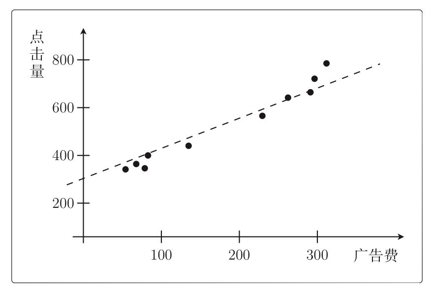

## 
机器学习基础

#### 线性模型

***

**简单的事情往往异乎寻常。——保罗$\cdot$柯艾略**

***

**我们所说的线性到底是什么意思?**

线性模型是一个通过**属性的线性组合**来进行预测的**函数**，即
$$
f(\boldsymbol x)=w_1x_1+w_2x_2+\dots+w_dx_d+b
$$
一般用向量形式写成：
$$
f(\boldsymbol x)=\boldsymbol w^T\boldsymbol x+b
$$
其中的$\boldsymbol w$和$b$学得之后，模型就得以确定。

***

#### 线性回归

**回归：**$regression$，倒推的意思，意即由现有的数据**倒推（回归到）**原来真实的函数。

给定数据集$D=\{(\boldsymbol x_1,y_1),(\boldsymbol x_2,y_2),\dots,(\boldsymbol x_m,y_m)\}$，其中$\boldsymbol x_i=(x_{i1};x_{i2},\dots,x_{id}),y_i\in \mathbb{R}$。"线性回归"试图学得一个**线性模型**尽可能准确地预测实值输出标记。

线性回归是**利用最小二乘函数对一个或多个自变量之间关系进行建模**的方法。

***

均方误差有非常好的几何意义，它对应了欧氏距离。基于均方误差最小化进行模型求解的方法成为“最小二乘法“。在线性回中，最小二乘法就是试图找到一条直线，使所有样本到直线上的欧氏距离之和最小。

##### 最小二乘法

***

**用$OLS$（普通最小二乘法）估计基本的线性模型是对数据进行分析的一个好的起点，但可能不是一个好的终点。——迈克尔$\cdot S.$刘易斯**

***

二乘其实是指**平方**的意思，为什么用平方呢？因为平方可以消除误差正负方向上的差异，单纯的只比较**长度**。

另一种通俗的说法叫**距离**（学术一点叫**欧氏距离**），距离不分上下、左右，只有大小，所以可以用来衡量**目标**与**估计**的所有方向偏差累积。

假设我们定义，**估计**在**目标**正方向上为正，负方向上为负。计算时只要加一个$if-else$判断就行了，并不一定非要用**平方**来代表**距离**，还可以用绝对值、三次方等。但是平方是一种很好用的**数学技巧**，从一个方面说来：比起绝对值，平方的微分更加简单。**负负得正**这个简单的计算规则让**二乘法**（即两个数相乘）这个名字得以发扬光大，成为一切**拟和法**的鼻祖。

###### 数学表达形式

$$
E(\boldsymbol \theta)=\dfrac{1}{2}\sum\limits_{i=1}^n(y^{(i)}-f_{\boldsymbol \theta}(\boldsymbol x^{(i)}))^2
$$

其中$f_\boldsymbol \theta(\boldsymbol x)$就是我们假设的以$\boldsymbol \theta$为参数的线性模型。

* 举例：

  假设$f_\boldsymbol \theta(x)=\theta_0+\theta_1x$

  
  $$
  \begin{aligned}
  E(\boldsymbol \theta)&=\dfrac{1}{2}\sum\limits_{i=1}^4\left(y^{(i)}-f_{\boldsymbol \theta}(x^{(i)})\right)^2\\
  &=\dfrac{1}{2}\times\left((374-117)^2+(385-141)^2+(375-163)^2+(401-169)^2\right)\\
  &=\dfrac{1}{2}\times(66049+59536+44944+53824)\\
  &=112176.5
  \end{aligned}
  $$
  这个值本身没什么意义，我们用它来指导改变参数$\boldsymbol \theta$，使这个值变得越来越小，即让误差变小。这种做法就叫做最小二乘法。

***

###### 通用数学公式解

误差方程为：
$$
E(\boldsymbol w|\boldsymbol X,\boldsymbol y)=(\boldsymbol X\boldsymbol w-\boldsymbol y)^T(\boldsymbol X\boldsymbol w-\boldsymbol y)
$$
其最优解为：
$$
\boldsymbol w=(\boldsymbol X^T\boldsymbol X)^{-1}\boldsymbol X^T\boldsymbol y
$$
其中$X$为$m\times n$的样本输入矩阵：
$$
\begin{bmatrix}
\boldsymbol x_{11} & \boldsymbol x_{12}&\dots& \boldsymbol x_{1n} \\
\boldsymbol x_{21} & \boldsymbol x_{22}&\dots &\boldsymbol x_{2n} \\
\dots & \dots&\dots &\dots\\
\boldsymbol x_{m1} & \boldsymbol x_{m2}&\dots &\boldsymbol x_{mn} \\
\end{bmatrix}
$$
$\boldsymbol y$为$m\times1$ 的列向量，一般称为$labels$:
$$
\begin{bmatrix}
\boldsymbol y_1\\
\boldsymbol y_2\\
\dots\\
\boldsymbol y_m\\
\end{bmatrix}
$$

$\boldsymbol w$为$n\times1$列向量，就是待求的拟和权重参数:
$$
\begin{bmatrix}
\boldsymbol w_1\\
\boldsymbol w_2\\
\dots\\
\boldsymbol w_m\\
\end{bmatrix}
$$

###### 推导过程

误差方程展开：
$$
\begin{aligned}
(\boldsymbol X\boldsymbol w-\boldsymbol y)^T(\boldsymbol X\boldsymbol w-\boldsymbol y)&=\left((\boldsymbol X\boldsymbol w)^T-\boldsymbol y^T\right)(\boldsymbol X\boldsymbol w-\boldsymbol y)\\
&=\boldsymbol w^T\boldsymbol X^T\boldsymbol X\boldsymbol w-(\boldsymbol X\boldsymbol w)^T\boldsymbol y-\boldsymbol y^T\boldsymbol X\boldsymbol w+\boldsymbol y^T\boldsymbol y\\
&=\boldsymbol w^T\boldsymbol X^T\boldsymbol X\boldsymbol w-2(\boldsymbol X\boldsymbol w)^T\boldsymbol y+\boldsymbol y^T\boldsymbol y
\end{aligned}
$$
其中用到了$\boldsymbol \alpha^T\boldsymbol \beta=\boldsymbol \beta^T\boldsymbol \alpha$这一等式。

化简的最后结果的极值（小）在对$\boldsymbol w$求导为零处，所以有
$$
2\boldsymbol X^T\boldsymbol X\boldsymbol w-2\boldsymbol X^T\boldsymbol y=0
$$
整理得：
$$
\boldsymbol w=(\boldsymbol X^T\boldsymbol X)^{-1}\boldsymbol X^T\boldsymbol y
$$

***

##### 线性回归

###### 一元线性回归

我们将求解$w$和$b$使得$E(w,b)$（下边提到）最小化的过程称为线性回归模型的最小二乘参数估计。

* **求解偏置$b$的公式推导**

  * **由最小二乘法导出损失函数$E(w,b)$:**
    $$
    \begin{aligned}
    E(w,b)&=\sum\limits_{i=1}^m(y_i-f(x_i))^2\\
    &=\sum\limits_{i=1}^m(y_i-(wx_i+b))^2\\
    &=\sum\limits_{i=1}^m(y_i-wx_i-b)^2
    \end{aligned}
    $$

  * **求解：**

    * **定理一：二元函数判断凹凸性：**

      设$f(x,y)$在区域$D$上具有二阶连续偏导数，记$A=f''_{xx}(x,y),B=f''_{xy}(x,y),C=f''_{yy}(x,y)$则：

      （1）在$D$上恒有$A>0$，且$AC-B^2\geqslant0$时，$f(x,y)$在区域$D$上是凸函数；

      （2）在$D$上恒有$A<0$，且$AC-B^2\geqslant0$时，$f(x,y)$在区域$D$上是凹函数。   

    * **定理二：二元凹凸函数求最值：**

      设$f(x,y)$是在开区域$D$内具有连续偏导数的凸（凹）函数，$(x_0,y_0)\in D$且$f'_x(x_0,y_0)=0,f'_y(x_0,y_0)=0$，则$f(x_0,y_0)$必为$f(x,y)$在$D$内的最小值（或最大值）。

    ***

    接下来用以上两个定理来求解：

    * 证明损失函数$E(w,b)$是关于$w$和$b$的凸函数：

      * 求$A=f''_{xx}(x,y)$:
        $$
        \begin{aligned}
        \dfrac{\partial E_{(w,b)}}{\partial w}&=\dfrac{\partial \left[\sum\limits_{i=1}^m(y_i-wx_i-b)^2\right]}{\partial w}\\
        &=\sum\limits_{i=1}^m\dfrac{\partial (y_i-wx_i-b)^2}{\partial w}\\
        &=\sum\limits_{i=1}^m2\cdot(y_i-wx_i-b)\cdot(-x_i)\\
        &=2\left(w\sum\limits_{i=1}^mx_i^2-\sum\limits_{i=1}^m(y_i-b)x_i\right)
        \end{aligned}
        $$

        $$
        \begin{aligned}
        \dfrac{\partial^2E_(w,b)}{\partial w^2}&=\dfrac{\partial (\dfrac{\partial E_{(w,b)}}{\partial w})}{\partial w}\\
        &=\dfrac{\partial \left[2\left(w\sum\limits_{i=1}^mx_i^2-\sum\limits_{i=1}^m(y_i-b)x_i\right) \right]}{\partial w}\\
        &=2\sum\limits_{i=1}^mx_i^2
        \end{aligned}
        $$

      * 求$B=f''_{xy}(x,y)$:
        $$
        \begin{aligned}
        \dfrac{\partial ^2E(w,b)}{\partial w\partial b}&=\dfrac{\partial (\dfrac{\partial E_{(w,b)}}{\partial w})}{\partial b}\\
        &=\dfrac{\partial \left[2\left(w\sum\limits_{i=1}^mx_i^2-\sum\limits_{i=1}^m(y_i-b)x_i\right) \right]}{\partial b}\\
        &=2\sum\limits_{i=1}^{m}x_i
        \end{aligned}
        $$

      * 求$C=f''_{yy}(x,y)$:
        $$
        \begin{aligned}
        \dfrac{\partial E_{(w,b)}}{\partial b}&=\dfrac{\partial \left[\sum\limits_{i=1}^m(y_i-wx_i-b)^2\right]}{\partial b}\\
        &=\sum\limits_{i=1}^m\dfrac{\partial (y_i-wx_i-b)^2}{\partial b}\\
        &=\sum\limits_{i=1}^m2\cdot(y_i-wx_i-b)\cdot(-1)\\
        &=2\left(mb-\sum\limits_{i=1}^m(y_i-wx_i)\right)
        \end{aligned}
        $$

        $$
        \begin{aligned}
        \dfrac{\partial^2 E_{(w,b)}}{\partial b^2}&=\dfrac{\partial(\dfrac{\partial E_{(w,b)}}{\partial b})}{\partial b}\\
        &=\dfrac{\partial \left[2\left(mb-\sum\limits_{i=1}^{m}(y_i-wx_i)\right)\right]}{\partial b}\\
        &=2m
        \end{aligned}
        $$

    * 以上：$A=2\sum\limits_{i=1}^mx_i^2$，$B=2\sum\limits_{i=1}^mx_i$，$C=2m$。
      $$
      \begin{aligned}
      AC-B^2&=2m\cdot2\sum\limits_{i=1}^mx_i^2-\left(2\sum\limits_{i=1}^mx_i\right)^2\\
      &=4m\sum\limits_{i=1}^mx_i^2-4\left(\sum\limits_{i=1}^mx_i\right)^2\\
      &=4m\sum\limits_{i=1}^mx_i^2-4\cdot m\cdot \dfrac{1}{m}\left(\sum\limits_{i=1}^mx_i\right)^2\\
      &=4m\sum\limits_{i=1}^mx_i^2-4m\cdot\overline{x}\cdot\sum\limits_{i=1}^mx_i\\
      &=4m\left(\sum\limits_{i=1}^mx_i^2-\sum\limits_{i=1}^mx_i\overline{x}\right)\\
      &=4m\sum\limits_{i=1}^m(x_i^2-x_i\overline{x}-x_i\overline{x}+x_i\overline{x})\\
      &=4m\sum\limits_{i=1}^m(x_i^2-x_i\overline{x}-x_i\overline{x}+\overline{x}^2)\\
      &=4m\sum\limits_{i=1}^m(x_i-\overline{x})^2
      \end{aligned}
      $$
      我们可知$AC-B^2=4m\sum\limits_{i=1}^m(x_i-\overline{x})^2\geqslant0$，也即损失函数$E(w,b)$是关于$w$和$b$的凸函数。

    * 补充：$\sum\limits_{i=1}^mx_i\overline{x}=\overline{x}\sum\limits_{i=1}^mx_i=\overline{x}\cdot m\cdot\dfrac{1}{m}\cdot\sum\limits_{i=1}^mx_i=m\overline{x}^2=\sum\limits_{i=1}^m\overline{x}^2.$

    **令一阶偏导数等于$0$解出$b$：**
    $$
    \dfrac{\partial E_{(w,b)}}{\partial b}=2\left(mb-\sum\limits_{i=1}^m(y_i-wx_i)\right)=0\\
    mb-\sum\limits_{i=1}^m(y_i-wx_i)=0\\
    b=\dfrac{\sum\limits_{i=1}^m(y_i-wx_i)}{m}=\dfrac{1}{m}\sum\limits_{i=1}^my_i-w\cdot\dfrac{1}{m}\sum\limits_{i=1}^m x_i=\overline{y}-w\overline{x}.
    $$
    **令一阶偏导数为$0$解出$w$：**
    $$
    \dfrac{\partial E_{(w,b)}}{\partial w}=2\left(w\sum\limits_{i=1}^mx_i^2-\sum\limits_{i=1}^m(y_i-b)x_i\right)=0\\
    w\sum\limits_{i=1}^mx_i^2-\sum\limits_{i=1}^m(y_i-b)x_i=0\\
    w\sum\limits_{i=1}^mx_i^2=\sum\limits_{i=1}^my_ix_i-\sum\limits_{i=1}^mbx_i\\
    $$
    将$b=\overline{y}-w\overline{x}$代入上式可得：
    $$
    w\sum\limits_{i=1}^mx_i^2=\sum\limits_{i=1}^my_ix_i-\sum\limits_{i=1}^m(\overline{y}-w\overline{x})x_i\\
    w\sum\limits_{i=1}^mx_i^2=\sum\limits_{i=1}^my_ix_i-\overline{y}\sum\limits_{i=1}^mx_i+w\overline{x}\sum\limits_{i=1}^mx_i\\
    w\sum\limits_{i=1}^mx_i^2-w\overline{x}\sum\limits_{i=1}^mx_i=\sum\limits_{i=1}^my_ix_i-\overline{y}\sum\limits_{i=1}^mx_i\\
    w\left(\sum\limits_{i=1}^mx_i^2-\overline{x}\sum\limits_{i=1}^mx_i\right)=\sum\limits_{i=1}^my_ix_i-\overline{y}\sum\limits_{i=1}^mx_i\\
    w=\dfrac{\sum\limits_{i=1}^my_ix_i-\overline{y}\sum\limits_{i=1}^mx_i}{\sum\limits_{i=1}^mx_i^2-\overline{x}\sum\limits_{i=1}^mx_i}=\dfrac{\sum\limits_{i=1}^my_ix_i-\overline{x}\sum\limits_{i=1}^my_i}{\sum\limits_{i=1}^mx_i^2-\dfrac{1}{m}(\sum\limits_{i=1}^mx_i)^2}=\dfrac{\sum\limits_{i=1}^my_i(x_i-\overline{x})}{\sum\limits_{i=1}^mx_i^2-\dfrac{1}{m}(\sum\limits_{i=1}^mx_i)^2}
    $$
    其中：

    * $\overline{y}\sum\limits_{i=1}^mx_i=\dfrac{1}{m}\sum\limits_{i=1}^{m}y_i\sum\limits_{i=1}^{m}x_i=\overline{x}\sum\limits_{i=1}^my_i$
    * $\overline{x}\sum\limits_{i=1}^mx_i=\dfrac{1}{m}\sum\limits_{i=1}^{m}x_i\sum\limits_{i=1}^{m}x_i=\dfrac{1}{m}(\sum\limits_{i=1}^{m}x_i)^2$

    ***

    为提高运算速度，将求解$w$的过程向量化可得（**核心：将累加的形式抽象成向量的点乘**）：

    $w=\dfrac{\sum\limits_{i=1}^my_i(x_i-\overline{x})}{\sum\limits_{i=1}^mx_i^2-\dfrac{1}{m}(\sum\limits_{i=1}^mx_i)^2}$

    将$\dfrac{1}{m}(\sum\limits_{i=1}^{m}x_i^2)=\overline{x}\sum\limits_{i=1}^{m}x_i=\sum\limits_{i=1}^mx_i\overline{x}$代入分母可得：
    $$
    w=\dfrac{\sum\limits_{i=1}^my_i(x_i-\overline{x})}{\sum\limits_{i=1}^mx_i^2-\sum\limits_{i=1}^{m}x_i\overline{x}}=\dfrac{\sum\limits_{i=1}^m(y_ix_i-y_i\overline{x})}{\sum\limits_{i=1}^m(x_i^2-x_i\overline{x})}
    $$
    由于：
    $$
    \left\{
    \begin{aligned}
    &\sum\limits_{i=1}^my_i\overline{x}=\overline{x}\sum\limits_{i=1}^my_i=\dfrac{1}{m}\sum\limits_{i=1}^mx_i\sum\limits_{i=1}^my_i=\sum\limits_{i=1}^mx_i\cdot \dfrac{1}{m}\cdot\sum\limits_{i=1}^{m}y_i=\sum\limits_{i=1}^{m}x_i\overline{y}\\
    &\sum\limits_{i=1}^my_i\overline{x}=\overline{x}\sum\limits_{i=1}^my_i=\overline{x}\cdot m\cdot\dfrac{1}{m}\sum\limits_{i=1}^my_i=m\overline{x}\ \overline{y}=\sum\limits_{i=1}^m\overline{x}\ \overline{y}\\
    &\sum\limits_{i=1}^mx_i\overline{x}=\overline{x}\sum\limits_{i=1}^mx_i=\overline{x}\cdot m\cdot\dfrac{1}{m}\sum\limits_{i=1}^mx_i=m\overline{x}^2=\sum\limits_{i=1}^m\overline{x}^2
    \end{aligned}
    \right.
    $$
    所以：
    $$
    w=\dfrac{\sum\limits_{i=1}^m(y_ix_i-y_i\overline{x})}{\sum\limits_{i=1}^m(x_i^2-x_i\overline{x})}=\dfrac{\sum\limits_{i=1}^m(y_ix_i-y_i\overline{x}-y_i\overline{x}+y_i\overline{x})}{\sum\limits_{i=1}^m(x_i^2-x_i\overline{x}-x_i\overline{x}+x_i\overline{x})}=\dfrac{\sum\limits_{i=1}^m(y_ix_i-y_i\overline{x}-x_i\overline{y}+\overline{x}\ \overline{y})}{\sum\limits_{i=1}^m(x_i^2-2x_i\overline{x}+\overline{x}^2)}=\dfrac{\sum\limits_{i=1}^m(x_i-\overline{x})(y_i-\overline{y})}{\sum\limits_{i=1}^m(x_i-\overline{x})^2}
    $$
    令$\boldsymbol x=(x_1,x_2,\dots,x_m)^T$，$\boldsymbol y=(y_1,y_2,\dots,y_m)^T$

    $\boldsymbol x_d=(x_1-\overline{x},x_2-\overline{x},\dots,x_m-\overline{x})^T,\boldsymbol y_d=(y_1-\overline{y},y_2-\overline{y},\dots,y_m-\overline{y})^T$。

    则
    $$
    w=\dfrac{\sum\limits_{i=1}^m(x_i-\overline{x})(y_i-\overline{y})}{\sum\limits_{i=1}^m(x_i-\overline{x})^2}=\dfrac{\boldsymbol x_d^T\boldsymbol y_d}{\boldsymbol x_d^T\boldsymbol x_d}
    $$

* 值得注意的是：上述求$w$的式子在高中选修$1-2$出现过。后续求$b$的式子只用到了一个性质：$(\overline{x},\overline{y})$一定在回归方程上。（我们上述求解是先求$b$后求的$w$，与课本相反）。

***

###### 多元线性回归

多元线性回归的求解思路同一元线性回归的求解思路基本相同：

* 将$\boldsymbol w$和$b$组合成$\hat{\boldsymbol w}$：

$$
f(\boldsymbol x_i)=\boldsymbol w^T\boldsymbol x_i+b=\hat{\boldsymbol w}^T\hat{\boldsymbol {x}_i}
$$
* 由最小二乘法导出损失函数$E_\hat{\boldsymbol w}$：

$$
E_\hat{\boldsymbol w}=\sum\limits_{i=1}^m(y_i-f(\hat{\boldsymbol x_i}))^2=\sum\limits_{i=1}^m(y_i-\hat{\boldsymbol w}^T\hat{\boldsymbol x}_i)^2
$$
* 进行向量化：

  令$X=(\hat{\boldsymbol x}_1^T,\hat{\boldsymbol x}_2^T,\cdots,\hat{\boldsymbol x}_m^T )^T,\boldsymbol y=(y_1,y_2,\cdots,y_m)^T$

  得：

$$
E_{\hat{\boldsymbol w}}=(\boldsymbol y-\boldsymbol X\hat{\boldsymbol w})^T(\boldsymbol y-\boldsymbol X\hat{\boldsymbol w})
$$
 **求解：**

* 证明损失函数是关于$\hat{\boldsymbol w}$的凸函数：

  * **凸集：**设集合$D\in R^n$，如果对任意的点$\boldsymbol x,\boldsymbol y\in D$与任意的$a\in[0,1]$，有$a\boldsymbol x+(1-a)\boldsymbol y\in D$，则称集合$D$是凸集。

    

  * **梯度（多元实值函数的一阶导数）：**设$n$元函数$f(\boldsymbol x)$对自变量$\boldsymbol x=(x_1,x_2,\dots,x_n)^T$的各分量$x_i$的一阶偏导数$\dfrac{\partial f(\boldsymbol x)}{\partial x_i}\quad(i=1,2,\dots,n)$都存在，则称函数$f(\boldsymbol x)$在$\boldsymbol x$处一阶可导，并称向量
    $$
    \triangledown f(\boldsymbol x)=
    \left( 
    \begin{aligned}
    \dfrac{\partial f(\boldsymbol x)}{\partial x_1}\\
    \dfrac{\partial f(\boldsymbol x)}{\partial x_2}\\
    \vdots\quad\ \\
    \dfrac{\partial f(\boldsymbol x)}{\partial x_n}\\
    \end{aligned}
    \right)
    $$
    为函数$f(\boldsymbol x)$在$\boldsymbol x$处的一阶导数或梯度，记为$\triangledown f(\boldsymbol x)$（列向量）。

  * $Hessian$（海塞）矩阵：设$n$元函数$f(\boldsymbol x)$对自变量$\boldsymbol x=(x_1,x_2,\dots,x_n)^T$的各分量$x_i$的二阶偏导数$\dfrac{\partial ^2f(\boldsymbol x)}{\partial x_i\partial x_j}\quad(i=1,2,\dots,n;j=1,2,\dots,n)$都存在，则称函数$f(\boldsymbol x)$在$\boldsymbol x$处二阶可导，并称矩阵
    $$
    \triangledown ^2f(x)=
    \begin{bmatrix}
    \dfrac{\partial^2f(x)}{\partial x_1^2}\ \dfrac{\partial^2f(x)}{\partial x_1\partial x_2}\cdots\ \dfrac{\partial^2f(x)}{\partial x_1\partial x_n}\\
    \dfrac{\partial^2f(x)}{\partial x_2\partial x_1}\ \dfrac{\partial^2f(x)}{\partial x_2^2}\cdots\ \dfrac{\partial^2f(x)}{\partial x_2\partial x_n}\\
    \vdots\ \quad \quad \quad \vdots\ \quad \quad  \ddots \quad \quad \vdots\\
    \dfrac{\partial^2f(x)}{\partial x_n\partial x_1}\ \dfrac{\partial^2f(x)}{\partial x_n\partial x_2}\cdots\ \dfrac{\partial^2f(x)}{\partial x_n^2}\\
    \end{bmatrix}
    $$
    为$f(\boldsymbol x)$在$\boldsymbol x$处的二阶导数或$Hessian$矩阵，记为$\triangledown^2f(\boldsymbol x)$，若$f(\boldsymbol x)$对$\boldsymbol x$各变元的所有二阶偏导数都连续，则$\dfrac{\partial^2f(\boldsymbol x)}{\partial x_i\partial x_j}=\dfrac{\partial^2f(\boldsymbol x)}{\partial x_j\partial x_i}$，此时易知$\triangledown^2f(x)$为对称矩阵。

  ***

  * **定理一：多元实值函数凹凸性判定定理：**

    设$D\subset R^n$是非空开凸集。$f:D\subset R^n\to R$.且$f(\boldsymbol x)$在$D$上二阶连续可微。如果$f(x)$的$Hessian$矩阵$\triangledown^2f(\boldsymbol x)$在$D$上是**正定**的，则$f(\boldsymbol x)$是$D$上的严格凸函数。

  * **定理二：凸充分性定理：**

    若$f:R^n\to R$是凸函数，且$f(\boldsymbol x)$一阶连续可微，则$x^*$是全局解的充分必要条件是$\triangledown f(\boldsymbol x^*)=\boldsymbol0$，其中$\triangledown f(\boldsymbol x)$为$f(\boldsymbol x)$关于$\boldsymbol x$的一阶导数（也称梯度）。
  
  ***
  
  ​	   接下来用以上两个定理来求解：
  $$
  \begin{aligned}
  \dfrac{\partial E_\hat{\boldsymbol w}}{\partial \hat{\boldsymbol w}}&=\dfrac{\partial\left[(\boldsymbol  y-X\hat{\boldsymbol w})^T(\boldsymbol y-X\hat{\boldsymbol w})\right]}{\partial \hat{\boldsymbol w}}\\
  &=\dfrac{\partial\left[(\boldsymbol y^T-\hat{\boldsymbol w}^T\boldsymbol X^T)(\boldsymbol y-\boldsymbol X\hat{\boldsymbol w})\right]}{\partial \hat{\boldsymbol w}}\\
  &=\dfrac{\partial \left[\boldsymbol y^T\boldsymbol y-\boldsymbol y^T\boldsymbol X\hat{\boldsymbol w}-\hat{\boldsymbol w}^T\boldsymbol X^T\boldsymbol y+\hat{\boldsymbol w}^T\boldsymbol X^T\boldsymbol X\hat{\boldsymbol w}\right]}{\partial\hat{\boldsymbol w}}\\
  &=\dfrac{\partial \left[-\boldsymbol y^T\boldsymbol X\hat{\boldsymbol w}-\hat{\boldsymbol w}^T\boldsymbol X^T\boldsymbol y+\hat{\boldsymbol w}^T\boldsymbol X^T\boldsymbol X\hat{\boldsymbol w}\right]}{\partial\hat{\boldsymbol w}}\\
  &=\dfrac{\partial \boldsymbol y^T\boldsymbol X\hat{\boldsymbol w}}{\partial \hat{\boldsymbol w}}-\dfrac{\partial\hat{\boldsymbol w}\boldsymbol X^T\boldsymbol y}{\partial\hat{\boldsymbol w}}+\dfrac{\partial \hat{\boldsymbol w}\boldsymbol X^T\boldsymbol X\hat{\boldsymbol w}}{\partial \hat{\boldsymbol w}}
  \end{aligned}
  $$
  
  ​	由矩阵微分公式$\dfrac{\partial \boldsymbol x^T\boldsymbol a}{\partial \boldsymbol x}=\dfrac{\partial \boldsymbol a^T\boldsymbol x}{\partial \boldsymbol x}=\boldsymbol a$，$\dfrac{\partial \boldsymbol x^T\boldsymbol B\boldsymbol x}{\partial \boldsymbol x}=(\boldsymbol B+\boldsymbol B^T)\boldsymbol x$可得：
  $$
  \dfrac{\partial E_{\hat{\boldsymbol w}}}{\partial\hat{\boldsymbol w}}=-\boldsymbol X^T\boldsymbol y-\boldsymbol X^T\boldsymbol y+(\boldsymbol X^T\boldsymbol X+\boldsymbol X^T\boldsymbol X)\hat{\boldsymbol w}=2\boldsymbol X^T(\boldsymbol X\hat{\boldsymbol w}-\boldsymbol y)
  $$
  ​	则$Hessian$矩阵为：
  $$
  \begin{aligned}
  \dfrac{\partial^2E_\hat{\boldsymbol w}}{\partial\hat{\boldsymbol w}\partial\hat{\boldsymbol w}^T}&=\dfrac{\partial}{\partial \hat{\boldsymbol w}}\left(\dfrac{\partial E_{\hat{\boldsymbol w}}}{\partial \hat{\boldsymbol w}}\right)\\
  &=\dfrac{\partial}{\partial\hat{\boldsymbol w}}[2\boldsymbol X^T(\boldsymbol X\hat{\boldsymbol w}-\boldsymbol y)]\\
  &=\dfrac{\partial}{\partial\hat{\boldsymbol w}}(2\boldsymbol X^T\boldsymbol X\hat{\boldsymbol w}-2\boldsymbol X^T\boldsymbol y)\\
  &=2\boldsymbol X^T\boldsymbol X
  \end{aligned}
  $$
  当$X^TX$是正定矩阵时，损失函数$E_{\hat{\boldsymbol w}}$是关于$\hat{\boldsymbol w}$的凸函数。
  
  令$\dfrac{\partial E_\hat{\boldsymbol w}}{\partial \hat{\boldsymbol w}}=2\boldsymbol X^T(\boldsymbol X\hat{\boldsymbol w}-\boldsymbol y)=\boldsymbol 0$
  
  解出：$\hat{\boldsymbol w}=(\boldsymbol X^T\boldsymbol X)^{-1}\boldsymbol X^T\boldsymbol y$

***

有时**分类问题也可以转化为回归问题**，例如肺癌预测，我们可以用回归模型先预测出患肺癌的概率，然后再**给定一个阈值**，例如$50\%$，概率值在$50\%$以下的人划为没有肺癌，$50\%$以上则认为患有肺癌。这种分类型问题的回归算法预测，最常用的就是**逻辑回归**。

***

#### 逻辑回归

***

**如果面试官问你熟悉哪个机器学习模型，可以说 $SVM$，但千万别说 $LR$，因为细节真的太多了。**

**——阿泽**

***

##### $logistic$函数

$logistic$函数中文名叫**对数几率**函数，因其形状像$S$，是$Sigmoid$函数最重要的代表，故又称**$Sigmoid$函数：**

**$Sigmoid$函数的性质：**

* 将$input$压缩到$(0,1)$之间（可以由此联想到概率的取值）
* $\dfrac{1}{2}$处导数值最大
* $y(x)$的导数为$y(x)(1-y(x))$
* 两边梯度趋于饱和（作为激活函数在神经网络的弊端）
* 不以原点为中心（作为激活函数在神经网络的弊端）
* 单调递增

***

**逻辑回归为何不叫逻辑分类？**

回归来源于"线性回归"，使用线性回归去拟合逼近一个“界”（对数几率），使得按照这个"界"进行数据分类后得到的$cost$最小。以概率$0.5$为分界线，将数据分为正例和反例。使得$z>0$对应于正例，$z<0$对应于反例。因此是使用的**回归思想**去解决**分类问题**。

***

##### 广义线性模型

***

**看似无关的事物背后往往有着不可思议的联系。——佚名**

***

我们知道标准的线性模型如下：
$$
y=w_1x_1+w_2x_2+\dots+w_dx_d+b
$$
广义线性模型如下：
$$
f(y)=w_1x_1+w_2x_2+\dots+w_dx_d+b
$$
也就是广义线性模型的操作方式让被解释变量通过$f(x)$的形式变化，以使得等式右边依旧是一个线性组合，仍然可以使用最小二乘法来进行回归模型建立。其中$f(y)$被称为**连接函数**。但是为什么可以这样变换？$Why\large Why\Large Why?$

广义线性模型的理论发展建立在指数族分布的基础上。

###### 指数族分布

指数族分布是一类分布的总称，该类分布的分布律（或者概率密度）的一般形式如下：
$$
p(y;\eta)=b(y)e^{\eta^T T(y)-a(\eta)}
$$
其中，$\eta$称为该分布的自然参数；$T(y)$为充分统计量，视具体的分布而定，通常是等于随机变量$y$本身；$a(\eta)$为配分函数；$b(y)$为关于	随机变量$y$的函数。（ $e^{-a(\eta)}$本质上是一个归一化常数，保证$\sum p(y;\eta)=1$)。也就是说$T,a,b$确定了一种分布，$\eta$是该分布的参数。

常见的伽玛分布、泊松分布、二项分布和正态分布均属于指数族分布。

举例说明**二项分布是指数族分布：**

已知二项分布的分布律为：
$$
p(y)=\phi^y(1-\phi)^{1-y}
$$
其中$y\in\{0,1\}$，$\phi$为$y=1$的概率。对上式恒等变形可得：
$$
\begin{aligned}
p(y)&=\large \phi^y(1-\phi)^{1-y}\\
&=\Large e^{(ln(\phi^y(1-\phi)^{1-y}))}\\
&=\Large e^{(ln(\phi^y)+ln(1-\phi)^{1-y})}\\
&=\Large e^{(yln\phi+(1-y)ln(1-\phi))}\\
&=\Large e^{(yln\phi+ln(1-\phi)-yln(1-\phi))}\\
&=\Large e^{(y(ln\phi-ln(1-\phi))+ln(1-\phi))}\\
&=\Large e^{ yln(\frac{\phi}{1-\phi})+ln(1-\phi)}
\end{aligned}
$$
对比指数族分布的一般形式$p(y;\eta)=b(y)e^{\eta^T T(y)-a(\eta)}$可知：
$$
b(y)=1\\
\eta=ln(\frac{\phi}{1-\phi})\\
T(y)=y\\
a(\eta)=-ln(1-\phi)=ln(1+e^\eta)
$$

故得证。

***

考虑一个分类或者回归问题，我们就是想预测某个随机变量$y$，$y$是某些特征$\boldsymbol x$的函数。为了推导出广义线性模型（想用广义线性模型对一般问题进行建模），我们须做出如下三条假设：

###### 广义线性模型的三条假设

* 在给定$\boldsymbol x$的条件下，假设随机变量$y$服从某个**指数族分布**；
* 在给定$\boldsymbol x$的条件下，我们的目标是得到一个模型$h(\boldsymbol x)$能预测出**$T(y)$的期望值**；
* 假设该指数族分布中的自然参数$\eta$和$\boldsymbol x$是线性相关的，即$\eta=\boldsymbol w^T\boldsymbol x$。

##### 对数几率回归

已知$y$服从二项分布，而二项分布属于指数族分布，所以满足广义线性模型的**第一条假设**，根据**第二条假设**我们可以推得模型$h(\boldsymbol x)$的表达式应该为：
$$
h(\boldsymbol x)=E[T(y|\boldsymbol x)]
$$
由于二项分布的$T(y|\boldsymbol x)=y|\boldsymbol x$，所以：
$$
h(\boldsymbol x)=E[y|\boldsymbol x]
$$
又因为$E[y|\boldsymbol x]=1\times p(y=1|\boldsymbol x)+0\times p(y=0|\boldsymbol x)=\phi$，所以$h(\boldsymbol x)=\phi$。

而由$\eta=ln(\dfrac{\phi}{1-\phi})$可推出$\phi=\dfrac{1}{1+e^{-\eta}}$。

所以可得：
$$
h(\boldsymbol x)=\phi=\dfrac{1}{1+e^{-\eta}}
$$
再根据广义模型的**第三条假设**：$\eta=\boldsymbol w^T\boldsymbol x$，$h(\boldsymbol x)$最终可化为：
$$
h(\boldsymbol x)=\phi=\dfrac{1}{1+e^{-\boldsymbol w^T\boldsymbol x}}=p(y=1|\boldsymbol x)
$$

至此，我们用广义线性模型建模出了逻辑回归模型。

***

###### 对数几率回归的极大似然估计

似然和概率是不同的。$likelihood$不是$probability$。

当把$\boldsymbol x$固定而把$f(\boldsymbol x,\boldsymbol \theta)$看做$\boldsymbol \theta$的函数时，它称为”似然函数“。 这个名称的意义，可根据分析得到理解：这个函数对于不同的 $\boldsymbol \theta$的取值，反映了在观察结果$\boldsymbol x$已知的条件下，$\boldsymbol \theta$的各种值的“似然程度”。 注意，这里有些像贝叶斯公式中的推理：把观察值$\boldsymbol x$看成结果，而把参数值$\theta$看成是导致这个结果的原因。 现已有了结果，要反过来推算各种原因的概率。 这里**参数**$\boldsymbol \theta$是确定的值（虽然未知)，**并非随机变量，无概率可言**，于是就改用”似然“这个词。——陈希孺《概率论与数理统计》

**在统计学上，基于某些模型的参数（粗略地说，我们可以认为参数决定了模型），观测到某数据的概率称为概率；而已经观测到某数据，模型的参数取特定值的概率称为似然。**

已知随机变量$y$取$1$和$0$的概率分别为
$$
p(y=1|\boldsymbol x)=\dfrac{e^{\boldsymbol w^T\boldsymbol x+b}}{1+e^{\boldsymbol w^Tx+b}}\\
p(y=0|\boldsymbol x)=\dfrac{1}{1+e^{\boldsymbol w^T\boldsymbol x+b}}
$$
将$b$考虑进$\boldsymbol w$，令$\boldsymbol \beta=(\boldsymbol w;b),\hat{\boldsymbol x}=(\boldsymbol x;1)$，则$\boldsymbol w^T\boldsymbol x+b$可以简写为$\boldsymbol \beta^T\hat{\boldsymbol x}$，于是上式可化简为：
$$
p(y=1|\boldsymbol x)=\dfrac{e^{\boldsymbol \beta^T\boldsymbol x}}{1+e^{\boldsymbol \beta^T\boldsymbol x}}\\
p(y=0|\boldsymbol x)=\dfrac{1}{1+e^{\boldsymbol \beta^T\boldsymbol x}}
$$
为了简单表示，记：
$$
p(y=1|\boldsymbol x)=\dfrac{e^{\boldsymbol \beta^T\boldsymbol x}}{1+e^{\boldsymbol \beta^T\boldsymbol x}}=p_1(\hat{\boldsymbol x};\boldsymbol \beta)\\
p(y=0|\boldsymbol x)=\dfrac{1}{1+e^{\boldsymbol \beta^T\boldsymbol x}}=p_0(\hat{\boldsymbol x};\boldsymbol \beta)
$$
使用一个简单的技巧可得到随机变量$y$的分布律表达式
$$
p(y|\boldsymbol x;\boldsymbol w,b)=y\cdot p_1(\hat{\boldsymbol x};\boldsymbol \beta)+(1-y)\cdot p_0(\hat{\boldsymbol x};\boldsymbol \beta)
$$
或者
$$
p(y|\boldsymbol x;\boldsymbol w,b)=[p_1(\hat{\boldsymbol x};\boldsymbol \beta)]^y\times[p_0(\hat{\boldsymbol x};\boldsymbol \beta)]^{1-y}
$$
根据**对数似然函数**的定义可得：
$$
{\scr{l}}_{(w,b)}=ln\ L(w,b)=\sum\limits_{i=1}^{m}ln\ p(y_i|x_i;w,b)
$$
将$p(y|\boldsymbol x;\boldsymbol w,b)=y\cdot p_1(\hat{\boldsymbol x};\boldsymbol \beta)+(1-y)\cdot p_0(\hat{\boldsymbol x};\boldsymbol \beta)$代入可得：
$$
{\scr{l}}(\beta)=\sum\limits_{i=1}^mln\left(y_ip_1(\hat{\boldsymbol x}_i;\boldsymbol \beta)+(1-y_i)\cdot p_0(\hat{\boldsymbol x}_i;\boldsymbol \beta)\right)
$$
将
$$
\dfrac{e^{\boldsymbol \beta^T\hat{\boldsymbol x}_i}}{1+e^{\boldsymbol \beta^T\boldsymbol x_i}}=p_1(\hat{\boldsymbol x}_i;\boldsymbol \beta)\\
\dfrac{1}{1+e^{\boldsymbol \beta^T\hat{\boldsymbol x}_i}}=p_0(\hat{\boldsymbol x}_i;\boldsymbol \beta)
$$
代入上式可得：
$$
\begin{aligned}
{\scr{l}}(\boldsymbol \beta)&=\sum\limits_{i=1}^{m}ln\left(\dfrac{y_ie^{\boldsymbol \beta^T\hat{x}_i}}{1+e^{\boldsymbol \beta^T\hat{x}_i}}+\dfrac{1-y_i}{{1+e^{\boldsymbol \beta^T\hat{x}_i}}}\right)\\
&=\sum\limits_{i=1}^m\left(ln(y_ie^{\boldsymbol \beta^T\hat{x}_i}+1-y_i)-ln(1+e^{\boldsymbol \beta^T\hat{x}_i})\right)
\end{aligned}
$$
由于$y_i\in \{0,1\}$，所以可以用一个小技巧继续化简为：
$$
{\scr{l}}(\boldsymbol \beta)=\sum\limits_{i=1}^m\left(y_i\boldsymbol \beta^T\hat{x}_i-ln(1+e^{\boldsymbol \beta^T\hat{x}_i})\right)
$$
上式即为对数似然函数。损失函数一般转化为最小化问题，加个负号即可：
$$
{\scr{l}}(\boldsymbol \beta)=\sum\limits_{i=1}^m\left(-y_i\boldsymbol \beta^T\hat{x}_i+ln(1+e^{\boldsymbol \beta^T\hat{x}_i})\right)
$$
* **补充：**也可以用$p(y|\boldsymbol x;\boldsymbol w,b)=[p_1(\hat{\boldsymbol x};\boldsymbol \beta)]^y\times[p_0(\hat{\boldsymbol x};\boldsymbol \beta)]^{1-y}$来推导。
  $$
  \begin{aligned}
  {\scr{l}}(\beta)&=\sum\limits_{i=1}^{m}ln\left([p_1(\hat{\boldsymbol x}_i;\boldsymbol \beta)]^{y_i}\times[p_0(\hat{\boldsymbol x}_i;\boldsymbol \beta)]^{1-y_{i}}\right)\\
  &=\sum\limits_{i=1}^{m}ln\left([p_1(\hat{\boldsymbol x}_i;\boldsymbol \beta)]^{y_i}\right)+ln\left([p_0(\hat{\boldsymbol x}_i;\boldsymbol \beta)]^{1-y_{i}}\right)\\
  &=\sum\limits_{i=1}^{m}\left[y_iln\left([p_1(\hat{\boldsymbol x}_i;\boldsymbol \beta)]\right)+(1-y_{i})ln\left(p_0(\hat{\boldsymbol x}_i;\boldsymbol \beta)\right)\right]\\
  &=\sum\limits_{i=1}^{m}\{y_i[ln(p_1(\hat{x}_i;\beta))-ln(p_0(\hat{x}_i))]+ln(p_0(\hat{x}_i;\beta))\}\\
  &=\sum\limits_{i=1}^m\left[y_iln\left(\dfrac{p_1(\hat{x}_i;\beta)}{p_0(\hat{x}_i;\beta)}\right)+ln(p_0(\hat{x}_i;\beta))\right]
  \end{aligned}
  $$
  同样将
  $$
  \dfrac{e^{\boldsymbol \beta^T\hat{\boldsymbol x}_i}}{1+e^{\boldsymbol \beta^T\boldsymbol x_i}}=p_1(\hat{\boldsymbol x}_i;\boldsymbol \beta)\\
  \dfrac{1}{1+e^{\boldsymbol \beta^T\hat{\boldsymbol x}_i}}=p_0(\hat{\boldsymbol x}_i;\boldsymbol \beta)
  $$
  代入可得：
  $$
  {\scr{l}}(\beta)=\sum_\limits{i=1}^m\left[y_iln\left(e^{\beta^T\hat{x}_i}\right)+ln\left(\dfrac{1}{1+e^{\beta^T\hat{x}_i}}\right)\right]=\sum\limits_{i=1}^m\left(y_i\boldsymbol \beta^T\hat{x}_i-ln(1+e^{\boldsymbol \beta^T\hat{x}_i})\right)
  $$
  

***

但是${\scr{l}}(\boldsymbol \beta)=\sum\limits_{i=1}^m\left(-y_i\boldsymbol \beta^T\hat{x}_i+ln(1+e^{\boldsymbol \beta^T\hat{x}_i})\right)$并不能像线性回归函数一样得到关于$\boldsymbol \beta$的解析解。我们可以用经典的比如梯度下降法，牛顿法来解。下面介绍梯度下降法求解。

###### 梯度下降法求解

取逻辑回归的损失函数为：
$$
{\scr{l}}(\boldsymbol \beta)=-\sum\limits_{i=1}^{m}\left[y_iln\left([p_1(\hat{\boldsymbol x}_i;\boldsymbol \beta)]\right)+(1-y_{i})ln\left(p_0(\hat{\boldsymbol x}_i;\boldsymbol \beta)\right)\right]
$$
我们对其中的$p_1(\hat{\boldsymbol x}_i;\boldsymbol \beta)$对$\beta_j$求导得到：
$$
\dfrac{\partial p_1(\hat{\boldsymbol x}_i;\boldsymbol \beta)}{\partial \beta_j}=p_1(\hat{\boldsymbol x}_i;\boldsymbol \beta)\cdot \left(1-p_1(\hat{\boldsymbol x}_i;\boldsymbol \beta)\right)\cdot \hat{x}_{ij}
$$
其中$\boldsymbol x_i$实际指的是第$i$个样本的特征向量，即$(x_{i1},x_{i2},\dots ,x_{im},1)$，我们注意到只有$x_{ij}$会和$\beta_j$相乘，因此一眼可看出求导结果。

***

$$
\begin{aligned}
\dfrac{\partial {\scr{l}}(\boldsymbol \beta)}{\partial \beta_j}&=-\sum\limits_{i=1}^m\left(y_i\dfrac{1}{p_1(\hat{\boldsymbol x}_i;\boldsymbol \beta)}\dfrac{\partial p_1(\hat{\boldsymbol x}_i;\boldsymbol \beta)}{\partial \beta _j}+(1-y_i)\dfrac{1}{1-p_1(\hat{\boldsymbol x}_i;\boldsymbol \beta)}\dfrac{\partial p_1(\hat{\boldsymbol x}_i;\boldsymbol \beta)}{\partial \beta_j}\right)\\
&=-\sum\limits_{i=1}^m\left(\dfrac{y_i}{p_1(\hat{\boldsymbol x}_i;\boldsymbol \beta)}-\dfrac{1-y_i}{1-p_1(\hat{\boldsymbol x}_i;\boldsymbol \beta)}\right)\cdot\dfrac{\partial p_1(\hat{\boldsymbol x}_i;\boldsymbol \beta)}{\partial\beta_j}\\
&=-\sum\limits_{i=1}^m\left(\dfrac{y_i}{p_1(\hat{\boldsymbol x}_i;\boldsymbol \beta)}-\dfrac{1-y_i}{1-p_1(\hat{\boldsymbol x}_i;\boldsymbol \beta)}\right)\cdot p_1(\hat{\boldsymbol x}_i;\boldsymbol \beta)\cdot \left(1-p_1(\hat{\boldsymbol x}_i;\boldsymbol \beta)\right)\cdot \hat{x}_{ij}\\
&=-\sum\limits_{i=1}^m[y_i(1-p_1(\hat{\boldsymbol x}_i;\boldsymbol \beta))-(1-y_i)p_1(\hat{\boldsymbol x}_i;\boldsymbol \beta)]\cdot x_{ij}\\
&=-\sum\limits_{i=1}^m(y_i-p_1(\hat{\boldsymbol x}_i;\boldsymbol \beta))\cdot x_{ij}\\
&=\sum\limits_{i=1}^m(\dfrac{e^{\boldsymbol \beta^T\hat{\boldsymbol x}_i}}{1+e^{\boldsymbol \beta^T\boldsymbol x_i}}-y_i)\cdot x_{ij}
\end{aligned}
$$
有了偏导，也就有了梯度$\boldsymbol G$(即偏导数组成的向量)。则梯度下降算法过程如下：

* 初始化向量$\boldsymbol \beta$的值为$\boldsymbol \theta_0$，将其代入$G$得到当前位置的梯度；
* 用步长$\alpha$乘以当前梯度，得到从当前位置下降的距离；
* 更新$\boldsymbol \theta_1$，其更新表达式为$\boldsymbol \theta_1=\boldsymbol \theta_0-\alpha \boldsymbol G$;
* 重复以上步骤，直到更新至$\boldsymbol \theta _k$达到停止条件，此时$\boldsymbol \theta_k$就是我们所求的参数向量$\boldsymbol \beta$。

***

## 问题

1. 逻辑回归为什么用交叉熵作为损失函数？
