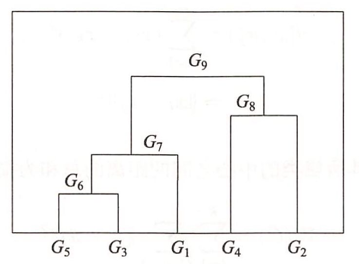

# 聚类方法

## 聚类的基本概念

聚类的对象是观测数据，或样本集合。假设有$n$个样本，每个样本由$m$个属性的特征向量构成。样本集合可用矩阵$X$表示：
$$
X=[x_{ij}]_{m\times n}=\begin{bmatrix}
x_{11} & x_{12}&\dots& x_{1n} \\
x_{21} & x_{22}&\dots& x_{2n} \\
\vdots&\vdots&&\vdots\\
x_{m1} & x_{m2}&\dots& x_{mn} \\
\end{bmatrix}
$$
矩阵的第$j$列表示第$j$个样本；第$i$行表示第$i$个属性。

### 相似度或距离

聚类的核心概念是相似度或距离，不同的相似度或者距离的定义直接影响聚类的结果，所以其选择是聚类的根本问题，没有绝对好的距离，取决于应用问题的特性。

* **闵可夫斯基距离**

  距离越大相似度越小，距离越小相似度越大。

  取$x_i,x_j\in X$，$x_i=(x_{1i},x_{2i},\cdots,x_{mi})^T$，$x_j=(x_{1j},x_{2j},\cdots,x_{mj})^T$，样本$x_i,x_j$的闵可夫斯基距离$d_{ij}$定义为
  $$
  d_{ij}=(\sum\limits_{k=1}^m|x_{ki}-x_{kj}|^p)^{\frac{1}{p}}
  $$
  可以看出，当$p=1$时是曼哈顿距离，当$p=2$时是欧式距离。

* **马氏距离**

  距离越大相似度越小，距离越小相似度越大。

  马氏距离修正了欧式距离中各个维度尺度（量纲）不一致的问题并且考虑了相关性。

  样本$x_i,x_j$的闵可夫斯基距离$d_{ij}$定义为：
  $$
  d_{ij}=[(x_i-x_j)^TS^{-1}(x_i-x_j)]^{\frac{1}{2}}
  $$
  其中$S$是协方差矩阵。

  当$S$为单位矩阵时，即样本数据的各个分量相互独立且各个分量的方差为$1$时，就是欧氏距离。

* **相关系数**

  相关系数的绝对值越接近于$1$，表示样本越相似；越接近于$0$，表示样本越不相似。

  样本$x_i,x_j$的相关系数$r_{ij}$定义为：
  $$
  r_{ij}=\dfrac{\sum\limits_{k=1}^m(x_{ki}-\bar{x}_i)(x_{kj}-\bar{x}_j)}{[\sum\limits_{k=1}^m(x_{ki}-\bar{x}_i)^2\sum\limits_{k=1}^m(x_{kj}-\bar{x}_j)^2]^\frac{1}{2}}
  $$
  其中
  $$
  \bar{x}_i=\dfrac{1}{m}\sum\limits_{k=1}^mx_{ki}\quad \bar{x}_j=\dfrac{1}{m}\sum\limits_{k=1}^mx_{kj}
  $$

* **夹角余弦**

  夹角余弦越接近于$1$，表示样本越相似；越接近于$0$，表示样本越不相似。

  样本$x_i,x_j$的夹角余弦$s_{ij}$定义为：
  $$
  s_{ij}=\dfrac{\sum\limits_{k=1}^mx_{ki}x_{kj}}{[\sum\limits_{k=1}^mx_{ki}^2\sum\limits_{k=1}^mx_{kj}^2]^\frac{1}{2}}
  $$
  

***

### 类或簇

设$T$为给定的正数，若集合$G$中**任意**两个样本$x_i,x_j$，有$d_{ij}\leqslant T$，则称$G$为一个类或簇。

设类$G_p$包含$n_p$个样本，$G_q$包含$n_q$个样本，分别用$\bar{x}_p$和$\bar{x}_q$表示$G_p$和$G_q$的均值，即类的中心。那么两类之间的一些距离如下：

* 最短距离：两类样本之间的最短距离
  $$
  D_{pq}=min\{d_{ij}|x_i\in G_p,x_j\in G_q\}
  $$

* 最长距离：两类样本之间的最长距离
  $$
  D_{pq}=max\{d_{ij}|x_i\in G_p,x_j\in G_q\}
  $$

* 中心距离：$\bar{x}_p$与$\bar{x}_q$之间的距离
  $$
  D_{pq}=d_{\bar{x}_p\bar{x}_q}
  $$

* 平均距离：任意两个样本之间的平均值：
  $$
  D_{pq}=\dfrac{1}{n_pn_q}\sum_{x_i\in G_p}\sum_{x_j\in G_q}d_{ij}
  $$

## 层次聚类

**层次聚类假设类别之间存在层次结构**，将样本聚到层次化的类中。分为聚合聚类和分裂聚类。

聚合聚类具体过程如下：对于给定的样本集合，开始将每个样本分到一个类中，然后按照一定的规则，例如类间距离最小，将满足规则条件的两个类进行合并；如此，每次减少一个类，直到满足停止条件，如类的个数达到阈值（极端情况是$1$）或者类的直径超过阈值。

```
聚合聚类算法：
输入：n个样本组成的样本集合及样本之间的距离
输出：对样本集合的一个层次化聚类
1.计算n个样本两两之间的欧氏距离。
2.构造n个类，每个类只包含一个样本。
3.合并类间距离最小的两个类，其中设定最短距离为类间距离，构造一个新的类。
4.计算新类与当前各类的距离。若满足终止条件，则终止计算，否则回到步骤3。
```

### 例子

给定$5$个样本的集合，样本之间的欧式距离由如下矩阵$D$表示：
$$
D=[d_{ij}]_{5\times5}=\begin{bmatrix}
0&7&2&9&3\\
7&0&5&4&6\\
2&5&0&8&1\\
9&4&8&0&5\\
3&6&1&5&0\\
\end{bmatrix}
$$
应用聚合层次聚类法对这$5$个样本进行聚类。

* 首先用$5$个样本构建$5$个类，$G_i=\{x_i\},i=1,2,\dots,5$，这样，**样本之间的距离也就变成类之间的距离**，所以$5$个类之间的距离矩阵亦为$D$。

* 由矩阵$D$看出$D_{35}=D_{53}=1$最小，所以把$G_3$和$G_5$合并成一个新类，记作$G_6=\{x_3,x_5\}$。

* 计算$G_6$与$G_1,G_2,G_4$之间的最短距离，有
  $$
  D_{61}=2,D_{62}=5,D_{64}=5
  $$
  又注意到其余的两类之间的距离是
  $$
  D_{12}=7,D_{14}=9,D_{24}=4
  $$
  $D_{61}$最小，所以将$G_1$与$G_6$合并成一个类，记作$G_7=\{x_1,x_3,x_5\}$。

* 计算$G_7$与$G_2,G_4$之间的最短距离，
  $$
  D_{72}=5,D_{74}=5
  $$
  又注意到
  $$
  D_{24}=4
  $$
  其中$D_{24}$最小，所以将$G_2$与$G_4$合并成一新类，记作$G_8={x_2,x_4}$。

* 将$G_7$与$G_8$合并成一个新类，记作$G_9=\{x_1,x_2,x_3,x_4,x_5\}$，即全部样本聚成$1$类，聚类终止。

  

## $k$均值聚类

$k$均值聚类将样本集合划分为$k$个子集，构成$k$个类，将$n$个样本分到$k$个类中，每个样本到其所属类的中心的距离最小。

### 模型

$k$均值聚类的模型是**一个从样本到类的多对一的函数**。

***

### 策略

$k$均值聚类的策略是通过**损失函数的最小化**选取最优的划分$C^*$。

首先，采用欧氏距离平方作为样本之间的距离$d(x_i,x_j)=\sum\limits_{k=1}^m(x_{ki}-x_{kj})^2=\|x_i-x_j\|^2$。

然后，定义样本与其所属类的中心之间的距离的总和为**损失函数，**即
$$
W(C)=\sum\limits_{l=1}^k\sum\limits_{C(i)=l}\|x_i-\bar{x}_l\|^2
$$
所以$k$均值聚类就转化为求解**最优化的问题：**
$$
C^*=arg\ \mathop{min}\limits_CW(C)=arg\ \mathop{min}\limits_C\sum\limits_{l=1}^k\sum\limits_{C(i)=l}\|x_i-\bar{x}_l\|^2
$$

***

### 算法

* 输入：$n$个样本的集合$X$；
* 输出：样本集合的聚类$C^*$。
  * **初始化：**令$t=0$，随机选择$k$个样本点作为初始聚类中心$m^{(0)}=(m_1^{(0)},\cdots,m_l^{(0)},\cdots,m_k^{(0)})$。
  * **对样本进行聚类：**计算每个样本到类中心$m^{(t)}=(m_1^{(t)},\cdots,m_l^{(t)},\cdots,m_k^{(t)})$的距离，将每个样本指派到与其最近的中心的类中，构成聚类结果$C^{(t)}$。
  * **计算新的类中心：**对聚类结果$C^{(t)}$，计算当前各个类中样本的均值，作为新的类中心$m^{(t+1)}=(m_1^{(t+1)},\cdots,m_l^{(t+1)},\cdots,m_k^{(t+1)})$。
  * 如果迭代收敛或符合停止条件，输出$C^*=C^{(t)}$。否则令$t=t+1$返回步骤$(2)$。

### 例子

给定含有$5$个样本的集合
$$
X=\begin{vmatrix}
0&0&1&5&5\\
2&0&0&0&2\\
\end{vmatrix}
$$
用$k$均值聚类算法将样本聚到$2$个类中。


* 选择两个样本点作为类的**中心**：假设选择$m_1^{(0)}=x_1=(0,2)^T$，$m_2^{(0)}=x_2=(0,0)^T$。

* 计算$x_3=(1,0)^T,x_4=(5,0)^T,x_5=(5,2)^T$与$G_1^{(0)}、G_2^{(0)}$的中$m_1^{(0)},m_2^{(0)}$的欧氏**距离**的平方：

  对$x_3=(1,0)^T$，$d(x_3,m_1^{(0)})=5,d(x_3,m_2^{(0)})=1$，所以将$x_3$分到类$G_2^{(0)}$。

  对$x_4=(5,0)^T$，$d(x_4,m_1^{(0)})=29,d(x_4,m_2^{(0)})=25$，所以将$x_4$分到类$G_2^{(0)}$。

  对$x_5=(5,2)^T$，$d(x_5,m_1^{(0)})=25,d(x_5,m_2^{(0)})=29$，所以将$x_5$分到类$G_1^{(0)}$。

* 得到**新的类**$G_1^{(1)}=\{x_1,x_5\},G_2^{(1)}={x_2,x_3,x_4}$，计算类的**中心**$m_1^{(1)}=(2.5,2.0)^T,m_2^{(1)}=(2,0)^T$

* **重复**步骤$(2)$和步骤$(3)$。

  将$x_1$分到类$G_1^{(1)}$，将$x_2$分到类$G_2^{(1)}$，将$x_3$分到类$G_2^{(1)}$，将$x_4$分到类$G_2^{(1)}$，将$x_5$分到类$G_2^{(1)}$。

  得到新的类$G_1^{(2)}=\{x_1,x_5\},G_2^{(2)}=\{x_2,x_3,x_4\}$。

  此时已经收敛，聚类停止。
  
  
